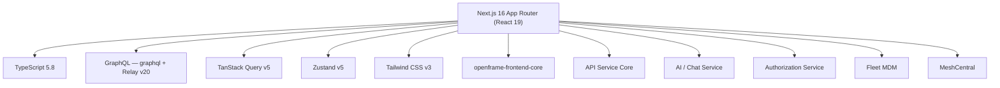
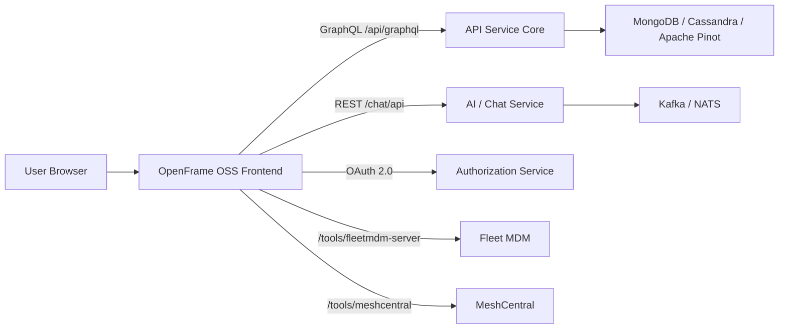
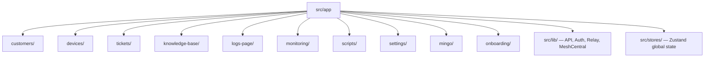

<div align="center">
  <picture>
    <source media="(prefers-color-scheme: dark)" srcset="https://shdrojejslhgnojzkzak.supabase.co/storage/v1/object/public/public/doc-orchestrator/logos/1771371901777-lc3cse-logo-openframe-full-dark-bg.png">
    <source media="(prefers-color-scheme: light)" srcset="https://shdrojejslhgnojzkzak.supabase.co/storage/v1/object/public/public/doc-orchestrator/logos/1771372526604-k3y1w-logo-openframe-full-light-bg.png">
    
  </picture>
</div>

<p align="center">
  <a href="LICENSE.md"></a>
</p>

# OpenFrame OSS Frontend

**OpenFrame OSS Frontend** is the primary web application for the [OpenFrame](https://openframe.ai) platform — a unified, AI-driven interface for Managed Service Providers (MSPs). It replaces expensive proprietary MSP software with intelligent open-source alternatives, bringing device management, ticketing, monitoring, scripts, and AI assistance into a single cohesive operational interface.

Built and maintained by [Flamingo](https://flamingo.run), this project is the human-facing layer of the OpenFrame ecosystem — connecting backend services into an AI-first MSP experience.

---

## Features

| Feature | Description |
|---------|-------------|
| **Device Management** | Unified device model, remote shell, file manager, remote desktop via MeshCentral |
| **Customer Management** | Per-organization AI configuration, guardrails templates, aggregated device counts |
| **Ticketing** | Kanban boards, AI-assisted replies, approval workflows, assignment management |
| **Knowledge Base** | Article management, folder organization, attachment handling |
| **Mingo AI (Technician)** | Streaming AI assistant with tool execution, context awareness, and approval flows |
| **Customer AI (Fae)** | Embeddable AI for client-facing portals |
| **Monitoring** | Fleet MDM policies, osquery live query campaigns, query execution |
| **Scripts** | Script library, scheduling, execution history |
| **Audit Logs** | Organization and device-level log viewer with cursor-based pagination |
| **Settings & Billing** | Tenant config, SSO, API keys, subscription management |
| **Onboarding** | Step-by-step guided setup for new tenants |
| **Feature Flags** | Runtime-configurable feature toggles via Zustand |

---

## Technology Stack



### Core Dependencies

| Package | Version | Purpose |
|---------|---------|---------|
| `next` | ^16.2.4 | SSR + App Router framework |
| `react` | ^19.2.0 | UI library |
| `react-relay` | ^20.1.1 | GraphQL fragment system |
| `@tanstack/react-query` | ^5.90.16 | Server-state caching and pagination |
| `zustand` | ^5.0.8 | Client-side state management |
| `tailwindcss` | ^3.4.17 | Utility-first CSS |
| `@xterm/xterm` | ^6.0.0 | Terminal emulator for remote shell |
| `@monaco-editor/react` | ^4.7.0 | Script editor |
| `zod` | ^4.3.6 | Runtime schema validation |
| `@flamingo-stack/openframe-frontend-core` | ^0.0.480 | Shared UI component library |

---

## Architecture

OpenFrame OSS Frontend acts as the **presentation and orchestration layer** on top of OpenFrame backend services.



### Application Domain Structure

The application is organized by feature domain under `src/app`:



### State Management

The application uses three complementary state management approaches:

| Pattern | Technology | Used For |
|---------|-----------|---------|
| **Server state** | TanStack Query v5 | REST API calls, optimistic mutations, cursor pagination |
| **GraphQL fragments** | Relay v20 | Logs, scripts, notifications (streaming + pagination) |
| **Client UI state** | Zustand v5 | Feature flags, onboarding, Mingo chat, device filters |

---

## Quick Start

> **Prerequisites:** Node.js 18+, npm 9+, Git. See the [Prerequisites Guide](./docs/getting-started/prerequisites.md) for full details.

```bash
# 1. Clone the repository
git clone https://github.com/flamingo-stack/openframe-oss-frontend.git
cd openframe-oss-frontend

# 2. Install dependencies
npm install

# 3. Configure environment
cp .env.example .env.local
# Edit .env.local with your backend URLs

# 4. Start the development server
npm run dev
```

Open [http://localhost:3000](http://localhost:3000) in your browser.

### Minimum Environment Variables

```bash
NEXT_PUBLIC_TENANT_HOST_URL=https://your-tenant.openframe.dev
NEXT_PUBLIC_SHARED_HOST_URL=https://api.openframe.dev
NEXT_PUBLIC_APP_MODE=oss-tenant
NEXT_PUBLIC_APP_URL=http://localhost:3000
```

> Refer to your environment configuration for actual backend URLs.

### Available Scripts

| Script | Description |
|--------|-------------|
| `npm run dev` | Start development server with hot reload |
| `npm run build` | Generate schema enums + Relay artifacts + Next.js production build |
| `npm run start` | Start production server (after build) |
| `npm run lint` | Run ESLint (the fast pass; rules come from the core library's shared config) |
| `npm run lint:fix` | ESLint autofix |
| `npm run lint:types` | ESLint type-aware pass (slow — needs an 8 GB heap) |
| `npm run format:fix` | Auto-fix formatting with Prettier |
| `npm run type-check` | TypeScript type checking without emitting |
| `npm run relay` | Compile Relay GraphQL fragments |
| `npm run relay:watch` | Watch and recompile Relay fragments on change |
| `npm run fetch-schema` | Fetch the latest GraphQL schema from the backend |

---

## Documentation

📚 See the [Documentation](./docs/README.md) for comprehensive guides including getting started tutorials, development workflows, architecture overviews, and API references.

---

## Community & Support

OpenFrame OSS is supported through the **OpenMSP Slack community** — the primary channel for discussions, questions, and collaboration.

> We do not use GitHub Issues or Discussions. All support and coordination happens in Slack.

- **Join Slack:** https://join.slack.com/t/openmsp/shared_invite/zt-36bl7mx0h-3~U2nFH6nqHqoTPXMaHEHA
- **Community Hub:** https://www.openmsp.ai/
- **OpenFrame Website:** https://openframe.ai
- **Flamingo Platform:** https://flamingo.run
- **GitHub Repository:** https://github.com/flamingo-stack/openframe-oss-frontend

---

## Contributing

We welcome contributions! Please read the [Contributing Guidelines](./CONTRIBUTING.md) before opening a pull request.

Key points:
- All code must be TypeScript with strict typing
- Follow the [Conventional Commits](https://www.conventionalcommits.org/) format
- Run `npm run type-check`, `npm run lint`, and `npm run relay` before submitting
- Coordinate in the OpenMSP Slack community before starting large features

---

<div align="center">
  Built with 💛 by the <a href="https://www.flamingo.run/about"><b>Flamingo</b></a> team
</div>
