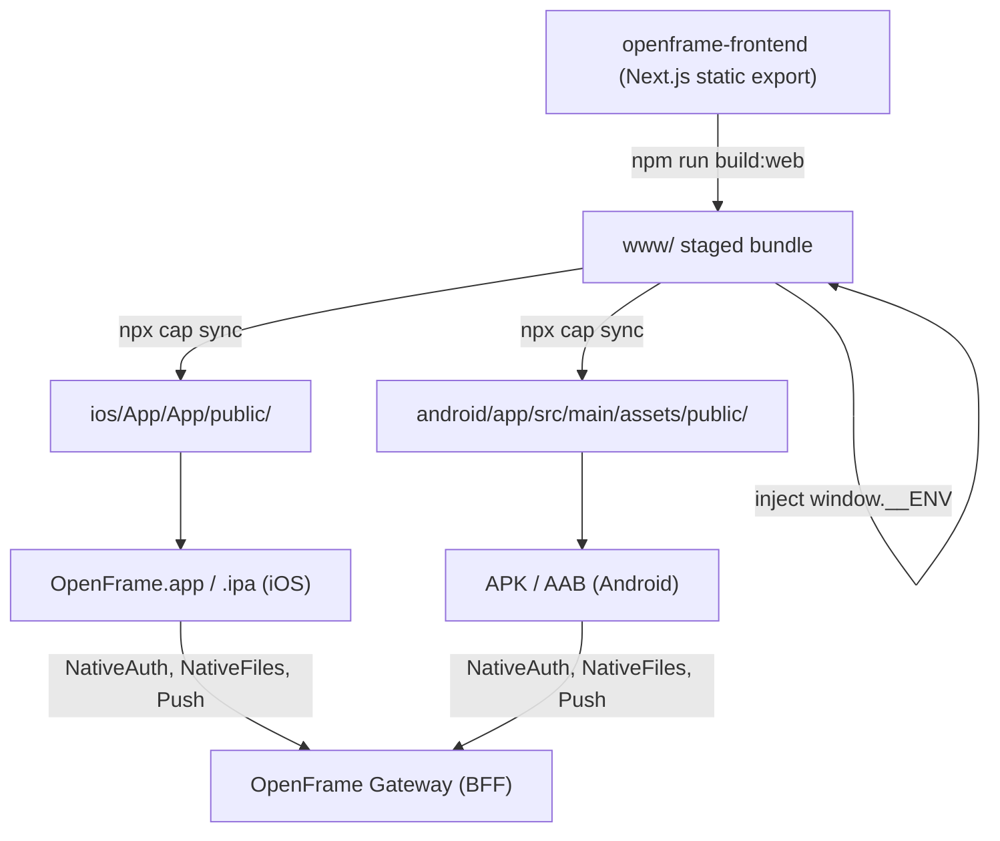

<div align="center">
  <picture>
    <source media="(prefers-color-scheme: dark)" srcset="https://shdrojejslhgnojzkzak.supabase.co/storage/v1/object/public/public/doc-orchestrator/logos/1771371901777-lc3cse-logo-openframe-full-dark-bg.png">
    <source media="(prefers-color-scheme: light)" srcset="https://shdrojejslhgnojzkzak.supabase.co/storage/v1/object/public/public/doc-orchestrator/logos/1771372526604-k3y1w-logo-openframe-full-light-bg.png">
    
  </picture>
</div>

<p align="center">
  <a href="LICENSE.md"></a>
</p>

# OpenFrame SaaS Mobile

`openframe-mobile` is the **native mobile shell** for the OpenFrame MSP platform, built with [Capacitor](https://capacitorjs.com/). It wraps the `openframe-frontend` static web export in a thin native host for iOS and Android, adding only what the web can't do on its own — push notifications, biometric-gated authentication, secure token storage, and native file pickers.

There is **no UI source code in this repository**. All screens, routing, and application logic live in the `openframe-frontend` codebase; this repo consumes a *built static bundle* of that frontend and ships it inside a native app container.

## Features

- **Thin native shell** — the shared `openframe-frontend` UI is bundled as a static export (`www/`) and loaded inside a Capacitor `WKWebView` (iOS) / WebView (Android). No duplicated UI logic between web and mobile.
- **Native authentication** — hand-rolled `NativeAuth` Capacitor plugin (Swift on iOS, Java on Android) drives OAuth login via Custom Tabs/`ASWebAuthenticationSession`, dev-ticket-to-token exchange, and biometric-gated token access bound at the OS layer (Keychain on iOS, Android Keystore on Android) rather than an insecure "boolean gate" pattern.
- **Secure token storage & lifecycle** — `SecureTokenStore` encrypts the access/refresh token pair as a single combined blob using AES-256-GCM (Android Keystore) or Keychain (iOS), with an optional biometric-gated hybrid envelope mode. `TokenLifecycle` is a process singleton that manages single-flight token refresh, foreground/background polling, and propagates token state to the web view.
- **Push notifications** — data-only FCM/APNs push payloads are rendered as native tray notifications with action buttons (approve/reject/reply), backed by `PushNotifications`, `OpenFrameMessagingService`, `NotificationActionReceiver`, and `NotificationActionWorker`. All push is brokered through Firebase/FCM.
- **Native file I/O** — `NativeFiles` Capacitor plugin picks, uploads, and downloads files natively (via `HttpURLConnection`/`ContentResolver` on Android), working around WebView limitations where browser-native download/upload patterns silently fail.
- **Multi-environment builds** — separate `prod`/`stage`/`dev` app identities on both platforms (distinct bundle IDs/application IDs, Firebase projects, and OAuth schemes) so multiple environments can be installed side by side on the same device.
- **Runtime-configured bundle** — the static web bundle is tenant-agnostic; gateway host, app mode, and OAuth scheme are injected into `window.__ENV` at build time via `scripts/inject-env.mjs`, so the same bundle can target dev/stage/prod gateways without a rebuild of the frontend itself.

## Technology Stack

- **Capacitor 8** — native runtime bridge (`@capacitor/core`, `@capacitor/ios`, `@capacitor/android`)
- **Swift** (iOS) — `AppDelegate`, `NativeAuthPlugin`, `TokenLifecycle`, `SecureTokenStore`, notification handling
- **Java** (Android) — `MainActivity`, `NativeAuthPlugin`, `NativeFilesPlugin`, `TokenLifecycle`, `SecureTokenStore`, `PushNotifications`, `OpenFrameMessagingService`
- **Swift Package Manager** — resolves the Capacitor native runtime on iOS (no CocoaPods)
- **Gradle** with product flavors (`prod`/`stage`/`dev`) — Android multi-environment builds
- **@capacitor-firebase/messaging** — push notification transport (FCM brokers APNs on iOS)
- **TypeScript / Node.js** — build glue scripts (`scripts/build-web.sh`, `scripts/inject-env.mjs`, `scripts/make-placeholder-web.mjs`)
- **openframe-frontend** (external, Next.js) — the actual UI, built as a static export and staged into `www/`

## Architecture



## Quick Start

### Prerequisites

- Node.js 18+
- For iOS: full Xcode (from the Mac App Store — Command Line Tools alone are not enough), an Apple ID added to Xcode
- For Android: Android Studio / JDK
- No CocoaPods required — Capacitor 8 resolves iOS native dependencies via Swift Package Manager

### iOS Simulator (fastest path, no device or Apple account needed)

```bash
npm install
npm run web:placeholder        # or: npm run build:web   (real frontend export)
npx cap sync ios
npx cap run ios                # choose an iPhone simulator from the list
```

### On a physical iPhone

```bash
npm install
npm run web:placeholder        # dev stub — proves the device pipeline
# — or — the real openframe-frontend export:
# NEXT_PUBLIC_TENANT_HOST_URL=https://<your-tenant> \
#   npm run build:web

npx cap sync ios
npx cap open ios
```

Then in Xcode: select the **App** target → **Signing & Capabilities**, enable automatic signing, select your Team, plug in the iPhone, trust the computer, and press **Run**.

> `ios/` is already committed to this repo (scaffolded once via `cap add ios`); you do not need to re-run `cap add ios` — just `cap sync` after each web build.

### Android

Android support is added via `npx cap add android`, using a parallel Gradle project with `prod`/`stage`/`dev` build flavors. Building requires Android Studio/JDK; see the release documentation linked below for flavor-specific build commands.

## Documentation

📚 See the [Documentation](./docs/README.md) for comprehensive guides, including project structure, native API integration patterns, running on a physical device, and release processes for iOS and Android.

---
<div align="center">
  Built with 💛 by the <a href="https://www.flamingo.run/about"><b>Flamingo</b></a> team
</div>
