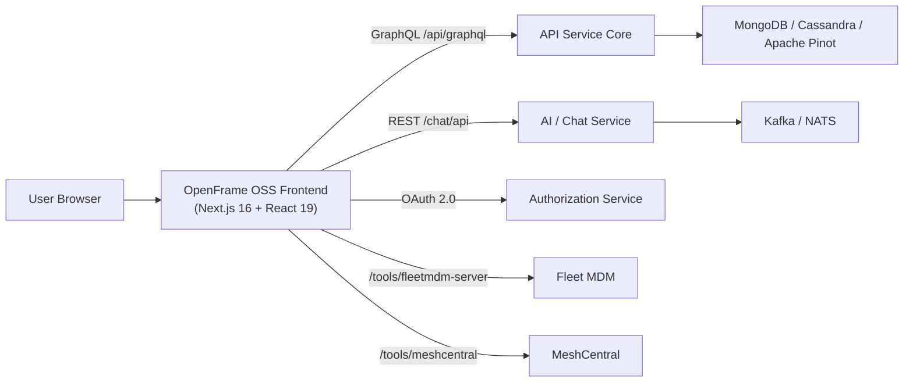
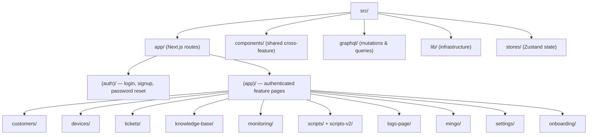
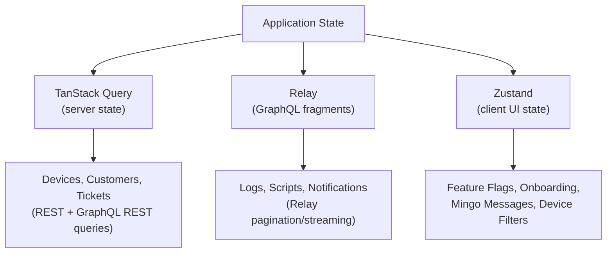
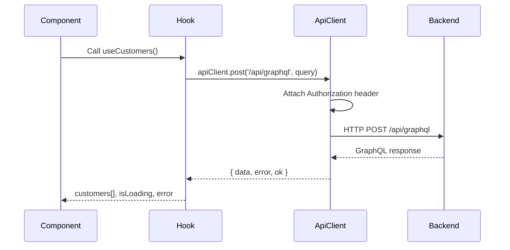
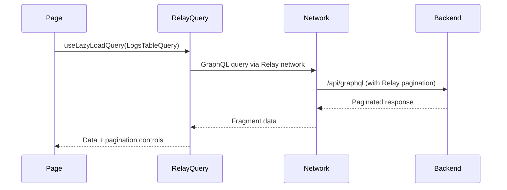
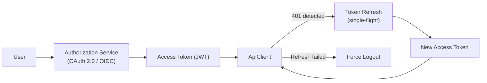
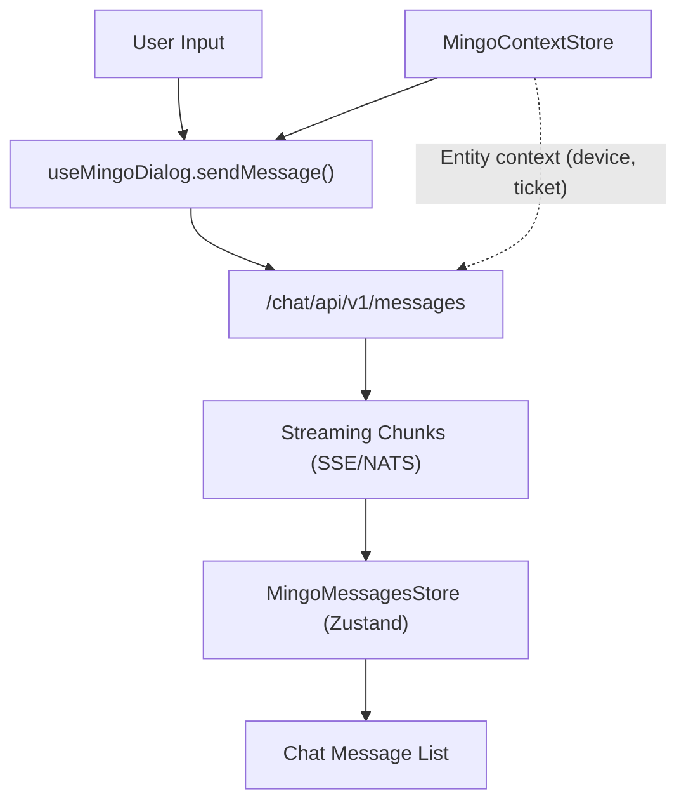

# Architecture Overview

This document describes the high-level architecture of the OpenFrame OSS Frontend, its core components, data flow patterns, and key design decisions.

---

## High-Level Architecture

The OpenFrame OSS Frontend is a Next.js 16 (App Router) application that serves as the **presentation and orchestration layer** for the OpenFrame platform. It communicates with multiple backend services:



---

## Application Structure

The repository follows a domain-based file organization under Next.js App Router:



---

## Core Components

### Feature Domain Structure

Every feature domain follows the same internal organization pattern:

```text
<domain>/
├── components/     # React components (UI, forms, tables, modals)
├── hooks/          # React hooks (data fetching, mutations, UI state)
├── queries/        # GraphQL query/mutation strings
├── types/          # TypeScript type definitions
├── utils/          # Utility functions
└── page.tsx        # Next.js page entry point
```

### Key Infrastructure Components

| Component | Location | Responsibility |
|-----------|----------|----------------|
| `ApiClient` | `src/lib/api-client.ts` | Centralized HTTP client with auth, token refresh |
| `AuthApiClient` | `src/lib/auth-api-client.ts` | Auth-specific endpoints (login, token exchange) |
| `FleetApiClient` | `src/lib/fleet-api-client.ts` | Fleet MDM REST API proxy client |
| Relay Environment | `src/lib/relay/environment.ts` | GraphQL Relay network layer |
| Query Client | `src/lib/query-client-provider.tsx` | TanStack Query configuration |
| Runtime Config | `src/lib/runtime-config.ts` | Typed `NEXT_PUBLIC_*` env var accessors |
| Navigation Config | `src/lib/routes.ts` | App route definitions |
| Token Store | `src/lib/token-store.ts` | Access/refresh token persistence |
| MeshCentral | `src/lib/meshcentral/` | Remote desktop, file manager WebSocket protocol |

---

## State Management Strategy

The application uses **three complementary state management approaches**:



| Pattern | Technology | Used For |
|---------|-----------|---------|
| **Server state** | TanStack Query v5 | REST API calls, optimistic mutations, cursor pagination |
| **GraphQL fragments** | Relay v20 | Logs, scripts, notifications (streaming + pagination) |
| **Client UI state** | Zustand v5 | Feature flags, onboarding progress, Mingo chat state, device store |

### Zustand Stores

| Store | Location | Purpose |
|-------|----------|---------|
| `FeatureFlagsState` | `src/stores/feature-flags-store.ts` | Feature flag values |
| `OnboardingState` | `src/stores/onboarding-store.ts` | Onboarding progress tracking |
| `DevicesState` | `src/stores/devices-store.ts` | Device selection and filter state |
| `MingoMessagesStore` | `src/app/(app)/mingo/stores/` | Per-dialog chat messages |
| `MingoContextStore` | `src/app/(app)/mingo/stores/` | Context items sent with messages |
| `MingoLauncherStore` | `src/app/(app)/mingo/stores/` | Chat panel open/closed state |

---

## Data Flow: GraphQL Request



---

## Data Flow: Relay Fragment (Streaming)



---

## Authentication Architecture



Key behaviors:
- **Bearer mode:** Attaches `Authorization: Bearer <token>` header
- **Cookie mode:** Uses `credentials: 'include'` with HttpOnly cookies
- **Single-flight refresh:** Only one refresh request fires at a time (prevents multiple simultaneous 401s)
- **Force logout:** Triggered if token refresh fails or returns 401

---

## Mingo AI (Chat) Architecture



The Mingo AI system:
- Streams responses via **Server-Sent Events (SSE)** or **NATS WebSocket**
- Maintains per-dialog message state in **Zustand**
- Sends structured **context items** (`{ type, id }`) representing currently viewed entities
- Handles **tool execution** and **approval workflows** via message segments

---

## MeshCentral Integration

The frontend includes a custom binary WebSocket protocol implementation for:
- **Remote Desktop** — binary frame decoding, tile rendering, keyboard/mouse events
- **Remote Shell** — xterm.js terminal connected via WebSocket
- **File Manager** — custom binary protocol for file operations (upload, download, delete)

Located in `src/lib/meshcentral/`.

---

## Key Design Decisions

| Decision | Rationale |
|----------|-----------|
| **Next.js App Router** | Server components, streaming, file-based routing, layout nesting |
| **Relay for GraphQL streaming** | Optimal for logs/notifications with large datasets and cursor pagination |
| **TanStack Query for REST** | Better DX for REST APIs, optimistic mutations, refetch controls |
| **Zustand over Redux** | Minimal boilerplate, TypeScript-native, no provider nesting |
| **Biome over Prettier** | Significantly faster, single tool for lint + format |
| **Domain-based file organization** | Scales well, co-locates everything related to a feature |
| **Single ApiClient** | Centralized auth, error handling, and base URL resolution |

---

## Reference Documentation

For deeper dives into specific subsystems, see the generated reference docs:

- [openframe-oss-frontend reference](./reference/architecture/openframe-oss-frontend/openframe-oss-frontend.md)
- [frontend-core reference](./reference/architecture/frontend-core/frontend-core.md)
- [gateway-service-core reference](./reference/architecture/gateway-service-core/gateway-service-core.md)
