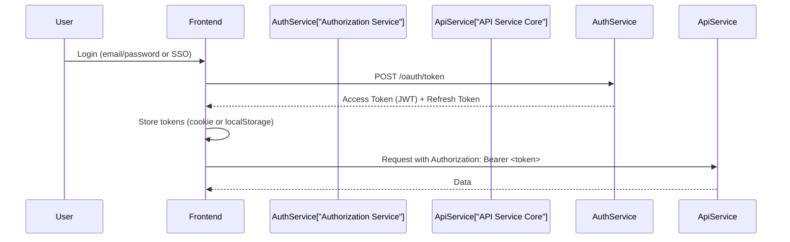
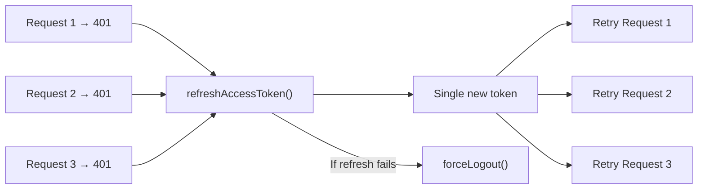

# Security Best Practices

This guide covers authentication patterns, data handling, input validation, secret management, and security guidelines for developing in the OpenFrame OSS Frontend.

---

## Authentication Architecture

### OAuth 2.0 + JWT Flow

OpenFrame uses an OAuth 2.0 / OIDC-compliant authorization flow. The frontend interacts with the Authorization Service for all authentication operations.



### Token Storage

Tokens are stored and managed through `src/lib/token-store.ts`. The application supports two auth modes:

| Mode | Storage | Header | Use Case |
|------|---------|--------|----------|
| **Bearer mode** | `localStorage` / memory | `Authorization: Bearer <token>` | Browser-based access |
| **Cookie mode** | HttpOnly cookie (server-managed) | Automatic via `credentials: 'include'` | Enhanced security (SameSite) |

> **Never store tokens in plain JavaScript-accessible storage if using HttpOnly cookies.** The cookie mode is more secure since cookies are inaccessible to JavaScript.

### Token Refresh Strategy

The `ApiClient` implements a **single-flight refresh** to prevent race conditions when multiple requests simultaneously receive a 401:



This is implemented in `src/lib/token-refresh-manager.ts`.

---

## Input Validation and Sanitization

### Zod Schema Validation

All form inputs and API responses that need validation use [Zod](https://zod.dev/) (`zod: ^4.3.6`):

```typescript
import { z } from 'zod';

// Define schema
const createTicketSchema = z.object({
  title: z.string().min(1, 'Title is required').max(255),
  description: z.string().optional(),
  priority: z.enum(['low', 'medium', 'high', 'critical']),
});

// Validate at the form boundary
type CreateTicketInput = z.infer<typeof createTicketSchema>;
```

### React Hook Form Integration

Forms use `react-hook-form` with `@hookform/resolvers` for Zod integration:

```typescript
import { useForm } from 'react-hook-form';
import { zodResolver } from '@hookform/resolvers/zod';

const form = useForm<CreateTicketInput>({
  resolver: zodResolver(createTicketSchema),
  defaultValues: { priority: 'medium' },
});
```

### Server Response Validation

When consuming API responses that may have unknown shapes, use Zod to parse and validate:

```typescript
const responseSchema = z.object({
  id: z.string(),
  name: z.string(),
});

// Parse and throw if invalid
const parsed = responseSchema.parse(apiResponse);
```

---

## Common Security Vulnerabilities and Mitigations

### Cross-Site Scripting (XSS)

| Risk | Mitigation |
|------|-----------|
| Rendering user content as HTML | Always use React's JSX (auto-escapes) — never use `dangerouslySetInnerHTML` without sanitization |
| Markdown rendering | Markdown content is rendered via sanitized renderers in `@flamingo-stack/openframe-frontend-core` |
| User-supplied URLs | Validate and restrict URL schemes (no `javascript:` URLs) |

> **Rule:** Never use `dangerouslySetInnerHTML` unless the content has been explicitly sanitized through an approved HTML sanitizer.

### Cross-Site Request Forgery (CSRF)

- All state-changing requests use the `ApiClient` which attaches Authorization headers
- Bearer token authentication inherently mitigates CSRF (browsers do not auto-attach custom headers)
- Cookie-based auth uses `SameSite` cookie policies managed by the Authorization Service

### Sensitive Data Exposure

- Never log access tokens, refresh tokens, or user credentials
- API keys visible in the Settings UI are masked by default
- MeshCentral WebSocket sessions use short-lived signed tickets

---

## Environment Variables and Secrets Management

### What Goes in Environment Variables

| ✅ Safe to use | ❌ Never put in env vars |
|---------------|------------------------|
| API base URLs | Private API keys or secrets |
| Feature flag defaults | OAuth client secrets |
| Public app URLs | Database credentials |
| GTM container IDs (public) | Encryption keys |

### NEXT_PUBLIC_ Variables

Variables prefixed with `NEXT_PUBLIC_` are embedded in the client bundle and **visible to all users**. Only use them for non-sensitive configuration:

```bash
# ✅ Safe - public URL
NEXT_PUBLIC_TENANT_HOST_URL=https://your-tenant.openframe.dev

# ✅ Safe - public runtime setting
NEXT_PUBLIC_AUTH_CHECK_INTERVAL=300000

# ❌ Never - private key
NEXT_PUBLIC_SECRET_KEY=secret123  # This would be exposed in the browser!
```

### .env.local

- Add all local secrets and config to `.env.local`
- This file is gitignored — **never commit it**
- The `.env.example` file documents required variables without real values

---

## API Security Patterns

### Always Use ApiClient

All backend calls must go through `src/lib/api-client.ts`:

```typescript
// ✅ Correct - uses ApiClient with auth
import { apiClient } from '@/lib/api-client';
const { data } = await apiClient.get('/api/devices');

// ❌ Incorrect - bypasses auth layer
const response = await fetch('/api/devices');
```

The `ApiClient`:
- Automatically attaches authentication headers
- Handles 401 with token refresh
- Enforces HTTPS-only connections
- Prevents auth credential leaking

### Skipping Auth (Public Endpoints Only)

Only skip authentication for genuinely public endpoints:

```typescript
// ✅ Public health check
await apiClient.get('/api/health', { skipAuth: true });

// ❌ Never skip auth for protected resources
await apiClient.get('/api/devices', { skipAuth: true }); // Wrong!
```

---

## Security Testing Guidelines

### Before Submitting a PR

Run the linter and type checker — both catch common security antipatterns:

```bash
npm run type-check   # Catches unsafe type assertions
npm run lint         # ESLint security rules
npm run lint:biome   # Biome security checks
```

### Manual Security Review Checklist

- [ ] No hardcoded credentials, tokens, or secrets in code
- [ ] No `dangerouslySetInnerHTML` without sanitization
- [ ] All form inputs validated with Zod schemas
- [ ] API calls use `apiClient` (not raw `fetch`)
- [ ] No `console.log` statements printing tokens or user data
- [ ] User-supplied URLs validated before use
- [ ] No sensitive data in `NEXT_PUBLIC_` environment variables

---

## Reporting Security Issues

If you discover a security vulnerability, do **not** open a public GitHub issue. Instead, reach out directly through the [OpenMSP Slack community](https://join.slack.com/t/openmsp/shared_invite/zt-36bl7mx0h-3~U2nFH6nqHqoTPXMaHEHA) to the Flamingo Stack maintainers.

---

## Additional Resources

- [OWASP Top 10](https://owasp.org/www-project-top-ten/) — Common web vulnerabilities
- [Next.js Security Documentation](https://nextjs.org/docs/app/building-your-application/authentication)
- [React Security Best Practices](https://react.dev/reference/react-dom/components/common#dangerously-setting-the-inner-html)
