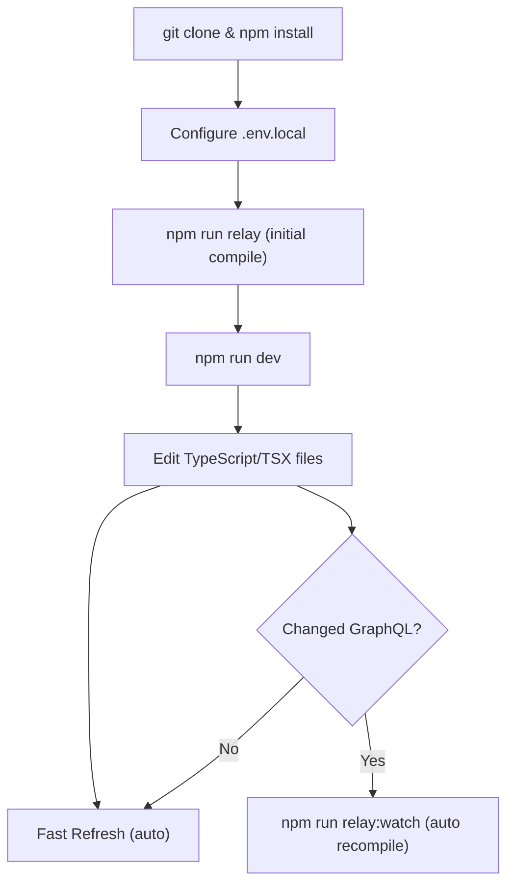

# Local Development Guide

This guide explains how to clone the repository, run the application locally, use hot reload, and configure debugging.

---

## Clone and Initial Setup

```bash
# Clone the repository
git clone https://github.com/flamingo-stack/openframe-oss-frontend.git
cd openframe-oss-frontend

# Install all dependencies
npm install

# Set up environment variables
cp .env.example .env.local
# Edit .env.local with your backend URLs
```

---

## Running the Development Server

```bash
npm run dev
```

The development server starts on port 3000 by default. To use a different port:

```bash
PORT=3001 npm run dev
```

Expected output:

```text
▲ Next.js 16.2.4
- Local:        http://localhost:3000
- Network:      http://0.0.0.0:3000

✓ Starting...
✓ Ready in 2.1s
```

---

## Hot Reload

Next.js (App Router) provides **Fast Refresh** out of the box. When you save a file:

- React components update instantly without losing state
- Server components re-render automatically
- TypeScript errors appear directly in the browser overlay

**What triggers a full reload:**
- Changes to `next.config.*`
- Changes to `tailwind.config.*`
- Changes to global CSS (`app/globals.css`)
- Changes to `src/lib/relay/environment.ts` (Relay environment)

**What supports Fast Refresh (no full reload):**
- Any React component (`*.tsx`)
- Hooks (`*.ts` / `*.tsx`)
- Utility functions
- Zustand stores

---

## Relay Compiler Watch Mode

If you are modifying or creating GraphQL queries/fragments, run the Relay compiler in watch mode alongside the dev server:

```bash
# In a separate terminal
npm run relay:watch
```

This automatically recompiles Relay artifacts whenever you change a `.graphql` file or a `graphql\`...\`` template literal in TypeScript files.

> **Note:** The Relay compiler must have run at least once before the dev server can start without errors. If you see Relay-related import errors, run `npm run relay` first.

---

## Connecting to Backend Services

The frontend communicates with backend services via environment variables. Update your `.env.local`:

```bash
# Primary API gateway (GraphQL + REST proxy)
NEXT_PUBLIC_TENANT_HOST_URL=https://your-tenant.openframe.dev

# Shared platform API
NEXT_PUBLIC_SHARED_HOST_URL=https://api.openframe.dev

# Application mode
NEXT_PUBLIC_APP_MODE=oss-tenant

# Local app URL
NEXT_PUBLIC_APP_URL=http://localhost:3000
```

All API calls from the frontend use the centralized `ApiClient`:

```typescript
// src/lib/api-client.ts
import { apiClient } from '@/lib/api-client';

// Authenticated GET request
const { data, error } = await apiClient.get<MyType>('/api/endpoint');

// Authenticated POST (GraphQL)
const result = await apiClient.post('/api/graphql', { query, variables });
```

The `ApiClient` automatically:
- Attaches authentication tokens (Bearer or cookie-based)
- Handles 401 errors with a single-flight token refresh
- Resolves URLs relative to `NEXT_PUBLIC_TENANT_HOST_URL`

---

## Debugging in VS Code

Create a `.vscode/launch.json` configuration to attach the VS Code debugger to the Next.js server:

```json
{
  "version": "0.2.0",
  "configurations": [
    {
      "name": "Next.js: debug server-side",
      "type": "node-terminal",
      "request": "launch",
      "command": "npm run dev"
    },
    {
      "name": "Next.js: debug client-side",
      "type": "chrome",
      "request": "launch",
      "url": "http://localhost:3000"
    },
    {
      "name": "Next.js: debug full stack",
      "type": "node-terminal",
      "request": "launch",
      "command": "npm run dev",
      "serverReadyAction": {
        "pattern": "- Local:.+(https?://.+)",
        "uriFormat": "%s",
        "action": "debugWithChrome"
      }
    }
  ]
}
```

---

## Debugging in the Browser

For client-side debugging:

1. Open Chrome DevTools (`F12` or `Cmd+Option+I` on macOS)
2. Navigate to the **Sources** tab
3. Use `Cmd+P` / `Ctrl+P` to search for source files
4. Set breakpoints directly in TypeScript files (source maps are enabled in dev mode)

### Useful DevTools Tips

- **React DevTools** browser extension shows the component tree, props, and hooks state
- **Network tab** shows all API calls — useful to verify requests go to the right backend
- **Relay DevTools** (if installed) shows GraphQL query/fragment status

---

## Fetching an Updated GraphQL Schema

When the backend schema changes (new fields, types, or mutations), sync it locally:

```bash
npm run fetch-schema
```

Then recompile Relay:

```bash
npm run relay
```

And restart the dev server if needed.

---

## Production Build Locally

To test a production build locally:

```bash
# Build
npm run build

# Start production server
npm run start
```

Or to test the standalone server output:

```bash
npm run start:standalone
```

---

## Local Development Workflow Summary



---

## Troubleshooting Common Issues

**`Cannot find module '@relay/__generated__/...'`**
Run `npm run relay` to generate Relay artifacts before starting.

**Port 3000 in use:**
```bash
PORT=3001 npm run dev
```

**Environment variables not loading:**
Confirm `.env.local` exists in the project root and the variable names start with `NEXT_PUBLIC_`.

**TypeScript errors after pulling new code:**
```bash
npm install  # Update dependencies
npm run relay  # Recompile Relay artifacts
npm run type-check  # Check for errors
```
