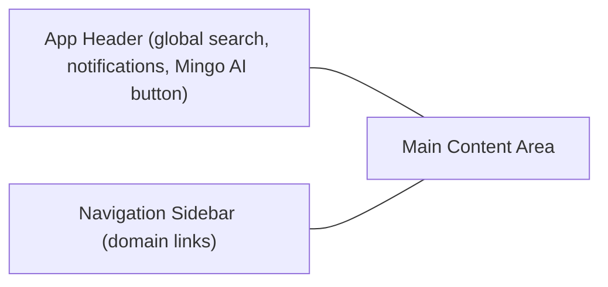

# First Steps

Now that you have the OpenFrame OSS Frontend running locally, here are the first 5 things to do to get oriented, verify your setup, and start being productive.

---

## 1. Explore the Application Layout

After logging in, you'll see the main application shell. Take a moment to familiarize yourself with the navigation:



**Key navigation areas:**

| Section | URL Path | What You'll Find |
|---------|---------|-----------------|
| Dashboard | `/dashboard` | Overview stats, onboarding progress |
| Devices | `/devices` | All managed endpoints |
| Customers | `/customers` | Organizations / client accounts |
| Tickets | `/tickets` | Support ticket queue and Kanban board |
| Knowledge Base | `/knowledge-base` | Internal documentation articles |
| Monitoring | `/monitoring` | Fleet policies, osquery checks |
| Scripts | `/scripts` | Script library and schedule management |
| Logs | `/logs-page` | Unified audit log viewer |
| Mingo AI | `/mingo` | AI assistant chat interface |
| Settings | `/settings` | Tenant config, users, SSO, API keys |

---

## 2. Complete the Onboarding Checklist

OpenFrame includes a guided onboarding experience for new tenant setups. If you're starting fresh, visit `/onboarding` to walk through:

- **Company & Team Setup** — Set your MSP profile and invite team members
- **Customer Setup** — Add your first client organization
- **Device Setup** — Connect a managed endpoint
- **Mingo AI** — Configure the Mingo AI assistant
- **Scripting** — Create or import your first script
- **Monitoring** — Set up your first Fleet policy or osquery check
- **Tickets** — Configure ticket statuses and workflows
- **Knowledge Base** — Create your first article

> The onboarding checklist auto-detects completion of each step as you use the platform.

---

## 3. Verify Environment Configuration

Confirm the application is connected to the right backend by checking your runtime configuration. The key environment variables are read at startup:

| Configuration | Where to Check |
|--------------|----------------|
| API connectivity | Navigate to `/devices` — if devices load (or show empty state), the GraphQL API is connected |
| Auth flow | Logout and log back in to verify the OAuth flow works correctly |
| Feature flags | Open browser DevTools console and look for any feature flag warnings |

You can also check the Network tab in DevTools for requests to confirm they hit your `NEXT_PUBLIC_TENANT_HOST_URL`.

---

## 4. Run the Type Checker and Linter

Before making any code changes, run the TypeScript type checker and linter to understand the current state of the codebase:

```bash
# Type checking (no files emitted, just checks)
npm run type-check

# ESLint — the fast pass
npm run lint

# Prettier — formatting check
npm run format
```

If you see errors, do not worry — review the error output and check if there are any known issues in the OpenMSP Slack community. A clean type check and lint is a good baseline before you start contributing.

---

## 5. Understand the Key Directories

Navigate the codebase to understand how it's organized. Here are the most important directories:

```text
src/
├── app/               # Next.js App Router pages and layouts
│   ├── (app)/         # Authenticated app routes (devices, tickets, etc.)
│   └── (auth)/        # Authentication routes (login, signup)
├── components/        # Shared app-level components (assignments, route guards)
├── graphql/           # GraphQL mutation and query definitions
├── lib/               # Core utilities (api-client, auth, meshcentral, relay)
├── stores/            # Zustand global state (feature flags, onboarding, devices)
└── app/(app)/         # Feature domains (each has: components/, hooks/, queries/)
```

**Each feature domain** (e.g., `devices/`, `tickets/`) follows the same pattern:

```text
devices/
├── components/        # UI components specific to this domain
├── hooks/             # React hooks for data fetching and mutations
├── queries/           # GraphQL query definitions
├── types/             # TypeScript type definitions
├── utils/             # Domain-specific utility functions
└── page.tsx           # Next.js page entry point
```

---

## Where to Get Help

If you run into issues or have questions:

- **OpenMSP Slack Community** (primary support channel): https://join.slack.com/t/openmsp/shared_invite/zt-36bl7mx0h-3~U2nFH6nqHqoTPXMaHEHA
- **OpenMSP Hub**: https://www.openmsp.ai/
- **GitHub Repository**: https://github.com/flamingo-stack/openframe-oss-frontend
- **Flamingo Platform**: https://flamingo.run
- **OpenFrame Website**: https://openframe.ai

> We do not use GitHub Issues or Discussions for support — all questions and discussions happen in the OpenMSP Slack community.

---

## Suggested Learning Path

After completing your first steps:

1. Read the [Architecture Overview](../development/architecture/README.md) to understand the system design
2. Set up your IDE with the [Environment Setup Guide](../development/setup/environment.md)
3. Review the [Contributing Guidelines](../development/contributing/guidelines.md) before submitting your first PR
4. Explore the [Security Overview](../development/security/README.md) to understand authentication patterns
