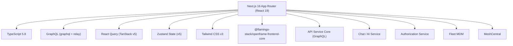
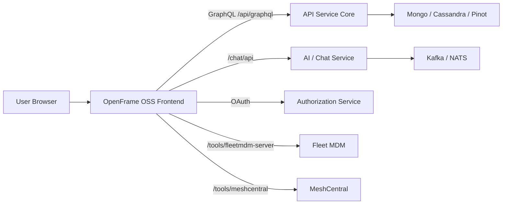
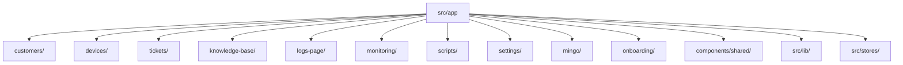

# Introduction to OpenFrame OSS Frontend

OpenFrame OSS Frontend is the primary web application powering the [OpenFrame](https://openframe.ai) platform — a unified, AI-driven interface for Managed Service Providers (MSPs). It replaces expensive proprietary MSP software with intelligent open-source alternatives, bringing device management, ticketing, monitoring, scripts, and AI assistance into a single cohesive interface.

Built and maintained by [Flamingo](https://flamingo.run), this project is part of the [flamingo-stack](https://github.com/flamingo-stack) open-source ecosystem.

---

## What Is OpenFrame OSS Frontend?

This repository implements the **presentation and orchestration layer** of the OpenFrame platform. It is a modern **Next.js 16 + React 19** application that:

- Renders the full operational UI for MSP workflows
- Orchestrates AI interactions through Mingo (technician AI) and Fae (client AI)
- Manages authentication and session lifecycle via OAuth/JWT
- Integrates with Fleet MDM, MeshCentral, and other open-source tools
- Supports multi-tenant SaaS deployments

---

## Key Features

| Feature | Description |
|---------|-------------|
| **Device Management** | Unified device model, remote shell, file manager, remote desktop |
| **Customer Management** | Per-organization AI configuration, guardrails, device counts |
| **Ticketing** | Kanban boards, AI-assisted replies, approval workflows |
| **Knowledge Base** | Article management, folder organization, attachment handling |
| **Mingo AI (Technician)** | Chat-based AI assistant with streaming, tool execution, context awareness |
| **Customer AI (Fae)** | Embeddable AI for client-facing portals |
| **Monitoring** | Fleet MDM policies, osquery, live query campaigns |
| **Scripts** | Script library, scheduling, execution history |
| **Audit Logs** | Organization and device-level log viewer |
| **Settings & Billing** | Tenant config, SSO, API keys, subscriptions |
| **Onboarding** | Step-by-step guided setup for new tenants |

---

## Target Audience

This project is primarily for:

- **MSP Developers** building on or contributing to the OpenFrame platform
- **MSP Operators** who want to self-host and customize the platform
- **OSS Contributors** looking to improve the frontend codebase
- **Flamingo Stack engineers** working on new features

---

## Technology Stack

### Core Dependencies

| Package | Version | Purpose |
|---------|---------|---------|
| `next` | ^16.2.4 | SSR + App Router framework |
| `react` | ^19.2.0 | UI library |
| `react-relay` | ^20.1.1 | GraphQL fragment system |
| `@tanstack/react-query` | ^5.90.16 | Server-state caching |
| `zustand` | ^5.0.8 | Client-side state management |
| `tailwindcss` | ^3.4.17 | Utility-first CSS |
| `@xterm/xterm` | ^6.0.0 | Terminal emulator for remote shell |
| `@monaco-editor/react` | ^4.7.0 | Script editor |
| `zod` | ^4.3.6 | Runtime schema validation |
| `@flamingo-stack/openframe-frontend-core` | ^0.0.480 | Shared UI component library |

---

## High-Level Architecture

---

## Application Domain Structure

The application is organized by feature domain under `src/app`:

---

## Community & Support

OpenFrame OSS is supported through the **OpenMSP Slack community** — the primary channel for discussions, questions, and collaboration:

- **Join Slack:** https://join.slack.com/t/openmsp/shared_invite/zt-36bl7mx0h-3~U2nFH6nqHqoTPXMaHEHA
- **Community Hub:** https://www.openmsp.ai/
- **OpenFrame Website:** https://openframe.ai
- **GitHub Repository:** https://github.com/flamingo-stack/openframe-oss-frontend

---

## What's Next?

- Review the [Prerequisites Guide](prerequisites.md) to prepare your development environment
- Follow the [Quick Start](quick-start.md) to get the app running in minutes
- Complete the [First Steps Guide](first-steps.md) to explore key features after setup
