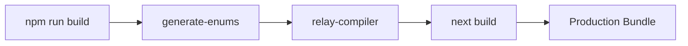

# Quick Start

Get the OpenFrame OSS Frontend running locally in under 5 minutes.

> **Before you begin:** Ensure you have Node.js 18+, npm 9+, and Git installed. See the [Prerequisites Guide](prerequisites.md) for details.

---

## TL;DR

```bash
git clone https://github.com/flamingo-stack/openframe-oss-frontend.git
cd openframe-oss-frontend
npm install
cp .env.example .env.local   # then fill in your backend URLs
npm run dev
```

Open [http://localhost:3000](http://localhost:3000) in your browser.

---

## Step 1: Clone the Repository

```bash
git clone https://github.com/flamingo-stack/openframe-oss-frontend.git
cd openframe-oss-frontend
```

---

## Step 2: Install Dependencies

```bash
npm install
```

This installs all production and development dependencies, including Next.js, React, Relay, TanStack Query, Tailwind CSS, and the shared `@flamingo-stack/openframe-frontend-core` UI library.

---

## Step 3: Configure Environment Variables

The app requires environment variables pointing to your backend services. Copy the example file and fill in your values:

```bash
cp .env.example .env.local
```

Then edit `.env.local` with your environment values. At minimum, set:

```bash
NEXT_PUBLIC_TENANT_HOST_URL=https://your-tenant.openframe.dev
NEXT_PUBLIC_SHARED_HOST_URL=https://api.openframe.dev
NEXT_PUBLIC_APP_MODE=oss-tenant
NEXT_PUBLIC_APP_URL=http://localhost:3000
```

> Refer to your environment configuration or OpenMSP Slack community for actual backend URLs.

---

## Step 4: Start the Development Server

```bash
npm run dev
```

This starts Next.js in development mode on port 3000 (configurable via `PORT` environment variable):

```text
▲ Next.js 16.2.4
- Local:        http://localhost:3000
- Network:      http://0.0.0.0:3000

✓ Starting...
✓ Ready in 2.1s
```

---

## Step 5: Open the App

Navigate to [http://localhost:3000](http://localhost:3000) in your browser.

You will see the OpenFrame login screen. Log in with credentials from your connected OpenFrame backend instance.

---

## Available Scripts

| Script | Description |
|--------|-------------|
| `npm run dev` | Start development server with hot reload |
| `npm run build` | Generate schema enums + Relay artifacts + Next.js production build |
| `npm run start` | Start the production server (after build) |
| `npm run lint` | Run ESLint (the fast pass; rules come from the core library's shared config) |
| `npm run lint:fix` | ESLint autofix |
| `npm run lint:types` | ESLint type-aware pass (slow — needs an 8 GB heap) |
| `npm run format:fix` | Auto-fix formatting with Prettier |
| `npm run type-check` | Run TypeScript type checking without emitting |
| `npm run relay` | Compile Relay GraphQL fragments |
| `npm run relay:watch` | Watch and recompile Relay fragments on change |
| `npm run fetch-schema` | Fetch the latest GraphQL schema from the backend |

---

## Build Pipeline

The production build runs several steps automatically:



1. **`generate-enums`** — Generates TypeScript enum files from the GraphQL schema
2. **`relay-compiler`** — Compiles Relay fragment queries into optimized artifacts
3. **`next build`** — Produces the optimized Next.js production build

---

## Expected Result

After `npm run dev` starts successfully, you should be able to:

- Access the login page at `http://localhost:3000`
- Authenticate with your backend credentials
- See the OpenFrame dashboard with navigation sidebar

---

## Troubleshooting

**Port already in use?** Change the port:

```bash
PORT=3001 npm run dev
```

**Relay compilation errors?** The Relay compiler needs to run before the dev server for fresh environments:

```bash
npm run relay
npm run dev
```

**TypeScript errors on startup?** Run the type checker to see all issues:

```bash
npm run type-check
```

---

## Next Steps

After getting the app running:

- Read the [First Steps Guide](first-steps.md) to explore key features and initial configuration
- Review [Local Development](../development/setup/local-development.md) for IDE setup, debug config, and hot reload details
- Check the [Architecture Overview](../development/architecture/README.md) to understand how the codebase is organized
