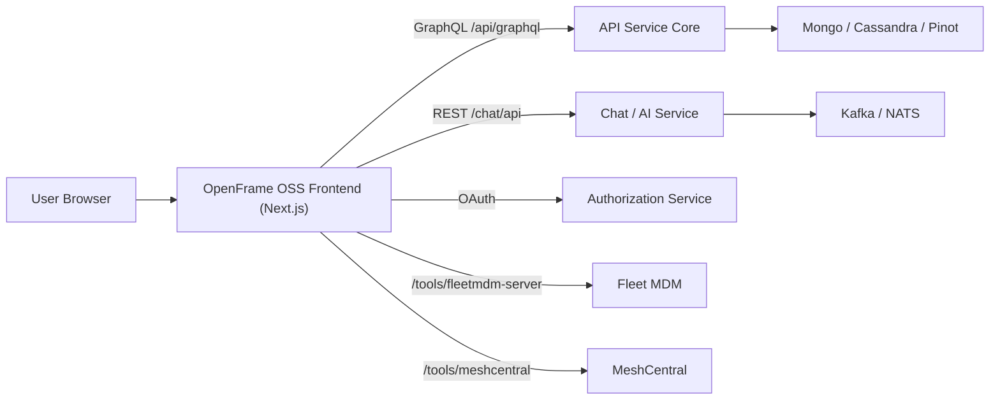
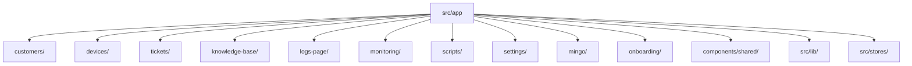
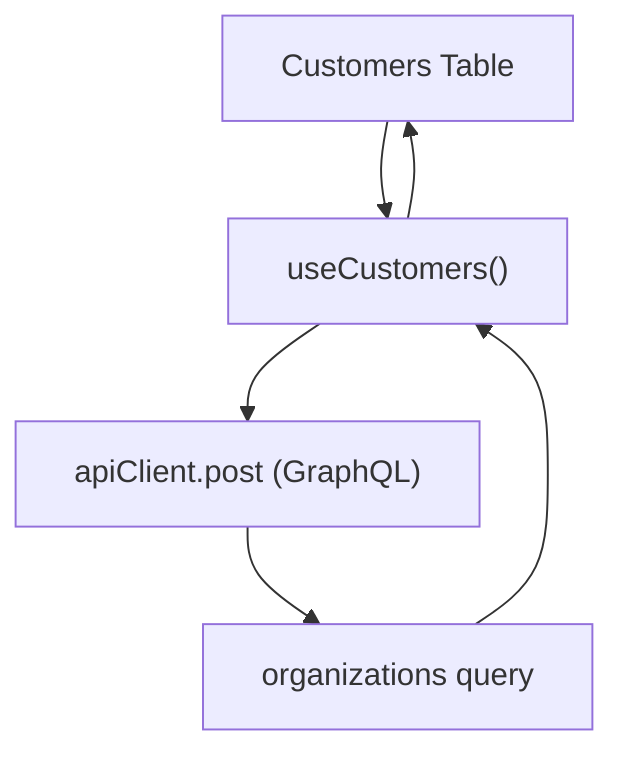
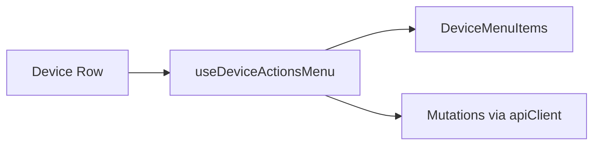
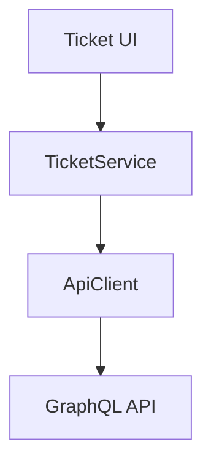
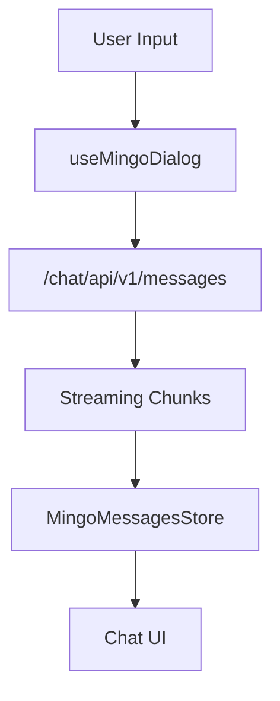
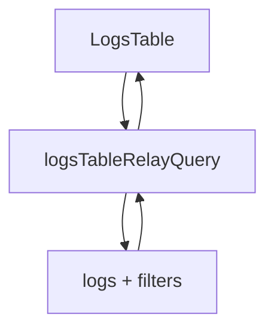
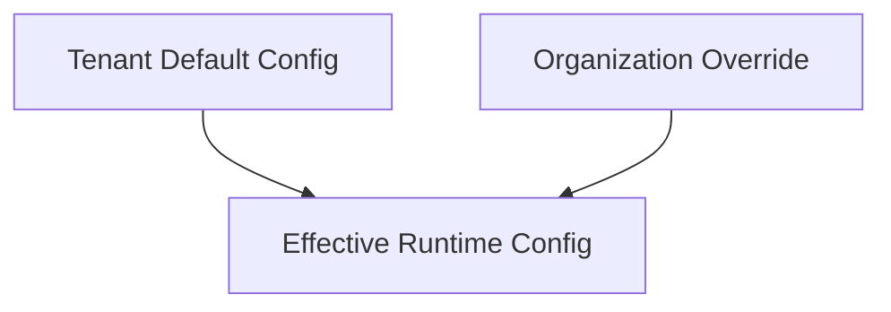
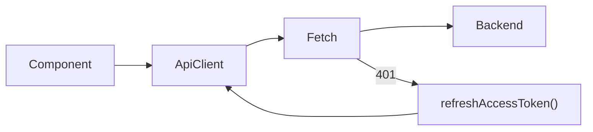

# OpenFrame OSS Frontend – Repository Overview

**Repository:** https://github.com/flamingo-stack/openframe-oss-frontend  
**Purpose:** Frontend application for the OpenFrame OSS platform (Flamingo Stack).

OpenFrame OSS Frontend is the primary web interface for the OpenFrame platform. It provides a unified, AI-driven UI for MSP operations including:

- Device and customer management  
- Ticketing and knowledge base  
- Logs, monitoring, and scripts  
- AI assistant workflows (Mingo / Customer AI)  
- Billing, onboarding, and tenant configuration  

It is built with **Next.js (App Router) + React + TypeScript**, and integrates with backend services via **GraphQL and REST APIs**.

---

# 1. Purpose of the Repository

This repository implements the **presentation and orchestration layer** of OpenFrame. It:

- Renders operational UI for MSP workflows  
- Orchestrates AI interactions  
- Manages authentication and token lifecycle  
- Maintains client-side state (React Query + Zustand)  
- Integrates with Fleet MDM and MeshCentral  
- Provides a multi-tenant SaaS-ready frontend  

It depends heavily on shared UI primitives from `openframe-frontend-core`.

---

# 2. High-Level End-to-End Architecture

The frontend interacts with multiple backend services:

### Responsibilities in the Stack

| Layer | Responsibility |
|-------|----------------|
| Frontend | UI rendering, state orchestration |
| API Service Core | Business logic + persistence |
| Authorization Service | OAuth, JWT, tenant scoping |
| Stream Service | Event ingestion & AI orchestration |
| Fleet / MeshCentral | Device management integrations |

---

# 3. Application Structure

The application is organized under `src/app` using Next.js App Router.

## Domain-Based Structure

---

# 4. Core Feature Modules

## 4.1 Customers

Key capabilities:

- Customer list with cursor-based pagination  
- Device counts per organization  
- AI assistant configuration per customer  
- Guardrails and LLM overrides  

Data flow:

---

## 4.2 Devices

Centralized `Device` type provides a unified model including:

- Hardware & OS metadata  
- Installed tools  
- Policies & tags  
- Fleet + MeshCentral linkage  

Device actions are abstracted through:

Supports archive, unarchive, delete, remote shell, file manager.

---

## 4.3 Tickets

Ticket Service abstracts lifecycle, transitions, and chat integration.

Responsibilities:

- Status transitions  
- Kanban reorder  
- Assignment handling  
- Chat/AI message sending  
- Approval workflows  

---

## 4.4 Mingo AI (Chat)

AI-driven dialog system with streaming support.

Features:

- Context-aware entity references  
- Incremental streaming  
- Approval batch handling  
- Zustand-based dialog state  

---

## 4.5 Monitoring & Logs

Uses Relay-based pagination:

Supports:

- Cursor pagination  
- Date-range filtering  
- Device/organization scoping  

---

## 4.6 Scripts

Supports:

- Script creation and editing  
- Device assignment  
- Schedule configuration  
- Execution monitoring  

Integrated with device selector and Fleet MDM.

---

## 4.7 Settings & Billing

Includes:

- AI provider + model configuration  
- Quick actions editor  
- Tenant info management  
- Subscription cancellation preview  
- Provisioning state polling  

Override model:

---

# 5. Shared Infrastructure

## 5.1 API Client Layer

Located under `src/lib`.

Responsibilities:

- Inject auth headers  
- Token refresh (single-flight)  
- Multi-tenant base URL resolution  
- Standardized `ApiResponse<T>` envelope  

---

## 5.2 State Management

| Tool | Purpose |
|------|---------|
| React Query | Server-state caching & pagination |
| Relay | GraphQL fragments & streaming |
| Zustand | UI/session state |

Key stores:

- `FeatureFlagsState`  
- `OnboardingState`  
- `MingoMessagesStore`  
- `SubscriptionLockSignalState`  

---

## 5.3 MeshCentral Integration

Custom remote desktop client:

- Binary frame decoding  
- Tile rendering  
- Keyboard/mouse event injection  
- File manager support  

Enables full remote control within the browser.

---

# 6. Cross-Cutting Patterns

## 6.1 Cursor-Based Pagination

Used across:

- Customers  
- Devices  
- Tickets  
- Logs  
- Dialog messages  

## 6.2 Tenant-Aware URL Resolution

Frontend adapts to:

- Dedicated tenant domains  
- Shared SaaS host  
- Local development  

## 6.3 Override + Inheritance Model

Applied to:

- AI configuration  
- Customer assistant settings  
- Billing plans  
- Feature flags  

---

# 7. Repository Role in the Platform

OpenFrame OSS Frontend is the **human interface layer** connecting:

- API Service Core  
- Authorization Service  
- Stream Service Core  
- Fleet MDM  
- MeshCentral  

It orchestrates AI-first MSP workflows while maintaining strict tenant isolation and scalable SaaS compatibility.

---

# Summary

The **openframe-oss-frontend** repository implements a modular, multi-tenant, AI-driven Next.js application that:

- Unifies device, ticket, script, and monitoring workflows  
- Integrates deeply with Fleet MDM and MeshCentral  
- Supports streaming AI conversations (Mingo)  
- Provides SaaS-ready tenant isolation  
- Enforces consistent API interaction patterns  
- Maintains scalable cursor-based data access  

It serves as the orchestration and presentation layer for the entire OpenFrame OSS ecosystem.