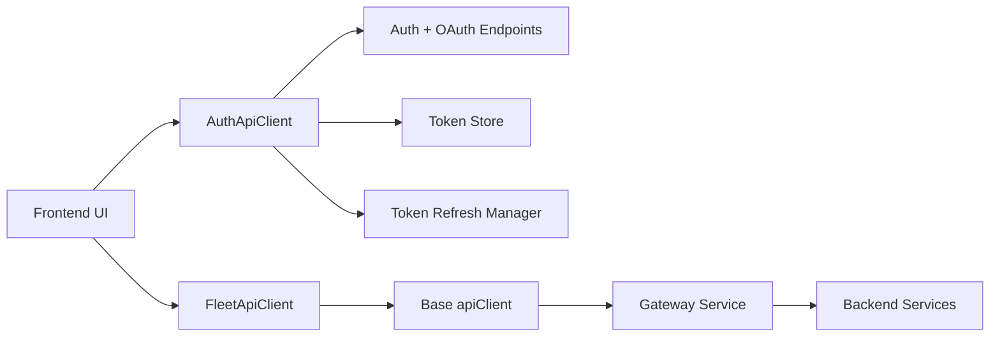
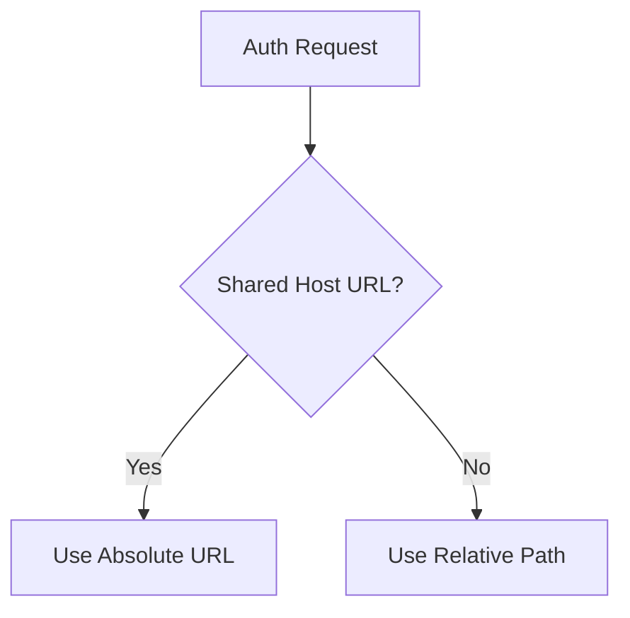
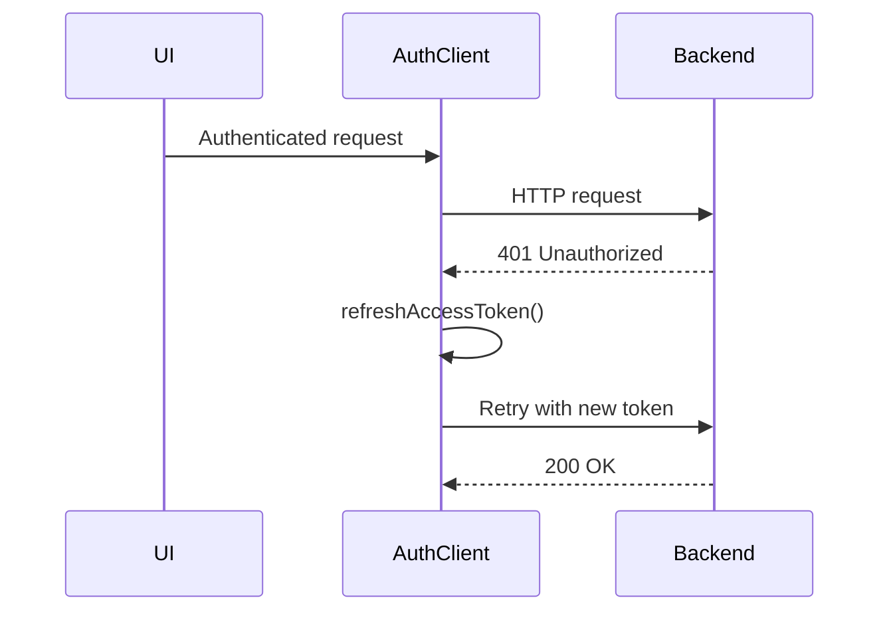
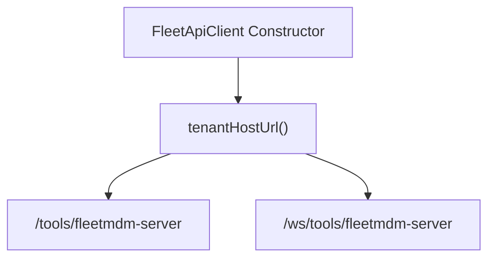
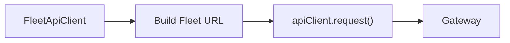
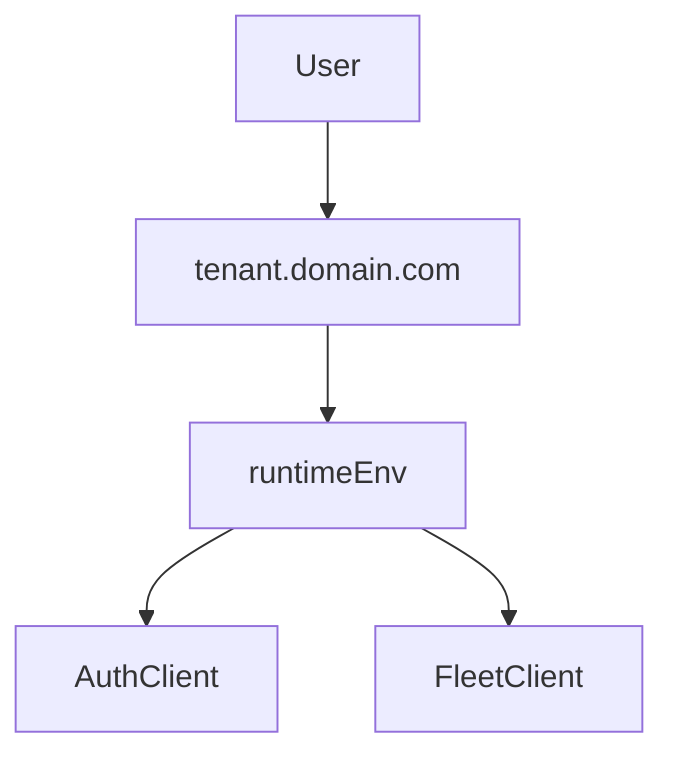

# Api Client

The **Api Client** module provides typed, centralized HTTP clients used by the OpenFrame frontend to communicate with backend services. It encapsulates:

- Authentication and OAuth flows (via `AuthApiClient`)
- Fleet MDM integration (via `FleetApiClient`)
- Token lifecycle management (access + refresh tokens)
- Multi-tenant and SaaS shared-host URL handling
- Consistent response envelopes and error handling

This module acts as the boundary between frontend UI logic and backend APIs, ensuring that authentication, retries, and base URL resolution are handled consistently.

---

## Core Components

The Api Client module contains two primary clients:

- `AuthApiClient` – Handles authentication, OAuth, registration, invitation, and password reset flows.
- `FleetApiClient` – Handles Fleet MDM REST and WebSocket interactions for policies, queries, hosts, labels, teams, and packs.

---

## High-Level Architecture



### Key Observations

- `AuthApiClient` communicates directly with authentication endpoints (e.g., `/oauth/*`, `/sas/*`, `/me`).
- `FleetApiClient` builds Fleet-specific URLs and delegates actual HTTP execution to the shared `apiClient`.
- Token rotation and retry logic are centralized in `AuthApiClient`.
- Multi-tenant host resolution is derived from runtime configuration.

---

# AuthApiClient

`AuthApiClient` is a dedicated authentication client responsible for:

- Login and logout flows
- OAuth provider integration
- Token refresh handling
- Registration and invitation acceptance
- Public auth-related endpoints

It supports both:

- Cookie-based authentication
- Bearer-token-based authentication (mobile or token mode)

---

## URL Resolution Strategy

The client dynamically builds URLs depending on environment:

- If `sharedHostUrl()` is defined → absolute URL (SaaS shared mode)
- Otherwise → relative paths (same origin)



This ensures compatibility across:

- SaaS shared deployments
- Tenant-isolated domains
- Local development

---

## Token Lifecycle and 401 Handling

A key feature of `AuthApiClient` is safe token rotation.

### Flow Overview



### Important Safeguards

- Captures `tokenEpoch` before sending the request.
- Prevents double refresh when a token was already rotated.
- Avoids forced logout during `/auth` page flows.
- Forces logout only when refresh fails.

This protects against race conditions during mobile login or multi-tab usage.

---

## Supported Auth Operations

`AuthApiClient` provides high-level methods for:

### OAuth & Login

- `loginUrl()`
- `logout()` / `logoutAsync()`
- `oauth()`
- `refresh()`
- `devExchange()`

### Registration & Tenancy

- `registerOrganization()`
- `registerOrganizationSso()`
- `discoverTenants()`
- `checkDomainAvailability()`
- `checkEmailAvailability()`

### Invitations

- `acceptInvitation()`
- `acceptInvitationSso()`
- `getInviteProviders()`

### Password Reset

- `requestPasswordReset()`
- `confirmPasswordReset()`

### Public Requests

Public endpoints use `credentials: omit` and do not attach tokens.

---

# FleetApiClient

`FleetApiClient` is a specialized integration client for Fleet MDM.

It wraps Fleet's REST API and WebSocket endpoints and delegates HTTP execution to the shared `apiClient`.

---

## Base URL Construction

The base path is derived from `tenantHostUrl()`:

```text
{tenantHostUrl}/tools/fleetmdm-server
```

WebSocket base path:

```text
{tenantHostUrl}/ws/tools/fleetmdm-server
```



---

## Delegation to Base apiClient

All REST calls eventually go through the shared `apiClient`:



This ensures:

- Shared authentication headers
- Shared error handling
- Consistent response shape (`ApiResponse<T>`)

---

## Fleet Domain Coverage

`FleetApiClient` provides structured methods for:

### Policies

- CRUD operations
- Host assignments
- Policy execution
- Count endpoints

### Queries

- CRUD operations
- Live query execution
- Query reports
- Host assignments
- Count inference via list endpoint

### Hosts

- Host listing with filters
- Policy and query associations
- Host counts

### Labels

- CRUD operations

### Teams

- Team listing and retrieval

### Packs

- Pack listing and retrieval

---

## WebSocket Support (Fleet Results)

`FleetApiClient` provides `getSockJsUrl()` for Fleet result streaming.

Key properties:

- Generates unbiased random server IDs using rejection sampling.
- Generates session IDs via cryptographically secure randomness.
- Produces URLs of the form:

```text
/ws/tools/fleetmdm-server/api/v1/fleet/results/{serverId}/{sessionId}/websocket
```

This ensures:

- Even load distribution
- Collision avoidance
- Secure session randomness

---

# Error Handling Model

Both clients return standardized response envelopes:

```text
{
  ok: boolean,
  status: number,
  data?: T,
  error?: string
}
```

Advantages:

- No uncaught exceptions for standard HTTP errors
- Predictable UI integration
- Clear distinction between transport errors and application errors

---

# Multi-Tenancy and SaaS Considerations

The Api Client module is multi-tenant aware:

- Shared SaaS host mode
- Tenant-specific host resolution
- Domain suffix computation for subdomain registration
- Support for switching tenants during invitation acceptance



This design allows the same frontend build to run across:

- Local environments
- Dedicated tenant domains
- Shared SaaS infrastructure

---

# Responsibilities and Boundaries

The Api Client module is responsible for:

- HTTP request orchestration
- Authentication header injection
- Token refresh and retry logic
- Base URL resolution
- Typed response wrapping

It is **not responsible for**:

- UI state management
- Business logic
- Data transformation beyond transport concerns

---

# Summary

The **Api Client** module is a critical infrastructure layer for the OpenFrame frontend.

It:

- Abstracts authentication complexity
- Encapsulates Fleet MDM integration
- Enforces consistent API communication patterns
- Handles token rotation safely
- Supports multi-tenant SaaS deployments

By centralizing these concerns, the frontend remains clean, predictable, and resilient to authentication edge cases and environment differences.