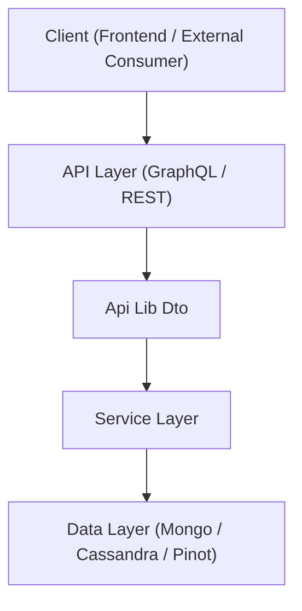
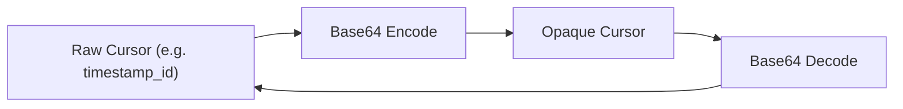
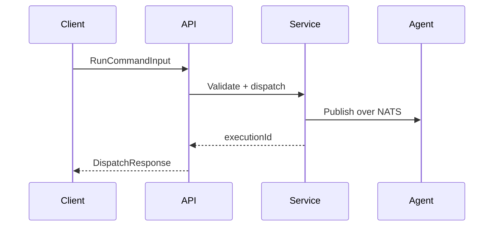
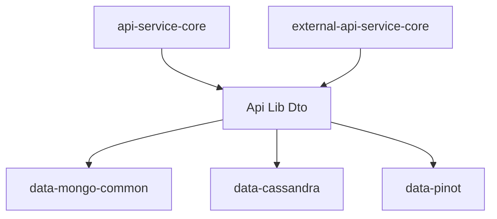

# Api Lib Dto

## Overview

The **Api Lib Dto** module defines the shared Data Transfer Objects (DTOs) used across the OpenFrame backend services. It acts as a stable contract layer between:

- GraphQL API layer (see `api-service-core`)
- External REST API layer (see `external-api-service-core`)
- Service layer implementations
- Data access modules (Mongo, Cassandra, Pinot, etc.)

This module contains:

- Query filter criteria and filter option DTOs
- Relay-style pagination helpers and cursor utilities
- Command and mutation inputs (RMM, Knowledge Base, Time Tracking, etc.)
- Shared response envelopes (e.g., dispatch responses, counted results)

It does **not** contain business logic. Instead, it defines the contract shapes that other modules consume and implement.

---

## Architectural Role

The Api Lib Dto module sits between API entry points and service/data layers.

### Responsibilities

- Standardize request and response shapes
- Enforce validation constraints at API boundary
- Provide pagination and cursor utilities
- Decouple API contracts from persistence models
- Share DTOs between GraphQL and REST services

---

## Module Structure

The module is organized by domain areas:

- Audit (Logs)
- Devices
- Events
- Knowledge Base
- Organizations
- RMM (Commands, Scripts, Scheduling)
- Time Tracking
- Tools
- Shared (Pagination, Cursors, Generic Inputs)

Each package groups DTOs by functional boundary rather than by transport type.

---

# Shared Infrastructure DTOs

## CountedGenericQueryResult

`CountedGenericQueryResult<T>` extends a generic query result and adds:

- `filteredCount` – total items matching filter criteria (independent of page size)

Used for list views where:

- Results are paginated
- UI needs the total filtered count

This pattern supports efficient UI dashboards and filter sidebars.

---

## Relay Pagination Support

### ConnectionArgs

Implements Relay-style pagination arguments:

- `first` + `after` (forward pagination)
- `last` + `before` (backward pagination)

Validation ensures page size stays within safe limits (1–100).

### CursorCodec

Encodes/decodes opaque Base64 cursors.

This hides internal database identifiers from API consumers.

### Domain Cursor Utilities

Examples:

- `OrganizationCursors`
- `TimeEntryCursors`

These create stable, sortable composite cursor keys (e.g., `timestamp_id`).

---

## MutationDeleteInput

A minimal, reusable DTO for delete mutations:

- `id` (required)

Encourages consistent mutation contracts across domains.

---

# Audit (Logs)

## LogFilterCriteria

Defines filter parameters:

- Date ranges (`startDate`, `endDate`)
- Timestamp ranges
- Event types
- Tool types
- Severities
- Organization IDs
- Device ID

## LogFilters

Represents available filter options for UI dropdowns.

Includes:

- Tool types
- Event types
- Severities
- Organization filter options

## OrganizationFilterOption

Simple `(id, name)` pair for UI selection.

---

# Device DTOs

## DeviceFilterCriteria

Supports filtering by:

- Status
- Device type
- OS type
- Organization
- Tags (keys and values)

## DeviceFilters

Provides filter options including:

- Aggregated counts
- Available values for dropdowns
- `filteredCount` summary

## DeviceFilterOption / TagFilterOption

Reusable value-label-count pattern for faceted filtering.

---

# Event DTOs

## EventFilterCriteria

Filters events by:

- User IDs
- Event types
- Date range

## EventFilters

Provides available event types and user IDs.

---

# Organization DTOs

## OrganizationResponse

Shared response DTO used by:

- GraphQL API (`api-service-core`)
- REST API (`external-api-service-core`)

Encapsulates:

- Identity fields
- Contact information
- Contract metadata
- Revenue data
- Status lifecycle fields

## OrganizationList

Wrapper for list responses.

## OrganizationFilterOptions

Internal filter parameters for advanced organization search.

---

# Knowledge Base DTOs

## CreateArticleCommand

Defines article creation input:

- Name, parent folder
- Content and summary
- Status
- Tag assignments
- Entity assignments (orgs, devices, tickets, related articles)

## UpdateArticleCommand

PUT-style update command.

## KnowledgeBaseFilterCriteria

Filters by:

- Parent ID
- Item type
- Status
- Tags

## KnowledgeBaseAttachmentUpload

Couples:

- Attachment metadata
- Pre-signed upload URL

Used for secure file upload workflows.

---

# RMM (Remote Monitoring & Management)

This is one of the most critical domains in Api Lib Dto.

It defines command dispatch, script management, execution history, and scheduling.

## Command Dispatch

### RunCommandInput

Runs an ad-hoc shell command on one machine.

### BatchRunCommandInput

Runs a command on multiple machines with:

- Hard limit (`MAX_BATCH_SIZE = 100`)
- Subject-safe machine ID validation
- Timeout limits (max 600 seconds)

### CancelExecutionInput

Cancels in-flight execution by:

- `machineId`
- `executionId`

### DispatchResponse

Unified response containing:

- `executionId`

---

## Script Management

### CreateScriptInput / UpdateScriptInput

Define full resource payloads (PUT semantics for updates):

- Name
- Shell
- Privilege level
- Script body
- Timeout
- Arguments
- Environment variables
- Tag assignments

### ScriptEnvVarInput

Represents script environment variables.

Includes a `secret` flag (storage currently plaintext; masking handled externally).

### ScriptFilterInput / ScriptFilterOption

Support advanced filtering by:

- Shell
- Status
- Platform
- Author
- Tags

---

## Script Execution & Scheduling

### RunScriptInput / BatchRunScriptInput

Dispatch saved scripts to machines.

### ScriptExecutionFilterInput

Filters execution history by:

- Status
- Initiator
- Machine

### CreateScriptScheduleInput / UpdateScriptScheduleInput

Define schedule creation and full replacement updates.

Constraints enforce:

- Minimum repeat interval (30 minutes)
- Explicit start time behavior

### ScriptScheduleFilterInput

Filter schedules by:

- Status
- Platform
- Author

---

# Time Tracking DTOs

## CreateTimeEntryCommand

Creates manual entries.

## StartTimerCommand / StopTimerCommand

Support timer lifecycle:

- Start staging
- Finalize entry
- Allow override of ticket/notes

## UpdateTimeEntryCommand

Partial update semantics (null = unchanged).

## EmployeeTimeStats

Aggregate statistics for dashboards:

- Today totals
- Period totals
- Average per day

---

# Tool DTOs

## ToolFilterCriteria

Filter tools by:

- Enabled state
- Type
- Category
- Platform category

## ToolFilters

Available filter values.

## ToolList

Wrapper for list of `IntegratedTool` entities.

---

# Cross-Module Integration

Api Lib Dto is consumed by:

- `api-service-core` (GraphQL controllers, data fetchers)
- `external-api-service-core` (REST controllers)
- Service modules handling RMM, Knowledge Base, Devices, Organizations, etc.

This ensures:

- Single source of truth for API contracts
- Reduced duplication across API entry points
- Stable integration surface for frontend and external consumers

---

# Design Principles

1. Contract First – DTOs define API boundaries explicitly.
2. Validation at the Edge – Jakarta validation annotations enforce constraints early.
3. Transport Agnostic – Same DTOs used across GraphQL and REST.
4. Pagination Consistency – Relay-compatible cursor model.
5. Security Conscious – Input validation for NATS subject safety and bounded batch sizes.

---

# Summary

The **Api Lib Dto** module is the contract backbone of OpenFrame’s backend ecosystem.

It standardizes:

- Filtering
- Pagination
- Mutation inputs
- Dispatch responses
- Domain-specific commands

By separating API contracts from service logic and persistence models, this module enables clean architecture boundaries, consistent API behavior, and safer evolution of the platform.
