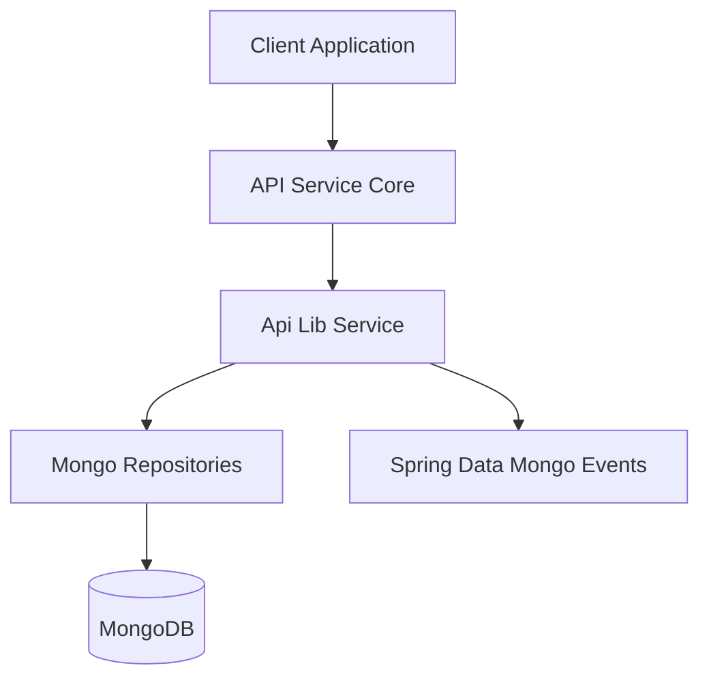
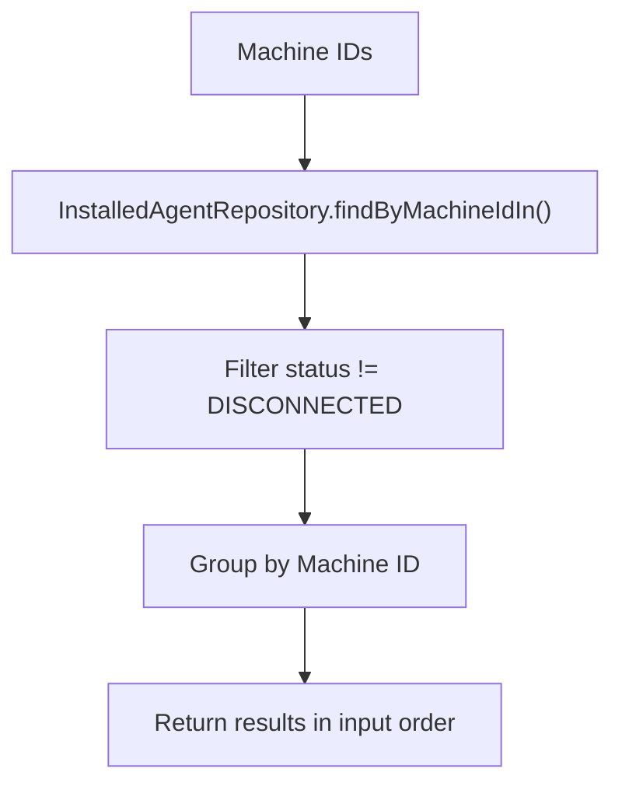
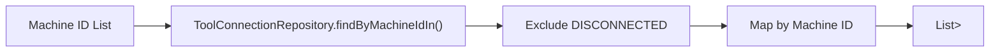
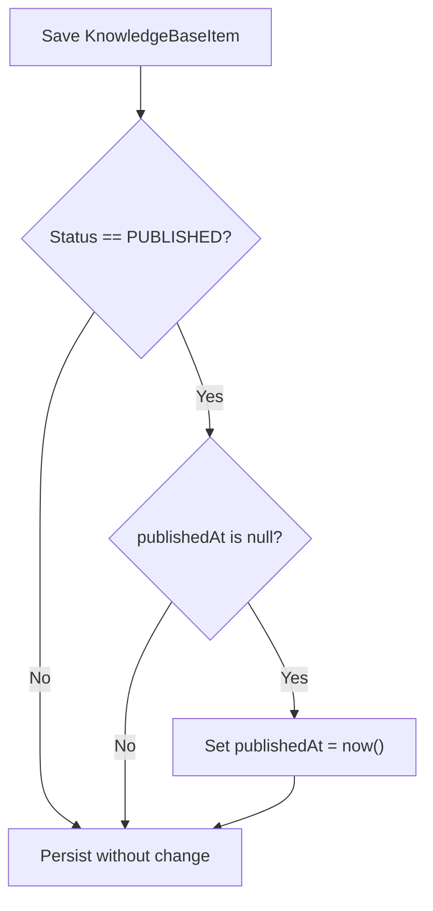
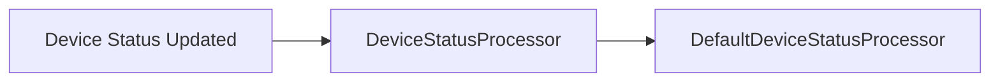
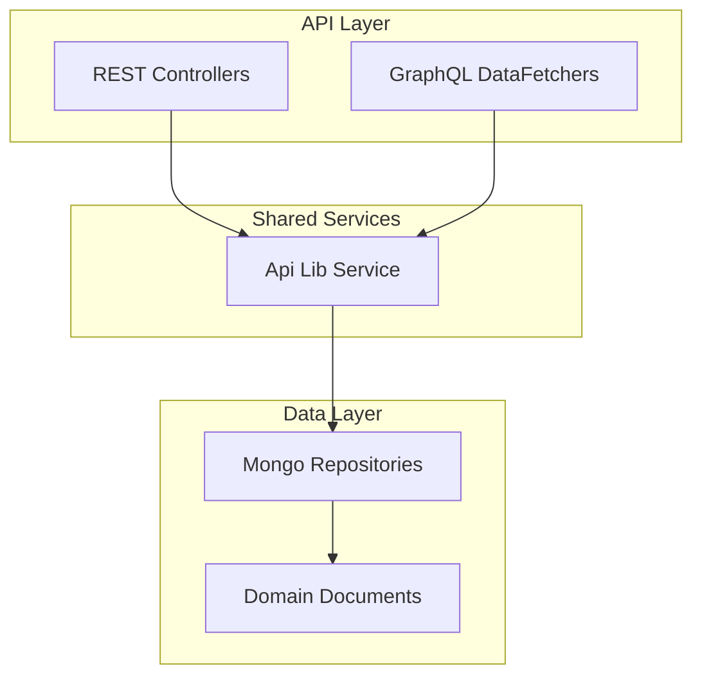

# Api Lib Service

## Overview

The **Api Lib Service** module provides core domain services and lifecycle hooks that are shared across API-facing components of the OpenFrame platform. It encapsulates reusable business logic around:

- Installed agents per device
- Tool connections per machine
- Knowledge base publication lifecycle
- Device status post-processing

This module sits between the API layer (for example, controllers and GraphQL data fetchers in the API Service Core module) and the data layer (Mongo repositories and domain documents). It ensures consistent filtering, lifecycle handling, and extension points across the system.

---

## Architectural Context

The Api Lib Service module is part of the shared API library layer and is consumed primarily by higher-level API services.

### Responsibilities in the Stack

- **API Service Core**: Exposes REST and GraphQL endpoints.
- **Api Lib Service**: Encapsulates reusable domain services and processors.
- **Data Modules**: Provide repositories and document models.

The Api Lib Service module avoids controller concerns and focuses strictly on domain-level service logic and lifecycle processing.

---

## Core Components

### 1. InstalledAgentService

**Component:**  
`deps.openframe-oss-lib.openframe-api-lib.src.main.java.com.openframe.api.service.InstalledAgentService.InstalledAgentService`

#### Purpose

Provides read operations for installed agents associated with machines, while enforcing a consistent rule: **disconnected agents are excluded from results**.

#### Key Responsibilities

- Fetch installed agents by:
  - Machine ID
  - Multiple machine IDs (batch)
  - Agent ID
  - Machine ID and agent type
- Exclude agents with status `DISCONNECTED`
- Preserve machine ID ordering in batch queries (DataLoader-friendly)

#### Internal Logic Pattern

This batching behavior is particularly important for GraphQL DataLoader usage in higher layers.

#### Design Considerations

- Centralizes connection-state filtering logic.
- Prevents duplication of `DISCONNECTED` filtering across controllers and data fetchers.
- Encourages consistent semantics for "active" installed agents.

---

### 2. ToolConnectionService

**Component:**  
`deps.openframe-oss-lib.openframe-api-lib.src.main.java.com.openframe.api.service.ToolConnectionService.ToolConnectionService`

#### Purpose

Manages read access to tool connections per machine while enforcing the same connection-status semantics used in InstalledAgentService.

#### Key Responsibilities

- Retrieve tool connections by ID
- Retrieve tool connections for:
  - A single machine
  - Multiple machines (batch)
- Exclude connections with `DISCONNECTED` status

#### Batch Loading Strategy

#### Transactional Behavior

- Annotated with `@Transactional(readOnly = true)`.
- Optimized for read-heavy usage from API and GraphQL layers.

---

### 3. KnowledgeBasePublishLifecycleListener

**Component:**  
`deps.openframe-oss-lib.openframe-api-lib.src.main.java.com.openframe.api.service.KnowledgeBasePublishLifecycleListener.KnowledgeBasePublishLifecycleListener`

#### Purpose

Automatically stamps the `publishedAt` timestamp the first time a knowledge base item transitions to the `PUBLISHED` state.

#### Lifecycle Hook

- Extends `AbstractMongoEventListener<KnowledgeBaseItem>`.
- Listens to `BeforeConvertEvent`.

#### Semantic Guarantee

- If status is `PUBLISHED` and `publishedAt` is `null`, set it to `Instant.now()`.
- Once set, `publishedAt` is **never overwritten**, even if the item is unpublished and republished.

#### Standards Alignment

The behavior aligns with:

- Schema.org `datePublished`
- Atom RFC 4287 `atom:published`

This ensures canonical "first publication" semantics.

---

### 4. DefaultDeviceStatusProcessor

**Component:**  
`deps.openframe-oss-lib.openframe-api-lib.src.main.java.com.openframe.api.service.processor.DefaultDeviceStatusProcessor.DefaultDeviceStatusProcessor`

#### Purpose

Provides a default no-op implementation of the `DeviceStatusProcessor` extension point.

#### Characteristics

- Annotated with `@ConditionalOnMissingBean`.
- Used only when no custom `DeviceStatusProcessor` is defined.
- Logs device status updates at debug level.

#### Extension Model

- Applications can define their own `DeviceStatusProcessor` bean.
- The default implementation is automatically replaced.
- Encourages pluggable behavior without modifying core API logic.

---

## Cross-Cutting Patterns

### 1. Disconnected State Filtering

Both InstalledAgentService and ToolConnectionService enforce:

- `status != DISCONNECTED`

This ensures:

- API responses reflect only active or relevant connections.
- Business rules are centralized.
- Data fetchers and controllers remain simple.

### 2. Batch-Oriented Service Design

Several methods return:

- `List<List<Entity>>`

This pattern supports:

- GraphQL DataLoader integration.
- Order-preserving results.
- Efficient multi-entity resolution.

### 3. Lifecycle-Driven Consistency

KnowledgeBasePublishLifecycleListener demonstrates a broader pattern:

- Domain invariants are enforced at persistence lifecycle boundaries.
- Business timestamps are automatically managed.
- Controllers remain unaware of stamping logic.

---

## How Api Lib Service Fits into the System

### Summary

The Api Lib Service module:

- Encapsulates reusable API-domain services.
- Enforces consistent filtering and lifecycle rules.
- Provides extension points for customization.
- Keeps controllers and data fetchers focused on transport logic.

It acts as a stable, reusable foundation for API-facing functionality across the OpenFrame platform.