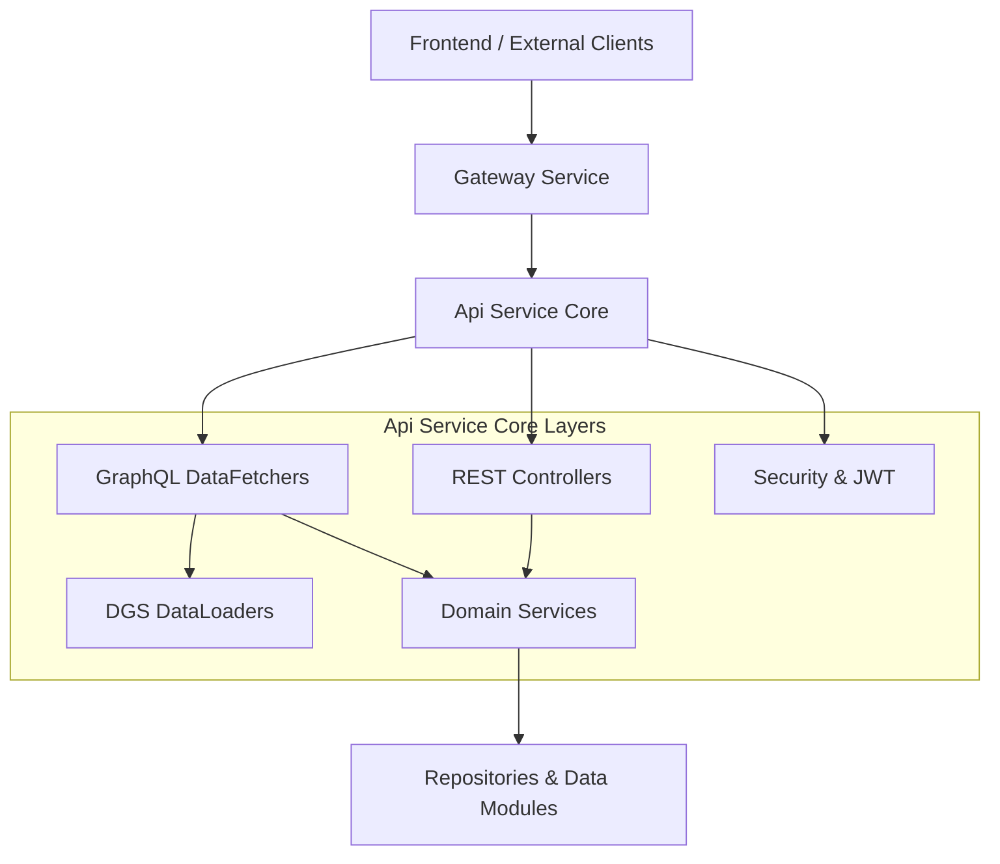
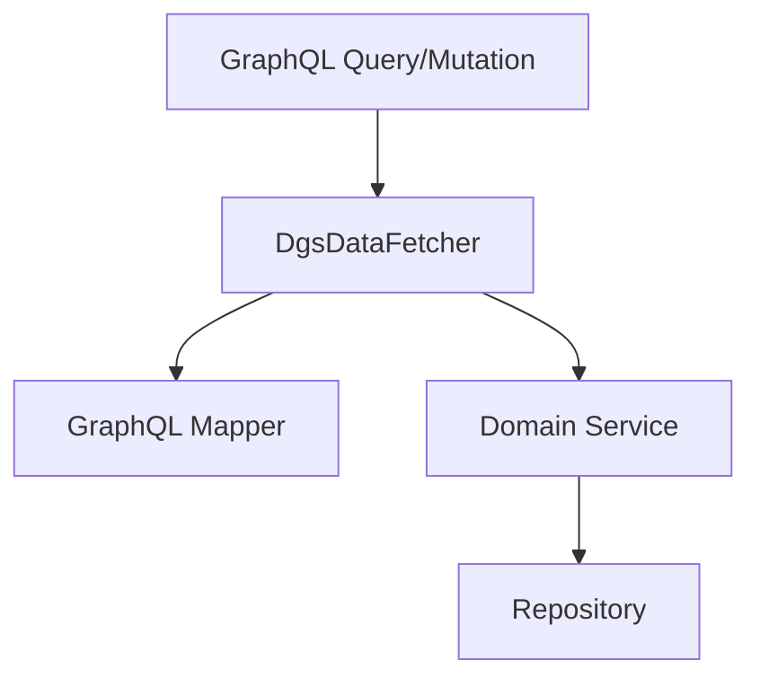
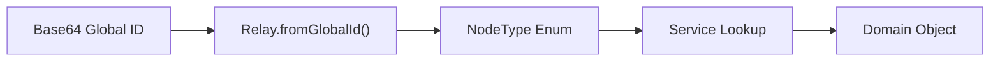
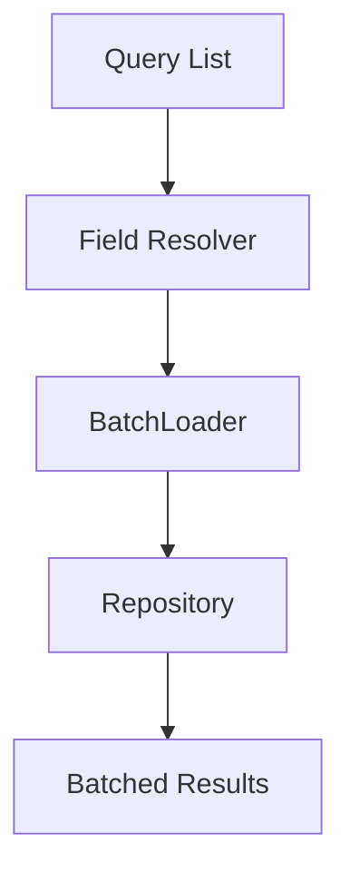
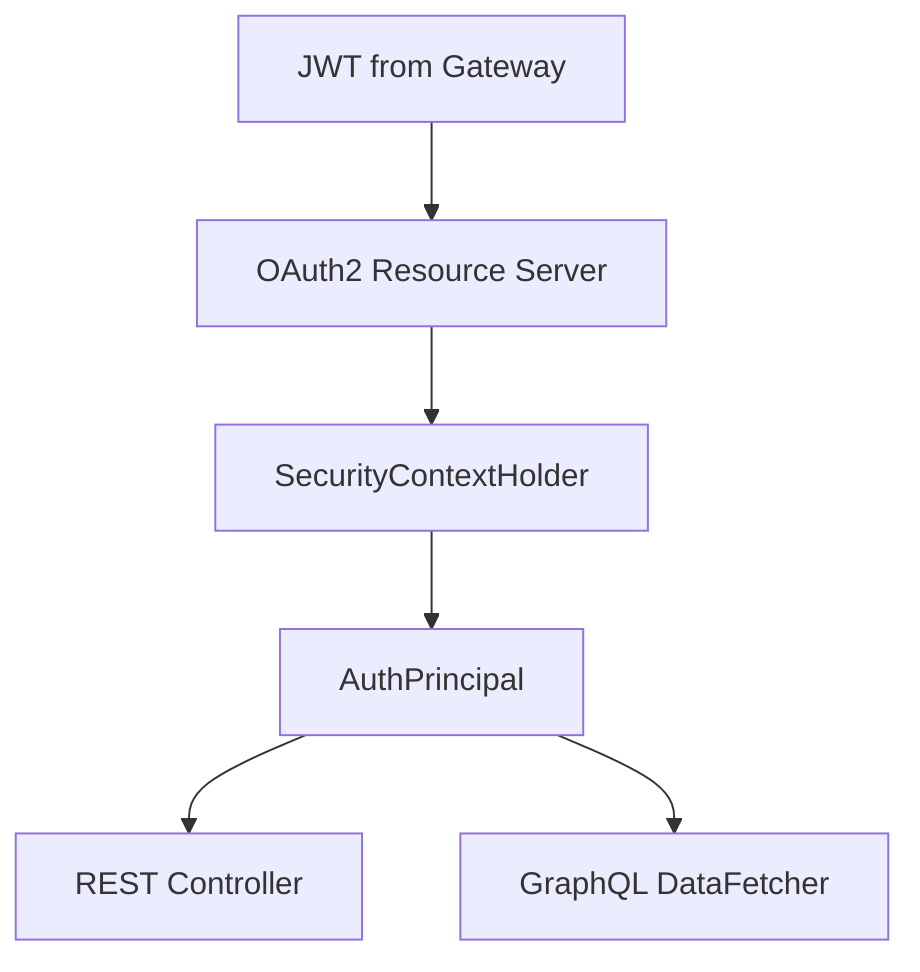

# Api Service Core

The **Api Service Core** module is the primary backend application layer for OpenFrame. It exposes:

- REST endpoints for operational and administrative actions
- A GraphQL API (via Netflix DGS) for rich, client-driven queries and mutations
- DataLoader infrastructure to prevent N+1 database queries
- Security integration as an OAuth2 Resource Server
- Cross-cutting configuration such as custom scalars, password encoding, and JWT caching

It acts as the orchestration layer between domain services (devices, organizations, scripts, knowledge base, notifications, etc.) and underlying data modules (Mongo, Cassandra, Kafka, etc.).

---

## 1. High-Level Architecture

The Api Service Core sits behind the Gateway and consumes domain services and repositories from other core modules.

### Key Responsibilities

- Expose business capabilities via REST and GraphQL
- Translate API-level DTOs to domain models
- Apply pagination, filtering, sorting, and cursor encoding
- Resolve polymorphic GraphQL types
- Enforce authentication context via JWT

---

## 2. Configuration Layer

All configuration classes live under `com.openframe.api.config`.

### 2.1 Core Application Configuration

- **ApiApplicationConfig**  
  Provides shared beans such as `PasswordEncoder` (BCrypt).

- **RestTemplateConfig**  
  Exposes a reusable `RestTemplate` bean for outbound HTTP calls.

- **DataInitializer**  
  Boot-time initializer that ensures a default OAuth client exists and updates it if configuration changes.

### 2.2 Security Configuration

Security in Api Service Core is intentionally minimal because the Gateway handles most authentication concerns.

- **SecurityConfig**
  - Enables OAuth2 Resource Server support
  - Uses `JwtIssuerAuthenticationManagerResolver`
  - Caches `JwtAuthenticationProvider` instances via Caffeine
  - Disables CSRF
  - Permits all requests (authorization is handled upstream)

- **AuthenticationConfig**
  - Registers `AuthPrincipalArgumentResolver` for REST controllers

- **DgsAuthPrincipalArgumentResolver**
  - Enables `@AuthenticationPrincipal AuthPrincipal` injection in GraphQL data fetchers

### 2.3 GraphQL Custom Scalars

The module defines custom scalars for richer schema support:

- **DateScalarConfig** → `LocalDate` (`yyyy-MM-dd`)
- **InstantScalarConfig** → `Instant` (ISO-8601)
- **LongScalarConfig** → 64-bit integers beyond GraphQL `Int`

These scalars ensure strict parsing, validation, and consistent serialization.

---

## 3. REST Layer

REST controllers are grouped under `com.openframe.api.controller`.

### 3.1 Operational Controllers

- **DeviceController** – Update device status (internal APIs)
- **ForceAgentController** – Force tool installations, updates, and client updates
- **ReleaseVersionController** – Query current release version
- **HealthController** – Health check endpoint (`/health`)

### 3.2 Identity & Access Controllers

- **ApiKeyController** – CRUD and regeneration of user API keys
- **MeController** – Returns current authenticated user context
- **InvitationController** – Manage user invitations
- **UserController** – List, update, and soft-delete users

### 3.3 Organization & Configuration Controllers

- **OrganizationController** – Create, update, archive organizations
- **OpenFrameClientConfigurationController** – Client configuration retrieval
- **SSOConfigController** – Manage SSO providers and configuration
- **AgentRegistrationSecretController** – Manage agent registration secrets

These controllers:

- Accept validated DTOs
- Use `AuthPrincipal` for contextual identity
- Delegate all business logic to services

---

## 4. GraphQL Layer (Netflix DGS)

GraphQL functionality is implemented via `@DgsComponent` data fetchers.

### 4.1 Major Data Fetchers

| Domain | DataFetcher |
|---------|------------|
| Devices | `DeviceDataFetcher` |
| Organizations | `OrganizationDataFetcher` |
| Events | `EventDataFetcher` |
| Logs | `LogDataFetcher` |
| Scripts | `ScriptDataFetcher` |
| Script Executions | `ScriptExecutionDataFetcher` |
| Script Schedules | `ScriptScheduleDataFetcher` |
| Knowledge Base | `KnowledgeBaseDataFetcher` |
| Tags | `TagDataFetcher` |
| Assignments | `AssignmentDataFetcher` |
| Notifications | `NotificationDataFetcher` |
| Time Tracking | `TimeEntryDataFetcher` |
| Tools | `ToolsDataFetcher` |
| Relay Node | `NodeDataFetcher` |

Each data fetcher:

- Accepts strongly typed `InputArgument` DTOs
- Converts Relay global IDs to raw IDs
- Applies pagination using `ConnectionArgs` and `CursorPaginationCriteria`
- Returns Relay-compatible `Connection` and `Edge` wrappers

---

## 5. Relay & Global Node Resolution

The module implements Relay-style global IDs.

### Components

- **NodeDataFetcher** – Resolves `node(id)` and `nodes(ids)` queries
- **NodeTypeResolver** – Maps domain objects to GraphQL type names
- **AssignableTargetTypeResolver** – Polymorphic resolution for assignment targets

This enables:

- Type-safe global references
- Polymorphic GraphQL unions and interfaces
- Consistent ID handling across the API

---

## 6. DataLoader Infrastructure

To prevent N+1 database queries, the module defines multiple `@DgsDataLoader` classes.

### Examples

- `MachineDataLoader`
- `OrganizationDataLoader`
- `UserDataLoader`
- `TicketDataLoader`
- `ScriptDataLoader`
- `ScriptTagDataLoader`
- `KnowledgeBaseAttachmentDataLoader`
- `ScriptScheduleDeviceIdsDataLoader`

Each DataLoader:

- Accepts a list of IDs
- Performs a single batched repository call
- Returns results aligned to the requested key order

This ensures predictable performance under nested GraphQL queries.

---

## 7. DTO Layer

The DTO package defines:

- Input types (e.g., `CreateArticleInput`, `DeviceFilterInput`)
- Output types (e.g., `UserResponse`, `ApiKeyResponse`)
- Relay connection wrappers (`GenericEdge`, `CountedGenericConnection`)
- Filter and sort inputs
- OAuth and OIDC request/response objects

DTOs are:

- Validation-annotated (`@NotBlank`, `@Valid`, etc.)
- GraphQL-optimized for schema clarity
- Isolated from persistence models

---

## 8. Service Integration & Extension Points

Api Service Core depends on domain services (e.g., `DeviceService`, `OrganizationService`, `ScriptService`).

It also defines extension points via processors:

- `DefaultUserProcessor`
- `DefaultInvitationProcessor`
- `DefaultSSOConfigProcessor`
- `DefaultAgentRegistrationSecretProcessor`

These use `@ConditionalOnMissingBean`, allowing SaaS or enterprise deployments to override behavior without modifying the core module.

---

## 9. Authentication Context Flow

The same `AuthPrincipal` abstraction is used consistently across REST and GraphQL.

---

## 10. Summary

The **Api Service Core** module:

- Centralizes REST and GraphQL APIs
- Implements Relay-compliant GraphQL patterns
- Uses DataLoaders for scalable performance
- Integrates with JWT-based security
- Delegates business logic to domain services
- Provides extensibility through processor hooks

It is the main backend boundary between clients (web UI, integrations) and the OpenFrame domain layer, ensuring consistency, performance, and modular extensibility.