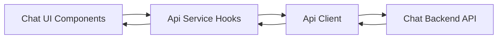
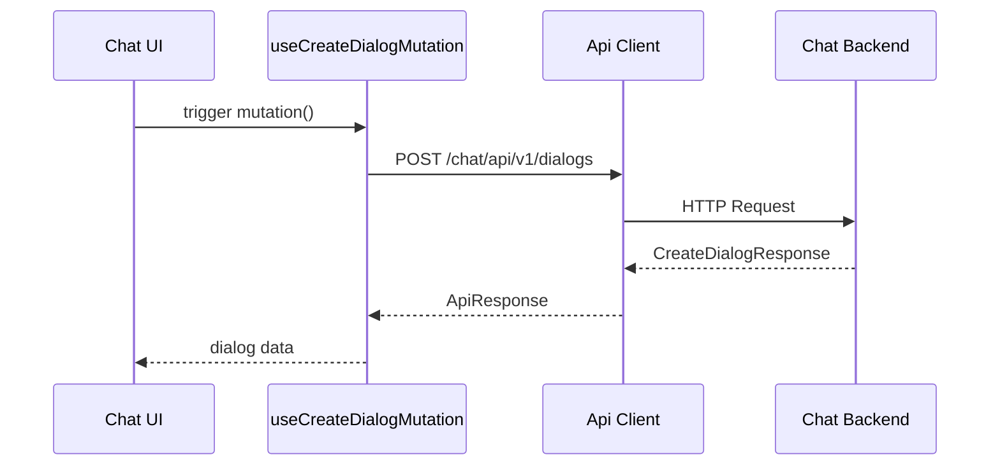
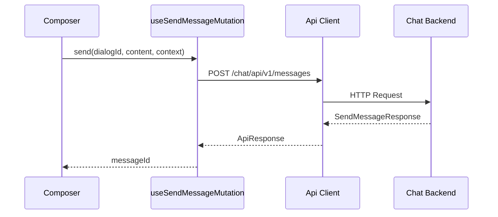
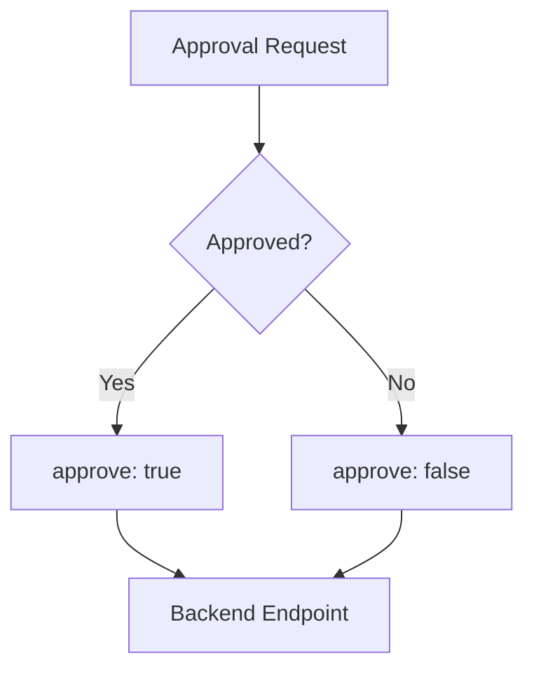
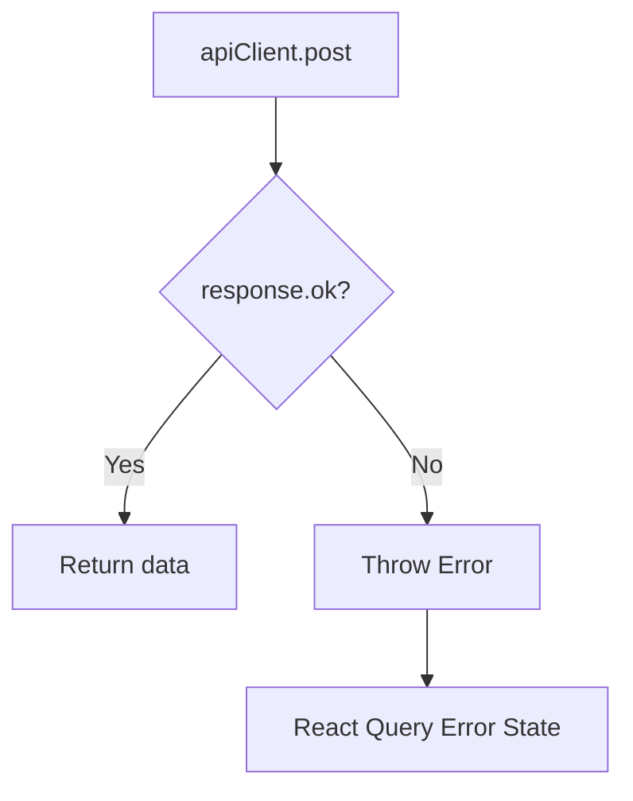
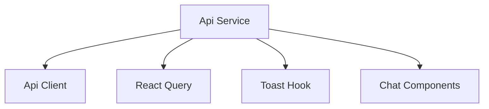

# Api Service

The **Api Service** module provides a thin, typed client layer for interacting with the backend Chat (Mingo AI) APIs from the OpenFrame frontend. It encapsulates dialog lifecycle operations, message sending, approval workflows, and AI generation control using React Query and a centralized API client.

This module acts as the boundary between UI components (chat views, context panels, approval prompts) and backend REST endpoints under `/chat/api/v1/*`.

---

## Responsibilities

The Api Service module is responsible for:

- Creating new AI dialogs
- Sending chat messages with contextual metadata
- Approving or rejecting AI-triggered actions
- Stopping in-progress AI response generation
- Providing strongly-typed request and response contracts
- Integrating with React Query for mutation state management
- Delegating HTTP concerns to the shared Api Client

It does **not**:

- Manage global auth state (handled by Api Client)
- Render UI components (handled by chat and page modules)
- Implement business logic for AI orchestration (handled server-side)

---

## High-Level Architecture



### Layer Breakdown

| Layer | Responsibility |
|-------|----------------|
| Chat UI | Collect user input and render responses |
| Api Service | Expose typed mutations via React Query |
| Api Client | Perform HTTP requests and normalize responses |
| Chat Backend | Process AI chat, approvals, and dialog lifecycle |

The Api Service depends directly on the **Api Client** module:

- See: [Api Client](api-client.md)

---

## Core Data Contracts

### CreateDialogRequest

```typescript
export interface CreateDialogRequest {
  agentType: 'ADMIN';
}
```

Creates a new dialog session for the ADMIN AI agent.

### SendMessageRequest

```typescript
export interface SendMessageRequest {
  dialogId: string;
  content: string;
  chatType: 'ADMIN_AI_CHAT';
  contextItems?: MessageContextRef[];
  currentView?: MessageContextRef;
  recentViews?: MessageContextRef[];
}
```

This payload mirrors the backend OpenAPI schema.

Key design decisions:

- `contextItems` (max 10) represent explicitly attached entities
- `currentView` represents the active page context
- `recentViews` (max 5) provide conversational memory
- Empty context fields are omitted to preserve backward compatibility

### SendMessageResponse

```typescript
export interface SendMessageResponse {
  messageId: string;
}
```

Minimal response confirming message creation.

---

## Mutation Hooks

All operations are implemented as React Query mutations.

### 1. Create Dialog



**Endpoint:**

```text
POST /chat/api/v1/dialogs
```

Validates:
- `response.ok`
- Presence of `response.data.id`

---

### 2. Send Message



**Endpoint:**

```text
POST /chat/api/v1/messages
```

Conditional payload spreading ensures:

- No empty `contextItems`
- No undefined `currentView`
- No empty `recentViews`

This prevents schema regressions in legacy flows.

---

### 3. Approval Workflow

Both approve and reject share the same endpoint:

```text
POST /chat/api/v1/approval-requests/{requestId}/approve
```

Payload:

```json
{ "approve": true | false }
```

Error handling includes:

- Toast notifications
- Standardized error extraction
- Defensive fallback messages



---

### 4. Stop Generation

```text
POST /chat/api/v1/dialogs/{dialogId}/stop
```

Stops streaming or in-progress AI output generation.

Used when:

- User cancels a long response
- System detects invalid context
- UI triggers abort action

---

## Error Handling Strategy

All mutations follow a consistent pattern:

1. Await `apiClient.post`
2. Check `response.ok`
3. Throw `Error` if false
4. Let React Query manage error state
5. Display toast (for approval/rejection flows)



This keeps UI components clean and declarative.

---

## Dependency Relationships



### External Dependencies

- `@tanstack/react-query` — mutation lifecycle
- `@flamingo-stack/openframe-frontend-core/hooks` — toast notifications
- Central `apiClient` — HTTP abstraction

---

## Design Principles

### 1. Thin Transport Layer

The Api Service does not:

- Transform domain models
- Cache business entities manually
- Maintain global state

It strictly forwards typed requests and validates responses.

### 2. Explicit Context Passing

AI message context is intentionally explicit:

- No implicit global state
- No hidden entity resolution
- Clear max limits for attachments

This prevents:

- Oversized payloads
- Non-deterministic AI behavior
- Context leakage

### 3. Backward Compatibility

Empty fields are omitted entirely to preserve legacy API compatibility.

---

## Integration Points

The Api Service integrates primarily with:

- Chat state stores and dialog hooks
- UI composer components
- Approval message components

Related modules:

- [Api Client](api-client.md)
- [Ticket Service](ticket-service.md)

---

## Summary

The **Api Service** module is a focused, strongly-typed communication layer between the frontend Chat UI and the backend Chat API.

It provides:

- Dialog lifecycle management
- Message sending with contextual metadata
- Approval workflow execution
- AI generation cancellation
- Standardized error propagation

By centralizing these mutations, the module ensures:

- Consistent API interaction
- Predictable error handling
- Clean separation of UI and transport logic
- Scalable extension for future chat capabilities

The module is intentionally small but critical to maintaining a robust AI-driven chat experience in OpenFrame.