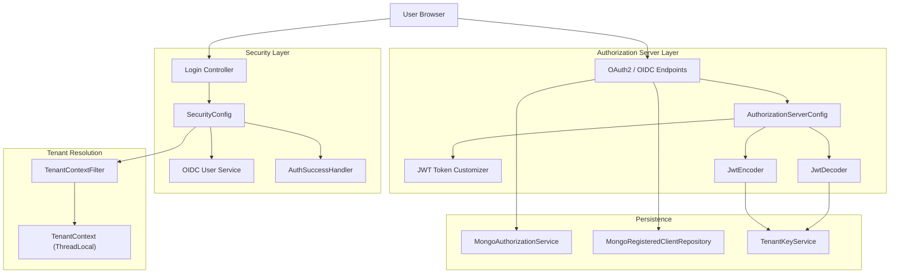
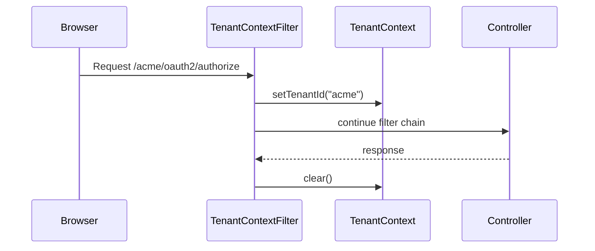
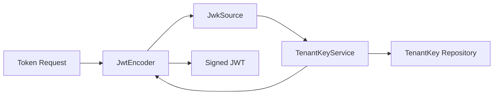
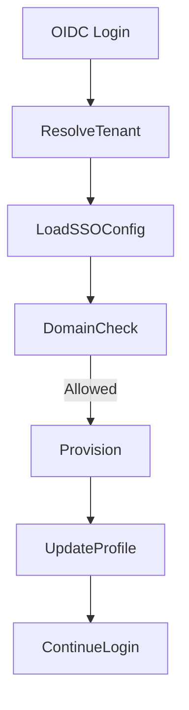
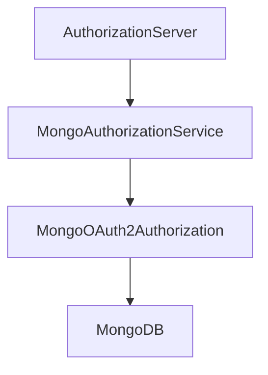

# Authorization Service Core

The **Authorization Service Core** module is the central identity and OAuth2/OIDC authorization server for OpenFrame. It provides:

- Multi-tenant OAuth2 Authorization Server (Spring Authorization Server)
- OpenID Connect (OIDC) login with Google and Microsoft
- Tenant-aware JWT issuance and validation
- Dynamic SSO client registration per tenant
- Invitation-based onboarding and SSO flows
- Password reset and email availability checks
- Per-tenant RSA key management for token signing

This module is the trust anchor of the platform. All downstream services (API Service Core, Gateway Service Core, Frontend) rely on tokens issued here.

---

## 1. Architectural Overview

The Authorization Service Core is built on top of:

- Spring Security
- Spring Authorization Server
- OAuth2 / OIDC
- MongoDB (authorization + client persistence)
- Per-tenant cryptographic signing keys

### High-Level Architecture

---

## 2. Multi-Tenancy Model

Multi-tenancy is enforced at the authorization layer.

### Tenant Resolution

`TenantContextFilter`:

- Extracts tenant ID from:
  - URL path (`/{tenant}/oauth2/...`)
  - Query parameter (`tenant=`)
  - Existing HTTP session
- Stores it in `TenantContext` (ThreadLocal)
- Ensures isolation per request

All downstream components (JWT signing, user lookup, client registration) depend on `TenantContext.getTenantId()`.

---

## 3. OAuth2 Authorization Server Configuration

### AuthorizationServerConfig

This class configures:

- OAuth2 endpoints
- OIDC support
- JWT encoder/decoder
- Token customization
- Password authentication

### Multiple Issuers

`AuthorizationServerSettings.builder().multipleIssuersAllowed(true)` enables:

- Per-tenant issuer URLs
- Tenant-scoped `.well-known` discovery endpoints

---

## 4. Per-Tenant JWT Signing

Each tenant has its own RSA key pair.

### TenantKeyService

Responsibilities:

- Generates RSA key pair if none exists
- Encrypts and stores private key
- Retrieves active signing key
- Builds `RSAKey` for Nimbus

### Token Flow

If no active key exists for a tenant, a new key pair is generated automatically.

---

## 5. JWT Custom Claims

The `OAuth2TokenCustomizer` enriches access tokens with:

- `tenant_id`
- `userId`
- `roles`

It also:

- Updates `lastLogin` on refresh flows
- Resolves effective roles

This ensures downstream services can:

- Authorize based on roles
- Enforce tenant isolation
- Identify the authenticated user without additional DB calls

---

## 6. Dynamic Client Registration (SSO)

### DynamicClientRegistrationRepository

Instead of static client registrations:

- Clients are resolved per tenant
- Uses `DynamicClientRegistrationService`
- Falls back to session-based tenant resolution

This enables:

- Google per-tenant credentials
- Microsoft per-tenant credentials
- Dynamic enable/disable of providers

---

## 7. OIDC Login and Auto-Provisioning

Configured in `SecurityConfig`.

### OAuth2 Login Flow

- Custom authorization request resolver
- Custom failure handler
- Microsoft-aware JWT validation
- Auto-provisioning logic

### Auto-Provisioning Logic

When a user logs in via SSO:

1. Resolve tenant
2. Check SSO configuration
3. Validate allowed domains
4. Create or reactivate user
5. Assign default roles (ADMIN on registration)
6. Optionally mark email verified

Provisioning is extensible via `RegistrationProcessor`.

---

## 8. Invitation and SSO Flows

### InvitationRegistrationController

Supports:

- Standard invitation acceptance
- SSO-based invitation acceptance

SSO invitation flow:

1. Validate invitation
2. Store temporary SSO cookie
3. Redirect to provider
4. Handle callback
5. Complete registration
6. Redirect to target tenant

Flow handlers:

- `InviteSsoHandler`
- `TenantRegSsoHandler`

These finalize onboarding after successful OIDC authentication.

---

## 9. Tenant Registration

### TenantRegistrationController

Supports:

- Standard tenant registration
- SSO-based tenant registration

Registration features:

- Domain validation
- Access code validation
- Optional preview environment binding (`prNumber`)
- Post-processing hooks

Response includes newly created tenant entity.

---

## 10. Password Reset

### PasswordResetController

Endpoints:

- `POST /password-reset/request`
- `POST /password-reset/confirm`

Security:

- Secure random reset tokens (`ResetTokenUtil`)
- Strong password validation rules
- Lowercased email normalization

---

## 11. Mongo Authorization Persistence

### MongoAuthorizationService

Implements `OAuth2AuthorizationService`:

- Persists authorization codes
- Persists access tokens
- Persists refresh tokens
- Rehydrates PKCE metadata

Special handling ensures PKCE parameters are preserved correctly.

---

## 12. Client Persistence

### MongoRegisteredClientRepository

Stores OAuth2 clients in Mongo:

- Client ID / secret
- Authentication methods
- Grant types
- Redirect URIs
- Scopes
- Token TTL settings
- PKCE requirements

Mapped bidirectionally between Spring `RegisteredClient` and Mongo documents.

---

## 13. Extensibility Points

The module is intentionally extensible via conditional beans:

- `RegistrationProcessor`
- `UserDeactivationProcessor`
- `UserEmailVerifiedProcessor`
- `GlobalDomainPolicyLookup`

Default implementations are no-ops and can be overridden.

---

## 14. Security Considerations

- BCrypt password hashing
- Per-tenant signing keys
- Encrypted private keys
- Secure + HttpOnly cookies for SSO flows
- Microsoft issuer validation pattern enforcement
- Session invalidation on tenant switch (except onboarding case)
- ThreadLocal tenant isolation

---

## 15. How It Fits Into the System

The Authorization Service Core acts as:

- Identity Provider (IdP)
- OAuth2 Authorization Server
- OIDC Provider
- Tenant-aware security boundary

Other modules rely on it for:

- JWT validation (API Service Core)
- Gateway authentication enforcement
- Frontend login and onboarding
- SSO integrations

It is the foundational trust and identity component of the OpenFrame multi-tenant platform.
