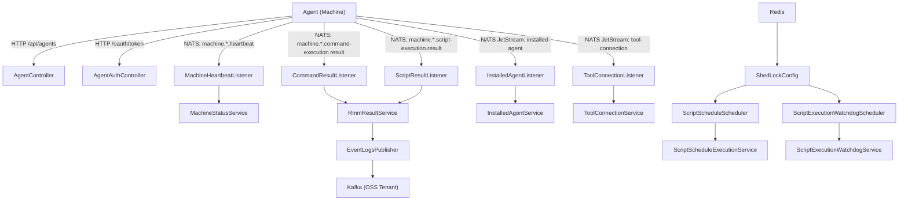
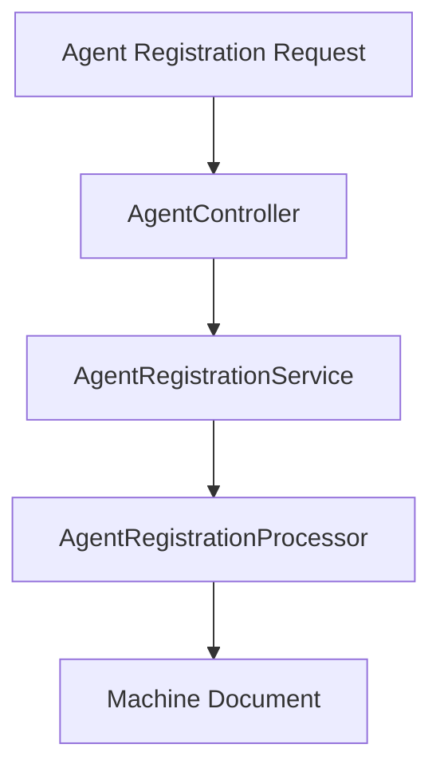
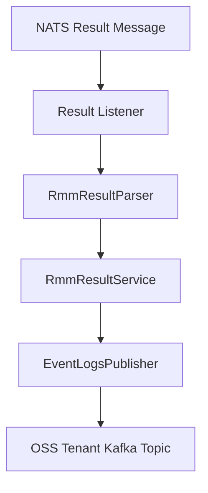
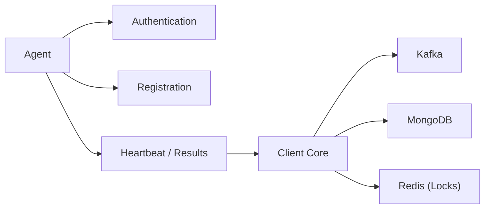

# Client Core

The **Client Core** module is the runtime backbone of the OpenFrame client-side service. It is responsible for:

- Agent authentication and registration
- Machine lifecycle tracking (online/offline/heartbeat)
- Tool connection and installed-agent ingestion
- RMM command and script result processing
- Schedule execution and watchdog supervision
- Publishing execution logs to Kafka
- Integrating with external tools such as Fleet MDM and MeshCentral

This module operates at the boundary between edge agents (machines), messaging infrastructure (NATS), and the broader OpenFrame backend ecosystem (Kafka, Redis, Mongo, and tool integrations).

---

## Architectural Overview

Client Core sits between field agents and the rest of the OpenFrame platform. Agents communicate over HTTP and NATS. Client Core validates, transforms, enriches, and relays data to downstream systems.

---

## Core Responsibilities

### 1. Agent Authentication

**Primary component:** `AgentAuthController`

- Exposes `POST /oauth/token`
- Delegates to `AgentAuthService`
- Issues access tokens for agents using grant types such as client credentials and refresh tokens
- Returns structured `AgentTokenResponse`

Security-related infrastructure:

- `PasswordEncoderConfig` – provides `BCryptPasswordEncoder`
- OAuth-compatible token flow for agent access

This enables secure, credential-based communication between deployed agents and the platform.

---

### 2. Agent Registration Lifecycle

**Primary components:**
- `AgentController`
- `AgentRegistrationRequest`
- `DefaultAgentRegistrationProcessor`

Endpoints:

- `POST /api/agents/register`
- `POST /api/agents/reinstall`

Registration includes:

- Host identity (hostname, OS UUID, MAC, IP)
- OS and hardware metadata
- Agent version and status
- Dynamic tag creation via `AgentRegistrationTagInput`

Registration flow:

The default processor is a no-op extension point. Custom implementations can:

- Enrich metadata
- Trigger onboarding workflows
- Integrate with external systems

---

### 3. Machine Presence & Status Tracking

**Primary components:**
- `MachineHeartbeatListener`
- `ClientConnectionListener`
- `MachineStatusService`

Handled subjects:

- `machine.*.heartbeat`
- `machine.*.connected`
- `machine.*.disconnected`

Behavior:

- Heartbeats update last-seen timestamps
- Connection/disconnection events mark machine ONLINE/OFFLINE
- `DeviceOnlineScheduleTriggerListener` bridges ONLINE events to schedule triggers

This ensures accurate real-time device availability tracking.

---

### 4. RMM Command & Script Result Processing

**Primary components:**
- `CommandResultListener`
- `ScriptResultListener`
- `RmmResultService`
- `DefaultEventLogsPublisher`

Subjects:

- `machine.*.command-execution.result`
- `machine.*.script-execution.result`

Processing steps:

Key characteristics:

- Fire-and-forget for results (core NATS)
- Metadata-only logging to avoid leaking sensitive output
- Kafka publication via `OssTenantRetryingKafkaProducer`

This creates a reliable bridge from edge execution to centralized analytics and auditing.

---

### 5. Installed Agent & Tool Connection Ingestion

**Primary components:**
- `InstalledAgentListener`
- `ToolConnectionListener`

These use **NATS JetStream** with:

- Durable consumers
- Explicit acknowledgments
- Redelivery with max attempts
- Delivery groups for horizontal scaling

Responsibilities:

- Persist installed tool agents
- Associate tools with machines
- Transform tool-specific identifiers

Both listeners:

- Extract `machineId` from subject
- Parse JSON payloads
- Delegate to domain services
- Acknowledge on success

---

### 6. Tool Agent ID Transformation

**Primary components:**
- `FleetMdmAgentIdTransformer`
- `MeshCentralAgentIdTransformer`

These map external tool identifiers into canonical internal forms.

#### Fleet MDM

- Queries Fleet API using `FleetMdmClient`
- Searches by UUID
- Selects latest enrolled host with valid osquery version
- Returns numeric Fleet host ID
- Handles multi-tenancy via `FleetTenantHeader`

#### MeshCentral

- Builds transformed node ID
- Supports legacy and tenant-scoped formats

This abstraction allows Client Core to normalize tool identities across heterogeneous ecosystems.

---

### 7. Scheduling & Watchdog

**Primary components:**
- `ScriptScheduleScheduler`
- `ScriptExecutionWatchdogScheduler`
- `ShedLockConfig`

Scheduling features:

- Cron-based execution on 30-minute grid (UTC)
- Distributed lock via Redis (ShedLock)
- Single-run guarantee across replicas

Watchdog features:

- Periodic scan for stuck script executions
- Marks long-running executions as failing
- Configurable thresholds and grace periods

Lock structure:

- Redis-backed
- Tenant-aware key prefix
- Environment-scoped lock names

This ensures deterministic execution timing and safe horizontal scaling.

---

### 8. Async Execution Model

**Component:** `AsyncConfig`

- Defines `toolInstallExecutor`
- Uses Java virtual threads (`newVirtualThreadPerTaskExecutor()`)

Benefits:

- Lightweight concurrency
- High scalability for I/O-bound tasks
- Clean separation of installation workflows

---

### 9. Event Publishing to Kafka

**Component:** `DefaultEventLogsPublisher`

- Publishes outbound execution events
- Uses OSS-tenant Kafka producer
- Automatically activated if no alternative publisher exists

This enables deployment flexibility between OSS and SaaS environments.

---

## Integration Points

Client Core integrates with:

- **NATS / JetStream** – real-time agent communication
- **Kafka** – durable event streaming
- **Redis** – distributed locking
- **MongoDB** – machine and execution persistence
- **Fleet MDM SDK** – host resolution
- **MeshCentral** – remote management ID mapping

---

## High-Level Runtime Flow

---

## Design Principles

- **Event-driven** – NATS-based ingestion for real-time responsiveness
- **Idempotent & durable** – JetStream with explicit acknowledgment
- **Pluggable** – Conditional beans and processor extension points
- **Tenant-aware** – Multi-tenant safe transformations and key scoping
- **Horizontally scalable** – ShedLock + delivery groups

---

## Summary

The **Client Core** module is the operational engine of OpenFrame’s client-side service. It:

- Authenticates and registers machines
- Tracks device presence in real time
- Processes RMM execution results
- Normalizes external tool identities
- Executes time-based schedules safely across replicas
- Bridges edge events into Kafka-based platform pipelines

It forms the critical junction between distributed edge agents and the centralized OpenFrame ecosystem.