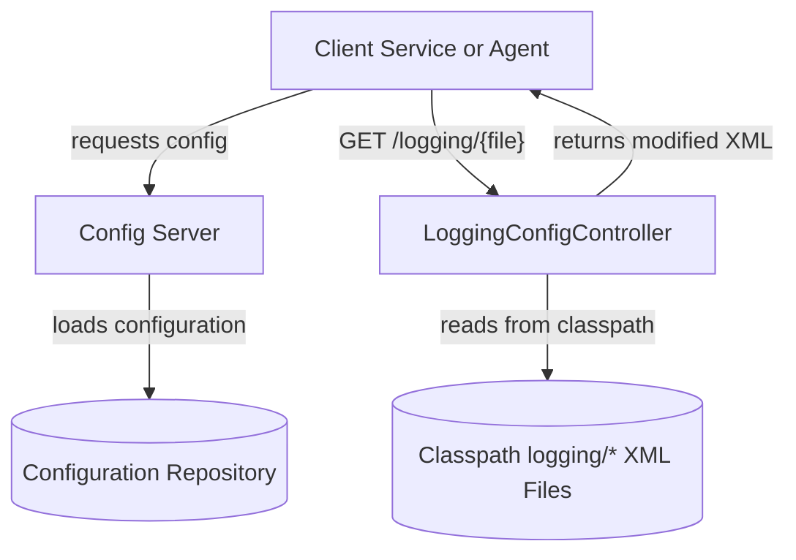
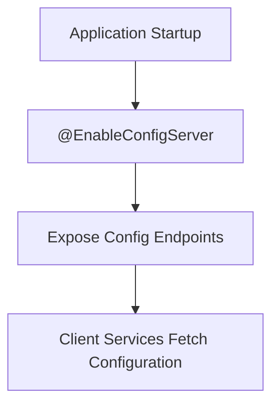
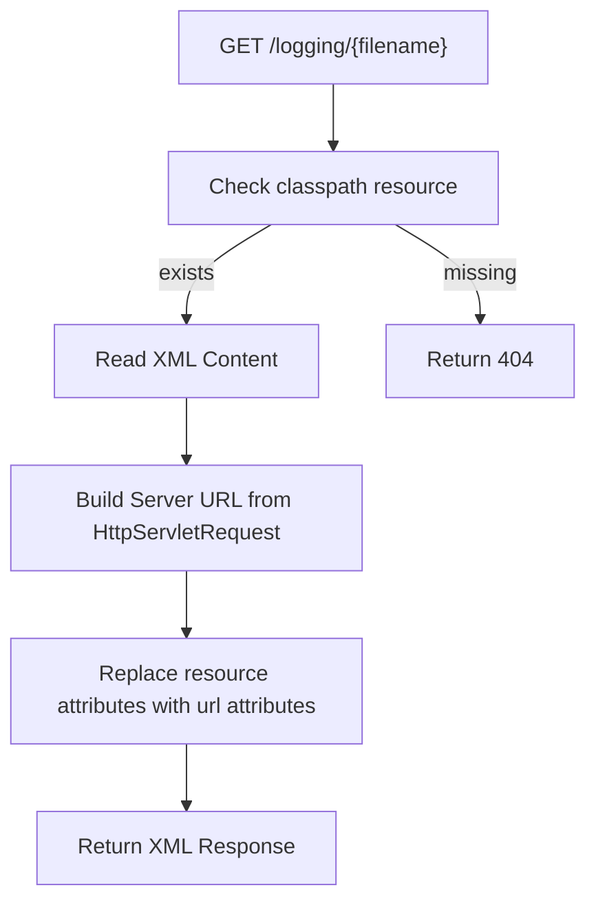

# Config Core

## Overview

The **Config Core** module provides centralized configuration capabilities for the OpenFrame platform. It combines two primary responsibilities:

1. Acting as a **Spring Cloud Config Server** for distributed configuration management.
2. Serving dynamic **logging configuration files** to clients and services at runtime.

This module enables consistent configuration across microservices and supports dynamic log configuration retrieval, which is especially important in distributed, multi-environment deployments.

---

## Core Responsibilities

The Config Core module includes the following main components:

- `ConfigServerConfiguration` – Bootstraps the Spring Cloud Config Server.
- `LoggingConfigController` – Exposes logging configuration files via HTTP and dynamically rewrites resource URLs.

Together, these components ensure that both application configuration and logging configuration can be centrally managed and distributed.

---

## Architecture Overview



### Description

- The **Config Server** retrieves configuration from an external configuration repository (e.g., Git, filesystem, or other supported backends).
- The **LoggingConfigController** serves logging configuration files stored under the `logging/` classpath directory.
- Logging configuration XML files are dynamically modified to include fully qualified URLs pointing back to the Config Core service.

---

## Component Details

### 1. ConfigServerConfiguration

**Class:**  
`com.openframe.config.core.ConfigServerConfiguration`

This class enables the Spring Cloud Config Server using the `@EnableConfigServer` annotation.

### Responsibilities

- Activates Config Server auto-configuration.
- Exposes endpoints used by other services to fetch environment-specific configuration.
- Integrates with Spring Cloud Config infrastructure.

### Runtime Behavior

When the application starts:

1. Spring Boot initializes the application context.
2. The `@EnableConfigServer` annotation activates the Config Server.
3. Config endpoints become available to client services.



---

### 2. LoggingConfigController

**Class:**  
`com.openframe.config.controller.LoggingConfigController`

This REST controller dynamically serves logging configuration XML files.

#### Endpoint

```text
GET /logging/{filename}
Content-Type: application/xml
```

#### Responsibilities

- Locates logging XML files under `classpath:logging/`.
- Returns `404 Not Found` if the file does not exist.
- Dynamically rewrites resource references in the XML.
- Generates fully qualified URLs using request metadata.

#### Dynamic URL Rewriting

The controller replaces occurrences of:

```text
resource="logging/
```

with:

```text
url="http(s)://{host}:{port}/logging/
```

This ensures that logging configuration files referencing other logging resources use fully qualified URLs rather than relative classpath references.

#### Request Handling Flow



#### Key Implementation Points

- Uses `ClassPathResource` to resolve files from the `logging/` directory.
- Builds the server base URL from:
  - Request scheme (HTTP/HTTPS)
  - Server name
  - Server port (if not default 80/443)
- Uses string replacement to rewrite resource references.
- Returns the modified XML with `application/xml` media type.

---

## Interaction with Other Modules

The Config Core module plays a foundational role in the platform architecture:

- All backend services can consume centralized configuration from the Config Server.
- Logging configurations distributed by this module may be used by:
  - API services
  - Gateway services
  - Management services
  - Stream services

Because it is infrastructure-level, this module typically runs early in the deployment topology and is treated as a platform service.

---

## Deployment Considerations

### Config Server

- Requires proper configuration of the backing configuration repository.
- Must be reachable by internal services.
- Should be secured in production environments (e.g., via authentication, network restrictions).

### Logging Configuration

- Logging XML files must be placed under `src/main/resources/logging/`.
- Filenames are accessed directly via path variable.
- Care should be taken to ensure only intended files are included in the classpath.

---

## Security Considerations

- The logging endpoint exposes XML configuration files. Ensure:
  - No sensitive credentials are embedded in logging XML files.
  - Proper network-level access control is applied.
- If deployed publicly, protect the Config Server endpoints using appropriate authentication mechanisms.

---

## Summary

The **Config Core** module provides:

- Centralized configuration management via Spring Cloud Config Server.
- Dynamic logging configuration distribution with URL rewriting.

It serves as an infrastructure building block for the OpenFrame platform, ensuring consistency, flexibility, and centralized control over service configuration and logging behavior.
