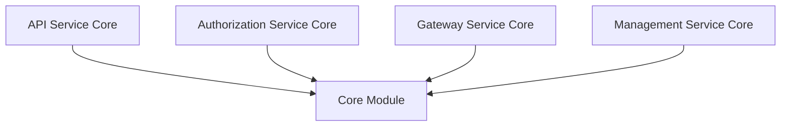
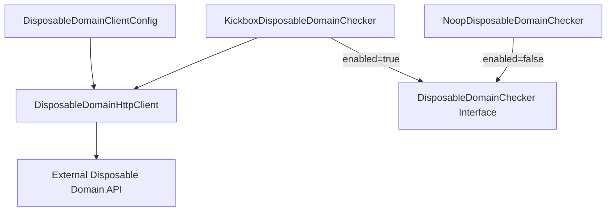
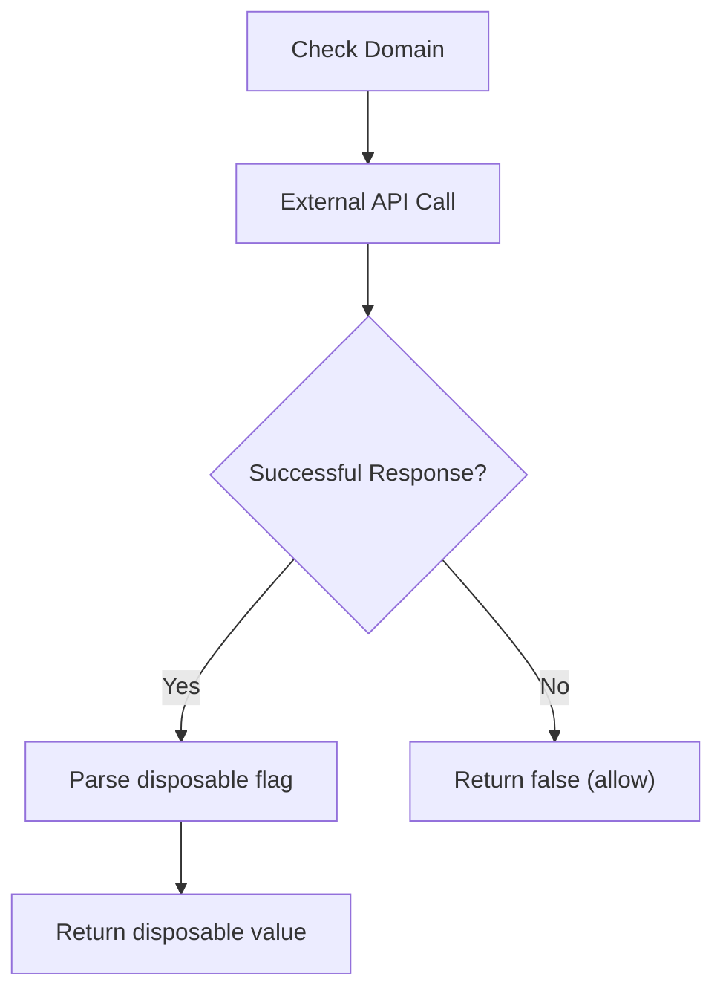
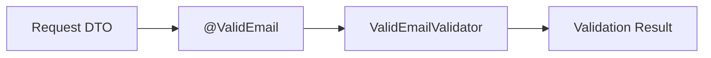
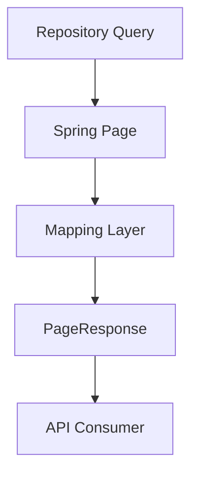

# Core

The **Core** module provides foundational building blocks shared across the OpenFrame backend ecosystem. It contains lightweight, reusable utilities and infrastructure components that support:

- Email validation and disposable domain enforcement  
- Generic pagination responses  
- Slug generation utilities  
- Cross-cutting validation helpers  

Unlike higher-level service modules (such as API, Gateway, or Authorization), the Core module is intentionally dependency-light and framework-aligned. It focuses on reusable primitives that can be safely imported across services without creating circular or heavy dependencies.

---

## Architectural Role

The Core module sits at the bottom of the service dependency hierarchy. Other backend services depend on it, but it does not depend on business-domain modules.



### Design Principles

1. **Fail-safe defaults** – external dependencies must not block critical flows.  
2. **Configuration-driven behavior** – feature toggles via Spring properties.  
3. **Framework-native integration** – leverages Spring Boot, Jakarta Validation, and standard HTTP clients.  
4. **Zero domain coupling** – no direct references to business entities.

---

# Email Domain Policy

The email domain validation subsystem ensures that disposable or temporary email domains can be detected and optionally blocked during:

- User registration  
- Invitation acceptance  
- Organization onboarding

It is designed to be **fail-open**, meaning external validation failures never prevent user registration.

## Component Overview



---

## DisposableDomainClientConfig

**Purpose:** Builds a declarative HTTP client for checking disposable domains.

### Responsibilities

- Configures connection and read timeouts  
- Binds base URL from configuration properties  
- Builds a Spring `RestClient`  
- Generates a typed `DisposableDomainHttpClient` via `HttpServiceProxyFactory`

### Configuration

Controlled by:

- `openframe.email-domain-policy.disposable-check.enabled`  
- `openframe.email-domain-policy.disposable-check.timeout-ms`  
- `openframe.email-domain-policy.disposable-check.url`

### Key Behavior

Both **connect timeout** and **read timeout** are capped by the same property value. Since this check runs inline during registration and invitation flows, long-running external calls are prevented from blocking user onboarding.

---

## KickboxDisposableDomainChecker

**Purpose:** Queries an external API (default: Kickbox open endpoint) to determine whether an email domain is disposable.

### Behavior

- Sends domain to external service  
- Parses JSON response `{ "disposable": true|false }`  
- Returns `true` only if response explicitly marks domain as disposable  
- On any exception (timeout, DNS, invalid body, non-2xx):
  - Logs warning  
  - Returns `false` (fail-open)

### Fail-Open Strategy



This guarantees that:

- External instability never blocks legitimate users  
- The external service only *adds* stricter filtering  
- Built-in static blocklists remain authoritative

---

## NoopDisposableDomainChecker

**Purpose:** Provides a fallback implementation when external checking is disabled.

### Characteristics

- Activated when `enabled=false`  
- Always returns `false`  
- Ensures exactly one checker bean exists  
- Avoids bean registration order ambiguity

This enables clean feature toggling between:

- External disposable detection  
- Built-in static policy only

---

# Validation Utilities

## ValidEmailValidator

**Purpose:** Custom Jakarta Validation constraint validator for email fields.

### Responsibilities

- Reads regex from `@ValidEmail` annotation  
- Compiles pattern during initialization  
- Validates input against configured regex  
- Rejects `null` values explicitly

### Integration

Used via annotation-based validation in DTOs and request objects across services.



---

# Pagination Support

## PageResponse<T>

**Purpose:** Standardized generic pagination wrapper used by REST endpoints.

### Fields

- `items` – list of results  
- `page` – current page index  
- `size` – page size  
- `totalElements` – total number of records  
- `totalPages` – total pages available  
- `hasNext` – indicates if another page exists

### Design Notes

- Generic and reusable  
- Serializable DTO  
- Lombok-powered for concise construction  
- Compatible with Spring Data pagination responses

### Typical Flow



---

# Utility Helpers

## SlugUtil

**Purpose:** Provides deterministic, URL-friendly slug generation.

### Behavior

- Uses `Slugify` library  
- Converts to lowercase  
- Uses hyphen separator  
- Falls back to `"org"` if input is `null`

### Example

| Input | Output |
|--------|---------|
| `"My Organization"` | `"my-organization"` |
| `null` | `"org"` |

### Typical Usage

- Organization identifiers  
- Human-readable URLs  
- SEO-friendly resource paths

---

# Configuration Properties Summary

```text
openframe.email-domain-policy.disposable-check.enabled=true|false
openframe.email-domain-policy.disposable-check.timeout-ms=2000
openframe.email-domain-policy.disposable-check.url=https://api.kickbox.com/v2/disposable
```

---

# Cross-Module Usage

The Core module is consumed by higher-level modules including:

- API services (validation and pagination)  
- Authorization services (email validation during registration)  
- Management services (slug generation and pagination)  

It does not contain:

- Business domain logic  
- Persistence logic  
- Messaging infrastructure  
- Security configuration

---

# Summary

The **Core** module provides foundational infrastructure primitives that enable:

- Safe, configurable email validation  
- Optional disposable domain enforcement with fail-open guarantees  
- Standardized pagination responses  
- Reusable string utilities  

By keeping this module minimal and dependency-light, the platform ensures high reusability, predictable behavior, and safe integration across all backend services.