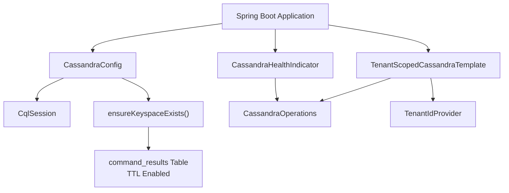
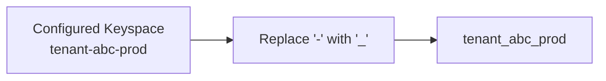
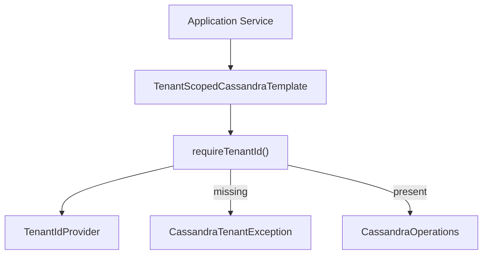
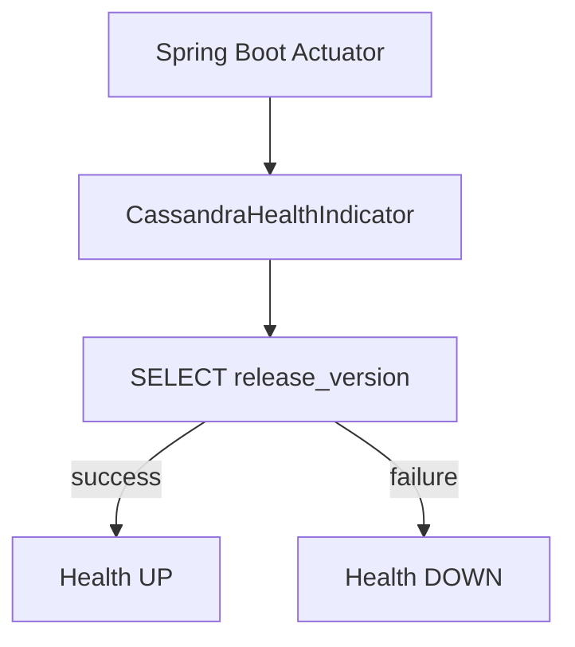
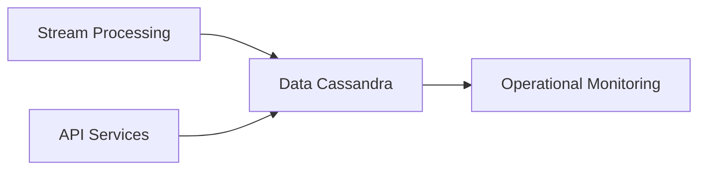

# Data Cassandra

The **Data Cassandra** module provides Cassandra-based persistence and tenant-scoped access for OpenFrame services. It encapsulates:

- Cluster and keyspace configuration
- Automatic keyspace and table initialization
- Tenant-safe data access via a guarded template
- Health monitoring integration with Spring Boot Actuator

This module is designed to operate in multi-tenant environments and integrates with the broader data and streaming ecosystem (for example, Stream Service Core and Data Mongo modules) while remaining focused on Cassandra-specific responsibilities.

---

## 1. Purpose and Responsibilities

Data Cassandra is responsible for:

1. Bootstrapping and configuring the Cassandra session.
2. Ensuring the configured keyspace and required tables exist.
3. Enforcing strict tenant scoping for all Cassandra operations.
4. Exposing a health indicator for operational monitoring.

It is conditionally enabled via the property:

```text
spring.data.cassandra.enabled=true
```

If this property is not set to `true`, the entire module remains inactive.

---

## 2. High-Level Architecture



### Core Components

- **CassandraConfig** – Configures and initializes the Cassandra session.
- **CassandraKeyspaceNormalizer** – Normalizes keyspace names for Cassandra compatibility.
- **CassandraHealthIndicator** – Exposes Cassandra availability via Actuator.
- **TenantScopedCassandraTemplate** – Enforces tenant scoping for reads and writes.

---

## 3. Configuration Layer

### 3.1 CassandraConfig

`CassandraConfig` extends `AbstractCassandraConfiguration` and provides:

- Contact point configuration
- Local datacenter configuration
- Port and replication factor
- Keyspace name
- TTL configuration for specific tables

#### Key Responsibilities

1. **Session Configuration**  
   Configures a `CqlSessionFactoryBean` with:
   - Explicit local datacenter
   - Contact points
   - Server-side timestamp generator

2. **Schema Management**  
   Uses:

```text
SchemaAction.CREATE_IF_NOT_EXISTS
```

3. **Keyspace Initialization (Pre-Session)**  
   Before the Spring Data session connects to the keyspace, `ensureKeyspaceExists()`:

   - Creates the keyspace if it does not exist.
   - Creates the `command_results` table with a default TTL.

Example table definition (simplified):

```text
CREATE TABLE IF NOT EXISTS <keyspace>.command_results (
  execution_id text,
  machine_id text,
  result text,
  PRIMARY KEY (execution_id, machine_id)
)
WITH default_time_to_live = <ttl_seconds>;
```

The TTL is controlled by:

```text
openframe.command-result.cassandra.ttl-seconds
```

This makes Cassandra suitable for short-lived command execution results without requiring manual cleanup.

---

### 3.2 CassandraKeyspaceNormalizer

Cassandra keyspace names must contain only:

- Alphanumeric characters
- Underscores

However, tenant identifiers or environment names may include dashes.  
`CassandraKeyspaceNormalizer` ensures compatibility by:

- Reading `spring.data.cassandra.keyspace-name`
- Replacing `-` with `_`
- Injecting the normalized value as a high-priority property source



This initializer runs at application context startup, ensuring Cassandra receives a valid keyspace name even when upstream configuration includes dashes.

---

## 4. Tenant Enforcement Layer

### 4.1 TenantScopedCassandraTemplate

Multi-tenancy is enforced centrally via `TenantScopedCassandraTemplate`.

It wraps `CassandraOperations` and requires a valid tenant ID for every operation.



### 4.1.1 requireTenantId()

This is the single enforcement point:

- Fetches the current tenant ID from `TenantIdProvider`.
- Throws `CassandraTenantException` if null or blank.

There is intentionally no bypass mechanism.

### 4.1.2 Insert with Tenant Stamping

```java
public <T> T insert(T entity, BiConsumer<T, String> tenantIdSetter)
```

- Resolves tenant ID.
- Injects it into the entity (usually part of the primary key).
- Delegates to Cassandra.

This guarantees all writes include `tenant_id`.

### 4.1.3 Tenant-Safe Lookup

```java
public <T, K> Optional<T> findById(Function<String, K> keyBuilder, Class<T> entityType)
```

- Forces key construction to include tenant ID.
- Prevents callers from building incomplete primary keys.

---

## 5. Health Monitoring

### 5.1 CassandraHealthIndicator

`CassandraHealthIndicator` integrates with Spring Boot Actuator.

Health check logic:

```text
SELECT release_version FROM system.local
```

If the query succeeds:

- Health = `UP`

If it fails:

- Health = `DOWN`
- Exception attached to the health response



This provides operational visibility for readiness and liveness probes.

---

## 6. Data Lifecycle Strategy

The `command_results` table demonstrates the intended Cassandra usage pattern:

- Write-heavy
- Time-bound data
- Automatically expiring via TTL

This aligns Cassandra with:

- Command execution pipelines
- Short-lived machine-level results
- Event-driven processing systems

Long-lived or relationally complex entities are typically handled by other data modules (for example, Mongo-based modules), while Cassandra is optimized for:

- High write throughput
- Partitioned data
- Time-based retention

---

## 7. Integration with the Broader Platform

Within the overall OpenFrame architecture, Data Cassandra:

- Is enabled only when Cassandra is explicitly configured.
- Works alongside stream-processing components that may persist execution results.
- Enforces tenant isolation at the data layer.
- Provides operational health signals to the platform.

Conceptually:



It acts as a durable, tenant-safe backing store for distributed execution results and similar high-throughput workloads.

---

## 8. Key Design Principles

1. **Fail Fast on Misconfiguration**  
   Keyspace creation failures stop application startup.

2. **Strict Tenant Isolation**  
   No Cassandra operation proceeds without a tenant ID.

3. **Operational Visibility**  
   Health indicator provides immediate cluster feedback.

4. **TTL-Based Data Retention**  
   Automatic expiration reduces operational overhead.

5. **Conditional Activation**  
   Fully disabled unless explicitly enabled via configuration.

---

## 9. Summary

The **Data Cassandra** module provides:

- Robust Cassandra session configuration
- Automated keyspace and table initialization
- Strong multi-tenant guarantees
- Integrated health monitoring
- TTL-driven ephemeral data storage

It forms the Cassandra-specific persistence backbone of OpenFrame, optimized for tenant-scoped, time-bound, high-throughput workloads while maintaining strict operational and security constraints.