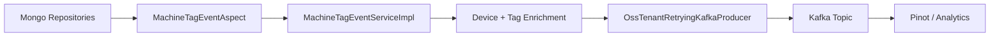
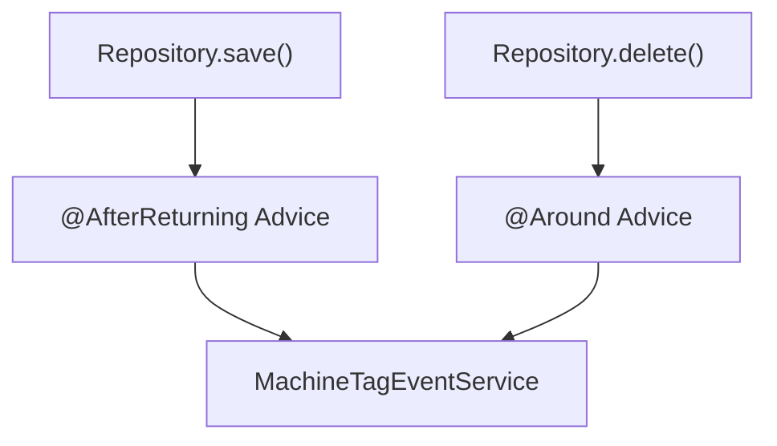
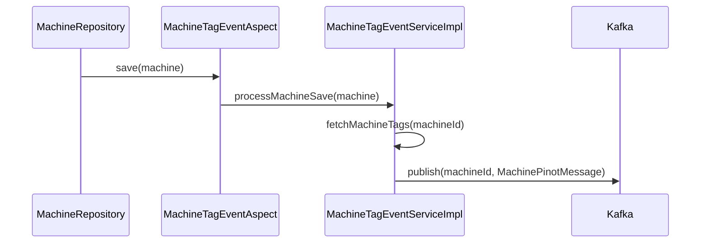
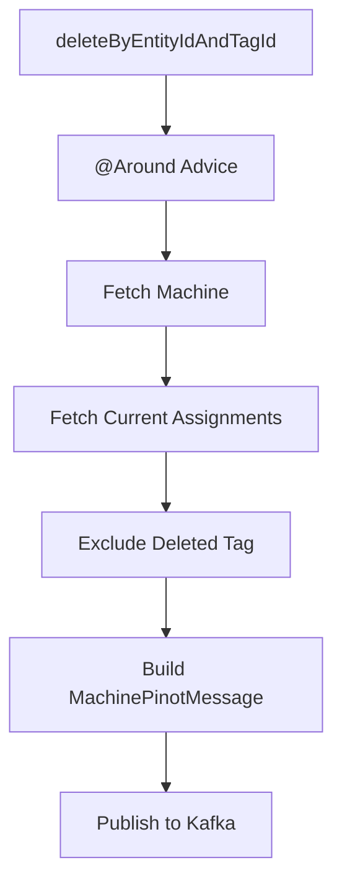
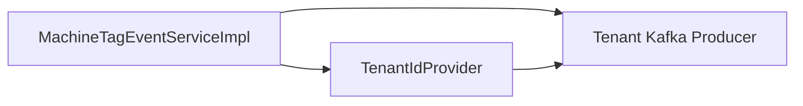
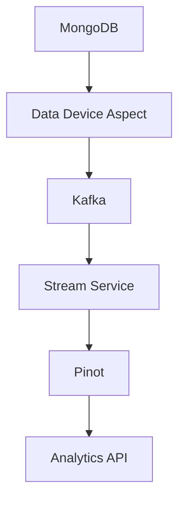

# Data Device Aspect

## Overview

The **Data Device Aspect** module provides cross-cutting event handling for device and tag-related persistence operations. It uses Spring AOP to intercept repository operations on `Machine`, `TagAssignment`, and `Tag` entities and delegates event processing to a dedicated service.

Its primary responsibility is to:

- Detect device and tag lifecycle changes at the repository layer
- Enrich device state with tag metadata
- Publish normalized `MachinePinotMessage` events to Kafka
- Keep downstream analytical systems (e.g., Pinot) in sync with MongoDB

This module acts as a **bridge between transactional data storage and streaming/analytics infrastructure**.

---

## Architectural Role

The module sits between:

- **Mongo repositories** (device + tag persistence)
- **Kafka publishing layer** (tenant-aware producer)
- **Downstream analytics consumers** (e.g., Pinot)



The module is conditionally enabled via:

```text
openframe.device.aspect.enabled=true
```

---

## Core Components

### 1. MachineTagEventAspect

**Class:** `MachineTagEventAspect`  
**Type:** Spring AOP Aspect  
**Responsibility:** Intercepts repository operations and delegates to the service layer.

This component listens to:

- `MachineRepository.save(..)`
- `MachineRepository.saveAll(..)`
- `TagAssignmentRepository.save(..)`
- `TagAssignmentRepository.saveAll(..)`
- `TagAssignmentRepository.deleteByEntityIdAndTagIdAndEntityType(..)`
- `TagAssignmentRepository.deleteByTagId(..)`
- `TagRepository.save(..)`
- `TagRepository.saveAll(..)`

It uses:

- `@AfterReturning` for post-save processing
- `@Around` for delete operations (to capture state before deletion)

### Interception Strategy



Key design decisions:

- Non-blocking business logic (exceptions are logged, not rethrown except in tag save)
- Delete operations use `@Around` to compute the correct post-delete state
- Only `TagEntityType.DEVICE` assignments are processed

---

### 2. MachineTagEventServiceImpl

**Class:** `MachineTagEventServiceImpl`  
**Implements:** `MachineTagEventService`  
**Responsibility:** Contains all business logic for transforming persistence events into Kafka messages.

Dependencies:

- `MachineRepository`
- `TagAssignmentRepository`
- `TagRepository`
- `OssTenantRetryingKafkaProducer`
- `TenantIdProvider`

Configured topic:

```text
openframe.oss-tenant.kafka.topics.outbound.devices-topic
```

---

## Event Processing Flows

### 1. Machine Save Flow

When a machine is saved:

1. Aspect intercepts repository save
2. Service fetches all current tag assignments
3. Service builds a `MachinePinotMessage`
4. Message is published to Kafka



---

### 2. Tag Assignment Save Flow

Triggered when a device is tagged.

Logic:

- Skip if entity type is not DEVICE
- Fetch full machine state
- Fetch all tags
- Rebuild complete device message
- Publish to Kafka

This ensures Pinot always receives the **full device state**, not partial diffs.

---

### 3. Tag Assignment Delete Flow

Delete operations require special handling.

Because the record will be removed from the database, the service:

1. Captures affected machine IDs
2. Fetches current assignments
3. Excludes the tag being deleted
4. Rebuilds the message without the removed tag
5. Publishes updated state



This guarantees analytics consistency even during bulk tag removals.

---

### 4. Tag Update Flow

If a tag key changes:

- All machines using that tag are identified
- Each machine is re-enriched
- Updated state is sent to Kafka

This ensures tag key renames propagate correctly into analytics indexes.

---

## MachinePinotMessage Construction

Message construction is centralized in:

- `buildMachinePinotMessage(...)`
- `buildMachinePinotMessageFromParts(...)`

The message contains:

```text
- tenantId
- machineId
- organizationId
- deviceType
- status
- osType
- tags (list of tag keys)
- tagKeyValues (key:value pairs)
- ingestionTime
```

### Tag Processing Logic

For each tag:

- `tags` contains only tag keys
- `tagKeyValues` contains flattened key:value combinations

Example:

```text
Tag: environment
Values: [production, us-east]

Results in:
- tags: [environment]
- tagKeyValues: [environment:production, environment:us-east]
```

This structure supports efficient filtering and indexing in Pinot.

---

## Multi-Tenancy Considerations

The module is fully tenant-aware:

- `TenantIdProvider` injects tenant ID into every message
- `OssTenantRetryingKafkaProducer` ensures tenant-scoped publishing



This guarantees strict isolation across tenants in downstream analytics.

---

## Reliability & Error Handling

The module follows a **fail-safe design**:

- Aspect methods catch and log errors
- Kafka publishing errors are logged
- Delete operations isolate per-machine failures
- Bulk operations avoid duplicate processing

Example safeguards:

- `Set<String>` used to avoid duplicate machine processing
- Graceful handling when machine not found
- Null checks on tag IDs and values

---

## Performance Characteristics

Key design trade-offs:

### ✅ Consistency Over Minimal Events
Instead of publishing diffs, the module publishes the full device state.

Benefits:
- Simpler downstream processing
- No need for event replay ordering guarantees
- Idempotent updates in analytics systems

Cost:
- Slightly higher Kafka payload size

### ✅ Tenant-Aware Kafka Producer with Retry
- Retries handled at producer level
- Avoids losing indexing updates

---

## Configuration

| Property | Purpose |
|----------|----------|
| `openframe.device.aspect.enabled` | Enables/disables the aspect |
| `openframe.oss-tenant.kafka.topics.outbound.devices-topic` | Kafka topic for device events |

If disabled, repository operations behave normally without event publishing.

---

## How This Module Fits the System

The Data Device Aspect module integrates with:

- Mongo persistence layer (device + tag repositories)
- Kafka infrastructure
- Streaming processors
- Pinot analytics layer

High-level ecosystem view:



It ensures that:

- Device metadata changes are instantly reflected in analytics
- Tag operations remain consistent across systems
- Multi-tenant isolation is preserved

---

## Summary

The **Data Device Aspect** module provides:

- Automatic interception of device and tag persistence events
- Enrichment of device state with tag metadata
- Reliable Kafka publishing
- Tenant-aware analytics synchronization

It is a critical infrastructure module that maintains **data consistency between MongoDB and analytics systems** while remaining transparent to repository consumers.
