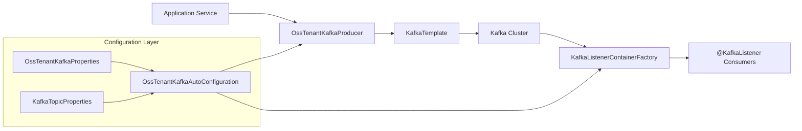
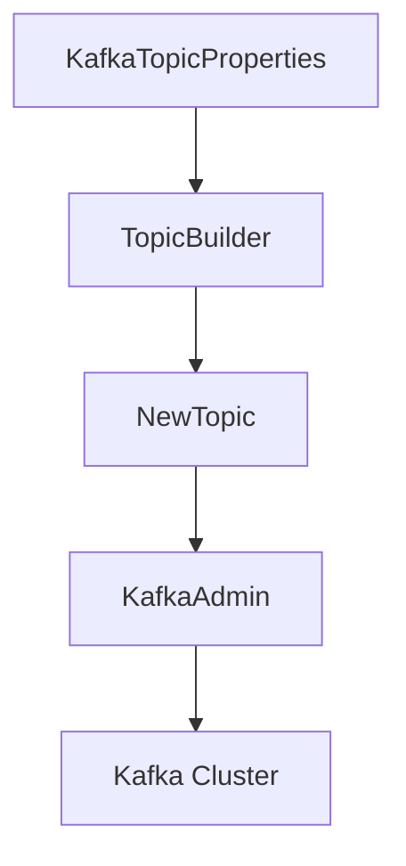
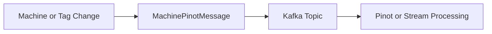
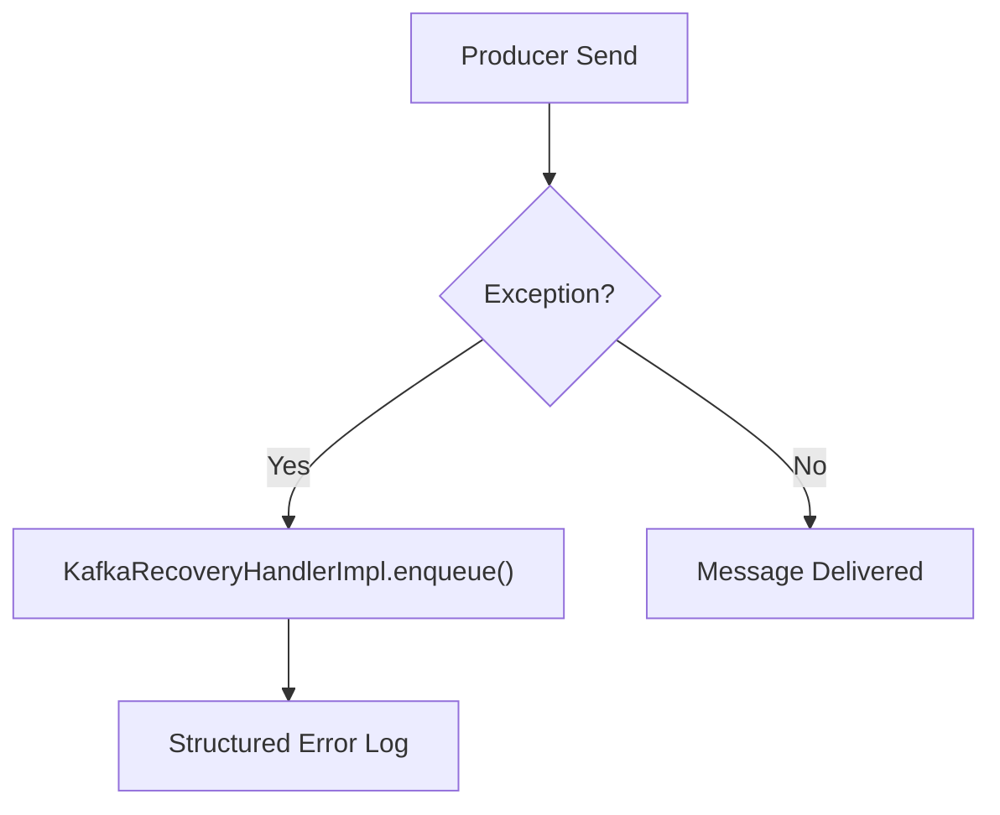

# Data Kafka

## Overview

The **Data Kafka** module provides the foundational Kafka infrastructure for OpenFrame OSS services. It encapsulates:

- Multi-tenant Kafka configuration
- Producer and consumer factory setup
- Topic auto-registration and admin configuration
- Standardized message models (e.g., machine and Debezium events)
- Basic producer recovery handling

This module is designed to be reusable across services that need to publish or consume Kafka messages, particularly in multi-tenant environments where Kafka clusters and topics are isolated per tenant context.

At its core, Data Kafka replaces Spring Boot’s default Kafka auto-configuration with a controlled, tenant-aware setup and provides consistent conventions for serialization, topic management, and message structure.

---

## Architectural Role

Data Kafka sits between domain services and the Kafka broker. It standardizes how services:

- Connect to Kafka
- Define topics
- Serialize and deserialize messages
- Handle failures during publishing



---

## Core Responsibilities

### 1. Custom Kafka Auto-Configuration

**Class:** `OssKafkaConfig`

- Enables Kafka support via `@EnableKafka`
- Explicitly excludes Spring Boot’s default `KafkaAutoConfiguration`
- Ensures the platform uses only OSS-specific Kafka configuration

This prevents unintended configuration conflicts and guarantees consistent cluster behavior.

---

### 2. Tenant-Aware Kafka Properties

**Class:** `OssTenantKafkaProperties`

Bound to configuration prefix:

```text
spring.oss-tenant
```

Key characteristics:

- Wraps Spring’s `KafkaProperties`
- Supports full producer, consumer, listener, and template configuration
- Has an `enabled` flag (enabled by default)

This design allows complete reuse of Spring’s Kafka configuration model while scoping it under a dedicated namespace.

---

### 3. Topic Configuration and Auto-Creation

**Class:** `KafkaTopicProperties`

Bound to:

```text
openframe.oss-tenant.kafka.topics
```

Structure:

```text
autoCreate: true
inbound:
  topicKey:
    name: "machine-events"
    partitions: 3
    replicationFactor: 1
```

### TopicConfig

Each topic definition includes:

- `name`
- `partitions`
- `replicationFactor`

When Kafka admin is enabled, topics are registered using Spring’s `TopicBuilder` and created automatically.



Topic auto-creation is controlled by:

```text
spring.oss-tenant.kafka.admin.enabled=true
```

---

### 4. Producer Infrastructure

Defined in `OssTenantKafkaAutoConfiguration`:

- `ProducerFactory<String, Object>`
- `KafkaTemplate<String, Object>`
- `OssTenantKafkaProducer`

#### Serialization Strategy

- Key serializer: `StringSerializer`
- Value serializer: `JsonSerializer`

This enforces JSON-based messaging across the platform, allowing domain objects to be published directly.

#### Default Topic

If configured, the Kafka template assigns a default topic via:

```text
spring.oss-tenant.kafka.template.default-topic
```

---

### 5. Consumer Infrastructure

Also configured in `OssTenantKafkaAutoConfiguration`:

- `ConsumerFactory<Object, Object>`
- `ConcurrentKafkaListenerContainerFactory<Object, Object>`

#### Deserialization Strategy

- Key deserializer: `StringDeserializer`
- Value deserializer: `JsonDeserializer`

#### Listener Customization

Listener behavior is configurable via properties:

- `concurrency`
- `ackMode` (defaults to `RECORD`)
- `pollTimeout`
- `idleEventInterval`
- `logContainerConfig`

This enables fine-grained control over message acknowledgment and consumption patterns.

---

## Message Models

Data Kafka defines canonical message structures used across streaming services.

### 1. MachinePinotMessage

Represents machine state changes sent to Kafka for analytics pipelines (e.g., Pinot ingestion).

**Fields include:**

- `tenantId`
- `machineId`
- `organizationId`
- `deviceType`
- `status`
- `osType`
- `tags`
- `tagKeyValues`
- `ingestionTime`



This message is optimized for analytical indexing, including multi-value tag fields.

---

### 2. DebeziumMessage<T>

Generic wrapper for CDC (Change Data Capture) events emitted by Debezium.

Structure:

```text
DebeziumMessage
 └─ payload
     ├─ before
     ├─ after
     ├─ source
     ├─ op
     └─ ts_ms
```

Key features:

- Supports generic entity type `T`
- Captures database metadata (schema, table, collection)
- Contains operation type (`op`) for insert/update/delete

This model allows services to process CDC events in a strongly typed manner.

---

## Kafka Headers

**Interface:** `KafkaHeader`

Defines standardized header keys:

- `message-type`

This supports message classification and routing without relying solely on topic naming.

---

## Producer Recovery Handling

**Class:** `KafkaRecoveryHandlerImpl`

Implements a recovery mechanism for failed publish attempts.

Current behavior:

- Logs structured error details
- Includes topic, key, headers, exception type, message, and payload snapshot
- Attaches stack trace



Although the current implementation logs errors only, the abstraction allows extension to:

- Dead-letter topics
- Retry queues
- External monitoring systems

---

## Bean Overview

The module auto-registers the following key beans (when enabled):

- `ossTenantKafkaProducerFactory`
- `ossTenantKafkaTemplate`
- `ossTenantKafkaConsumerFactory`
- `ossTenantKafkaListenerContainerFactory`
- `ossTenantKafkaProducer`
- `ossTenantKafkaAdmin`
- `KafkaAdmin.NewTopics`

All beans are conditionally loaded based on:

```text
spring.oss-tenant.kafka.enabled=true
```

---

## Multi-Tenant Design Considerations

The module is structured around the `oss-tenant` prefix to:

- Isolate cluster configuration
- Avoid conflicts with other Kafka clusters
- Support per-environment overrides
- Enable future per-tenant routing strategies

The design ensures that:

- Producers and consumers are consistently configured
- Topics can be centrally declared
- Services remain agnostic of low-level Kafka configuration

---

## Summary

The **Data Kafka** module provides a standardized, tenant-aware Kafka infrastructure layer for OpenFrame OSS. It:

- Replaces default Kafka auto-configuration
- Centralizes cluster and topic configuration
- Enforces JSON-based messaging
- Provides canonical CDC and analytics message models
- Supports configurable listener behavior
- Abstracts producer recovery handling

It acts as the foundational messaging layer upon which streaming, CDC processing, analytics ingestion, and event-driven workflows are built.