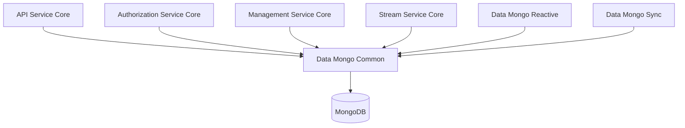
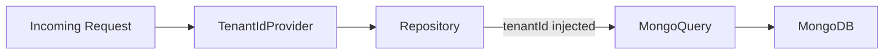
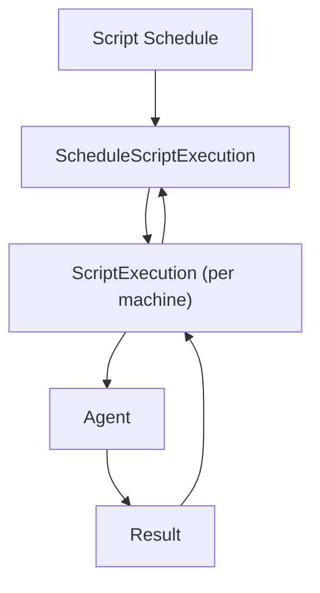
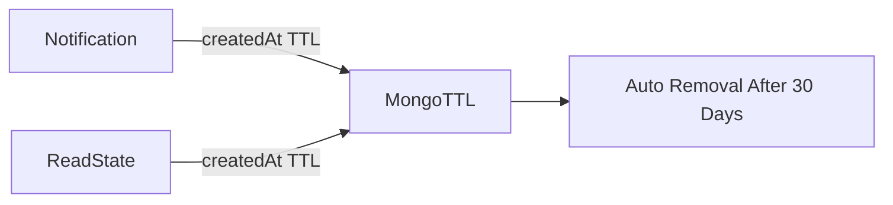
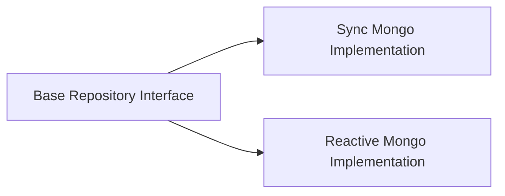

# Data Mongo Common

## Overview

**Data Mongo Common** is the foundational MongoDB domain module for OpenFrame OSS. It defines:

- Core **Mongo document models** (annotated with `@Document`)
- Embedded value objects used across aggregates
- **Query filter objects** for repository-layer filtering
- **Base repository interfaces** (technology-agnostic)
- Multi-tenant infrastructure primitives

This module is intentionally **infrastructure-focused and framework-lean**. It contains no business orchestration logic. Instead, it provides the persistent domain model used by:

- API Service Core
- Authorization Service Core
- Management Service Core
- Stream Service Core
- Notification modules
- Mongo Sync / Mongo Reactive modules

It is the canonical source of truth for MongoDB collection schemas in the platform.

---

## Architectural Role in the Platform

**Data Mongo Common** defines:

- Collection names
- Index definitions
- Compound index constraints
- TTL policies
- Embedded document structure
- Query filter types
- Base repository contracts

Higher-level modules implement repositories and services using these definitions.

---

# Multi-Tenancy Model

Multi-tenancy is enforced at the document level via the `TenantScoped` interface.

Most aggregate roots contain:

- `tenantId` field
- `@Indexed` tenantId
- Compound indexes including `tenantId`

### DefaultTenantIdProvider

`DefaultTenantIdProvider` supplies a fallback tenant (`TENANT_ID` env var, default `oss`) when no custom implementation is provided.

This allows:

- OSS single-tenant deployments
- Production multi-tenant overrides
- Transparent tenant enforcement in repository layers

---

# Domain Areas

Data Mongo Common is organized by domain packages under `com.openframe.data.document.*`.

Below is a structured breakdown.

---

# 1. Identity & Authentication

## User

Collection: `users`

Core identity document containing:

- Email (normalized to lowercase)
- Roles
- Status
- Email verification flag
- CRM sync flag
- Audit timestamps

Indexed fields:

- `tenantId`
- `email`
- `status`

## AuthUser

Extends `User` for authorization server usage.

Adds:

- `passwordHash`
- `loginProvider` (LOCAL, GOOGLE, etc.)
- `externalUserId`
- `lastLogin`
- `imageUrl`

Compound unique index:

- `{ tenantId, email }`

This ensures per-tenant unique identity while allowing cross-tenant duplicates.

---

# 2. Organization Domain

## Organization

Collection: `organizations`

Represents a tenant-scoped business entity.

Key features:

- Immutable `organizationId`
- Soft-delete and archive model
- Contract lifecycle fields
- Revenue and workforce metrics
- Contact information

Lifecycle helpers:

- `isContractActive()`
- `isDeleted()`
- `isArchived()`

## Embedded Types

- `ContactPerson`
- `ContactInformation` (referenced)

## Filtering

`OrganizationQueryFilter` enables repository-layer filtering by:

- Category
- Employee count
- Contract activity
- Status
- Last activity window

---

# 3. Device Domain

## Device

Collection: `devices`

Represents managed machines.

Key fields:

- `machineId`
- OS details
- Status (ACTIVE, OFFLINE, etc.)
- `DeviceType`
- Health & configuration objects

Embedded types:

- `Alert`
- `SecurityAlert`
- `ComplianceRequirement`

---

# 4. Event Domain

## CoreEvent

Collection: `events`

Tenant-scoped internal events.

Fields:

- `type`
- `payload`
- `timestamp`
- `status`

Statuses:

- CREATED
- PROCESSING
- COMPLETED
- FAILED

## ExternalApplicationEvent

Collection: `external_application_events`

Adds metadata:

- Source
- Version
- Arbitrary tag map

## Filtering

`EventQueryFilter` enables filtering by:

- User IDs
- Event types
- Date ranges

---

# 5. RMM & Script Execution Domain

This is one of the most performance-sensitive areas.

## ScriptExecution

Collection: `script_executions`

Represents one script run per machine.

Important constraints:

- Compound unique index on `{ tenantId, executionId, machineId, scriptId }`
- Status/time indexes for watchdog sweeps
- Output truncation limit (64 KiB)

## CommandExecution

Collection: `command_executions`

Ad-hoc command mirror of ScriptExecution.

Shared characteristics:

- Execution correlation ID
- Status transitions
- Truncated stdout/stderr

## ScheduleScriptExecution

Header record per schedule fire.

One record per execution batch.

## ScriptScheduleMachineAssigned

Assignment mapping between:

- Schedule
- Machine

## Query Filters

- `ScriptQueryFilter`
- `ScriptExecutionQueryFilter`
- `ScriptScheduleQueryFilter`

These mirror API-layer inputs but remain API-independent.

---

# 6. Ticketing Domain

Collections:

- `ticket_notes`
- `ticket_attachments`
- `ticket_statuses`

## TicketNote

Technician-authored notes.

## TicketAttachment

Metadata for externally stored files.

## TicketStatusDefinition

Per-tenant lifecycle definitions.

Supports lifecycle rollout via:

- `statusIds`
- `statusKinds`

## TicketQueryFilter

Supports both legacy and lifecycle-based filtering.

---

# 7. Notification Domain

Collections:

- `notifications`
- `notification_read_states`
- `notification_settings`

## Notification

- Severity
- Category
- Correlation ID
- TTL index (30 days)

## NotificationReadState

Compound unique index ensures:

- One read state per recipient per notification

## TTL Strategy

Retention constant:

- `NotificationRetention.HISTORY_TTL_SECONDS`

---

# 8. OAuth & Authorization

## MongoRegisteredClient

Collection: `oauth_registered_clients`

Compound unique index:

- `{ tenantId, clientId }`

Supports:

- Grant types
- Redirect URIs
- PKCE enforcement
- Token TTL policies

## OAuthToken

Collection: `oauth_tokens`

Stores:

- Access tokens
- Refresh tokens
- Expiry timestamps
- Client scope binding

---

# 9. Feature Flags

## FeFeatureFlags

Collection: `fe_feature_flags`

Per-tenant DB overrides for frontend feature flags.

Design principles:

- Missing document = defaults from configuration
- Explicit overrides take precedence

---

# 10. Tagging System

## TagAssignment

Collection: `tag_assignments`

Compound unique index:

- `{ tenantId, entityId, tagId, entityType }`

Supports:

- Key-value tagging
- Multi-value tags

## TagValidation

Static validation rules:

- Max length: 64
- Regex pattern enforcement

---

# 11. Onboarding

Collections:

- `tenant_onboarding_progress`
- `user_onboarding_progress`

## TenantOnboardingProgress

- One record per tenant
- Add-only completed steps
- Explicit completion marker

## UserOnboardingProgress

- Unique `(userId, tenantId)`
- Supports skip/reset

---

# 12. Push Devices

## PushDevice

Collection: `push_devices`

Compound indexes:

- Unique `{ tenantId, token }`
- `{ tenantId, userId }`

Used by push notification services.

---

# 13. Tool Agent & Integrations

Embedded configuration types:

- `IntegratedToolAgentConfiguration`
- `ToolAgentAsset`
- `LocalFilenameConfiguration`
- `DownloadConfiguration`

These describe:

- Download artifacts
- Execution arguments
- OS-specific installation parameters

---

# Repository Abstractions

Base repository interfaces are intentionally technology-agnostic.

Examples:

- `BaseUserRepository`
- `BaseTenantRepository`
- `BaseApiKeyRepository`
- `BaseIntegratedToolRepository`

These are implemented in:

- Mongo Sync module (blocking)
- Mongo Reactive module (reactive)

This separation ensures:

- Clean domain modeling
- No dependency on Reactor in core domain
- Shared contract across implementations

---

# Indexing & Performance Strategy

Patterns used consistently:

- `tenantId` always indexed
- Compound unique constraints enforce logical invariants
- TTL indexes for time-bound data
- Status + timestamp indexes for watchdog scans

This enables:

- Efficient tenant isolation
- Predictable pagination
- Background cleanup without cron jobs

---

# Design Principles

1. **Tenant-first indexing** — every aggregate is tenant-scoped.
2. **Repository independence** — no API-layer dependency in filters.
3. **Explicit lifecycle fields** — no inference-based state.
4. **Embedded value objects over joins** — Mongo-native modeling.
5. **Operational safeguards** — output truncation, TTL, uniqueness constraints.

---

# Summary

**Data Mongo Common** is the MongoDB schema foundation of OpenFrame OSS.

It defines:

- All primary Mongo collections
- Multi-tenant guarantees
- Domain aggregates
- Embedded structures
- Filter contracts
- Repository interfaces

Higher-level services rely on this module for consistent persistence behavior across the platform.