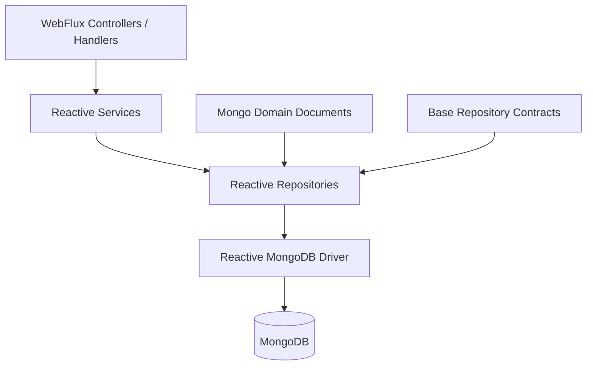
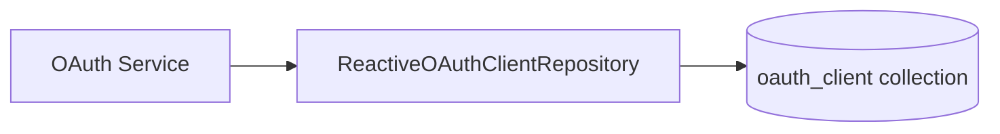
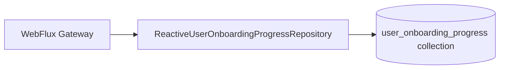
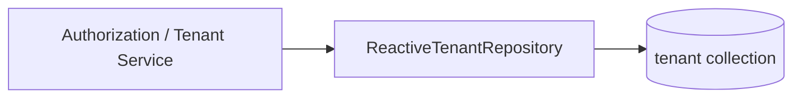
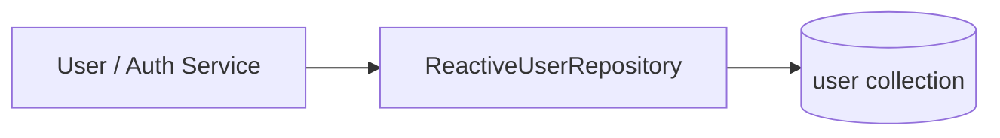
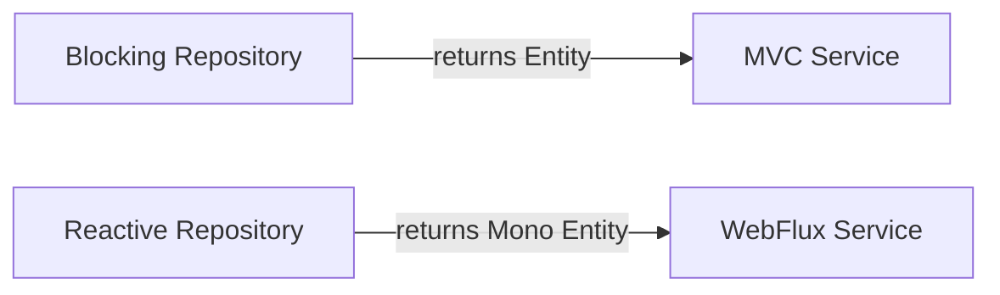
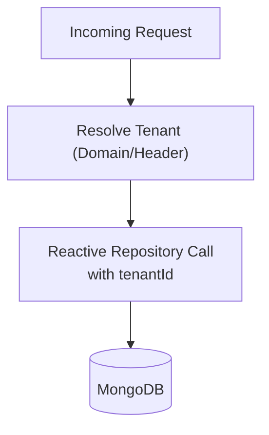

# Data Mongo Reactive

## Overview

The **Data Mongo Reactive** module provides the reactive (non-blocking) MongoDB data access layer for OpenFrame services built on Spring WebFlux.

It complements the blocking repositories defined in the Data Mongo Sync module by exposing `ReactiveMongoRepository`-based interfaces that return Project Reactor types (`Mono`, `Flux`). This module is primarily used by gateway, authorization, and WebFlux-based services that require:

- Non-blocking I/O
- High concurrency under low thread counts
- Explicit tenant scoping in shared/SaaS environments

At its core, the module:

- Enables reactive Mongo repositories
- Defines reactive repositories for OAuth, Tenant, User, and Onboarding domains
- Bridges shared base repository contracts to reactive return types

---

## Architectural Context

Data Mongo Reactive sits in the persistence layer and interacts with:

- **MongoDB** as the primary document store
- **Domain documents** from the Data Mongo Common module
- **Base repository contracts** shared with blocking implementations
- **WebFlux services** that consume reactive streams

### High-Level Architecture



### Key Characteristics

- ✅ Fully non-blocking via Spring Data Reactive MongoDB
- ✅ Reactor-based return types (`Mono<T>`, `Flux<T>`)
- ✅ Explicit tenant scoping where required
- ✅ Shared repository interfaces aligned with sync implementation

---

## Module Configuration

### MongoReactiveConfig

The `MongoReactiveConfig` class enables reactive MongoDB repositories.

```java
@Configuration
@EnableReactiveMongoRepositories(basePackages = "com.openframe.data.reactive.repository")
public class MongoReactiveConfig {
}
```

#### Responsibilities

- Activates Spring Data reactive repository scanning
- Restricts repository detection to `com.openframe.data.reactive.repository`
- Integrates with Spring Boot’s reactive Mongo auto-configuration

This configuration ensures that all repositories in this module are registered as reactive Spring beans.

---

## Reactive Repositories

The module defines reactive repositories for key identity and tenancy-related domains.

### 1. ReactiveOAuthClientRepository

**Domain:** OAuth Client  
**Document:** `OAuthClient`



#### Interface Highlights

- Extends `ReactiveMongoRepository<OAuthClient, String>`
- Adds:
  - `Mono<OAuthClient> findByClientId(String clientId)`

#### Purpose

- Used by OAuth and authorization flows
- Retrieves clients by `clientId` in a non-blocking manner
- Suitable for reactive authorization servers and token validation pipelines

---

### 2. ReactiveUserOnboardingProgressRepository

**Domain:** User Onboarding  
**Document:** `UserOnboardingProgress`



#### Interface Highlights

- Extends `ReactiveMongoRepository<UserOnboardingProgress, String>`
- Adds:
  - `Mono<UserOnboardingProgress> findByUserIdAndTenantId(String userId, String tenantId)`

#### Multi-Tenancy Note

This repository is **not tenant-aspect aware**.

In shared/SaaS runtimes:

- The tenant aspect is bypassed
- `tenantId` must be passed explicitly in queries
- Queries are written in a tenant-first or tenant-scoped form

This design ensures safe multi-tenant isolation even when AOP-based tenant injection is disabled.

---

### 3. ReactiveTenantRepository

**Domain:** Tenant  
**Document:** `Tenant`



#### Interface Composition

- `ReactiveMongoRepository<Tenant, String>`
- `BaseTenantRepository<Mono<Tenant>, Mono<Boolean>, String>`

#### Overridden Methods

- `Mono<Tenant> findByDomain(String domain)`
- `Mono<Boolean> existsByDomain(String domain)`

#### Purpose

- Supports tenant discovery (e.g., domain-based routing)
- Enables reactive existence checks
- Keeps contract parity with the sync repository while returning reactive types

This repository is central to:

- Domain-based tenant resolution
- Authorization server tenant lookup
- Gateway routing logic

---

### 4. ReactiveUserRepository

**Domain:** User  
**Document:** `User`



#### Interface Composition

- `ReactiveMongoRepository<User, String>`
- `BaseUserRepository<Mono<User>, Mono<Boolean>, String>`

#### Key Methods

- `Mono<User> findByEmail(String email)`
- `Mono<Boolean> existsByEmail(String email)`
- `Mono<Boolean> existsByEmailAndStatus(String email, UserStatus status)`
- `Mono<Boolean> existsByTenantIdAndId(String tenantId, String id)`

#### Tenant-First Existence Check

The method:

```
existsByTenantIdAndId(String tenantId, String id)
```

ensures:

- Explicit tenant scoping
- Safe operation when tenant aspect is bypassed
- Correct isolation in shared deployments

This is particularly important for:

- SaaS runtimes
- Cross-tenant validation
- Gateway-side user checks

---

## Reactive vs Sync Repositories

The Data Mongo Reactive module mirrors parts of the blocking implementation but adapts them to Reactor types.



### Differences

| Aspect | Sync | Reactive |
|--------|------|----------|
| Base Interface | `MongoRepository` | `ReactiveMongoRepository` |
| Return Type | Entity / Optional | `Mono<T>` / `Flux<T>` |
| Thread Model | Blocking | Non-blocking |
| Best For | Traditional MVC | WebFlux, Gateway |

The reactive module ensures functional equivalence while enabling event-loop-based scalability.

---

## Multi-Tenancy Strategy

In OpenFrame’s shared/SaaS environments:

- Tenant AOP aspects may be disabled
- Repositories must scope queries explicitly
- Tenant ID becomes a required query parameter in critical paths

### Tenant-Aware Flow



This explicit strategy avoids:

- Accidental cross-tenant reads
- Hidden coupling to AOP
- Implicit query rewriting

---

## How It Fits Into the Overall System

Data Mongo Reactive is primarily consumed by:

- WebFlux-based gateways
- Authorization and OAuth services
- Tenant-aware identity flows
- Reactive onboarding flows

It does **not**:

- Define domain documents (handled by Data Mongo Common)
- Provide blocking repositories (handled by Data Mongo Sync)
- Contain business logic (handled in service modules)

Instead, it acts as a thin, reactive persistence layer that:

- Exposes domain data as reactive streams
- Maintains contract parity with sync repositories
- Enables scalable, non-blocking service architectures

---

## Summary

The **Data Mongo Reactive** module provides:

- Reactive MongoDB configuration
- Reactor-based repositories for core identity and tenancy domains
- Explicit tenant-aware querying patterns
- A scalable foundation for WebFlux services

It is a critical building block for high-concurrency, multi-tenant, SaaS-ready OpenFrame services operating in a non-blocking execution model.
