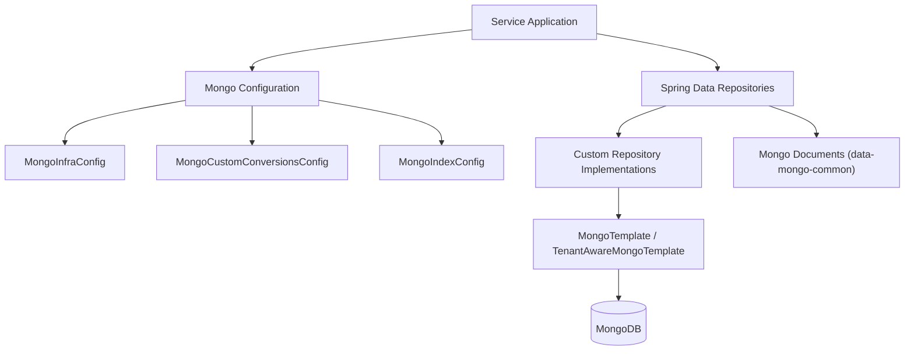
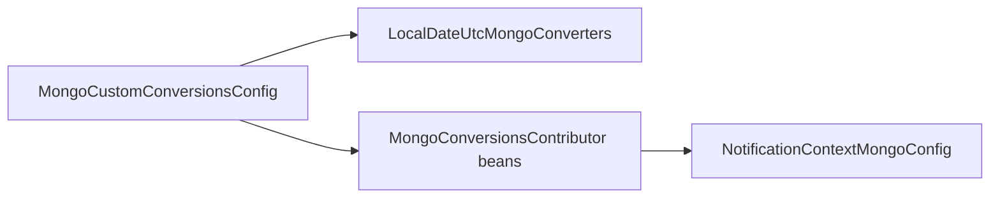
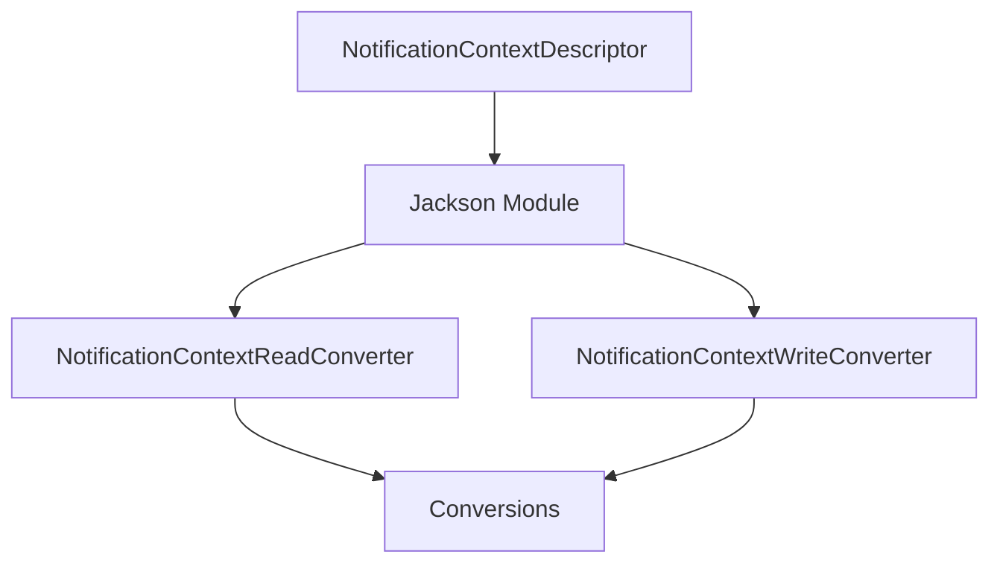
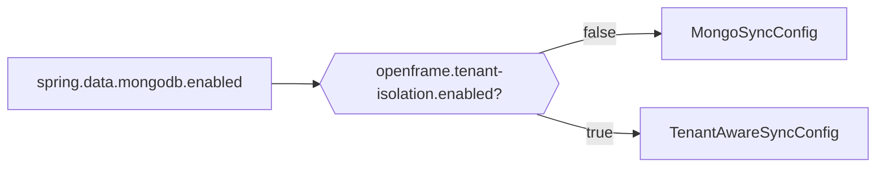
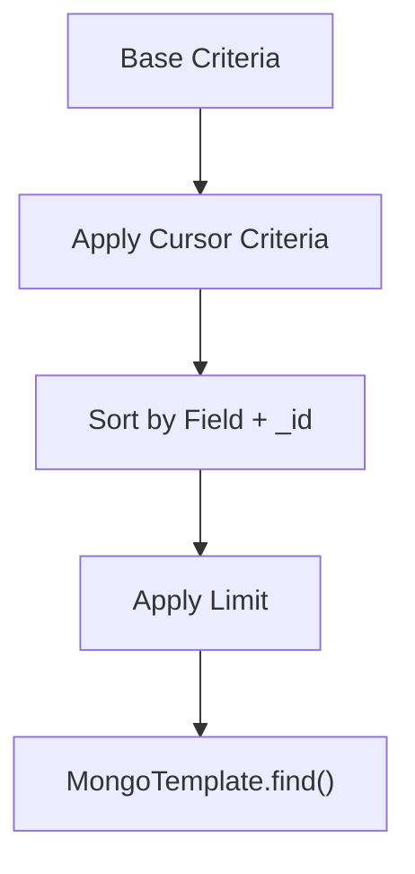
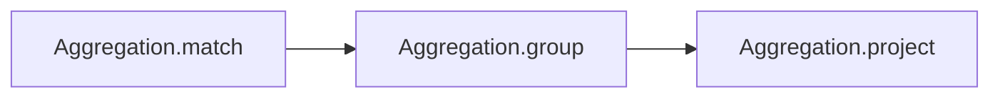
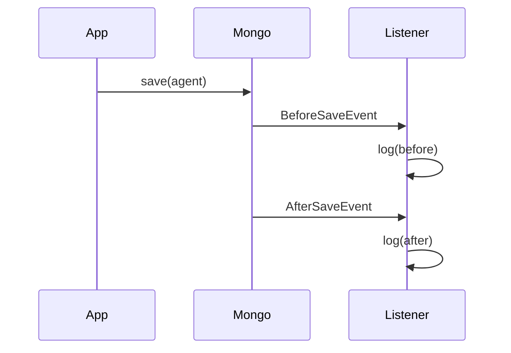
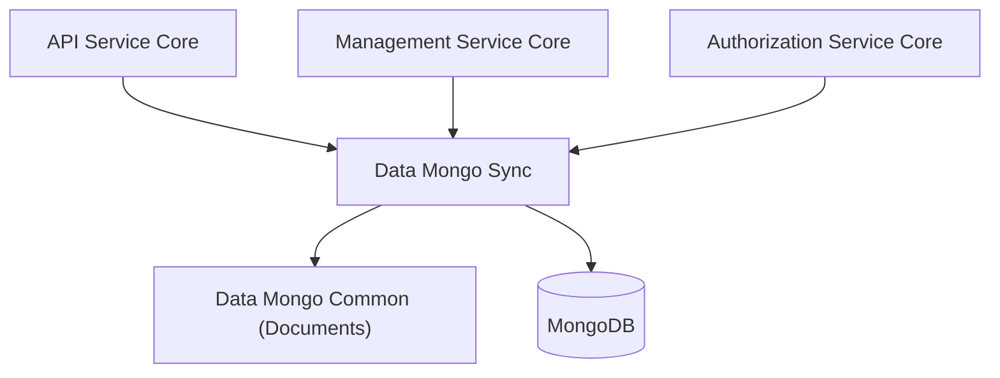

# Data Mongo Sync

## Overview

**Data Mongo Sync** is the synchronous MongoDB persistence module for the OpenFrame platform. It provides:

- Spring Data Mongo configuration (converter, auditing, indexes)
- Tenant-aware and non-tenant repository wiring
- Custom repository implementations with cursor-based pagination
- Aggregation-based statistics and faceting
- Retry and auditing hooks for optimistic locking and change logging

This module is the primary MongoDB data access layer for service applications running with synchronous (blocking) Mongo access.

It works closely with:

- `data-mongo-common` (document models and base repositories)
- `data-mongo-reactive` (reactive alternative)
- `management-service-core` (migrations and seeders)
- `api-service-core` (controllers and data fetchers consuming repositories)

---

## High-Level Architecture

The module can run in two modes:

- **Standard sync mode** (`MongoSyncConfig`) – plain `MongoTemplate`
- **Tenant-aware sync mode** (`TenantAwareSyncConfig`) – tenant-scoped repositories and queries

---

## Configuration Layer

### 1. Mongo Infrastructure

**MongoInfraConfig**

- Enables Mongo auditing (`@EnableMongoAuditing`)
- Defines a single `MappingMongoConverter`
- Applies custom conversions
- Replaces map key dots with `__dot__`

This ensures consistent document mapping across all services using this module.

---

### 2. Custom Conversions

**MongoCustomConversionsConfig** defines the *single* `MongoCustomConversions` bean in the module.

#### LocalDateUtcMongoConverters

Problem solved:

- Default Spring JSR-310 converters use system timezone.
- Different pods in different timezones persist different instants for the same `LocalDate`.

Solution:

- Always encode `LocalDate` at **UTC midnight**.
- Guarantees consistent date persistence across environments.

This prevents subtle duplication and deduplication bugs.

#### MongoConversionsContributor Pattern

Because Spring allows only **one** `MongoCustomConversions` bean:

- Additional converters are registered via `MongoConversionsContributor`
- Contributors are applied centrally in `MongoCustomConversionsConfig`

This avoids bean ambiguity errors.

---

### 3. Notification Context Serialization

Two complementary configs:

- **NotificationContextJacksonConfig** – registers Jackson subtypes dynamically
- **NotificationContextMongoConfig** – registers read/write Mongo converters

This allows polymorphic notification contexts to:

- Serialize correctly in JSON (API layer)
- Persist correctly in Mongo

---

### 4. Index Management

**MongoIndexConfig** ensures critical indexes at startup.

Key examples:

- Compound indexes for `application_events`
- Partial unique indexes for:
  - `scripts`
  - `script_schedules`

Partial uniqueness excludes soft-deleted documents:

- Users can reuse names of deleted scripts/schedules
- Avoids Mongo `$ne` partial-index limitation by using `$in`

This is essential for:

- Performance
- Correct soft-delete semantics
- Safe redeploys

---

## Tenant Isolation Modes

Two configuration classes control repository behavior:

### MongoSyncConfig

- Standard repositories
- Excludes `@TenantAwareRepository`
- Used when tenant isolation is disabled

### TenantAwareSyncConfig

- Enables all repositories
- Used when tenant isolation is enabled
- Custom repositories extend `TenantAwareRepositorySupport`

Tenant-aware repositories rely on:

- `TenantAwareMongoTemplate`
- Implicit `tenantCriteria()` injection

---

## Repository Layer

The module contains both:

- Plain `MongoRepository` interfaces
- Custom repository implementations

### Patterns Used

#### 1. Cursor-Based Pagination

Most custom repositories implement keyset pagination:

Characteristics:

- Cursor uses `_id` (ObjectId) or compound keys
- Sort field allowlist validation
- Tie-breaking with `_id`
- Safe fallback if cursor invalid

Used in:

- Devices (`CustomMachineRepositoryImpl`)
- Tickets (`CustomTicketRepositoryImpl`)
- Scripts and schedules
- Time entries
- Organizations
- Notifications

---

#### 2. Aggregation for Statistics

Aggregation pipelines are used for:

- Facets (status, author, platform)
- Counts by enum
- Distinct values
- Time-based metrics
- Duration sums

Example pattern:

Used in:

- Tickets (status counts, resolution time)
- Time entries (duration, distinct days)
- Scripts (facet counts)

---

#### 3. Tenant-Aware Writes

Repositories extending `TenantAwareRepositorySupport`:

- Automatically apply `tenantCriteria()`
- Use `TenantAwareMongoTemplate`
- Avoid cross-tenant leakage

Examples:

- Notifications
- Tickets
- Time entries
- Assignments
- Push devices

---

## Domain Areas Covered

Data Mongo Sync provides custom logic for multiple domains:

- **Devices & Machines** – filtered search, keyset pagination
- **Events** – date range filters, distinct values
- **Knowledge Base** – folder/article queries with compound cursor
- **Notifications** – read-state joins and pagination
- **OAuth Tokens** – token lookups
- **Onboarding** – tenant/user progress
- **Organizations** – complex filtering and keyset pagination
- **RMM (Scripts & Executions)** – faceting and aggregation
- **Tickets** – bulk updates, statistics, status grouping
- **Time Tracking** – duration aggregation and date-based pagination
- **Integrated Tools** – dynamic filtering and distinct queries
- **Users** – regex-based search

All repository logic is pushed to the database level for performance.

---

## Auditing and Retry

### IntegratedToolAgentChangeLogger

Listens to Mongo save events for `IntegratedToolAgent`:

Logs:

- Document version
- Agent version
- Publish state
- Release flag

This supports operational observability.

---

### OptimisticLockingRetryListener

Used with Spring Retry for optimistic locking:

- Logs each retry attempt
- Logs success after retries
- Logs exhaustion and bubbling exception

This improves visibility of concurrent update contention.

---

## Seed Data

### TicketStatusSeedCatalog

Defines system ticket statuses:

- AI Assistance
- Tech Required
- Resolved
- Archived
- On Hold (custom example)

Uses **LexoRank** to:

- Generate stable ordering
- Allow flexible reordering
- Avoid collisions

This catalog is typically consumed by management/migration components.

---

## Design Principles

1. **Single Source of Mongo Configuration**
   - Exactly one `MongoCustomConversions` bean
   - Centralized index management

2. **Database-Level Filtering**
   - No in-memory filtering
   - Use `Criteria`, aggregation, partial indexes

3. **Keyset Pagination over Offset Pagination**
   - Scales for large datasets
   - Stable ordering with tie-breakers

4. **Explicit Tenant Safety**
   - Clear separation between tenant-aware and non-tenant modes
   - No accidental cross-tenant operations

5. **Graceful Degradation**
   - Invalid cursors do not crash requests
   - Duplicate key races handled defensively

---

## How Data Mongo Sync Fits in the System

- Controllers and GraphQL data fetchers call repository interfaces.
- This module executes queries against MongoDB.
- Documents are defined in `data-mongo-common`.
- Reactive services use `data-mongo-reactive` instead.

Data Mongo Sync is therefore the **central synchronous persistence layer** for OpenFrame’s Mongo-backed domains.
