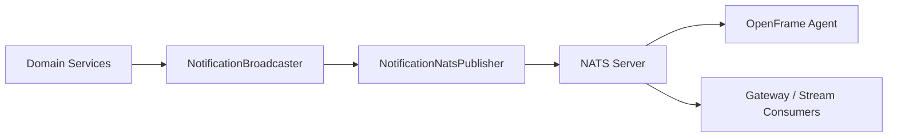
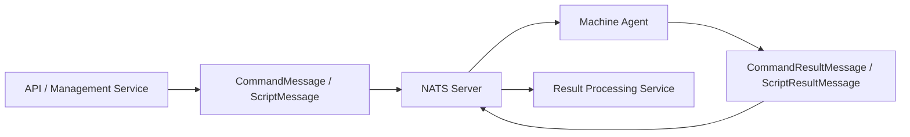
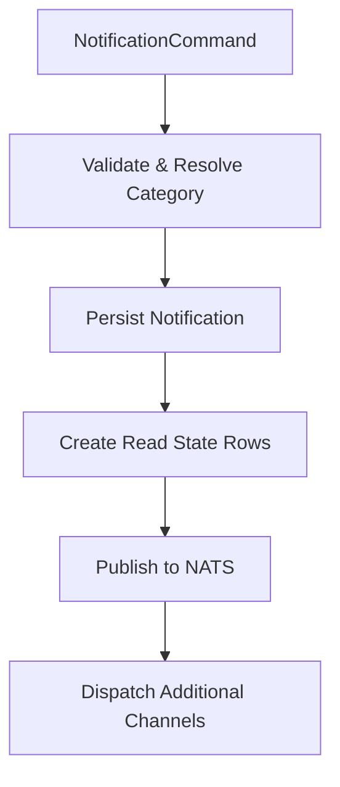
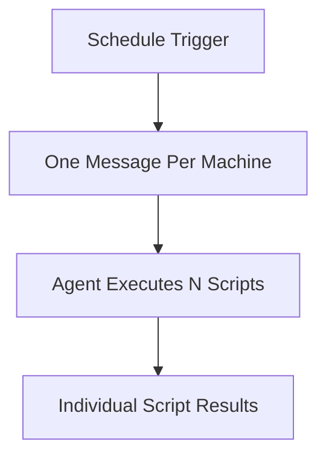

# Data Nats

## Overview

The **Data Nats** module provides the NATS-based messaging layer for OpenFrame. It defines:

- Wire-level message contracts exchanged over NATS.
- Publishers for domain events (notably notifications).
- Remote execution (RMM) dispatch and result payloads.
- Supporting utilities and async execution configuration.

This module acts as the bridge between:

- Core domain services (notifications, RMM, tool management).
- Agents running on managed machines.
- Real-time subscribers (e.g., WebSocket gateways or stream processors).

It does not contain business logic itself; instead, it standardizes and transports events across the distributed system.

---

## Architectural Role in the Platform

At runtime, Data Nats sits between domain services and NATS infrastructure.



For RMM dispatch:



Data Nats defines the **contracts and publisher logic**, while transport configuration and stream bindings are handled by the surrounding infrastructure (e.g., Spring Cloud Stream, management initializers, or stream services).

---

## Module Structure

The module can be logically divided into five areas:

1. Configuration
2. Notification Messaging
3. Tool & Agent Lifecycle Messaging
4. RMM (Remote Monitoring & Management) Messaging
5. Utilities

---

# 1. Configuration

## NotificationChannelExecutorConfig

Provides a dedicated `Executor` bean named:

```text
notificationChannelExecutor
```

It uses:

```java
Executors.newVirtualThreadPerTaskExecutor()
```

### Purpose

- Prevents `@Async` from falling back to unbounded platform threads.
- Uses virtual threads for high-concurrency, lightweight async processing.
- Ensures this library remains safe even when consumed by applications without a default executor.

This executor is primarily used for asynchronous notification channel dispatching.

---

# 2. Notification Messaging

Notification messaging is the most complete vertical in this module. It covers:

- Command validation
- Persistence coordination
- Read-state creation
- Real-time publication via NATS

## Core Components

- `NotificationCommand`
- `NotificationBroadcaster`
- `NotificationNatsPublisher`
- `NotificationMessage`

---

## NotificationCommand

An immutable command object used to initiate a broadcast.

### Guarantees

- `title` must not be blank.
- `severity` and `context` are required.
- `context.type` must not be blank.
- At least one audience must be non-empty:
  - `adminAudience`
  - `machineAudience`
- No blank IDs in audiences.

This ensures that invalid notification broadcasts fail fast before persistence.

---

## NotificationBroadcaster

Central orchestration service for notifications.

### Responsibilities

1. Feature-flag gating (`openframe.features.notifications.enabled`).
2. Category resolution using `NotificationContextDescriptorRegistry`.
3. Persistence of the `Notification` document.
4. Creation of `NotificationReadState` entries.
5. Publishing to NATS (if enabled).
6. Channel-based dispatch for additional integrations.

### Broadcast Flow



### Failure Handling

- If read-state creation fails:
  - The persisted notification is deleted (orphan cleanup).
  - Exception is rethrown to trigger caller retry.
- If NATS publish fails:
  - Failure is logged.
  - Clients reconcile via GraphQL catch-up.

This design prioritizes storage consistency over delivery guarantees.

---

## NotificationNatsPublisher

Publishes `NotificationMessage` instances to NATS subjects.

### Subject Patterns

```text
user.{userId}.notification
machine.{machineId}.notification
```

### Supported Event Types

- `CREATED`
- `UPDATED`

### Key Safeguards

- `userId` and `machineId` must not be blank.
- Notification must be persisted (must have `id`).
- `NatsException` is caught and logged.

### Message Mapping

The domain `Notification` document is mapped into a transport-safe `NotificationMessage` containing:

- id
- severity
- title
- description
- createdAt
- category
- context
- eventType

---

## NotificationMessage

A serializable DTO used for wire transmission.

It decouples:

- Storage schema (Mongo documents)
- Transport schema (NATS payload)

This protects external consumers from internal schema changes.

---

# 3. Tool & Agent Lifecycle Messaging

These messages coordinate installation, updates, and connection state for tool agents.

## InstalledAgentMessage

Represents an agent installed on a machine:

- `machineId`
- `agentType`
- `version`

Used to inform services of installation or upgrade events.

---

## ToolInstallationMessage

Sent to agents to install or reinstall a tool.

### Key Fields

- `toolAgentId`
- `toolId`
- `toolType`
- `version`
- `sessionType`
- `assets`
- `installationCommandArgs`
- `runCommandArgs`
- `uninstallationCommandArgs`
- `reinstall`

### Asset Model

Each `Asset` includes:

- id
- version
- download configurations
- local filename configuration
- source (`ARTIFACTORY`, `TOOL_API`, `GITHUB`)
- executable flag

This supports cross-platform installation strategies.

---

## ToolAgentUpdateMessage

Represents an update to an already-installed tool agent.

Includes:

- Updated version
- Updated assets
- Download configurations
- Session type

The nested `AssetUpdate` allows fine-grained version evolution.

---

## ToolConnectionMessage

Indicates a connection state or handshake between:

- `toolType`
- `agentToolId`

Used for lifecycle synchronization and connectivity tracking.

---

## ClientConnectionEvent

Represents a client connection lifecycle event:

- `timestamp`
- `client.name`

Useful for monitoring and real-time telemetry.

---

# 4. RMM Messaging (Remote Execution)

RMM messaging enables remote command and script execution on managed machines.

## Ad-hoc Command Execution

### CommandMessage

Subject:

```text
machine.{machineId}.command-execution
```

Fields:

- `executionId`
- `code`
- `shell`
- `privilegeLevel`
- `timeout`

Represents a one-off command execution.

---

### CommandResultMessage

Subject:

```text
machine.{machineId}.command-execution.result
```

Extends `RmmResultMessage`.

The distinct type enables downstream routing without embedding a discriminator in the payload.

---

## Saved Script Execution

### ScriptMessage

Subject:

```text
machine.{machineId}.script-execution
```

Includes:

- `executionId`
- `scheduleId`
- `scriptId`
- `machineId`
- `code`
- `args`
- `envVars`
- `timeoutSeconds`

Used for manual script dispatch.

---

### ScriptResultMessage

Subject:

```text
machine.{machineId}.script-execution.result
```

Extends `RmmResultMessage` and includes:

- `scriptId`
- `scheduleId`

Supports correlation and routing for saved script runs.

---

## Scheduled Script Execution

### ScriptScheduleExecutionMessage

Subject:

```text
machine.{machineId}.script-schedule-execution
```

Contains:

- Shared `executionId`
- `scheduleId`
- `machineId`
- `initiatedBy`
- List of `ScriptScheduleExecutionItem`

### Optimization Strategy

Instead of emitting:

```text
N scripts × M machines
```

The system emits:

```text
M messages (one per machine)
```

Each message contains all scripts to run on that machine.



This reduces subject fan-out and improves transport efficiency.

---

# 5. Utilities

## ScriptArgsTokenizer

Splits user-supplied script arguments into positional tokens.

### Behavior

- Preserves quoted spans.
- Removes blank or whitespace-only entries.
- Returns `null` if input is `null`.

Example:

```text
Input:  ["-Path=\"C:\\Program Files\" -Force"]
Output: ["-Path=C:\\Program Files", "-Force"]
```

Ensures correct argv-style execution on:

- `powershell -File script.ps1 <tokens>`
- `sh script.sh <tokens>`

---

# Design Principles

## 1. Strongly Typed Wire Contracts

Different Java classes represent:

- Command vs script results
- Created vs updated notifications

This avoids discriminator fields inside payloads and simplifies downstream routing.

## 2. Transport Decoupling

Domain documents (Mongo) are not sent directly.

Transport DTOs isolate:

- Persistence layer
- Messaging layer
- External consumers

## 3. Fail-Safe Notification Flow

- Persistence and read-state consistency are prioritized.
- NATS delivery failures degrade gracefully.
- Clients can reconcile via query-based catch-up.

## 4. Subject-Based Routing

Subjects encode recipient identity:

```text
user.{id}.notification
machine.{id}.script-execution
```

This supports:

- Fine-grained subscription
- Scalable multi-tenant delivery
- Efficient filtering at the broker level

---

# Summary

The **Data Nats** module provides the event backbone for OpenFrame:

- Real-time notifications to users and machines.
- Remote command and script execution contracts.
- Tool installation and update coordination.
- Lightweight, high-concurrency async dispatch.

It standardizes all NATS wire payloads and ensures that domain services can communicate reliably and consistently across a distributed, multi-tenant environment.