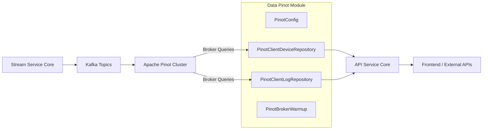
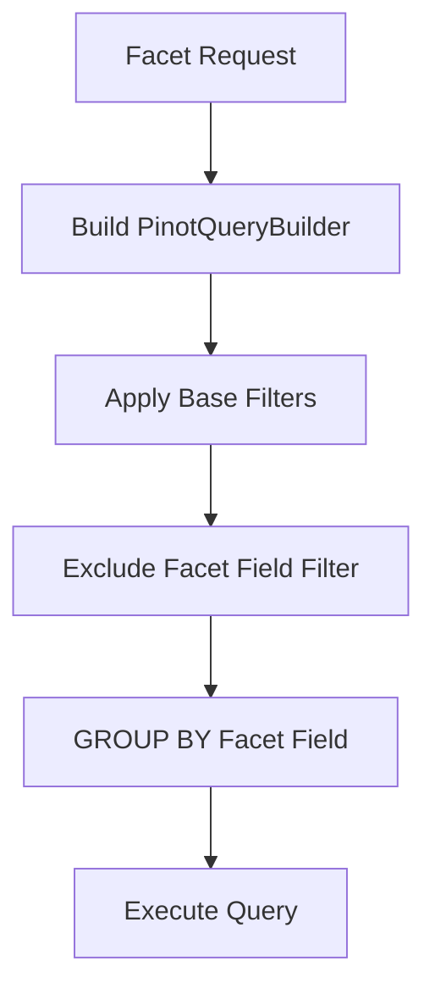
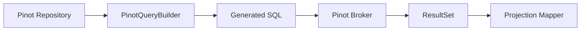

# Data Pinot

## Overview

The **Data Pinot** module provides read-optimized access to analytical data stored in **Apache Pinot**. It is designed for high-performance querying of time-series and faceted datasets such as:

- Device inventory and filter facets
- Log search and filtering
- Organization-based aggregations
- Time-bound event exploration

Within the OpenFrame platform, Data Pinot acts as the **analytics read layer**, complementing transactional data stores (for example MongoDB and Cassandra) with fast aggregation and search capabilities.

---

## Architectural Role

Data Pinot sits between upstream streaming ingestion (Kafka, Debezium, Stream Service Core) and API consumers (API Service Core, External API Service Core, Management Service Core).



### Key Responsibilities

1. Configure Pinot connections (broker and controller)
2. Provide repository abstractions for device and log analytics
3. Support faceted filtering and aggregation
4. Enable efficient cursor-based pagination for logs
5. Perform optional broker warm-up at application startup

---

## Configuration Layer

### PinotConfig

**Component:**  
`PinotConfig`

This configuration class defines two Spring beans:

- `pinotBrokerConnection` – Used for executing analytical queries
- `pinotControllerConnection` – Used for controller-level operations

Configuration properties:

```text
pinot.broker.url
pinot.controller.url
```

The broker connection is used by repositories to execute SQL queries against Pinot tables.

---

### PinotBrokerWarmup

**Component:**  
`PinotBrokerWarmup`

This optional configuration (enabled via `pinot.broker.warmup.enabled=true`) executes a lightweight query on application startup:

```text
SELECT COUNT(*) FROM "<devices_table>" LIMIT 1
```

Purpose:

- Prime broker connections
- Reduce first-request latency
- Fail gracefully (non-blocking if Pinot is temporarily unavailable)

---

## Domain Models

### OrganizationOption

Represents an organization filter option returned from faceted log queries.

Fields:

- `id`
- `name`

Used primarily in log filter dropdowns.

---

### PinotEventEntity

Currently a placeholder entity for Pinot-based event modeling. This class provides extension space for future strongly typed projections.

---

## Repository Layer

The repository layer provides optimized analytical queries using a shared `AbstractPinotRepository` and a `PinotQueryBuilder`.

---

# Device Analytics

## PinotClientDeviceRepository

**Component:**  
`PinotClientDeviceRepository`

This repository powers:

- Device filter facets
- Aggregated device counts
- Organization-based device metrics
- Filtered device totals

### Supported Facets

- Status
- Device type
- OS type
- Organization ID
- Tag key values

### Faceted Query Pattern

All facet methods follow this pattern:

```text
SELECT <facetField>, COUNT(*)
FROM devices
WHERE <filters>
GROUP BY <facetField>
ORDER BY COUNT(*) DESC
LIMIT 10000
```

### Important Design Decisions

#### 1. Explicit GROUP BY Limit

Pinot defaults to returning only 10 groups. Data Pinot explicitly sets:

```text
LIMIT 10000
```

This ensures low-frequency buckets (for example small organizations) are not silently dropped.

#### 2. Active vs Default Device Universe

- Default filtering excludes only `DELETED` devices.
- Organization facets count only `ONLINE` and `OFFLINE` devices.

This distinction prevents inflated organization device counts.

#### 3. Filter Exclusion for Facets

When computing a facet for a field (for example status), that field’s filter is excluded from the WHERE clause to avoid self-filtering.



---

# Log Analytics

## PinotClientLogRepository

**Component:**  
`PinotClientLogRepository`

This repository supports:

- Log retrieval with pagination
- Full-text relevance search
- Filter option extraction
- Sortable column validation
- Organization option projection

### Query Capabilities

Filtering dimensions:

- Date range (`LocalDate`)
- Timestamp range (`Instant`)
- Tool type
- Event type
- Severity
- Organization ID
- Device ID
- Cursor-based pagination

### Search Logs

Search uses a relevance-based filter method:

```text
whereRelevanceLogSearch(searchTerm)
```

This enables indexed text search over summary fields.

---

### Cursor-Based Pagination

Pagination is implemented using:

- A primary key field (`toolEventId`)
- Direction-aware cursor filtering
- Sort field validation

Sortable columns are explicitly whitelisted:

```text
eventTimestamp
severity
eventType
toolType
organizationId
deviceId
ingestDay
```

If an invalid sort field is provided, the repository falls back to:

```text
eventTimestamp
```

---

### Organization Filter Options

The repository returns distinct organization options from logs and maps them into `OrganizationOption` objects.

This allows UI layers to populate organization dropdowns without querying transactional stores.

---

## Internal Query Execution

Both repositories rely on:

- `PinotQueryBuilder` for SQL construction
- `AbstractPinotRepository` for execution helpers
- ResultSet-to-projection mapping



This layered approach ensures:

- Consistent tenant scoping
- Safe filter composition
- Centralized result mapping
- Reusable query primitives

---

## Multi-Tenancy

All queries are constructed with a `tenantId` parameter.

Tenant isolation is enforced at the query level via the query builder, ensuring analytical queries remain logically partitioned per tenant.

---

## Integration With Other Modules

Data Pinot integrates closely with:

- Stream Service Core (data ingestion)
- Data Kafka (event transport)
- API Service Core (GraphQL / REST exposure)
- Management Service Core (resync operations)
- Frontend modules (logs and device filtering UIs)

It does **not** handle:

- Data ingestion
- Schema management
- Pinot table lifecycle initialization

Those concerns are handled by streaming and initializer modules.

---

## Operational Considerations

### Performance

- Designed for aggregation-heavy workloads
- Explicit GROUP BY limits to avoid truncated facet results
- Cursor-based pagination prevents deep OFFSET queries

### Resilience

- Warm-up is non-blocking
- Query execution centralized for error handling

### Extensibility

New analytical repositories can be added by:

1. Extending `AbstractPinotRepository`
2. Using `PinotQueryBuilder`
3. Mapping projections via `executeQuery`

---

# Summary

The **Data Pinot** module provides the analytical backbone of OpenFrame’s read layer.

It delivers:

- High-performance faceted filtering
- Scalable log search
- Accurate device aggregation metrics
- Strict tenant isolation
- Clean separation from transactional persistence

By isolating analytical queries in this module, OpenFrame maintains a scalable architecture where streaming ingestion, transactional storage, and analytics querying remain independently evolvable.