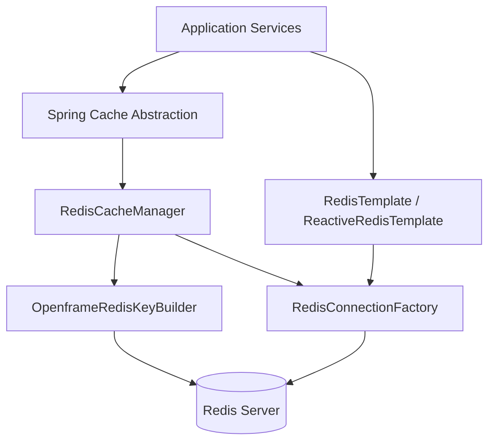
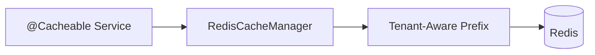
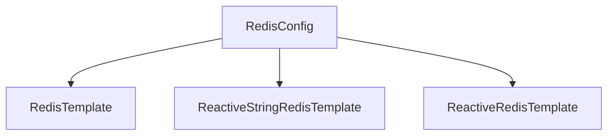
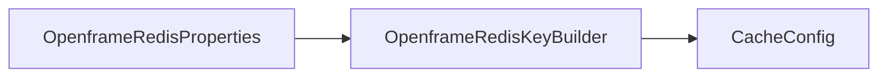

# Data Redis

## Overview

The **Data Redis** module provides Redis integration for the OpenFrame platform. It enables:

- Distributed caching using Spring Cache backed by Redis
- Tenant-aware cache key generation
- Synchronous and reactive Redis templates
- Centralized Redis configuration with conditional auto-configuration

This module is intentionally lightweight and focused. It acts as the caching and ephemeral data layer that complements persistent storage modules such as MongoDB and Cassandra, and supports higher-level services like API Service Core, Management Service Core, and Stream Service Core.

Redis is only enabled when explicitly configured via the `spring.redis.enabled=true` property, making this module safe to include in deployments where Redis is optional.

---

## High-Level Architecture



### Key Architectural Concepts

1. **Spring Cache Abstraction**  
   Business services use `@Cacheable`, `@CacheEvict`, and related annotations without depending directly on Redis.

2. **Tenant-Aware Key Prefixing**  
   All cache keys are automatically prefixed using `OpenframeRedisKeyBuilder` to ensure strict tenant isolation.

3. **Dual Access Model**  
   - Blocking access via `RedisTemplate`
   - Reactive access via `ReactiveRedisTemplate` and `ReactiveStringRedisTemplate`

4. **Conditional Activation**  
   The entire module is activated only when `spring.redis.enabled=true`.

---

## Core Components

The Data Redis module consists of three primary configuration classes:

- `CacheConfig`
- `RedisConfig`
- `OpenframeRedisKeyConfiguration`

Each plays a specific role in enabling Redis as a distributed cache and key-value store.

---

## Cache Configuration

**Class:** `CacheConfig`  
**Responsibility:** Configures Spring Cache to use Redis as the backing store.

### Features

- Enables Spring caching via `@EnableCaching`
- Configures a `RedisCacheManager`
- Applies default TTL policies
- Ensures JSON value serialization
- Enforces tenant-aware key prefixing

### Default Cache Behavior



### Default Settings

- **Default TTL:** 6 hours
- **Null values:** Not cached
- **Key serialization:** `StringRedisSerializer`
- **Value serialization:** `GenericJackson2JsonRedisSerializer`

### Specialized Fleet Caches

Two caches have shorter TTLs (1 hour):

- `fleetPolicyCache`
- `fleetQueryCache`

These caches store dynamic Fleet-related data (e.g., policies and queries) that may change frequently and must not remain stale for long periods.

### Tenant-Aware Prefix Strategy

The cache configuration uses:

```
computePrefixWith(cacheName -> keyBuilder.cacheKeyPrefix(null, cacheName))
```

This ensures keys follow a structure similar to:

```text
<prefix>:<cacheName>::<key>
```

This design prevents cross-tenant data leakage in shared Redis environments.

---

## Redis Configuration

**Class:** `RedisConfig`  
**Responsibility:** Provides Redis templates and enables Redis repositories.

### Conditional Activation

```text
spring.redis.enabled=true
```

If this property is not set to `true`, none of the Redis beans are created.

### Beans Provided



#### 1. RedisTemplate

- Blocking API
- String key and value serialization
- Suitable for imperative services

#### 2. ReactiveStringRedisTemplate

- Fully reactive API
- Optimized for string-based operations
- Used in WebFlux/reactive pipelines

#### 3. ReactiveRedisTemplate

- Custom serialization context
- Supports reactive access with explicit key/value serializers

### Redis Repositories

The module enables Redis repositories under:

```
com.openframe.data.repository.redis
```

This allows Spring Data Redis repositories to be defined in other modules without additional configuration.

---

## Redis Key Builder Configuration

**Class:** `OpenframeRedisKeyConfiguration`  
**Responsibility:** Registers the `OpenframeRedisKeyBuilder` bean.



### Purpose

- Centralizes Redis key naming rules
- Ensures consistent prefix formatting
- Enforces tenant isolation
- Allows customization via `OpenframeRedisProperties`

The builder is injected into `CacheConfig`, making tenant-awareness the default behavior for all caches.

---

## Multi-Tenancy Strategy

Tenant isolation is a critical requirement in OpenFrame.

The Data Redis module enforces multi-tenancy at the key level rather than through separate Redis databases.

### Key Pattern

```text
<environment>:<tenantId>:<cacheName>::<businessKey>
```

### Benefits

- Safe shared Redis cluster usage
- Environment isolation (dev, staging, prod)
- Simplified infrastructure management
- Horizontal scalability

This design aligns with tenant-scoped strategies used in MongoDB and Kafka modules across the platform.

---

## Serialization Strategy

### Keys

- Serialized as plain strings
- Deterministic and human-readable

### Values

- JSON serialized using `GenericJackson2JsonRedisSerializer`
- Compatible with polymorphic object graphs
- Safe for evolving DTO models

This allows cached DTOs and projections from higher-level modules (e.g., API Service Core) to be safely stored and retrieved.

---

## Interaction with Other Modules

Although Data Redis is infrastructure-focused, it supports multiple platform layers:

- **API Service Core** – Caches GraphQL query results and frequently accessed entities
- **Management Service Core** – Stores ephemeral computation results
- **Stream Service Core** – May use Redis for short-lived state or deduplication
- **Gateway Service Core** – Can leverage Redis-backed caching for rate limiting or metadata

The module does not contain business logic; it strictly provides reusable Redis infrastructure.

---

## Deployment Considerations

### When to Enable Redis

Enable Redis when:

- Running multiple service instances
- Needing distributed cache consistency
- Improving performance of read-heavy APIs
- Reducing load on MongoDB or Cassandra

### When to Disable Redis

Disable Redis when:

- Running local development without caching
- Debugging cache-related issues
- Running in minimal test environments

Simply omit or set:

```text
spring.redis.enabled=false
```

---

## Design Principles

The Data Redis module follows these principles:

1. **Opt-in configuration** – Nothing activates unless explicitly enabled
2. **Tenant safety by default** – Every key is prefixed
3. **Minimal surface area** – Only configuration and builders, no domain logic
4. **Compatibility-first serialization** – JSON-based, schema-evolution friendly
5. **Reactive and blocking parity** – Supports both programming models

---

## Summary

The **Data Redis** module provides the distributed caching foundation for OpenFrame. Through conditional configuration, tenant-aware key prefixing, and consistent serialization, it ensures:

- Safe multi-tenant caching
- Horizontal scalability
- Reduced database load
- Reactive and imperative support
- Environment-aware isolation

It is a foundational infrastructure module that enhances performance and scalability across the entire platform while remaining cleanly separated from business logic.