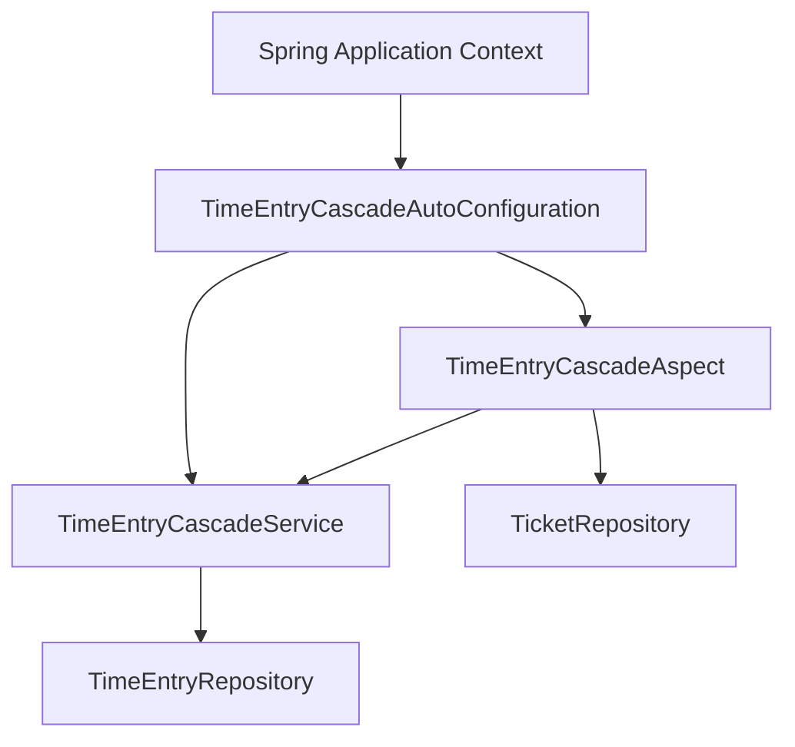
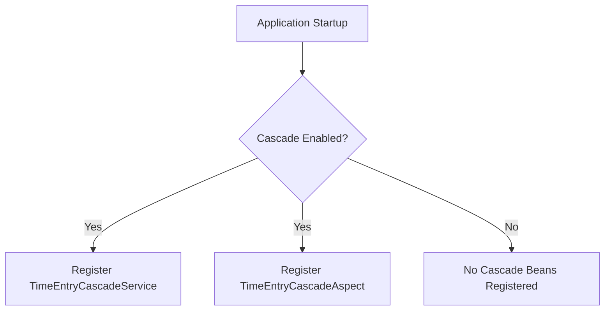
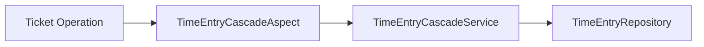
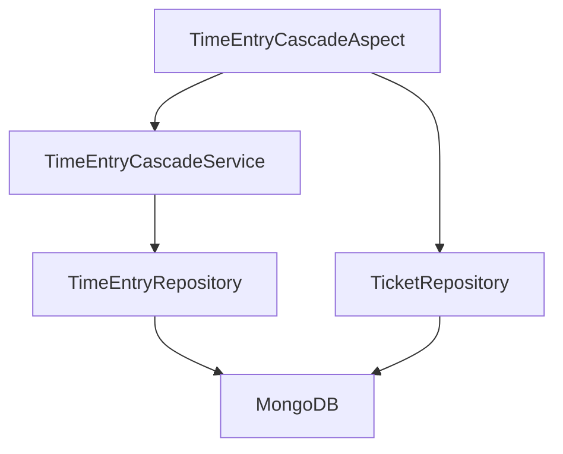
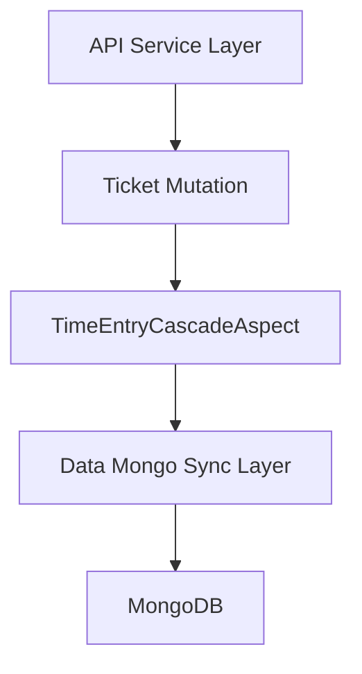

# Data Timeentry Aspect

The **Data Timeentry Aspect** module provides automatic cascade handling between time entries and their associated tickets. It ensures that when ticket state changes occur (such as deletion or updates), related time tracking records remain consistent without requiring explicit cascade logic in every service layer.

This module is implemented as a Spring Boot auto-configuration that conditionally registers an aspect and supporting service. It integrates with the Mongo-based persistence layer and operates transparently across the platform.

---

## 1. Purpose and Responsibilities

The Data Timeentry Aspect module is responsible for:

- Automatically cascading ticket-related changes to time entries
- Encapsulating cross-cutting cascade logic using Spring AOP
- Keeping ticket and time tracking data consistent
- Providing a feature toggle via configuration properties

It prevents duplicated cascade logic across controllers, services, and repositories.

---

## 2. Core Component

### TimeEntryCascadeAutoConfiguration

This is the central configuration class of the module.

**Responsibilities:**

- Conditionally enables cascade functionality
- Registers the cascade service bean
- Registers the cascade aspect bean
- Wires required repositories

**Activation Property:**

```text
openframe.timeentry.cascade.enabled=true
```

If the property is not defined, the feature is enabled by default (`matchIfMissing = true`).

---

## 3. High-Level Architecture



### Architectural Characteristics

- **Auto-configured**: Uses `@AutoConfiguration`
- **Conditionally enabled**: Uses `@ConditionalOnProperty`
- **Aspect-oriented**: Encapsulates cascade behavior outside business services
- **Repository-backed**: Operates directly on persistence layer repositories

---

## 4. Bean Registration Flow

When the application starts:



### Service Bean

```text
TimeEntryCascadeService(TimeEntryRepository)
```

Encapsulates logic for updating or cleaning up time entries when related ticket changes occur.

### Aspect Bean

```text
TimeEntryCascadeAspect(TimeEntryCascadeService, TicketRepository)
```

Intercepts relevant ticket operations and triggers cascade behavior.

---

## 5. Component Interaction Model

The cascade mechanism works as a cross-cutting concern applied to ticket operations.



### Interaction Steps

1. A ticket operation is executed (update, delete, or state change).
2. The aspect intercepts the operation.
3. The aspect determines whether cascade logic must run.
4. The cascade service updates or cleans related time entries.
5. The time entry repository persists the changes.

This keeps cascade behavior centralized and consistent.

---

## 6. Integration with the Persistence Layer

The module integrates with:

- `TicketRepository`
- `TimeEntryRepository`

These repositories are typically implemented in the Mongo sync data layer and abstract database operations.



The aspect does not directly manipulate database drivers. All persistence is delegated through repository abstractions.

---

## 7. Cross-Module Positioning

Within the broader platform architecture, Data Timeentry Aspect sits between:

- The **API service layer** (where ticket mutations originate)
- The **Data Mongo Sync layer** (where ticket and time entry repositories are implemented)



This design ensures:

- Ticket services remain clean and focused on business logic
- Cascade logic is reusable and centrally managed
- Data consistency is preserved across modules

---

## 8. Configuration and Feature Toggle

The cascade functionality can be controlled via application properties:

```text
openframe.timeentry.cascade.enabled=true
```

### Behavior

| Property Value | Result |
|---------------|--------|
| `true`        | Cascade aspect and service are registered |
| `false`       | No cascade behavior is applied |
| Not defined   | Enabled by default |

This allows safe rollout or rollback of cascade behavior without code changes.

---

## 9. Design Considerations

### Why Use an Aspect?

- Avoids embedding cascade logic inside ticket services
- Reduces duplication
- Ensures consistent enforcement
- Keeps domain services single-responsibility

### Why Auto-Configuration?

- Makes the module pluggable
- Allows reuse across services
- Supports environment-based feature control

### Why Repository-Based Cascades?

- Preserves separation between domain and persistence
- Ensures atomic consistency at the data layer

---

## 10. Summary

The **Data Timeentry Aspect** module is a lightweight but critical consistency component in the platform.

It:

- Provides automatic cascade handling between tickets and time entries
- Uses Spring Boot auto-configuration for seamless integration
- Applies AOP to encapsulate cross-cutting cascade behavior
- Integrates cleanly with repository abstractions
- Supports runtime feature toggling

By centralizing cascade logic, it improves maintainability, consistency, and modularity across the OpenFrame data architecture.
