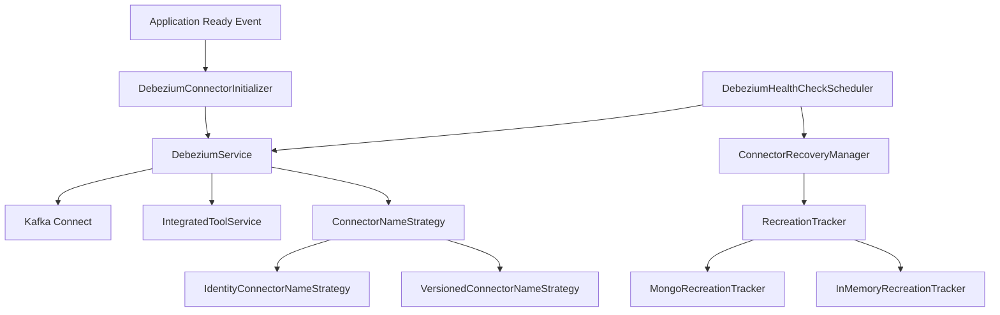
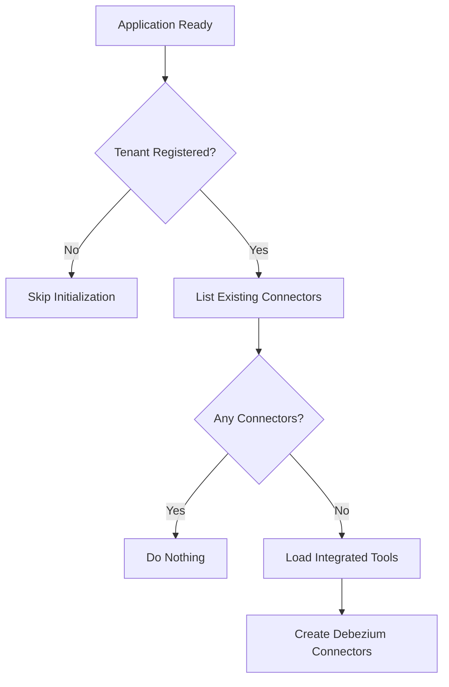
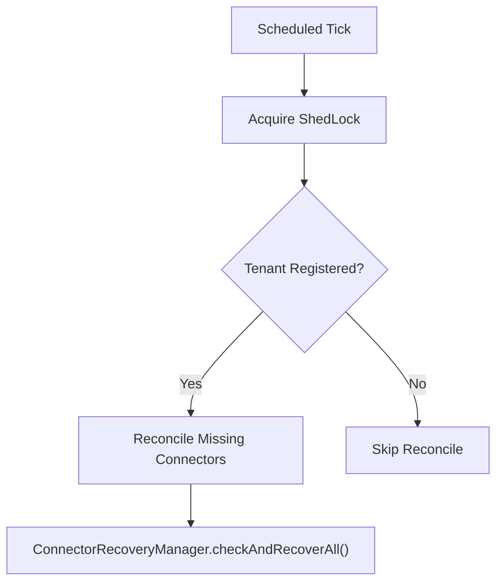
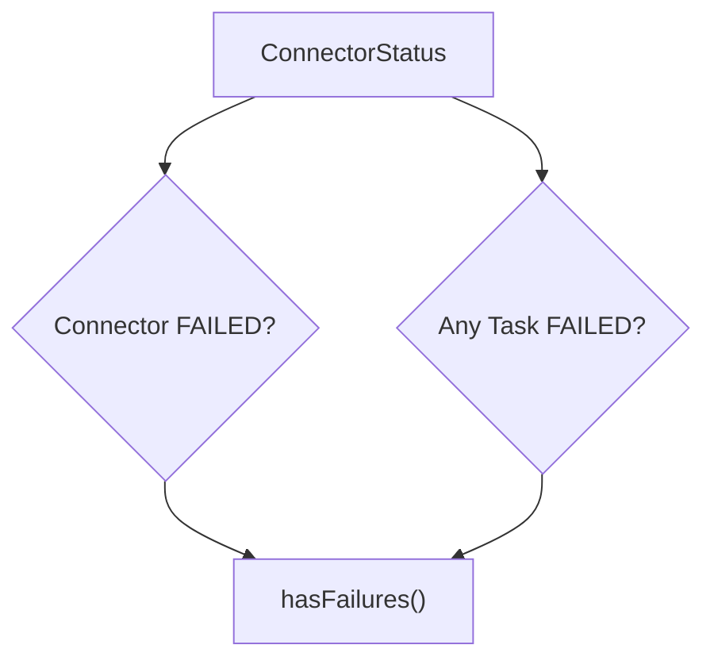
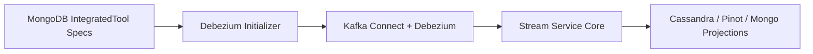

# Debezium Initializer

The **Debezium Initializer** module is responsible for lifecycle management, health monitoring, and safe recovery of Debezium connectors within the OpenFrame platform. It ensures that Kafka Connect connectors are:

- ✅ Created when missing
- ✅ Reconciled with MongoDB-backed tool definitions
- ✅ Cleaned up when orphaned
- ✅ Automatically recovered when failed
- ✅ Protected against runaway recreation loops

This module acts as the operational guardrail layer between:

- Integrated tool definitions stored in MongoDB
- Kafka Connect (running Debezium connectors)
- Stream processing services consuming CDC events

It is designed for both:

- Shared SaaS clusters
- Per-tenant dedicated clusters

---

## Architectural Overview

The Debezium Initializer operates during:

- Application startup (initial reconciliation)
- Scheduled health checks (continuous monitoring)
- Recovery workflows (controlled recreation of failed connectors)

### High-Level Architecture



---

# Core Responsibilities

## 1. Startup Initialization

Handled by:

- `DebeziumConnectorInitializer`

Triggered on `ApplicationReadyEvent` when:

```
openframe.debezium.health-check.enabled=true
```

### Responsibilities

- Prune orphaned connectors (optional)
- Initialize connectors if none exist
- Prevent initialization before tenant registration

### Initialization Flow



This ensures connectors are only created when:

- A tenant exists
- The Kafka Connect cluster is empty
- Tool definitions include Debezium specs

---

## 2. Orphan Reconciliation

Optional behavior controlled by:

```
openframe.debezium.reconcile.delete-orphans=true
```

### What Is an Orphan?

A connector whose base name:

- Does not match any known tool spec
- Represents legacy naming schemes
- Is a stale leftover version

### Safety Measures

The initializer:

- Skips deletion if Kafka Connect returns an empty list (prevents accidental full wipe on transient failure)
- Uses ALL tools (enabled + disabled) to compute valid base names
- Runs before initialization logic

This prevents:

- Accidental cluster-wide deletion
- Race conditions during startup

---

## 3. Scheduled Health Monitoring

Handled by:

- `DebeziumHealthCheckScheduler`

Configured via:

```
openframe.debezium.health-check.interval=300000
```

Uses **ShedLock** for distributed locking across replicas.

### Health Check Responsibilities

1. Reconcile missing connectors
2. Detect failed tasks
3. Trigger recovery workflows

### Health Check Flow



The scheduler prevents:

- Duplicate recreation across replicas
- Overlapping recovery attempts

---

# Connector Naming Strategies

Connector naming determines how Kafka Connect offsets and namespaces behave.

The module supports two strategies.

---

## Identity Connector Name Strategy

Default strategy.

Class:

- `IdentityConnectorNameStrategy`

Behavior:

- Uses connector name exactly as defined in tool configuration
- No version suffix
- Backward compatible

### Example

```
tool-events
```

Use case:

- Per-tenant clusters
- Systems that do not require recreation-based recovery

---

## Versioned Connector Name Strategy

Activated via:

```
openframe.debezium.recovery.recreation.enabled=true
```

Class:

- `VersionedConnectorNameStrategy`

### Behavior

Connectors are named:

```
<baseName>_vN
```

Example:

```
tool-events_v1
tool-events_v2
```

When recreation occurs:

- A new version is created
- Older versions are removed
- Offsets remain isolated

### Why Versioning Matters

Kafka Connect retains offsets per connector name.

Versioning enables:

- Clean recreation
- No offset collision
- Safe recovery of stuck connectors

---

# Failure Detection

Failure state is modeled by:

- `ConnectorStatus`
- `ConnectorStatus.TaskStatus`

### Failure Detection Capabilities

The DTO supports:

- Connector-level failure detection
- Task-level failure detection
- Failure trace extraction
- First-line error summary

### Failure Logic



Helper methods:

- `isConnectorFailed()`
- `hasFailedTasks()`
- `getFailureTraces()`
- `getFirstFailureTrace()`

These methods enable structured alerting and logging.

---

# Controlled Recreation

To prevent runaway restart loops, the module implements a **rolling-window recreation limiter**.

Interface:

- `RecreationTracker`

Implementations:

- `MongoRecreationTracker`
- `InMemoryRecreationTracker`

---

## Mongo Recreation Tracker

Used in shared clusters.

Behavior:

- Stores recreation events in MongoDB
- Counts recreations within last hour
- Enforces limit
- Deletes stale entries

Fail-closed behavior:

- If Mongo is unavailable → recreation denied

This prevents runaway behavior during partial outages.

---

## In-Memory Recreation Tracker

Activated via:

```
openframe.debezium.recovery.recreation.in-memory=true
```

Used in per-tenant clusters.

Characteristics:

- JVM-local counter
- No Mongo dependency
- Resets on restart
- Soft cap under multi-replica deployments

Designed for isolated tenant deployments.

---

# Connector Specs Utility

Class:

- `ConnectorSpecs`

Purpose:

Centralizes handling of raw `Object[]` connector definitions stored in:

```
IntegratedTool.getDebeziumConnectors()
```

### Responsibilities

- Safe casting
- Extract connector name
- Extract config map
- Build connector payload
- Ensure name consistency inside config

### Payload Structure

```text
{
  "name": "connectorName",
  "config": {
    "name": "connectorName",
    ... other Debezium config ...
  }
}
```

Debezium requires the connector name to match in both places.

---

# Observability

The module centralizes logging prefix via:

- `DebeziumLog.PREFIX`

Example:

```
[DEBEZIUM]
```

This prefix is used by Grafana/Loki alert rules.

Maintaining this constant ensures:

- Stable alerting queries
- Reliable operational dashboards

---

# Multi-Tenancy Considerations

The module integrates with:

- `TenantIdProvider`
- `IntegratedToolService`

Safety rules:

- No connector creation before tenant registration
- No orphan deletion if specs unknown
- No mass recreation during transient Kafka Connect outage

This ensures:

- Safe SaaS operation
- Clean per-tenant isolation
- Predictable behavior under failure

---

# Interaction with the Broader Platform

The Debezium Initializer connects the following layers:



It forms the foundation of:

- CDC ingestion
- Event streaming
- Real-time synchronization pipelines

Without this module:

- Connectors may drift
- Failed tasks remain stuck
- Orphaned connectors accumulate
- Recovery loops may spiral

---

# Summary

The **Debezium Initializer** module provides:

- Startup reconciliation
- Health monitoring with distributed locking
- Versioned naming for safe recreation
- Runaway protection with recreation limiting
- Multi-tenant safety guarantees
- Observability alignment

It transforms Debezium connector management from a manual operational task into a controlled, self-healing system aligned with OpenFrame's multi-tenant architecture.
