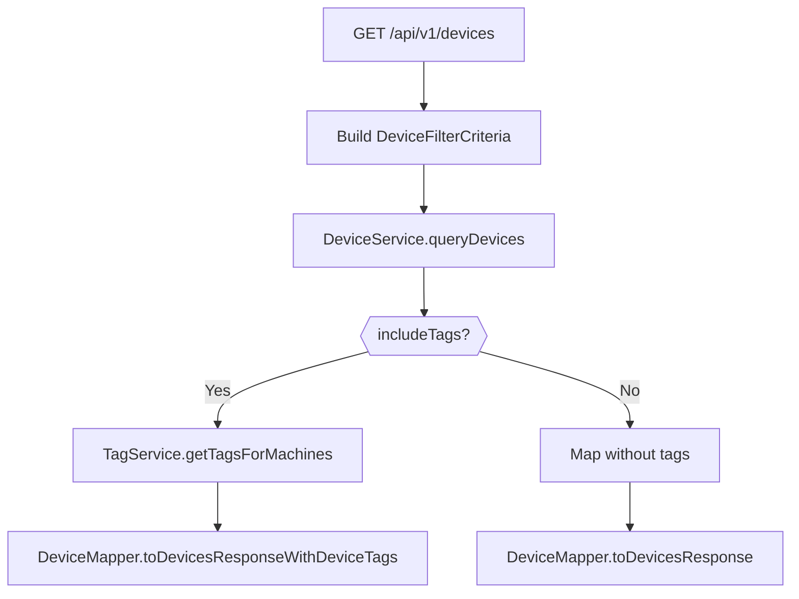
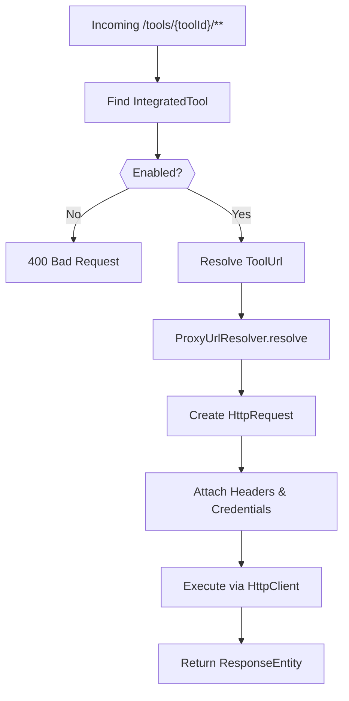
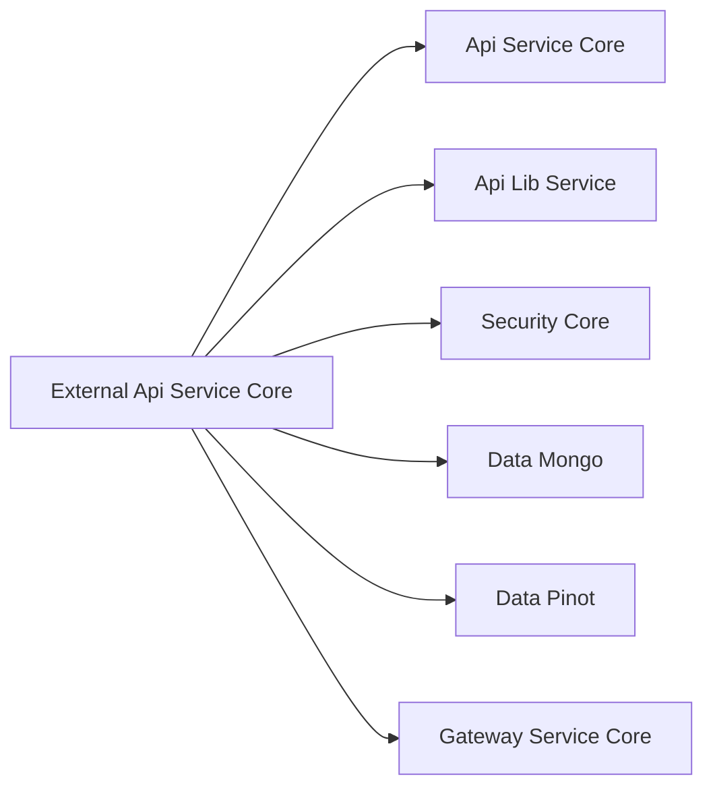

# External Api Service Core

## Overview

The **External Api Service Core** module exposes a secure, API key–based REST interface to the OpenFrame platform. It is designed for third-party integrations, automation scripts, and partner systems that require programmatic access to devices, events, logs, organizations, and integrated tools.

Unlike the internal GraphQL-based API in `api-service-core`, this module provides a versioned REST API (`/api/v1/**`) with:

- API key authentication via `X-API-Key`
- Cursor-based pagination
- Structured filtering and sorting
- OpenAPI/Swagger documentation
- Tool API proxying for external integrations

It acts as a façade over core domain services from:

- `api-service-core`
- `api-lib-service`
- `data-mongo-*`
- `data-pinot`
- `security-core`

---

## High-Level Architecture

The External Api Service Core follows a layered architecture:


### Request Flow

1. **Authentication** – API key validated upstream (typically by Gateway + security modules).
2. **Controller Layer** – REST controllers parse query parameters and headers.
3. **Service Layer** – Delegates to domain services from core modules.
4. **Mapping Layer** – Internal entities mapped to external DTOs.
5. **Response** – Paginated, filtered REST response returned.

---

## OpenAPI Configuration

### `OpenApiConfig`

The `OpenApiConfig` class configures:

- API metadata (title, version, contact, license)
- API key security scheme (`ApiKeyAuth`)
- Server base path (`/external-api`)
- Grouped API paths:
  - Included: `/tools/**`, `/api/v1/**`
  - Excluded: `/actuator/**`, `/api/core/**`

### Authentication Model

All endpoints require an API key in the header:

```text
X-API-Key: ak_keyId.sk_secretKey
```

Security scheme:

- Type: `APIKEY`
- Location: HTTP header
- Header name: `X-API-Key`

---

## Core REST Controllers

### 1. DeviceController

**Base Path:** `/api/v1/devices`

Provides:

- `GET /` – List devices (filter, search, pagination)
- `GET /{machineId}` – Get device details
- `GET /filters` – Get filter options with counts
- `PATCH /{machineId}` – Update device status

#### Features

- Filter by:
  - Status
  - Device type
  - OS type
  - Organization
  - Tag key/value
- Cursor-based pagination via `CursorPaginationCriteria`
- Sorting via `SortInput`
- Optional tag enrichment (`includeTags=true`)



---

### 2. EventController

**Base Path:** `/api/v1/events`

Provides:

- `GET /` – List events
- `GET /{id}` – Get event by ID
- `POST /` – Create event
- `PUT /{id}` – Update event
- `GET /filters` – Retrieve filter options

#### Filtering

- User IDs
- Event types
- Date range
- Search
- Sorting

Events are delegated to `EventService`, and results are mapped using `EventMapper`.

---

### 3. LogController

**Base Path:** `/api/v1/logs`

Provides:

- `GET /` – List logs
- `GET /filters` – Available log filter values
- `GET /details` – Retrieve detailed log entry

#### Data Sources

Log queries typically rely on:

- Indexed event/log storage (e.g., Apache Pinot)
- Cursor-based pagination
- Structured filtering via `LogFilterCriteria`

`LogDetailsResponse` includes:

- Tool event ID
- Tool type
- Event type
- Severity
- Summary and content
- Timestamp (UTC)

---

### 4. OrganizationController

**Base Path:** `/api/v1/organizations`

Provides full CRUD operations:

- `GET /` – List organizations
- `GET /{id}` – Get by database ID
- `GET /by-organization-id/{organizationId}` – Get by business ID
- `POST /` – Create organization
- `PUT /{id}` – Update organization
- `PATCH /{id}/status` – Change status (ACTIVE / ARCHIVED)
- `GET /{id}/can-archive` – Archive pre-check

#### Archive Protection

Archiving is blocked if:

- Organization contains active devices

Validation is delegated to `OrganizationService` and `OrganizationCommandService`.

---

### 5. ToolController

**Base Path:** `/api/v1/tools`

Provides:

- `GET /` – List integrated tools
- `GET /filters` – Tool filter options

Filter options:

- Enabled flag
- Tool type
- Category
- Platform category

Uses `ToolService` and maps results via `ToolMapper`.

---

### 6. IntegrationController (Tool Proxy)

**Base Path:** `/tools/{toolId}/**`

The IntegrationController enables HTTP proxying to integrated third-party tools.

This allows external API clients to:

- Access upstream tool APIs
- Reuse stored credentials
- Avoid exposing internal tool URLs

---

## RestProxyService

`RestProxyService` is the core of tool API forwarding.

### Responsibilities

1. Resolve tool by key (`IntegratedToolRepository`)
2. Validate tool is enabled
3. Resolve API URL (`ToolUrlService`)
4. Build authentication headers
5. Forward request via Apache HttpClient
6. Return upstream status + body



### Supported Authentication Modes

Based on `APIKeyType`:

- `HEADER` – Custom header key/value
- `BEARER_TOKEN` – `Authorization: Bearer <token>`
- `NONE` – No credentials

Timeout configuration:

- Connection request timeout: 10 seconds
- Response timeout: 60 seconds

---

## DTO Design

The module defines external-facing DTOs that decouple internal domain models from REST responses.

### Categories

- Device DTOs (`DeviceResponse`, `DevicesResponse`, `DeviceTagResponse`)
- Event DTOs (`EventResponse`, `EventsResponse`)
- Log DTOs (`LogResponse`, `LogDetailsResponse`, `LogsResponse`)
- Organization DTOs (`OrganizationsResponse`)
- Tool DTOs (`ToolResponse`, `ToolsResponse`, `ToolUrlResponse`)
- Filter DTOs (e.g., `DeviceFilterResponse`, `LogFilterResponse`)

### Pagination Model

All list endpoints use:

- `PageInfo` (cursor-based)
- `limit` (1–100)
- `cursor` (opaque value)

This enables stateless, scalable pagination across distributed systems.

---

## Security Model

The External Api Service Core relies on:

- API key validation
- Tenant scoping (via headers injected upstream)
- Role/permission checks enforced in core services

Headers typically available to controllers:

- `X-User-Id`
- `X-API-Key-Id`

These are injected after API key validation and used for logging, auditing, and scoping.

---

## Error Handling Strategy

Standard HTTP status codes are used:

- `200` – Success
- `201` – Created
- `204` – No content
- `400` – Validation error
- `401` – Invalid/missing API key
- `403` – Forbidden
- `404` – Not found
- `409` – Conflict (e.g., archive constraint)
- `429` – Rate limit exceeded
- `500` – Internal error

Errors return structured `ErrorResponse` bodies.

---

## Interaction with Other Modules

The External Api Service Core is a thin REST façade over internal services.



- **Api Service Core** – Business logic
- **Api Lib Service** – Shared service contracts
- **Security Core** – JWT & API key validation
- **Data Modules** – MongoDB, Pinot, Redis
- **Gateway Service Core** – Routing, rate limiting

---

## Design Principles

1. **Separation of Concerns** – Controllers are thin; services handle logic.
2. **DTO Isolation** – External representations are decoupled from internal entities.
3. **Cursor Pagination** – Scalable and consistent across APIs.
4. **Tool Abstraction** – Proxy-based integration model.
5. **OpenAPI First** – Fully documented REST contract.

---

## Summary

The **External Api Service Core** module provides:

- A stable, versioned REST API (`/api/v1`)
- API key–secured access to OpenFrame resources
- Rich filtering, sorting, and pagination
- Integrated tool API proxying
- OpenAPI documentation for third-party developers

It serves as the official external integration boundary of the OpenFrame platform, enabling automation, ecosystem integrations, and partner extensions while preserving internal architecture boundaries.
