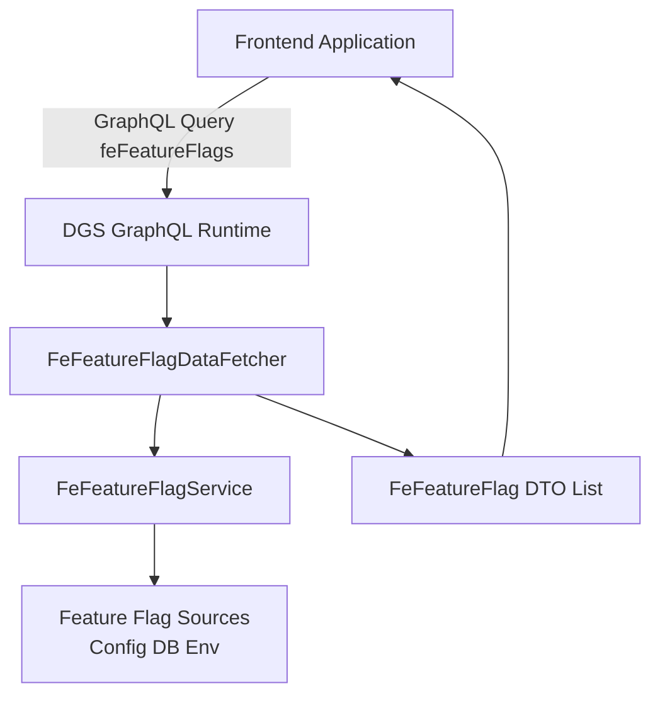
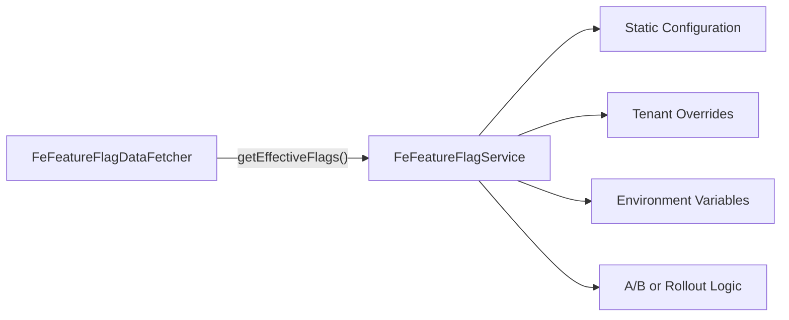

# Fe Feature Flags

## Overview

The **Fe Feature Flags** module provides a lightweight, GraphQL-based feature flag mechanism for frontend clients in the OpenFrame platform. It exposes runtime-evaluated feature toggles that allow the UI to dynamically enable or disable functionality without requiring frontend redeployments.

This module integrates with the Netflix DGS GraphQL framework and relies on a `FeFeatureFlagService` (provided elsewhere in the system) to compute the effective feature flag state.

At a high level, Fe Feature Flags:

- Exposes a GraphQL query (`feFeatureFlags`) for frontend consumption.
- Wraps feature flag state into a simple DTO (`FeFeatureFlag`).
- Auto-configures itself when GraphQL (DGS) is present.
- Delegates flag evaluation to a dedicated service layer.

---

## Architecture Overview



### Flow Summary

1. The frontend issues a GraphQL query: `feFeatureFlags(names: [String])`.
2. The DGS runtime routes the query to `FeFeatureFlagDataFetcher`.
3. The data fetcher calls `FeFeatureFlagService#getEffectiveFlags()`.
4. The resulting map of flag names to boolean states is transformed into a list of `FeFeatureFlag` objects.
5. The frontend receives a structured list of feature flags and their enabled state.

---

## Core Components

### 1. Fe Feature Flag

**Component:**  
`deps.openframe-oss-lib.openframe-fe-feature-flags.src.main.java.com.openframe.featureflags.FeFeatureFlag.FeFeatureFlag`

This is a simple DTO representing a single frontend feature flag.

#### Structure

- `name` (String) — Unique identifier of the feature flag.
- `enabled` (boolean) — Whether the feature is enabled.

#### Responsibilities

- Acts as a GraphQL response type.
- Encapsulates feature state in a frontend-friendly format.
- Serves as a contract between backend and UI.

Because it uses Lombok annotations (`@Data`, `@Builder`, etc.), it is concise and immutable-friendly when constructed via the builder.

---

### 2. Fe Feature Flag Data Fetcher

**Component:**  
`deps.openframe-oss-lib.openframe-fe-feature-flags.src.main.java.com.openframe.featureflags.FeFeatureFlagDataFetcher.FeFeatureFlagDataFetcher`

This is the GraphQL entry point for retrieving feature flags.

#### Key Annotations

- `@DgsComponent` — Registers the class as a DGS GraphQL component.
- `@DgsQuery` — Exposes the `feFeatureFlags` query.
- `@RequiredArgsConstructor` — Injects `FeFeatureFlagService`.

#### Query Method

```java
@DgsQuery
public List<FeFeatureFlag> feFeatureFlags(@InputArgument List<String> names)
```

#### Behavior

1. Calls `featureFlagService.getEffectiveFlags()` to retrieve all evaluated flags.
2. If `names` is:
   - `null` or empty → returns all flags.
   - Provided → returns only the requested subset.
3. For each requested flag name:
   - Builds a `FeFeatureFlag`.
   - Defaults to `false` if the flag does not exist.

This ensures:

- Safe defaults (unknown flags are disabled).
- Predictable frontend behavior.
- Minimal coupling between frontend and backend flag definitions.

---

### 3. Fe Feature Flag Auto Configuration

**Component:**  
`deps.openframe-oss-lib.openframe-fe-feature-flags.src.main.java.com.openframe.featureflags.FeFeatureFlagAutoConfiguration.FeFeatureFlagAutoConfiguration`

This class enables automatic integration into Spring Boot applications.

#### Key Annotations

- `@AutoConfiguration` — Enables Spring Boot auto-configuration.
- `@ConditionalOnClass(DgsComponent.class)` — Activates only when DGS is present.
- `@EnableConfigurationProperties(FeFeatureFlagProperties.class)` — Enables feature flag configuration binding.
- `@ComponentScan` — Scans for Fe Feature Flags components.

#### Purpose

- Automatically wires the data fetcher and related beans.
- Ensures the module activates only in GraphQL-enabled environments.
- Keeps integration friction minimal for service modules.

---

## GraphQL Contract

### Query

```graphql
query {
  feFeatureFlags(names: ["newDashboard", "aiAssistant"]) {
    name
    enabled
  }
}
```

### Response

```json
[
  { "name": "newDashboard", "enabled": true },
  { "name": "aiAssistant", "enabled": false }
]
```

### Design Characteristics

- Supports partial queries (only specific flags).
- Returns deterministic output.
- Provides a stable contract for frontend teams.

---

## Runtime Evaluation Model

The Fe Feature Flags module does not define how flags are computed. Instead, it delegates evaluation to `FeFeatureFlagService`.



### Benefits of Delegation

- Clear separation of concerns.
- Swappable evaluation strategies.
- Centralized feature toggle logic.
- Multi-tenant awareness (if implemented in the service).

---

## Integration in the OpenFrame Platform

Fe Feature Flags is typically consumed by:

- Frontend applications (e.g., OpenFrame UI).
- Admin panels for staged feature rollouts.
- AI-related UI capabilities gated by experimentation.

It fits into the broader architecture as:

- A backend GraphQL adapter layer.
- A runtime configuration control point.
- A safe rollout mechanism for new features.

---

## Design Principles

### 1. Backend-Driven UI Control
Frontend capabilities are centrally controlled from the backend.

### 2. Safe Defaults
Unknown or missing flags default to `false`, preventing accidental feature exposure.

### 3. GraphQL-Native Exposure
The module integrates directly with DGS, aligning with OpenFrame's GraphQL-first API architecture.

### 4. Minimal Surface Area
Only three primary components:

- DTO (`FeFeatureFlag`)
- Data fetcher (`FeFeatureFlagDataFetcher`)
- Auto-configuration (`FeFeatureFlagAutoConfiguration`)

This keeps the module easy to reason about and extend.

---

## Extensibility Considerations

Future enhancements could include:

- Role-based feature flags.
- Tenant-scoped feature sets.
- Percentage-based rollouts.
- Audit logging of flag changes.
- Integration with external feature flag systems.

The current architecture already supports these through the abstraction provided by `FeFeatureFlagService`.

---

## Summary

The **Fe Feature Flags** module provides a clean, minimal, and GraphQL-native mechanism for delivering backend-controlled feature toggles to frontend applications.

It:

- Auto-configures in DGS-enabled environments.
- Exposes a simple, stable GraphQL contract.
- Delegates logic to a service abstraction.
- Enables safe and scalable feature rollout strategies.

This makes it a foundational building block for controlled UI evolution across the OpenFrame ecosystem.
