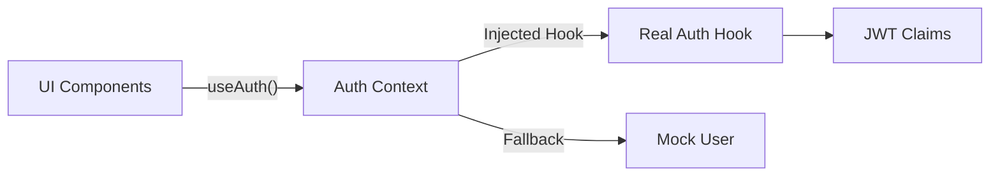
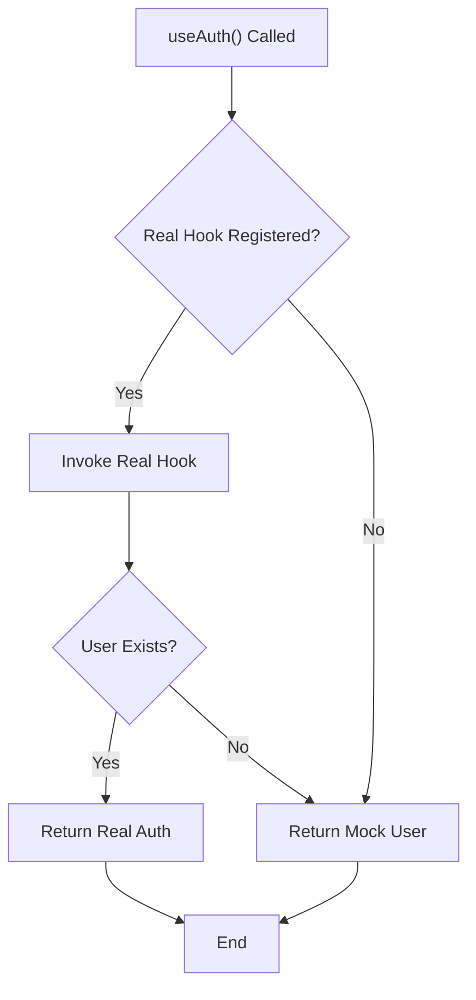
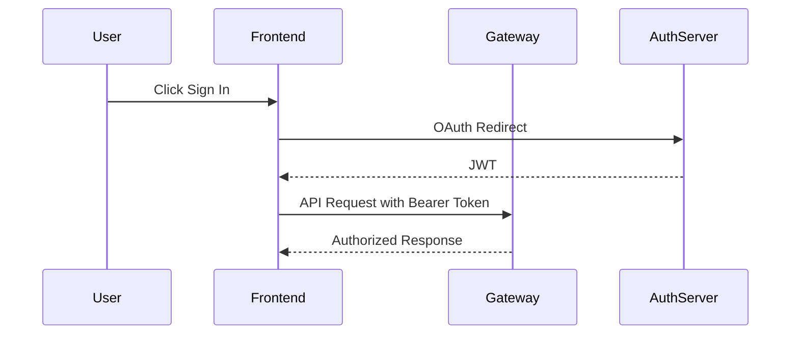

# Auth Context

The **Auth Context** module provides the frontend authentication abstraction layer for OpenFrame OSS. It defines the shared authentication types, JWT contract, and a pluggable React context that can operate in both:

- ✅ Full application mode (real authentication hook injected)
- ✅ UI kit / isolated component mode (mock fallback user)

This design allows the frontend component library to remain reusable and decoupled from any specific authentication provider while still supporting real OAuth / SSO flows in production.

---

## Purpose

The Auth Context module is responsible for:

1. Defining the canonical **authentication data structures**.
2. Providing a **React context interface** for consuming authentication state.
3. Supporting **runtime injection of a real authentication hook**.
4. Providing a **safe fallback stub implementation** for development and UI environments.

Core components:

- `AuthContextType` (stub version in `auth-stub.tsx`)
- `AuthContextType` (typed contract in `types/auth.ts`)
- `JWTClaims`

---

## High-Level Architecture

The Auth Context module acts as a thin abstraction between UI components and the actual authentication implementation.



### Key Principle

> UI components depend on the **Auth Context contract**, not on any specific authentication provider.

This enables:

- Reusable UI packages
- Embeddable components
- Storybook / isolated rendering
- Test environments without OAuth configuration

---

## Core Types

### AuthUser

Represents the authenticated user in the frontend.

```typescript
export interface AuthUser {
  id: string
  email: string
  name: string
  avatar_url?: string
  role: 'user' | 'super_admin'
  provider: string
}
```

Important characteristics:

- `role` determines privilege level
- `provider` identifies SSO source
- Designed to map directly from backend user + JWT

---

### AuthContextType (Frontend Contract)

This is the primary interface consumed by UI components.

```typescript
export interface AuthContextType {
  user: AuthUser | null
  status: 'loading' | 'authenticated' | 'unauthenticated'
  isLoading: boolean
  isSuperAdmin: boolean
  signInWithSSO: (provider: 'google' | 'slack' | 'microsoft') => Promise<void>
  signOut: () => Promise<void>
}
```

Responsibilities:

- Encapsulates authentication state
- Provides role awareness (`isSuperAdmin`)
- Exposes SSO login entry point
- Provides logout capability

All frontend modules (navigation, chat, tickets, settings, etc.) should consume authentication state via this interface only.

---

### JWTClaims

Defines the expected JWT payload structure.

```typescript
export interface JWTClaims {
  sub: string
  email: string
  user_role?: 'user' | 'super_admin'
  aud: string
  exp: number
  iat: number
  iss: string
  [key: string]: any
}
```

Key claims:

- `sub` → user identifier
- `email` → canonical identity
- `user_role` → role mapping
- `exp` / `iat` → token validity
- `iss` / `aud` → issuer and audience validation

The frontend does not validate signatures — that is handled by the backend and gateway — but it relies on these claims for UI logic and authorization rendering.

---

## Stub Implementation (Auth Stub)

The `auth-stub.tsx` file provides a fallback implementation used when no real authentication hook is registered.

### Default Context

```typescript
const AuthContext = createContext<AuthContextType>({
  user: null,
  isLoading: false,
});
```

### Runtime Hook Injection

```typescript
let realUseAuth: (() => any) | null = null;

export function setRealAuthHook(authHook: () => any) {
  realUseAuth = authHook;
}
```

This enables:

- The main application to inject its real authentication logic
- The UI library to remain standalone

### useAuth Resolution Flow



Behavior summary:

1. If a real hook is registered, attempt to use it.
2. If it returns a valid user, return real auth.
3. If it fails or is missing, return a mock user.

---

## AuthProvider Component

The stub includes a simple provider:

```typescript
export function AuthProvider({ children }: { children: React.ReactNode }) {
  return (
    <AuthContext.Provider value={{ user: { id: 'mock-user-id', name: 'Mock User' }, isLoading: false }}>
      {children as any}
    </AuthContext.Provider>
  );
}
```

This ensures:

- UI components always have a defined context
- Storybook / test environments do not break
- Embeddable builds remain functional

---

## Integration With the Backend

Although the Auth Context module lives in the frontend, it aligns with:

- Authorization Service (OAuth2 / OIDC)
- Gateway Service (JWT validation)
- API Service (role-aware endpoints)

### End-to-End Flow



The Auth Context module is responsible only for:

- Holding the authenticated user state
- Exposing sign-in and sign-out hooks
- Enabling role-based rendering

Security enforcement is handled server-side.

---

## Role Awareness and Authorization Rendering

The module provides lightweight client-side authorization logic:

- `user.role`
- `isSuperAdmin`

Typical usage pattern:

```typescript
const { user, isSuperAdmin } = useAuth()

if (isSuperAdmin) {
  // Render admin-only controls
}
```

Important:

> Client-side role checks are for UI rendering only.
> Server-side services must always enforce authorization.

---

## Design Benefits

### 1. Decoupled Authentication

UI does not depend on:

- OAuth implementation details
- JWT parsing logic
- Backend session strategy

### 2. Embeddable Frontend Components

The same component library can run in:

- Full OpenFrame app
- Embedded environments
- Design systems
- Storybook

### 3. Safe Defaults

Fallback mock user ensures:

- No null crashes
- Stable rendering in isolated environments
- Predictable development behavior

---

## When to Extend This Module

Extend the Auth Context module when:

- Adding new SSO providers
- Introducing additional role types
- Adding tenant-aware claims
- Supporting feature-flag-based access control

Avoid extending it for:

- Permission matrix logic (belongs in backend)
- Token validation logic (belongs in gateway)
- Complex policy evaluation (belongs in authorization service)

---

## Summary

The **Auth Context** module is the frontend authentication abstraction layer of OpenFrame OSS.

It provides:

- Typed authentication contracts
- JWT claim structure
- Role-aware user model
- Pluggable real authentication hook
- Mock fallback for UI environments

By separating the authentication contract from its implementation, the module ensures that the frontend remains modular, reusable, and compatible with multiple authentication strategies while maintaining a clean and predictable developer experience.
