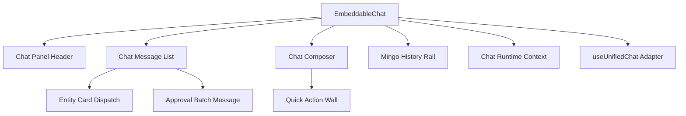
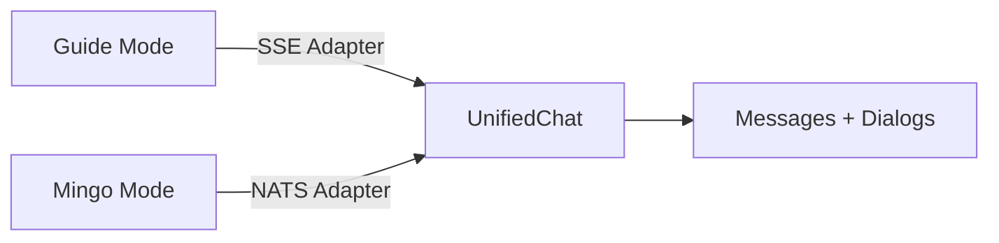
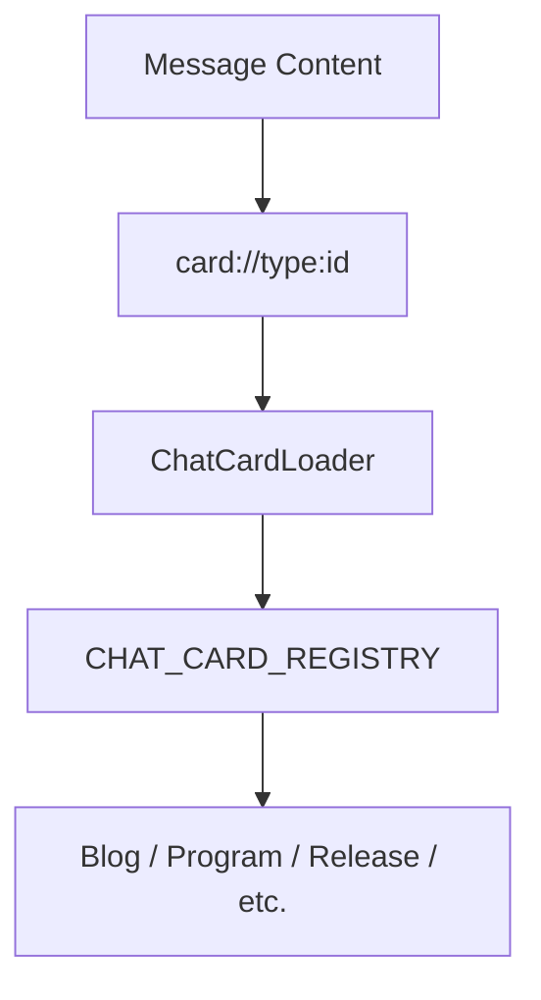
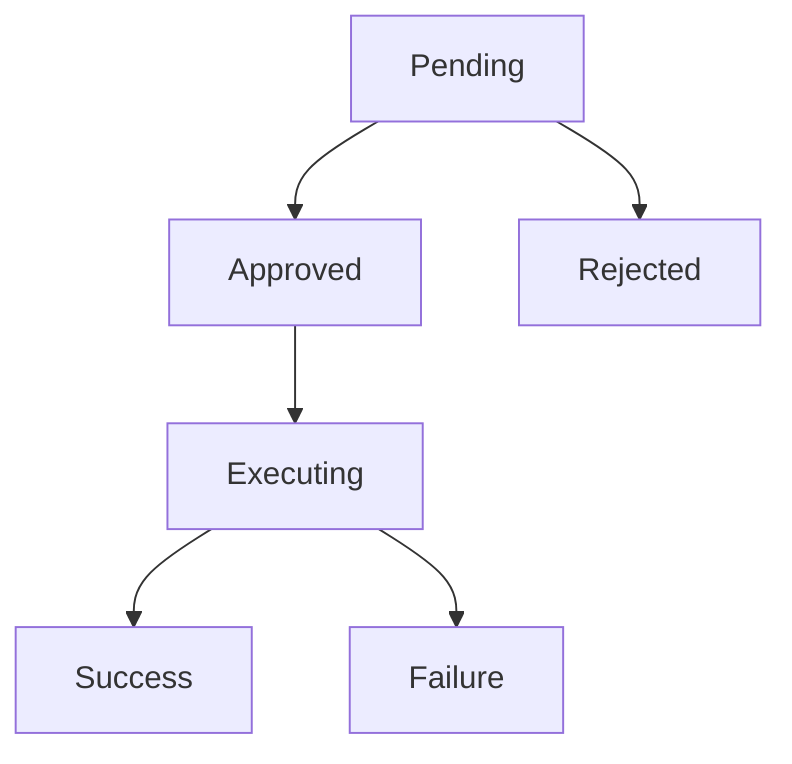
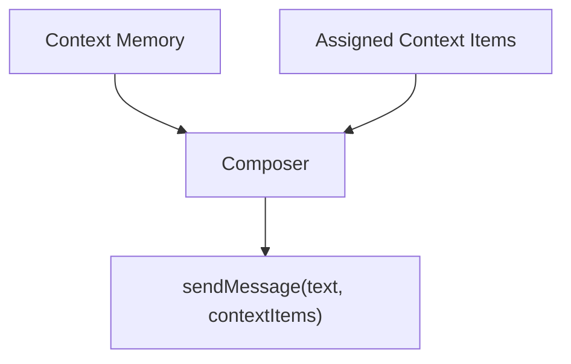
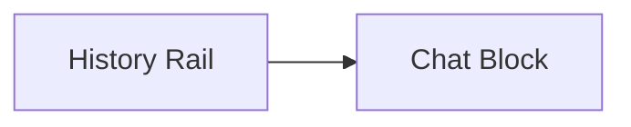

# Chat Components

The **Chat Components** module provides the full UI layer for OpenFrame’s conversational experiences (Mingo for technicians, Fae for end-clients, and embedded AI assistants). It includes:

- The chat panel shell (drawer or embedded)
- Message rendering and streaming support
- Approval workflows (tool execution gating)
- Context-aware composition (entity picker + memory)
- Quick action systems
- Entity card rendering inside messages
- History rails, archives, and dialog management

This module is UI-focused and runtime-driven. It consumes platform capabilities (navigation, identity, endpoints) via the Chat Runtime context and delegates transport logic to adapters (SSE for Guide mode, NATS for Mingo mode).

---

## 1. Architectural Overview

At a high level, Chat Components sits between:

- **Chat Runtime Context** (navigation, endpoints, identity)
- **Chat Adapters** (Guide/SSE, Mingo/NATS)
- **UI Primitives** (Tag, Button, Drawer, ActionsMenu, etc.)

### High-Level Component Topology

**Key idea:** `EmbeddableChat` is the orchestrator. Everything else is either a surface (header, list, composer), a rendering subsystem (entity cards, approval blocks), or a supporting UI structure (history rail, quick actions).

---

## 2. Core Orchestrator: EmbeddableChat

`EmbeddableChat` is the primary entry point for all chat experiences.

### Responsibilities

- Controls open/close state (drawer or shell-less mode)
- Switches between **Guide** and **Mingo** modes
- Connects to transport adapters via `useUnifiedChat`
- Wires runtime navigation via `useRequiredChatRuntime`
- Manages:
  - Dialog selection
  - Archive view
  - Rename/archive/restore flows
  - Attachment state
  - Context picker state
  - Quick action preview

### Mode Model

- **Guide Mode**: Stateless guidance chat (how-to, configuration help)
- **Mingo Mode**: Persistent dialog-based operational chat (tickets, tools, execution)

Each mode keeps independent state and message history.

---

## 3. Message Rendering System

### ChatMessageList

`ChatMessageList` renders the conversation thread:

- User messages
- Assistant messages
- Streaming responses
- Inline entity cards
- Tool execution blocks
- Context chips

It is optimized to avoid unnecessary re-renders during streaming by:

- Stabilizing assistant icon elements
- Caching timestamps
- Memoizing message-level rendering

### Entity Card Dispatch

Entity cards are rendered via a central registry in `entity-cards/dispatch`.

There are two card modes:

- **No-fetch**: `ChatRef` contains everything needed (e.g., GitHub, Slack)
- **Fetch**: Card fetches full entity data before rendering (e.g., blog, release)

All cards are pure presentation components and receive:

- `href`
- `target`
- `rel`
- Resolved new-tab behavior

Navigation is unified through `handleChatNavClick`.

---

## 4. Approval Workflow: ApprovalBatchMessage

`ApprovalBatchMessage` renders tool execution requests that require user approval.

It supports two visual variants:

- `admin` – full technical details (commands, arguments, results)
- `client` – simplified end-user card (explanation + approve/reject)

### Execution State Model

Features:

- Expandable argument and result blocks
- Execution status icons (spinner, check, error)
- Resolver identity display ("Approved by {name}")
- Footer action gating

This component is critical for secure tool orchestration in Mingo mode.

---

## 5. Composition System: ChatComposer

`ChatComposer` provides the full input system for sending messages.

### Capabilities

- Text input with streaming control
- Slash commands (Guide mode)
- Attachment uploads (Guide mode only)
- Context picker (Mingo mode only)
- Context memory strip
- Model usage display

### Context Model

There are two context layers:

- **Context Memory**: Ambient navigation-derived entities
- **Assigned Context**: Explicit user-selected items via picker or `@` mentions

The composer ensures:

- Mention tokens stay synchronized with chip state
- Context is cleared when dialog or mode changes
- Attachments are appended as markdown blocks

---

## 6. Quick Action System

Quick actions are rendered via:

- `QuickActionChipButton`
- `QuickActionWall`

They are used in:

- Guide empty state
- Mingo welcome state
- Marketing and embedded demos

### Theming Model

Quick actions support:

- Accent theming (agent-based or custom)
- Optional lozenge classification (e.g., IT / SEC)
- Animated marquee walls (horizontal or brick-stack mode)

The wall system adapts to container width and ensures:

- Infinite scroll when content overflows
- Deterministic repetition
- No layout jumps between skeleton and loaded state

---

## 7. History & Archive System

### MingoChatHistory

- Groups dialogs into Today / Yesterday / Older
- Supports rename and archive via row menu
- Infinite scroll via intersection observer

### MingoHistoryRail

In wide layouts, history is hoisted into a persistent rail:

Features:

- "My Chats" vs "All Chats" scope selector
- Start New Chat button
- Error and loading states
- Archive integration

### ChatArchivePage

Displays archived dialogs with:

- Standalone mode (full header + close)
- Embedded mode (rail-only rendering)

---

## 8. Header System

`ChatPanelHeader` and `ChatPanelHeaderMobile` provide:

- Back navigation
- Dialog owner avatar
- Rename/archive menu
- Archive access
- Guide-mode indicator

The header adapts to:

- Conversation view
- Empty state
- Archive view
- Guide mode
- Split vs stacked layout

---

## 9. Runtime Integration

Chat Components never hardcodes navigation or identity behavior.

Everything flows through **Chat Runtime Context**:

- Navigation decisions
- Cross-platform routing
- New-tab logic
- Agent configuration endpoints
- Attachment URLs

This guarantees:

- Identical behavior in host apps and embedded environments
- No duplication of navigation logic
- One consistent decision engine for:
  - Inline cards
  - Source chips
  - Markdown links

---

## 10. Design Principles

The Chat Components module is built around:

1. **Pure presentation components** – Cards never fetch navigation or decide routes.
2. **Single-source routing** – All links pass through runtime.
3. **Mode isolation** – Guide and Mingo state never bleed.
4. **Stable rendering under streaming** – Memoization + deterministic keys.
5. **Layout parity across surfaces** – Embedded, drawer, and marketing demos use the same primitives.
6. **Extensible registry pattern** – Adding a new chat card type requires:
   - Implementing a pure card
   - Registering it in `CHAT_CARD_REGISTRY`

---

# Summary

The **Chat Components** module is the complete UI framework for OpenFrame’s conversational interface. It unifies:

- Dialog management
- Streaming message rendering
- Tool approval flows
- Entity-rich inline cards
- Context-aware composition
- Quick action systems
- Adaptive layout (stacked vs split)

All while delegating transport, identity, and navigation to runtime providers.

It is the visual and interaction backbone of Mingo, Fae, and all embedded AI assistants in the OpenFrame ecosystem.
