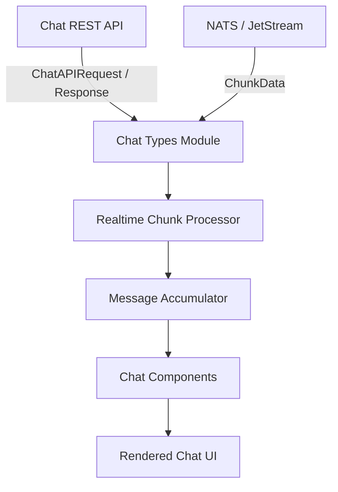
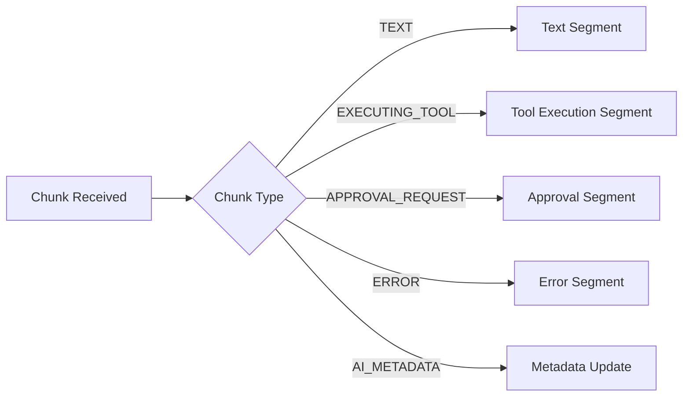
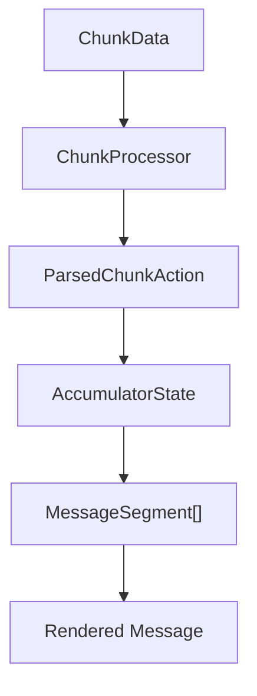
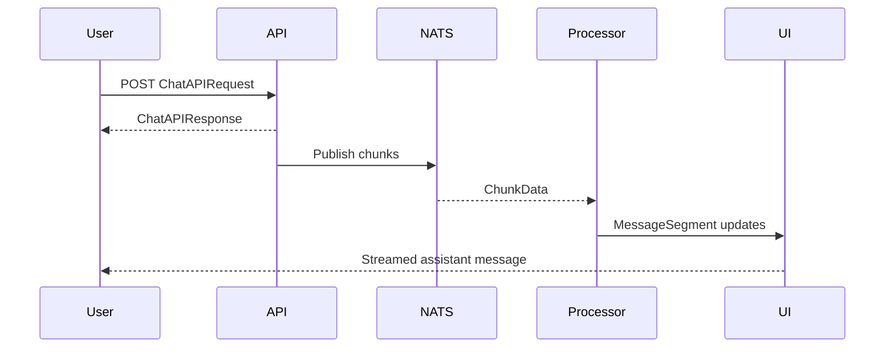

# Chat Types

The **Chat Types** module defines the complete type system that powers the OpenFrame chat experience in the frontend. It provides:

- ✅ API request/response contracts for dialogs and messages
- ✅ Real-time streaming and NATS/WebSocket type definitions
- ✅ Message, segment, and approval data models
- ✅ Component prop contracts for all chat UI elements
- ✅ Processing and accumulator interfaces for chunk-based streaming
- ✅ Entity wire-shapes used inside chat (programs, roadmap items, etc.)

This module is **purely declarative** — it contains no UI rendering or business logic. Instead, it acts as the single source of truth for how chat data is structured, transported, processed, and rendered.

---

## 1. Architectural Role in the Chat System

The Chat Types module sits at the center of the chat architecture, connecting:

- API services
- Real-time transport (NATS / JetStream)
- Stream processors
- Message accumulators
- React components
- Host applications (e.g., Mingo, Fae, embedded chat)



The Chat Types module ensures all layers speak the same language:

- Transport layer → `ChunkData`, `NatsMessageType`
- Processing layer → `ParsedChunkAction`, `AccumulatorState`
- UI layer → `MessageSegment`, `ChatMessageEnhancedProps`
- API layer → `ChatAPIRequest`, `DialogListResponse`

---

# 2. Core Type Domains

The module is organized into several logical domains.

---

## 2.1 API Contracts (`api.types.ts`)

Defines all REST-level contracts for chat interactions.

### Dialog Management

- `DialogCreateRequest`
- `DialogCreateResponse`
- `DialogListRequest`
- `DialogListResponse`

These power:

- Creating a new conversation
- Paginated dialog listing
- Sorting by `createdAt`, `updatedAt`, or `name`

### Message Sending

```typescript
export interface ChatAPIRequest {
  dialogId: string
  message: string
  metadata?: Record<string, any>
}
```

```typescript
export interface ChatAPIResponse {
  success: boolean
  messageId?: string
  error?: string
}
```

This contract initiates an AI turn and triggers streaming via NATS.

### Approvals

- `ApprovalRequest`
- `ApprovalResponse`

These types allow UI-driven approval or rejection of tool executions.

### Chat Settings

- `ChatSettings`
- `UpdateSettingsRequest`
- `UpdateSettingsResponse`

Used to configure assistant appearance and behavior:

- Assistant name
- Avatar
- Notifications
- Auto-scroll

---

## 2.2 Core Chat Enums and Identity (`chat.types.ts`)

This file defines all semantic constants used throughout the system.

### Chat Type

```typescript
export const CHAT_TYPE = {
  CLIENT: 'CLIENT_CHAT',
  ADMIN: 'ADMIN_AI_CHAT',
} as const
```

Used to differentiate:

- End-client chats (Fae)
- Admin/AI chats (Mingo)

### Message Role & Ownership

- `MESSAGE_ROLE` → `user`, `assistant`, `error`, `system`
- `OWNER_TYPE` → `CLIENT`, `ADMIN`, `ASSISTANT`
- `AuthorType`

### Approval Status

```typescript
export const APPROVAL_STATUS = {
  PENDING: 'pending',
  APPROVED: 'approved',
  REJECTED: 'rejected',
  CANCELLED: 'cancelled',
}
```

Approval status propagates across:

- Stream chunks
- Accumulator state
- Message segments
- UI rendering

### Content Helpers

- `isStructuredContent()`
- `normalizeContent()`

These normalize message content into a `MessageSegment[]` structure.

---

## 2.3 Message Model & Segments (`message.types.ts`)

This is the heart of the chat data model.

### Message Types (Wire-Level)



Defined via:

- `MESSAGE_TYPE`
- `MessageType`
- `MessageData` union

### Segment Types

UI rendering is driven by `MessageSegment`:

- `TextSegment`
- `ThinkingSegment`
- `ToolExecutionSegment`
- `ApprovalRequestSegment`
- `ApprovalBatchSegment`
- `ErrorSegment`
- `ContextCompactionSegment`

This design enables:

- Streaming updates
- Mixed-content messages
- Tool batching
- Escalated approvals
- Context compaction markers

### Approval Batch Model

The system supports both:

- Single approval card
- Multi-tool batch approval

Controlled via:

- `ApprovalBatchData`
- `PendingToolCallData`
- `ApprovalBatchExecutionState`

---

## 2.4 Network & Streaming Types (`network.types.ts`)

This layer abstracts real-time communication.

### NATS Types

- `NatsMessageType`
- `NatsConnectionStatus`
- `NatsConnectionSource`

### Chunk Data

```typescript
export interface ChunkData {
  sequenceId?: number
  streamSeq?: number
  type: string
  text?: string
  approvalRequestId?: string
  toolExecutionRequestId?: string
  modelName?: string
  ...
}
```

`ChunkData` is the canonical real-time transport unit.

### Network Configuration

```typescript
export const NETWORK_CONFIG = {
  CONNECT_TIMEOUT_MS: 10000,
  RETRY_INITIAL_DELAY_MS: 1000,
  RETRY_BACKOFF_MULTIPLIER: 2,
}
```

Used by subscription hooks to implement reconnection backoff.

---

## 2.5 Processing & Accumulator Layer (`processing.types.ts`)

Defines contracts for how chunks are transformed into messages.

### Processing Pipeline



### Key Interfaces

- `ChunkProcessor`
- `ParsedChunkAction`
- `AccumulatorState`
- `StreamProcessor`
- `BufferManager`

These abstractions allow:

- Buffered chunk handling
- Controlled stream lifecycle
- Retry-safe processing
- Message continuation after refresh

---

## 2.6 Component Contracts (`component.types.ts`)

Defines prop contracts for every chat UI component.

Examples:

- `ChatMessageEnhancedProps`
- `ChatMessageListProps`
- `ChatInputProps`
- `ApprovalRequestMessageProps`
- `ToolExecutionDisplayProps`

These contracts ensure:

- Host apps can override rendering
- Mentions and entity cards are injectable
- Approval variants (`admin` vs `client`) are respected
- Slash command behaviors are extensible

The Chat Types module does **not** implement UI — it only guarantees consistency across consumers.

---

## 2.7 Entity Types for Inline Cards

Chat supports inline entity rendering via structured references.

### Program Types

Defines a unified abstraction for:

- Events
- Podcasts
- Webinars

Key interfaces:

- `BaseProgramItem`
- `ProgramItemResponse<T>`
- `ProgramListResponse<T>`
- `AdminProgramFilter`

This enables a single rendering system for heterogeneous program content.

### Roadmap Items

```typescript
export interface RoadmapItem {
  id: string
  title: string
  status: string
  statusColor: string
  upvotes: number
  downvotes: number
}
```

Used for compact roadmap cards inside chat messages.

---

# 3. Realtime Hook Contracts

The Chat Types module also defines hook-level contracts.

### Chunk Catch-up

- `UseChunkCatchupOptions`
- `UseChunkCatchupReturn`

Handles:

- Missed message replay
- Sequence-based deduplication

### NATS Subscription

- `UseNatsDialogSubscriptionOptions`
- `UseJetStreamDialogSubscriptionOptions`

Supports:

- Custom reconnection backoff
- Token refresh before reconnect
- Stream sequence resume

### Realtime Chunk Processor

- `UseRealtimeChunkProcessorOptions`
- `UseRealtimeChunkProcessorReturn`

Provides:

- `processChunk()`
- `getSegments()`
- `updateApprovalStatus()`
- `getPendingApprovals()`

---

# 4. End-to-End Data Flow Example



This flow demonstrates how:

1. REST initiates a turn.
2. Real-time chunks stream via NATS.
3. The processor accumulates segments.
4. The UI renders structured messages.

---

# 5. Design Principles

The Chat Types module follows several core principles:

### 1️⃣ Strong Typing Across Layers

Every stage — from API to UI — uses shared contracts.

### 2️⃣ Segment-Based Rendering

Messages are not strings — they are structured segment arrays.

### 3️⃣ Transport-Agnostic Streaming

Supports:

- Legacy NATS
- JetStream
- WebSocket-based transports

### 4️⃣ Backward Compatibility

- Optional fields everywhere
- Fallback to legacy rendering modes
- Batch approvals are opt-in

### 5️⃣ Host Extensibility

Consumers can inject:

- Entity card renderers
- Mention resolvers
- Custom anchor components
- Slash command behaviors

---

# 6. Summary

The **Chat Types** module is the schema backbone of the OpenFrame chat system.

It defines:

- ✅ API contracts
- ✅ Real-time chunk structures
- ✅ Message and segment models
- ✅ Approval and tool execution state
- ✅ Component prop interfaces
- ✅ Processing abstractions
- ✅ Entity card wire shapes

Without containing any UI or business logic, it enables the entire chat system to operate safely, consistently, and extensibly across:

- Mingo (admin AI)
- Fae (client assistant)
- Embedded chat surfaces
- Ticket-integrated dialogs

It is the canonical contract layer for everything chat-related in the frontend.
