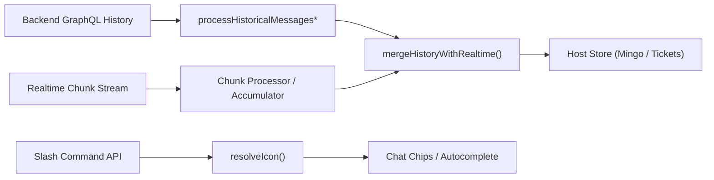
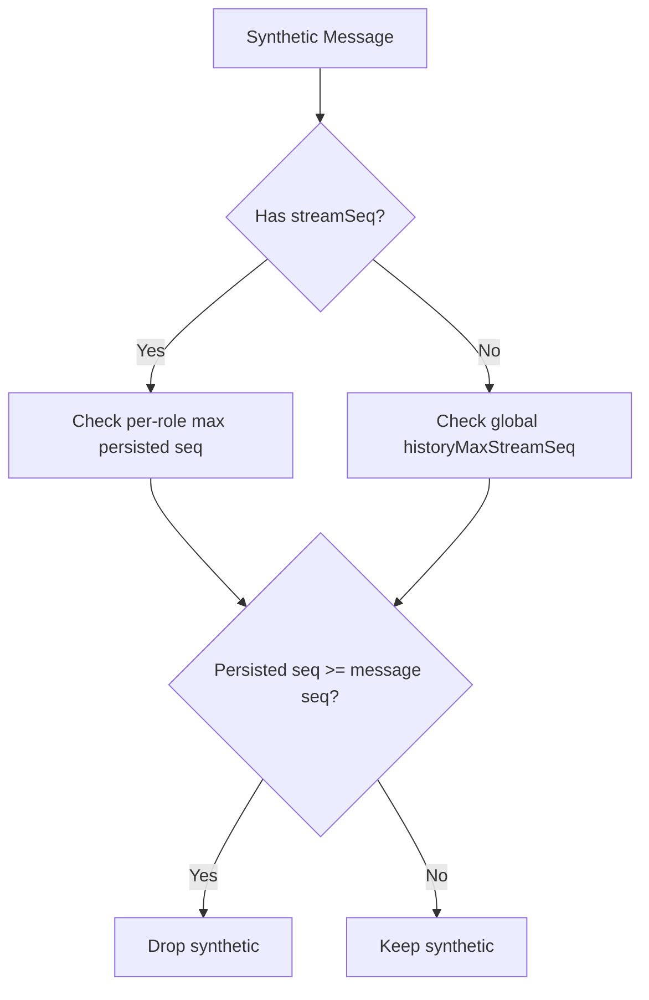
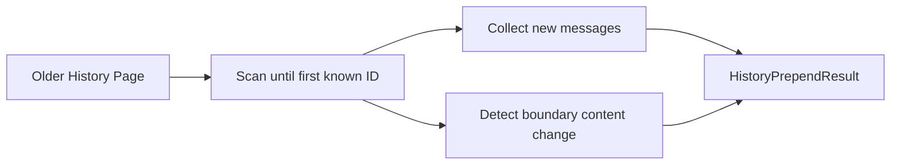
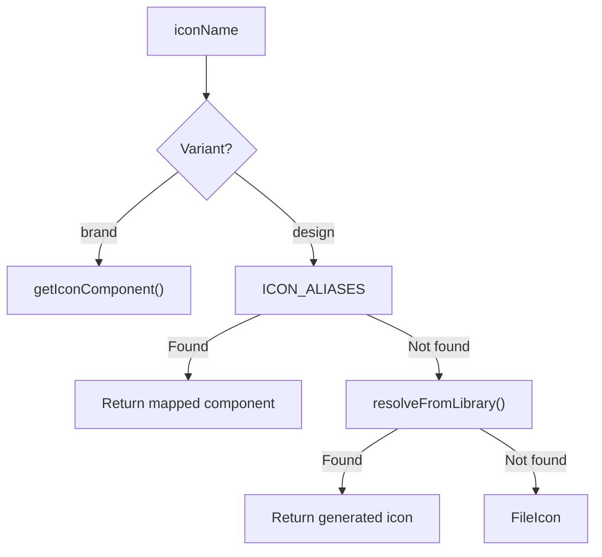

# Chat Utils

The **Chat Utils** module provides low-level, cross-host utilities that power the chat experience across OpenFrame (Mingo, Tickets, embeddable chat, and other consumers of `frontend-core`).

It focuses on two critical responsibilities:

- **History reconciliation** – merging persisted GraphQL history with realtime streaming messages without duplication or data loss.
- **Icon resolution** – mapping backend `iconName` values to concrete React icon components in a consistent and extensible way.

These utilities are intentionally **pure and host-agnostic**: they do not manage React state, networking, or stores. Instead, they encapsulate the deterministic logic that every host must apply.

---

## Module Responsibilities

### 1. History & Realtime Reconciliation

Implemented in:

- `MergeableChatMessage`
- `mergeHistoryWithRealtime`
- `computeHistoryPrepend`
- `flattenMessagePagesChronological`
- `maxPersistedStreamSeq`

This logic ensures that:

- Persisted messages from GraphQL history do not duplicate synthetic realtime messages.
- Streaming messages are not accidentally dropped when history is stale.
- Replay scenarios (e.g. JetStream resume) do not render duplicate turns.
- Partially persisted assistant turns (e.g. approval batches) are reconciled correctly.

### 2. Icon Resolution & Admin Picker Support

Implemented in:

- `resolveIcon`
- `ICON_ALIASES`
- `ICON_OPTIONS`
- `IconOption`

This logic ensures that:

- Backend-provided `iconName` values resolve deterministically.
- The admin slash-command picker and chat UI share a single icon source of truth.
- Brand icons and design-system icons are clearly separated but unified under one resolver.

---

# Architecture Overview



The Chat Utils module sits in the **middle of the chat pipeline**:

- It does not fetch history.
- It does not process chunks.
- It does not own state.

It defines the **invariants** for merging and resolving.

---

# History Reconciliation

## The Problem

A chat host maintains two independent streams of truth:

1. **Persisted history** (GraphQL pages, Mongo-backed).
2. **Realtime synthetics** (constructed from streaming chunks).

Naïve merging leads to:

- Duplicate assistant turns.
- Lost user messages.
- Partially rendered approval/tool messages.
- Replay duplication after reconnect.

The `mergeHistoryWithRealtime` function encodes the canonical merge strategy used across all hosts.

---

## Core Interface: MergeableChatMessage

```typescript
export interface MergeableChatMessage {
  id: string
  role: string
  content: MessageContent
  timestamp?: Date
  streamSeq?: number
}
```

### Key Fields

- `id` – Unique message identifier.
  - Mongo ObjectId for persisted rows.
  - Prefixed synthetic ID for realtime (`assistant-`, `user-`, etc.).
- `role` – `assistant`, `user`, `system`, etc.
- `content` – Segmented message content.
- `streamSeq` – Highest **content chunk sequence** contributing to this message.

The optional `streamSeq` is the foundation of the **coverage invariant** described below.

---

## Synthetic Message Contract

Synthetic realtime IDs must use one of the following prefixes:

```text
assistant-
user-
direct-
system-
error-
```

These prefixes allow the merge algorithm to:

- Detect synthetic messages.
- Distinguish them from persisted Mongo IDs.
- Apply coverage and deduplication rules consistently.

This prefix contract must be honored by all chunk processors.

---

## The Freshness & Coverage Invariant

The merge algorithm relies on a critical invariant:

> A synthetic message is safe to drop **only when the history snapshot provably covers it**.

Coverage is determined in three tiers:

1. **Per-message `streamSeq` coverage (preferred)**
2. **Global `historyMaxStreamSeq` coverage**
3. **Wall-clock fallback (`historyFetchedAt`)**

### Sequence-Based Coverage



This prevents two major classes of bugs:

- **Duplicate turns** – when a persisted twin already exists.
- **Lost turns** – when history lags behind streaming.

---

## Special Cases Handled

### 1. Approval Batch Trailing Assistant

Assistant turns ending in approval segments may persist out-of-order.

If the realtime version:

- Has more segments, or
- Is the active streaming message,

then history’s trailing version is discarded in favor of the richer synthetic.

### 2. Adoption Pin (Mid-Stream Reload)

When a host reloads mid-stream:

- The trailing assistant may already exist in history.
- Realtime chunks continue appending to the same ID.

If the existing store version is strictly richer (more segments or higher `streamSeq`), it is **pinned**, and the history copy is dropped.

This prevents collapsed tool sequences or regressed states after reload.

### 3. User Message Dedup (Content-Based)

User messages do not always carry `lastChunkStreamSeq`.

To avoid replay duplicates:

- User synthetics (`user-`) are deduplicated by **text content**.
- Matching is positional against persisted user rows.

This ensures:

- Replayed duplicates disappear.
- Legitimate repeated user messages are preserved.

---

## Pagination: computeHistoryPrepend

Used when older pages arrive via `fetchNextPage`.

Behavior:

- Keeps everything currently rendered.
- Prepends only truly new older messages.
- Optionally refreshes boundary content if changed.



If nothing changes, returns `null` to avoid unnecessary state updates.

---

# Icon Resolution System

The second responsibility of Chat Utils is deterministic icon resolution.

## Goals

- Backend sends a simple `iconName` string.
- Chat renders a valid icon component.
- Admin picker shows only valid, resolvable options.
- No drift between picker and renderer.

---

## Resolver Flow



Two variants are supported:

- `design` (default) – icons-v2-generated system.
- `brand` – brand/social icons via registry resolver.

---

## ICON_ALIASES

A curated map that:

- Normalizes backend keys (`clickup`, `slack`, `rocket`).
- Provides brand-grey variants.
- Supports legacy Figma canonical names.
- Includes announcement-bar compatibility keys.

This is intentionally small. Any icon not in this map falls back to:

```typescript
resolveFromLibrary(iconName)
```

which dynamically resolves icons by naming convention.

---

## Admin Slash Command Picker

`ICON_OPTIONS` defines the curated set shown in the admin UI.

```typescript
export interface IconOption {
  key: string
  label: string
}
```

Rules:

- `key` must match a valid `resolveIcon` input.
- Stored in `chat_admin_slash_commands.icon_name`.
- Always kebab-case.

The picker and chat renderer share the same resolver, ensuring:

- No missing glyphs.
- No mismatched preview vs runtime icon.

---

# Design Principles

## 1. Pure Functions

- No React state.
- No network calls.
- Deterministic input → output.

Hosts decide **when** to merge; this module defines **how**.

## 2. Backwards Compatibility

- `streamSeq` is optional.
- Wall-clock fallback ensures legacy transports still work.
- Icon resolution gracefully falls back to `FileIcon`.

## 3. Single Source of Truth

- Synthetic ID prefixes defined once.
- Icon resolver defined once.
- Merge invariants defined once.

Every chat host must rely on these utilities rather than reimplementing merge or icon logic.

---

# Summary

The **Chat Utils** module provides:

- A rigorously defined reconciliation algorithm for history + realtime streaming.
- Deterministic icon resolution shared by admin configuration and chat UI.

Without this module:

- Streaming reloads cause duplication or message loss.
- Approval/tool sequences become inconsistent.
- Icon rendering drifts between picker and runtime.

With it, all chat surfaces in OpenFrame share the same correctness guarantees.