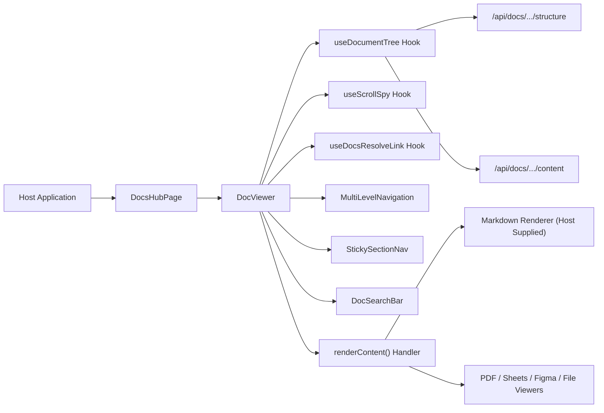
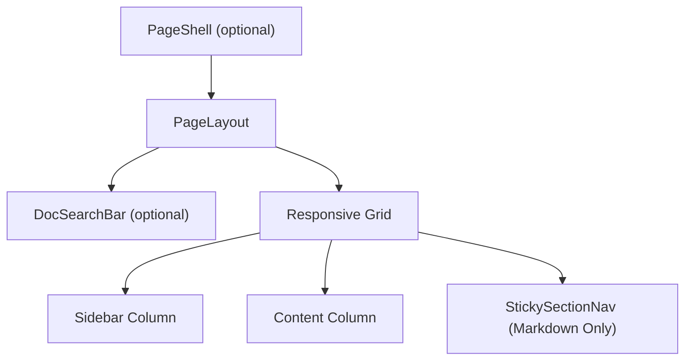
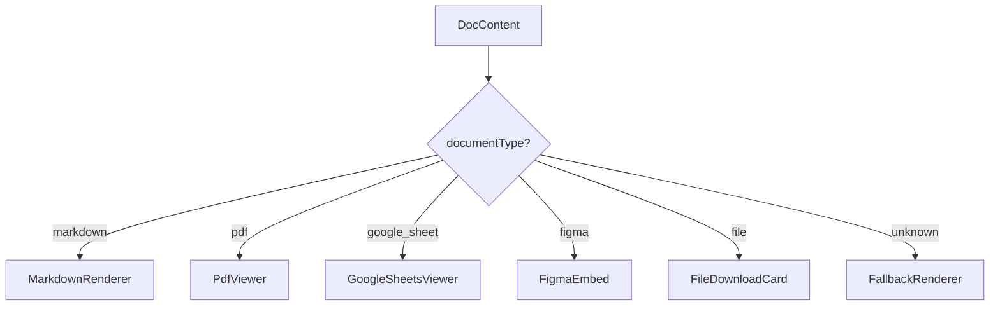
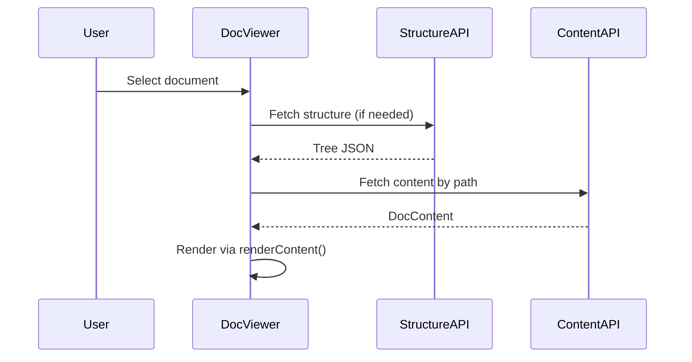
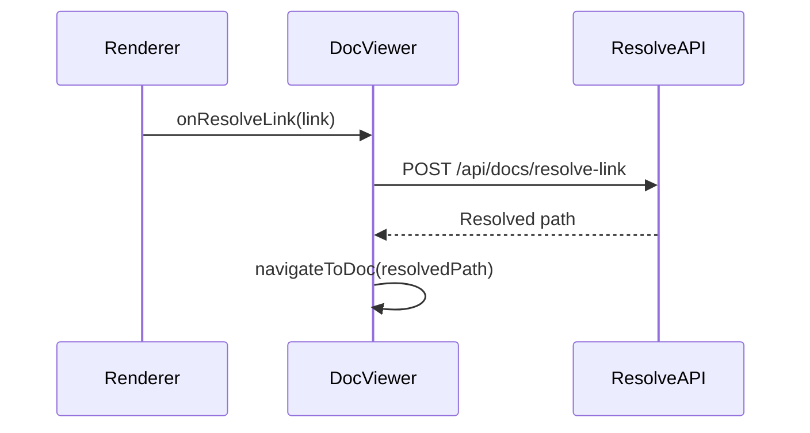

# Docs Components

The **Docs Components** module provides the embeddable documentation experience used across OpenFrame (Knowledge Base, Data Room, and third-party embeds). It is responsible for rendering document trees, content views, navigation chrome, AI-powered search integration, and document-type–aware viewers (Markdown, PDF, Google Sheets, Figma, file downloads).

At its core, this module exposes two primary surfaces:

- `DocViewer` – Low-level layout + state container
- `DocsHubPage` – Opinionated wrapper with safe defaults and document-type routing

It also includes reusable loading skeletons for markdown and embedded content.

---

## 1. Purpose and Responsibilities

The Docs Components module solves the following problems:

- Render a hierarchical document tree (sidebar + mobile dropdown)
- Fetch document structure and content from configurable endpoints
- Render content via pluggable renderers (consumer-supplied markdown renderer)
- Handle internal link resolution (`/api/docs/resolve-link`)
- Provide "On this page" sticky navigation for markdown documents
- Support multiple document types (markdown, PDF, Sheets, Figma, generic file)
- Provide AI-powered in-source search (RAG-backed)
- Offer an embeddable surface for external React applications

The design is intentionally:

- ✅ Renderer-agnostic (no built-in markdown renderer)
- ✅ Endpoint-injectable (for proxy/embedding scenarios)
- ✅ Platform-neutral (chat source passed from host boundary)
- ✅ Layout-consistent with other frontend-core surfaces

---

## 2. High-Level Architecture



### Key Design Principle

**DocViewer owns layout + state.**  
**DocsHubPage owns document-type routing and safe defaults.**  
**The host owns markdown rendering and SEO.**

---

## 3. Core Components

### 3.1 DocViewer

**Primary responsibility:** Layout container + orchestration.

`DocViewer` manages:

- Structure + content fetching
- Sidebar rendering (desktop + mobile)
- Document selection state
- Sticky section navigation
- Search integration
- Internal link navigation
- Loading and empty states
- Shell vs embedded layout modes

#### Important Props

| Prop | Responsibility |
|------|---------------|
| `sourceId` | Identifies document source (e.g., `openframe-docs`) |
| `renderContent` | Host-supplied content renderer |
| `renderSkeleton` | Host-supplied skeleton selector |
| `chatSource` | Chat-bound search identifier (trusted boundary) |
| `baseRoute` | URL base path for navigation |
| `structureEndpoint` | Optional override for tree API |
| `contentEndpoint` | Optional override for content API |
| `resolveLinkEndpoint` | Optional override for link resolver |
| `showAIChat` | Enables in-source search UI |
| `shell` | Controls whether `<PageShell>` wrapper is mounted |

#### Layout Composition



#### Markdown vs Embed Behavior

The component differentiates document types:

- `markdown` → max-width article + sticky navigation
- `pdf`, `google_sheet`, `figma`, `file` → full-width embed layout
- Skeleton rendering matches document type

This prevents layout shift and avoids incorrect section navigation for non-markdown documents.

---

### 3.2 DocsHubPage

**Primary responsibility:** Opinionated wrapper with document-type routing.

`DocsHubPage` simplifies embedding by:

- Requiring only a `markdown` renderer
- Providing default renderers for:
  - `pdf`
  - `google_sheet`
  - `figma`
  - `file`
- Providing a fallback renderer
- Providing document-type–aware skeleton defaults
- Enabling AI chat by default

#### Rendering Strategy



### Security Model

The library does **not** ship a markdown renderer.  
This avoids introducing an XSS surface at the library layer.

Consumers must provide:

```text
(documentTypeRenderers.markdown)
```

This forces embedders to consciously select a markdown renderer and sanitization strategy.

---

### 3.3 Skeletons

The module provides two skeleton systems:

#### MarkdownSkeleton

- Mimics article layout
- Matches heading + paragraph rhythm
- Used for `markdown` and undefined types

#### EmbedSkeleton

Document-type aware:

| Type | Layout Behavior |
|------|-----------------|
| `pdf` | Header + two buttons + iframe body |
| `google_sheet` / `figma` | Header + one button |
| `file` | Centered file card layout |
| Unknown | Generic embed layout |

Design note:

All skeleton bars use `bg-ods-border` instead of `bg-ods-skeleton` because the `--ods-skeleton` token resolves to transparent in this build.

---

## 4. Data Flow



### Internal Link Resolution



The resolution hook is abstracted via `useDocsResolveLink` so custom renderers can reuse the same contract.

---

## 5. Integration With Other Frontend Modules

Docs Components integrates with:

- **Navigation components** (multi-level navigation, sticky section nav)
- **Layout components** (`PageLayout`, `PageShell`)
- **Embeds components** (PDF, Figma, Google Sheets, file cards)
- **Shared doc-search components** (AI search bar)
- **Doc-source types** (document tree + content models)

It does **not**:

- Implement SEO (host responsibility)
- Provide markdown parsing
- Own authentication logic
- Assume platform context

---

## 6. Embedding Model

The module is explicitly designed to support:

- OpenFrame internal Knowledge Base
- Data Room surface
- Third-party React applications

Key embedding features:

- Configurable endpoints
- Custom baseRoute
- Optional PageShell
- Custom markdown renderer
- Custom fallback renderer

Minimal embedding surface:

```text
<DocsHubPage
  sourceId="openframe-docs"
  baseRoute="/docs"
  chatSource="openframe"
  documentTypeRenderers={{ markdown: myMarkdownRenderer }}
/>
```

---

## 7. Design Guarantees

1. **Layout stability** – Skeleton matches final viewer layout.
2. **Type safety** – DocumentType-based rendering map.
3. **Security boundary** – No built-in markdown parsing.
4. **Embedding flexibility** – Endpoint and shell overrides.
5. **Platform isolation** – Chat source injected from trusted boundary.

---

## 8. Summary

The Docs Components module provides a complete, embeddable documentation surface for OpenFrame:

- Tree navigation
- Markdown + rich embed rendering
- AI search integration
- Internal link resolution
- Responsive layout
- Safe renderer injection model

It acts as the foundation for all documentation-style experiences within the frontend-core ecosystem while remaining secure, flexible, and host-controlled.