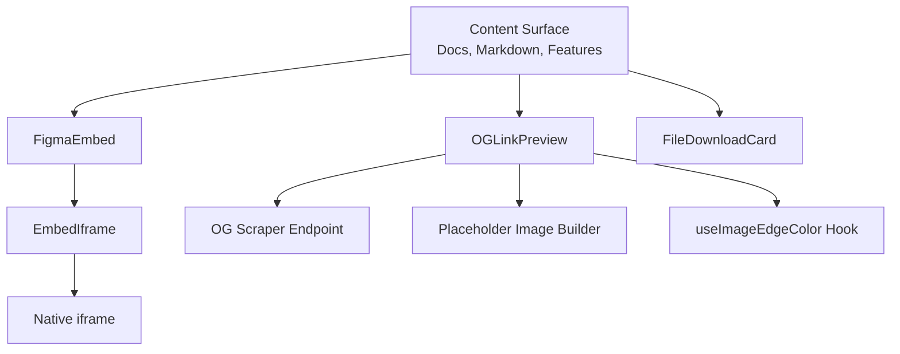
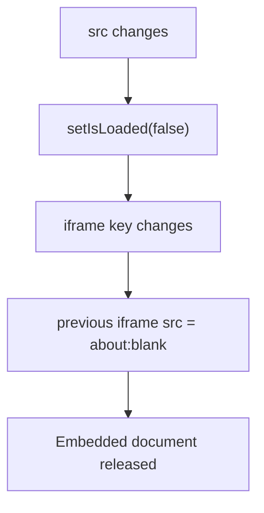
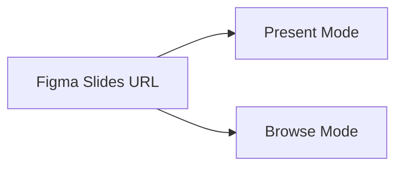
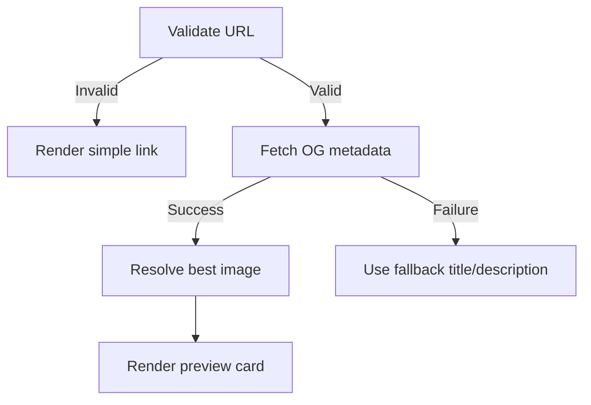
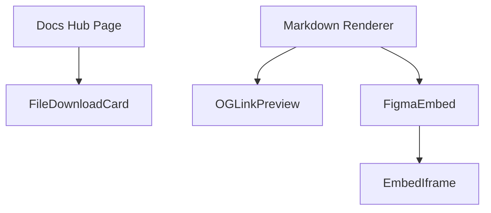
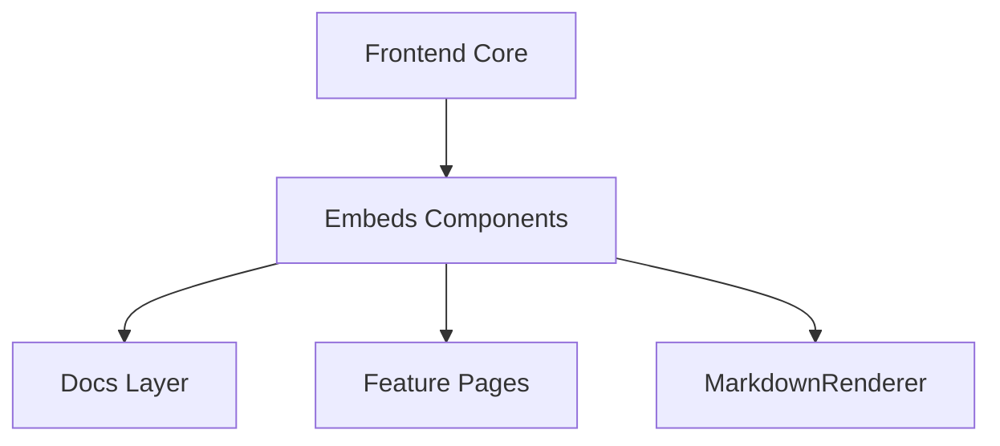

# Embeds Components

The **Embeds Components** module provides reusable, production-ready UI building blocks for rendering external and rich embedded content inside OpenFrame applications.

It standardizes how the frontend handles:

- Third-party iframes (e.g., Figma, prototypes, dashboards)
- Rich Open Graph (OG) link previews
- Downloadable file cards
- Loading states, error boundaries, and graceful fallbacks

This module lives inside the broader **Frontend Core** layer and is consumed by documentation pages, markdown renderers, feature pages, and embeddable surfaces.

---

## Purpose and Design Principles

The Embeds Components module is designed around four key principles:

1. **Safety first** – prevent crashes from third-party content.
2. **Memory-safe embeds** – avoid iframe leaks and stale documents.
3. **Progressive enhancement** – degrade gracefully to plain links when needed.
4. **Single source of truth** – shared components used consistently across surfaces.

---

## High-Level Architecture

### Core Responsibilities

| Component | Responsibility |
|------------|----------------|
| `EmbedIframe` | Base iframe wrapper with loading skeleton and memory cleanup |
| `FigmaEmbed` | Specialized Figma embed with URL normalization and Slides view toggle |
| `OGLinkPreview` | Rich Open Graph preview card with fallbacks and variants |
| `FileDownloadCard` | Downloadable file presentation for document-type content |

---

# Core Components

## 1. EmbedIframe

**Interface:** `EmbedIframeProps`  
**Role:** Low-level, reusable iframe container with lifecycle safeguards.

### Key Capabilities

- Loading skeleton shown until `onLoad`
- Full unmount/remount when `src` changes via `key={src}`
- Cleanup on unmount: sets iframe `src` to `about:blank`
- Configurable `allow`, `referrerPolicy`, `loading`, and `allowFullScreen`
- Height configurable via CSS string (default: `calc(100vh - 250px)`)

### Memory Safety Strategy

This prevents:

- Zombie iframe documents
- Retained cross-origin memory references
- Visual glitches when switching embeds

`EmbedIframe` is the foundational building block used by higher-level embed components.

---

## 2. FigmaEmbed

**Interface:** `FigmaEmbedProps`  
**Role:** Opinionated, fully-featured Figma embed built on top of `EmbedIframe`.

### Features

- Accepts any Figma URL (design, proto, board, slides, deck)
- Converts to canonical embed URL via `toFigmaEmbedUrl`
- Generates secure “Open in Figma” link
- Optional `height` and `loading` strategy override
- Special handling for **Figma Slides**

### Slides View Toggle

When the URL represents a Slides deck:

- **Present** – Full-bleed deck viewer with navigation
- **Browse** – Thumbnail rail and zoom view

The toggle is implemented via a controlled `SlidesView` state and passed into the embed URL converter.

### Security Considerations

Before generating the external link:

- URL is parsed and validated
- Host must match `figma.com` or subdomain
- Protocol must be HTTP or HTTPS

Invalid URLs render a safe fallback UI instead of a broken iframe.

---

## 3. FileDownloadCard

**Interface:** `FileDownloadCardProps`  
**Role:** Render downloadable file metadata in a consistent card layout.

### Supported Data

- `fileName`
- `mimeType`
- `fileSize`
- `fileUrl`

### Behavior Rules

| Condition | Behavior |
|------------|----------|
| `fileUrl` present | Show "Download File" button |
| `fileUrl` missing | Show metadata only (no button) |
| `fileSize` present | Format via `formatFileSize()` |

This ensures users understand what file exists even if the download link is unavailable.

---

## 4. OGLinkPreview

**Interfaces:**
- `OGData`
- `OGLinkPreviewProps`
- `BuildPlaceholderUrl`

**Role:** Robust Open Graph link preview card with multi-layer fallback.

### Rendering Flow

### Localhost and Private Network Guard

If the URL hostname matches:

- `localhost`
- `127.0.0.1`
- `192.168.*`
- `10.*`
- `172.*`

The component **does not fetch metadata** and renders a simple external link instead.

### Image Resolution Strategy

Priority order:

1. Scraped `og:image`
2. `originalImage`
3. `fallbackImage` prop
4. Placeholder image from `buildPlaceholderUrl`

If all fail → image-less card variant.

### Edge Color Extraction

The `useImageEdgeColor` hook:

- Extracts dominant edge color
- Applies it as background for letterboxing
- Requires same-origin or proxied images to avoid canvas tainting

### Variants

| Variant | Layout |
|----------|--------|
| `default` | Vertical, aspect-video hero |
| `compact` | Horizontal, ~120px height |

### Error Isolation

`OGLinkErrorBoundary` ensures:

- A broken preview does not crash a page
- Fallback UI renders safely
- Errors are logged but not fatal

---

# Interaction Between Components

The module acts as a reusable presentation layer shared across:

- Documentation hubs
- Markdown content
- Feature pages
- Embedded surfaces

---

# Error Handling Strategy

The module uses layered protection:

1. **Validation guards** – URL parsing before network requests.
2. **Network fallback** – Graceful degradation if OG endpoint fails.
3. **Image error toggles** – Independent flags per image source.
4. **Error boundary** – Isolates rendering failures.
5. **Visual skeletons** – Prevent layout shift and blank flashes.

This layered model ensures that third-party content cannot destabilize the application.

---

# How It Fits into the Overall System

Within the OpenFrame frontend architecture:

- **Frontend Core** provides reusable UI primitives.
- **Embeds Components** specialize in external content rendering.
- Higher-level surfaces (docs, features, chat, etc.) consume these components.

The module is intentionally isolated from backend logic. It assumes:

- A valid OG scraping endpoint exists.
- Consumers inject configuration such as `apiBaseUrl`.
- Higher layers manage authentication and routing.

---

# Extension Points

Developers can extend the module by:

- Providing a custom `ogEndpointPath`
- Injecting `buildPlaceholderUrl`
- Passing custom fallback metadata
- Wrapping `EmbedIframe` for new embed types

To add a new embed surface (e.g., YouTube or custom dashboard):

1. Create a wrapper component.
2. Normalize the input URL.
3. Render via `EmbedIframe`.
4. Provide loading and error states consistent with this module.

---

# Summary

The **Embeds Components** module provides a robust, safe, and extensible system for rendering:

- External iframes
- Figma designs and slides
- Rich Open Graph previews
- Downloadable files

It enforces consistent UX patterns, prevents memory leaks, isolates third-party failures, and serves as the single standardized embedding layer across the OpenFrame frontend ecosystem.
