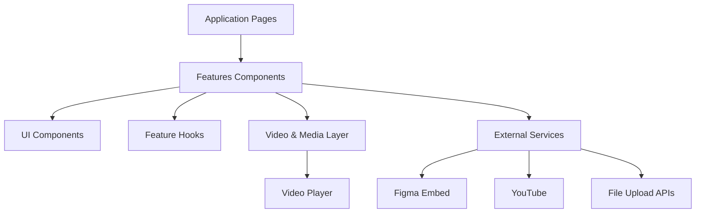
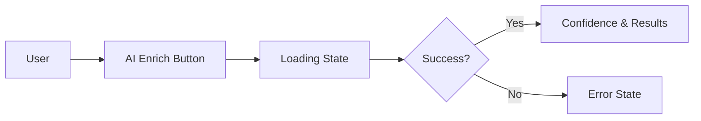
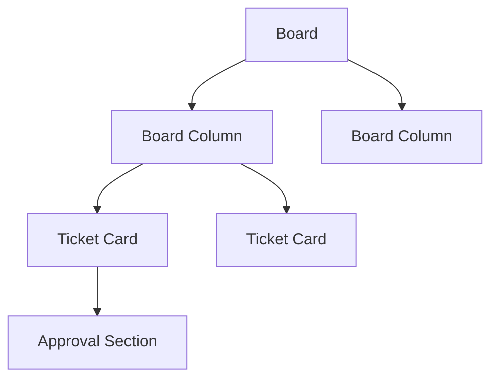
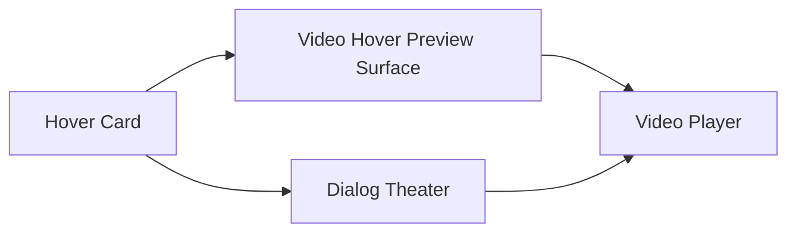
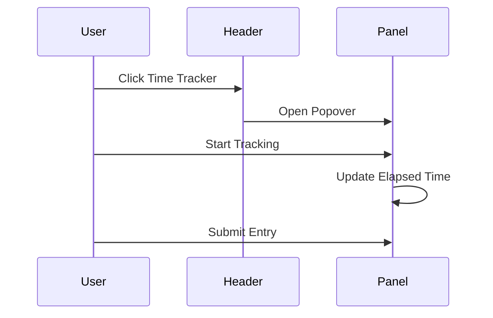
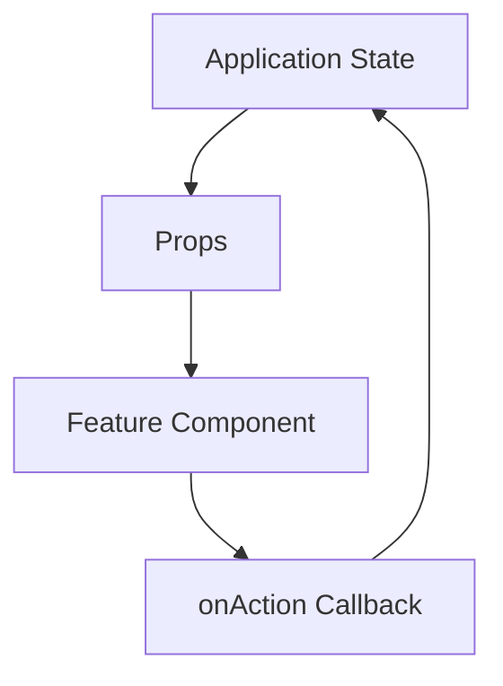
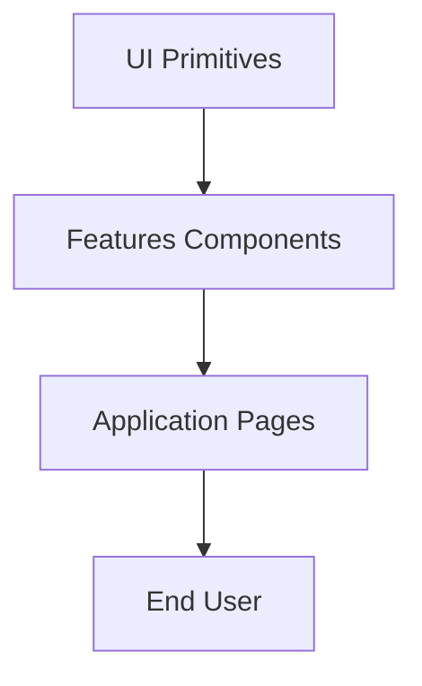

# Features Components

The **Features Components** module contains the high-level, user-facing React components that power interactive product features across OpenFrame.

These components sit on top of the foundational UI layer and compose:

- Feature-specific workflows (AI enrichment, highlights, SEO editing)
- Complex interactive surfaces (Kanban board, media galleries, time tracker)
- Embedded experiences (Figma prototype viewer, floating walkthrough video)
- Domain-specific panels (notifications drawer, social links, video source selection)

This module is part of the `frontend-core` package and is consumed by applications such as `openframe-oss-frontend`.

---

## Architectural Overview

At a high level, Features Components orchestrate:

- **UI primitives** (Buttons, Inputs, Tags, Drawers, Dialogs)
- **Domain hooks and utilities** (AI status, time tracking, notifications)
- **Media infrastructure** (Video player, hover previews, highlight workflows)
- **External integrations** (Figma embeds, YouTube, Mux, uploads)

Features Components act as **feature-level composition boundaries**: they do not implement low-level primitives, but instead coordinate state, layout, and business interactions.

---

# Core Feature Areas

## 1. AI Enrichment

Components:

- `AIEnrichSection`
- `AIStatusIndicator`
- `ConfidenceBadge`

### Purpose

Provide a standardized interface for AI-powered actions such as:

- Generating summaries
- Enriching metadata
- Creating highlight videos

### Responsibilities

- Render enrichment button with loading and cancel states
- Display required-field validation hints
- Surface warnings and confidence metrics
- Support custom instruction injection for AI prompts

AI components are reused by:

- Highlight generation workflows
- SEO enrichment
- Transcript summarization

---

## 2. Board (Kanban System)

Components:

- `Board`
- `BoardColumn`
- `BoardColumnHeader`
- `TicketCard`
- `BoardTicketApproval`

### Purpose

Implements a drag-and-drop Kanban board for tickets and work items.

### Key Capabilities

- Column collapsing
- Drag-and-drop via dnd-kit
- Infinite scroll per column
- Inline approval UI
- Visual status mapping

The Board module separates:

- **Presentation** (`TicketCardView`)
- **Drag behavior** (`useSortable`, `useDroppable`)
- **Business callbacks** (`onChange`, `onApprove`, `onReject`)

This keeps board logic reusable across admin and operational contexts.

---

## 3. Video & Media Features

Components:

- `VideoHoverPreviewSurface`
- `FloatingWalkthroughVideo`
- `VideoSourceSelector`
- `HighlightVideoSection`
- `HighlightVideoCombinedSection`
- `TranscriptSummaryEditor`
- `VideoRatioTabs`

### Purpose

Provide a unified system for:

- Hover previews
- Embedded video playback
- Highlight generation
- Transcript editing
- YouTube vs uploaded video switching

### Design Principles

- Single source of truth video player (`Video` component)
- Controlled hover activation
- AI-powered highlight generation integration
- Seamless transition between mini-player and theater modes

The same video infrastructure is reused by:

- Product releases
- Customer interviews
- Marketing pages
- Walkthrough demos

---

## 4. SEO & Metadata Editing

Components:

- `SEOEditorPreview`
- `EntitySummaryEditor`

### Purpose

Provide live-edit interfaces for:

- SEO title and description
- Open Graph image
- AI-generated summaries

Features:

- Character count enforcement
- Confidence indicators
- Live social preview card
- Image upload and replacement

These components ensure consistent SEO behavior across content types.

---

## 5. Configuration & Selectors

Components:

- `PushButtonSelector`
- `SectionSelector`
- `SelectButton`
- `FiltersDropdown`

### Purpose

Provide flexible selection interfaces for:

- Multi-select workflows
- Grouped options with sections
- Toggle-style configuration
- Filter menus with apply/reset

These are higher-level than UI primitives and encode opinionated interaction patterns.

---

## 6. Notifications & Time Tracking

Components:

- `NotificationDrawer`
- `NotificationTile`
- `TimeTrackerHeaderButton`
- `TimeTrackerPanel`

### Notification Drawer

- Anchors to layout header
- Displays live notifications
- Supports infinite scroll
- Integrates desktop notification permissions

### Time Tracker

- Header button with live timer
- Popover-based tracking panel
- Ticket and customer linking
- Manual entry and history navigation

These features integrate tightly with application-level context providers.

---

## 7. Media & Content Management

Components:

- `MediaGalleryManager`
- `PathsDisplay`
- `WarningBlock`
- `SocialLinksManager`
- `WaitlistForm`

### Responsibilities

- File upload and reordering
- Path display with copy actions
- Warning callouts
- Social link configuration
- Lead capture form with validation

These components abstract recurring product patterns into reusable feature blocks.

---

# State & Interaction Model

Features Components follow a consistent pattern:

1. **Controlled inputs** — parent owns data
2. **Side-effect callbacks** — feature triggers business logic
3. **Status-driven UI** — loading, success, error states are explicit
4. **Composable children** — sections can be extended without modification

This keeps Features Components reusable across:

- Admin dashboards
- Public marketing pages
- Embedded SDK examples

---

# Design Principles

### 1. Single Source of Truth

- One `Video` player abstraction
- One AI enrichment surface
- One board system

### 2. Controlled + Predictable

No hidden internal business state. Parent applications:

- Own data
- Own mutations
- Own persistence

### 3. Strict Visual Consistency

All components:

- Use ODS tokens (`ods-*` classes)
- Follow shared spacing and typography
- Reuse UI primitives instead of redefining patterns

---

# How This Module Fits the System

The **Features Components** module sits between:

- **UI primitives** (buttons, inputs, layout)
- **Application pages** (customers, devices, releases, onboarding)

It enables feature-rich interfaces without duplicating logic across pages.

In summary, Features Components define the interactive surface area of OpenFrame: AI workflows, boards, media experiences, tracking, and management panels — all built as reusable, composable building blocks.