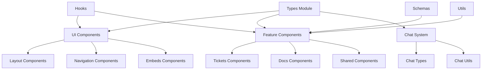
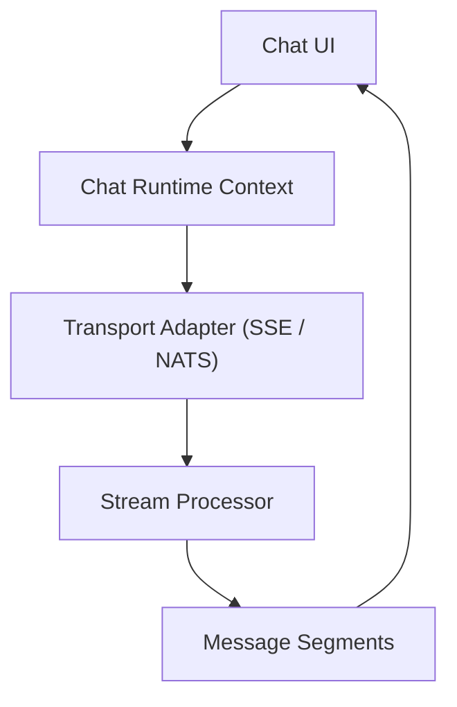
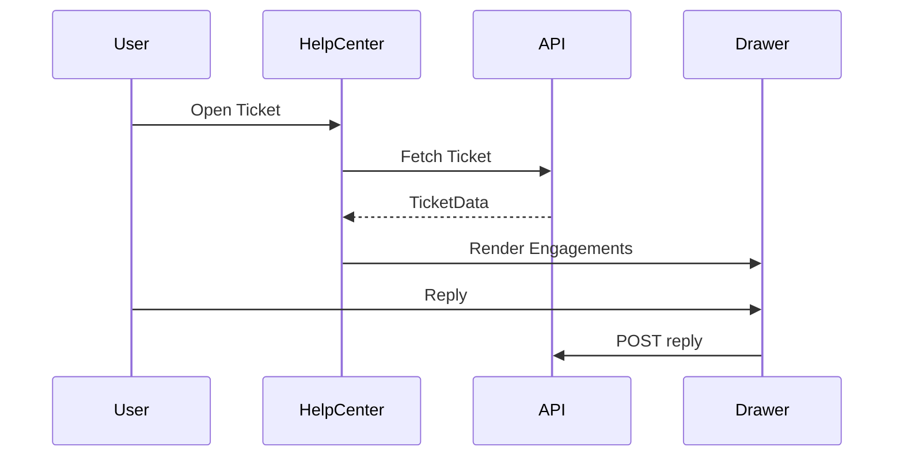
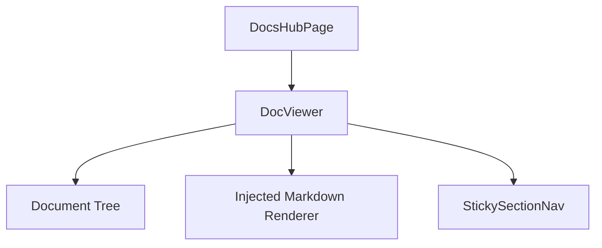
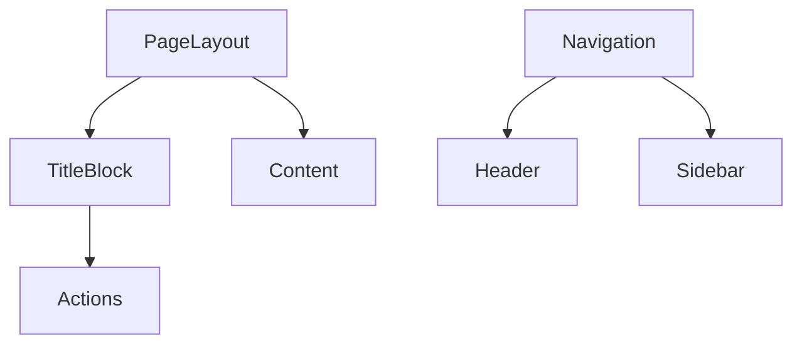
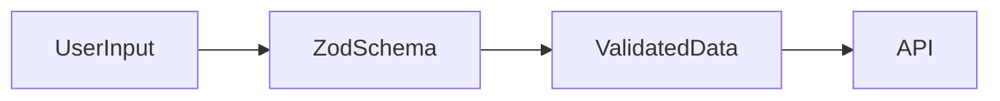

# Frontend Core

The **Frontend Core** module (`openframe-oss-lib/openframe-frontend-core`) is the shared UI, type, and runtime foundation for the OpenFrame ecosystem.

It provides:

- ✅ Reusable React component systems (Chat, Tickets, Docs, Layout, Navigation, UI primitives)
- ✅ Strongly typed domain models and API contracts
- ✅ Runtime-safe utilities and schema validation
- ✅ Shared hooks and infrastructure abstractions
- ✅ Platform-agnostic building blocks for embedding

Frontend Core is consumed by:

- `openframe-oss-frontend`
- Embedded SDK examples
- Marketing and hub surfaces
- Third-party React applications

It acts as the **frontend framework layer** for OpenFrame.

---

# 1. Purpose of the Module

The Frontend Core module solves five primary concerns:

1. **Design System Enforcement**  
   Provides consistent UI primitives and layout patterns aligned with ODS tokens.

2. **Feature-Level UI Systems**  
   Chat, Tickets, Docs, Roadmap, Releases, Stack Builder, Marketing AI.

3. **Typed Contracts**  
   Centralized `types/` directory defining domain models and API contracts.

4. **Runtime Infrastructure**  
   Hooks, schema validation, image caching, pagination abstractions.

5. **Embedding & Extensibility**  
   Components are platform-neutral and work in standalone or embedded contexts.

---

# 2. High-Level Architecture

Frontend Core is organized into layered domains.



### Architectural Layers

| Layer | Responsibility |
|--------|----------------|
| `types/` | Domain modeling and API contracts |
| `schemas/` | Runtime-safe Zod validation |
| `hooks/` | Stateful cross-cutting abstractions |
| `utils/` | Registries and metadata configuration |
| `components/ui` | Design system primitives |
| `components/layout` | Page structure and chrome |
| `components/navigation` | Header, sidebar, mobile nav |
| `components/chat` | Full conversational UI framework |
| `components/tickets` | Structured support system |
| `components/docs` | Embeddable documentation surfaces |
| `components/shared` | Roadmap, releases, onboarding, delivery |
| `components/features` | AI enrichment, board, media systems |
| `components/platform` | Script, shell, OS UI |
| `components/vendor` | Vendor identity layer |

---

# 3. Core Subsystems

## 3.1 Chat System

Location: `components/chat`, `components/chat/types`, `components/chat/utils`

The Chat system powers:

- Mingo (Admin AI)
- Fae (Client Assistant)
- Embedded chat experiences

### Chat Architecture



Key elements:

- `EmbeddableChat`
- Streaming chunk processing
- Tool approval workflows
- Entity card registry
- History reconciliation via `mergeHistoryWithRealtime`

References:
- `components/chat`
- `components/chat/types`
- `components/chat/utils`

---

## 3.2 Tickets System

Location: `components/tickets`

Provides a structured support layer with:

- Help center surface
- Ticket creation forms
- Engagement timeline
- Reply composer with attachments
- Optimistic UI via TanStack Query

### Ticket Flow



References:
- `components/tickets`
- `components/tickets/hooks`
- `components/tickets/types`

---

## 3.3 Documentation System

Location: `components/docs`

Provides embeddable documentation surfaces:

- Tree navigation
- Markdown rendering injection
- PDF / Figma / file embeds
- AI-powered search
- Sticky section navigation



References:
- `components/docs`
- `components/embeds`
- `components/shared/doc-search`

---

## 3.4 UI & Layout Foundation

Location:
- `components/ui`
- `components/layout`
- `components/navigation`

Provides:

- Inputs, tables, dropdowns, tags
- DataTable system
- Markdown renderer with Mermaid
- PageLayout and TitleBlock
- Header, Sidebar, Drawer systems

### Page Chrome Model



These systems define the consistent shell of OpenFrame.

---

## 3.5 Shared Feature Systems

Location: `components/shared`, `components/features`

Includes:

- Roadmap & voting
- Delivery tracking
- Product releases
- Onboarding flows
- Marketing AI campaign system
- Media & highlight generation
- Kanban board system

These are composed feature-level components built atop UI primitives and Types.

---

## 3.6 Types & Schemas

Location:
- `types/`
- `schemas/`

### Types

Defines contracts for:

- Blog
- Case Study
- Product Release
- Marketing Campaign
- Vendor & Stack
- Platform
- Profile
- Slack & Community
- AI & Video Processing

### Schemas

Provides runtime validation:



Ensures safe parsing and strict dropdown validation.

---

## 3.7 Hooks & Runtime Infrastructure

Location: `hooks/`

Includes:

- `useTablePagination` (client + cursor mode)
- `useAuthenticatedImage` (blob cache + dedupe)
- UI pagination config types

Provides performance optimizations and consistent behavior across components.

---

## 3.8 Utils & Registries

Location: `utils/`

Defines:

- `CONTENT_REF_GROUPS`
- `OPENFRAME_DEV_SECTIONS`
- `OS_PLATFORMS`

Enables configuration-driven rendering patterns.

---

# 4. Repository Structure (Simplified)

```text
openframe-frontend-core/
├── components/
│   ├── chat/
│   ├── tickets/
│   ├── docs/
│   ├── embeds/
│   ├── features/
│   ├── layout/
│   ├── navigation/
│   ├── platform/
│   ├── shared/
│   ├── ui/
│   └── vendor/
├── hooks/
├── schemas/
├── types/
└── utils/
```

Each directory represents a logical subsystem.

---

# 5. Design Principles

Frontend Core follows strict architectural guidelines:

1. **Strong Typing Everywhere**  
   Runtime validation + static contracts.

2. **Composable & Controlled Components**  
   No hidden business logic inside UI.

3. **Platform-Agnostic Rendering**  
   Works with Next.js, embedded apps, and standalone React.

4. **Registry-Driven Configuration**  
   Adding new content types or sections requires registration, not refactoring.

5. **Streaming-First Architecture (Chat)**  
   Segment-based rendering and deterministic reconciliation.

6. **URL-Driven State (Tickets & Dev Sections)**  
   Enables deep linking and shareable states.

---

# 6. Integration With Applications

Frontend Core is consumed by:

- `openframe-oss-frontend` (primary app)
- Embedded React apps
- Marketing surfaces
- Hub environments

It provides:

- UI building blocks
- Typed domain contracts
- Shared behavior
- Cross-surface consistency

---

# Summary

The **Frontend Core** module is the UI and domain backbone of OpenFrame.

It delivers:

- A complete conversational framework (Chat)
- A structured support system (Tickets)
- Embeddable documentation infrastructure
- AI-driven marketing and content tools
- Roadmap, release, and delivery surfaces
- Design-system-aligned UI primitives
- Typed domain contracts and validation schemas
- Shared hooks and runtime abstractions

By centralizing all shared UI systems, types, and utilities into a single cohesive module, Frontend Core ensures consistency, scalability, and maintainability across the entire OpenFrame frontend ecosystem.