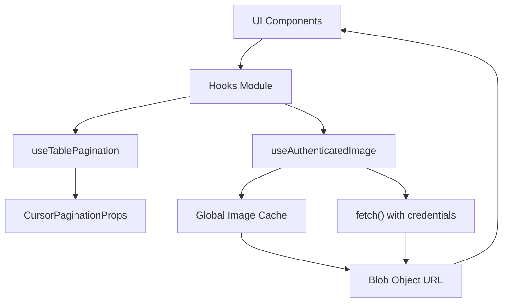
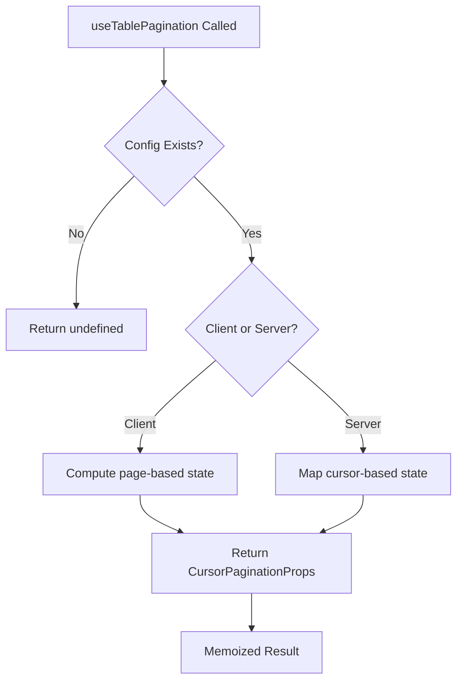
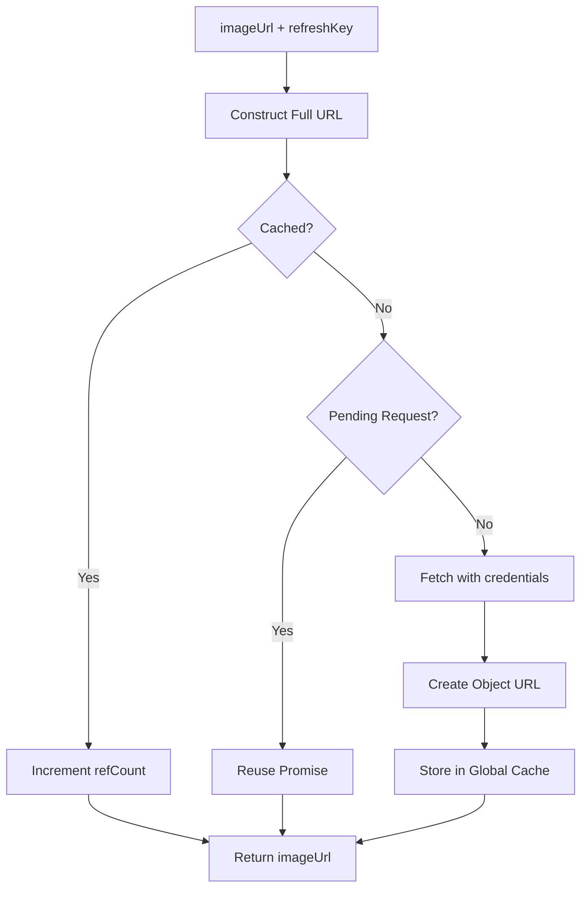
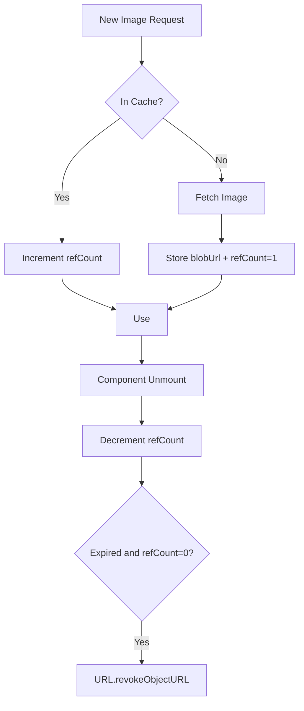
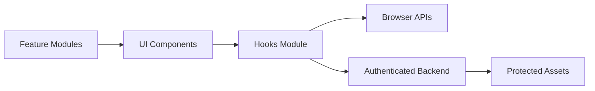

# Hooks

The **Hooks** module provides reusable React hooks that encapsulate cross-cutting UI logic for the OpenFrame frontend. These hooks abstract complex behaviors such as pagination and authenticated asset fetching into composable, framework-native primitives.

This module lives within the frontend core layer and is designed to:

- Standardize UI interaction patterns
- Reduce duplication across feature modules
- Encapsulate stateful logic behind simple interfaces
- Provide performance optimizations (memoization, caching, deduplication)

---

## Overview

The Hooks module currently includes:

- **useTablePagination** – Unified pagination adapter for client-side and server-side (cursor-based) pagination
- **useAuthenticatedImage** – Authenticated image fetching with global caching and request deduplication

These hooks are consumed by UI components (e.g., tables, image renderers) and higher-level feature modules across the frontend.

---

## Architecture



The Hooks module acts as a thin behavioral layer between UI components and browser/network APIs.

---

# useTablePagination

## Purpose

`useTablePagination` provides a **unified pagination abstraction** that supports both:

- Client-side pagination (page numbers)
- Server-side cursor pagination (GraphQL-style pageInfo)

It normalizes both modes into a single `CursorPaginationProps` structure used by pagination UI components.

---

## Supported Pagination Modes

### 1. Client-Side Pagination

Uses explicit page numbers and total page count.

Defined by:

- `currentPage`
- `totalPages`
- `onNext()`
- `onPrevious()`

### 2. Server-Side Cursor Pagination

Designed for GraphQL-style pagination with:

- `hasNextPage`
- `startCursor`
- `endCursor`
- `onNext()`
- `onReset()` (used as previous → reset to first page)

---

## Type System

The hook accepts a discriminated union:

```typescript
export type PaginationConfig =
  | ClientPaginationConfig
  | ServerPaginationConfig
```

This ensures:

- Compile-time safety
- Explicit pagination strategy
- No ambiguous runtime logic

---

## Internal Logic Flow



The hook uses `useMemo` to:

- Prevent unnecessary recalculations
- Ensure stable references when config does not change

---

## Key Design Decisions

### Unified Output Shape

Both pagination modes return `CursorPaginationProps`, allowing UI components to remain agnostic of backend strategy.

### Smart Visibility

Client pagination returns `undefined` if `totalPages <= 1`, preventing unnecessary pagination UI rendering.

### Reset-as-Previous (Server Mode)

Server pagination maps `onPrevious` to `onReset`, ensuring:

- Back navigation returns to first page
- Simplified cursor management

---

# useAuthenticatedImage

## Purpose

`useAuthenticatedImage` is a production-grade hook for fetching protected image resources.

It provides:

- Cookie-based authentication
- Optional Bearer token injection (dev mode)
- Blob URL transformation
- Global caching
- Request deduplication
- Automatic cleanup via reference counting

---

## High-Level Behavior



---

## Global Image Cache

The hook maintains two module-level maps:

- `imageCache` – Stores blob URLs with metadata
- `pendingRequests` – Prevents duplicate concurrent fetches

Each cache entry includes:

- `blobUrl`
- `timestamp`
- `refCount`

### Reference Counting

Each component using the same image:

- Increments `refCount` on mount
- Decrements `refCount` on unmount

Unused entries are cleaned when:

- `refCount === 0`
- Entry age exceeds maximum lifetime

---

## Cache Lifecycle



---

## Authentication Model

Images are fetched using:

```typescript
fetch(url, {
  credentials: 'include',
  headers
})
```

Authentication strategies:

1. **Cookie-based (default)** – Uses session cookies automatically
2. **Bearer token (dev mode)** – Reads token from localStorage

Global configuration is set via:

```typescript
configureAuthenticatedImage({
  tenantHostUrl,
  enableDevMode,
  accessTokenKey
})
```

---

## Multi-Tenant URL Resolution

The hook resolves relative paths intelligently:

- Absolute URLs → used directly
- `/api/...` → prefixed with tenant host
- `/path` → prefixed with `/api`
- Plain string → converted to `/api/{path}`

This ensures consistency across tenant-scoped deployments.

---

## Performance Optimizations

### Request Deduplication

If multiple components request the same image simultaneously:

- Only one network request is made
- Others await the same promise

### Memoization + Stable State

- React state ensures stable rendering
- URL object lifecycle is managed explicitly

### Periodic Cleanup

A timed cleanup removes expired entries and revokes blob URLs to prevent memory leaks.

---

# How Hooks Fits Into the Frontend Architecture



The Hooks module:

- Shields UI components from low-level browser and networking details
- Provides consistent UX behavior across the platform
- Improves performance through shared state and caching
- Enforces predictable pagination behavior across data sources

---

# Summary

The **Hooks** module is a foundational frontend abstraction layer that:

- Normalizes pagination across client and server modes
- Implements secure and optimized authenticated image fetching
- Centralizes performance-critical logic (memoization, caching, deduplication)
- Keeps UI components declarative and focused on presentation

By encapsulating these behaviors in well-typed hooks, the module improves maintainability, consistency, and performance across the OpenFrame frontend ecosystem.