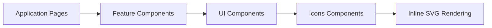
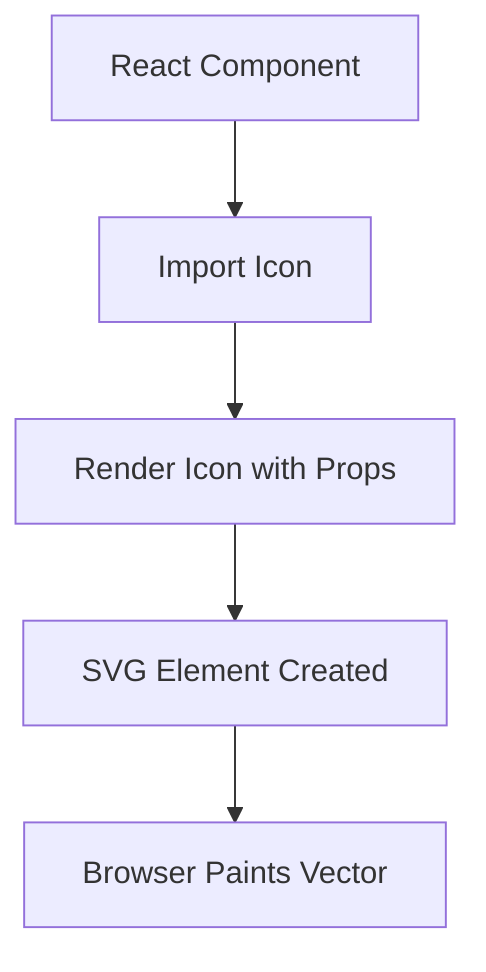

# Icons Components

## Overview

The **Icons Components** module provides reusable, type-safe React SVG components for brand logos and UI icons used across the OpenFrame frontend. These components encapsulate raw SVG markup behind a consistent TypeScript interface, ensuring:

- ✅ Visual consistency across the application
- ✅ Strong typing via `SVGProps<SVGSVGElement>`
- ✅ Configurable size, color, and className
- ✅ Easy tree-shaking and modular imports

This module currently includes:

- Brand logo icons (ClickUp, Elestio, Gemini, Google Gemini)
- Legacy and utility icons (Carta, Thumbs Down)

It is part of the `frontend-core` ecosystem and is consumed by higher-level UI, navigation, feature, and vendor components.

---

## Architectural Role

Icons Components act as **pure presentational building blocks**. They:

- Contain no business logic
- Have no external state dependencies
- Are safe to render anywhere in the React tree
- Support theming via `currentColor` or explicit `color` props

### High-Level Architecture



Icons are leaf-level UI primitives and do not depend on other frontend modules.

---

## Design Principles

### 1. Type-Safe SVG Props

Most v2-generated icons extend:

- `Omit<SVGProps<SVGSVGElement>, "width" | "height">`

This ensures:

- All standard SVG attributes are supported
- Width and height are controlled via a single `size` prop
- Consumers can pass accessibility attributes (`aria-*`, `role`, etc.)

### 2. Unified Sizing Model

All modern icons support:

- `size?: number` (default: `24`)

Which maps internally to:

```text
width={size}
height={size}
```

This enforces square scaling and predictable layout behavior.

### 3. Theming via Color

Icons typically default to:

```text
color = "currentColor"
```

This allows icons to inherit text color from CSS context.

For multicolor brand logos, gradients and masked paths are defined directly within the SVG.

---

## Provided Icon Components

### Brand Logos (icons-v2-generated)

These are auto-generated or standardized brand SVG components.

| Component | Description |
|------------|-------------|
| `ClickupLogoIcon` | ClickUp brand logo with gradient fills |
| `ElestioLogoIcon` | Full-color Elestio logo |
| `ElestioLogoGreyIcon` | Monochrome/grey variant of Elestio logo |
| `GeminiLogoIcon` | Gemini brand logo with advanced filters |
| `GoogleGeminiLogoIcon` | Google Gemini variant logo |

#### Characteristics

- Use SVG `<defs>`, `<linearGradient>`, `<filter>`, and `<mask>`
- Support `className`, `size`, `color`
- Encapsulate complex SVG definitions internally

---

### Legacy / Utility Icons

| Component | Notes |
|------------|-------|
| `CartaIcon` | Custom brand icon with viewBox-based scaling |
| `ThumbsDownIcon` | Deprecated icon (use icons-v2-generated instead) |

The `ThumbsDownIcon` includes a deprecation notice and should not be used in new code.

---

## Component Structure Pattern

A typical v2 icon follows this structure:

```typescript
import type { SVGProps } from "react";

export interface ExampleIconProps
  extends Omit<SVGProps<SVGSVGElement>, "width" | "height"> {
  className?: string;
  size?: number;
  color?: string;
}

export function ExampleIcon({
  className = "",
  size = 24,
  color = "currentColor",
  ...props
}: ExampleIconProps) {
  return (
    <svg
      width={size}
      height={size}
      className={className}
      {...props}
    >
      {/* SVG paths here */}
    </svg>
  );
}
```

This pattern ensures:

- Clean prop forwarding
- Default configuration
- Consistent API across all icons

---

## Rendering Flow



Icons render inline SVG, meaning:

- No external HTTP requests
- Fully styleable via CSS
- Resolution-independent scaling

---

## Accessibility Considerations

Because icons extend `SVGProps`, consumers may pass:

- `aria-label`
- `role="img"`
- `aria-hidden="true"`
- `focusable="false"`

For decorative icons, recommended usage:

```text
aria-hidden="true"
```

For meaningful brand icons, provide:

```text
role="img"
aria-label="ClickUp"
```

---

## Performance Characteristics

- ✅ Inline SVG eliminates network fetches
- ✅ Tree-shakeable ES module exports
- ✅ Small runtime footprint
- ✅ No React hooks or state

Even complex icons (e.g., Gemini with filters and gradients) remain lightweight because they are static SVG definitions.

---

## Usage Guidelines

### ✅ Recommended

- Use v2-generated icons for all new development
- Prefer `currentColor`-based theming
- Keep icon size consistent within UI sections

### ❌ Avoid

- Directly embedding raw SVG markup repeatedly
- Modifying generated SVG definitions manually
- Introducing new legacy-style icons

---

## Future Evolution

The Icons Components module may evolve to include:

- Centralized icon registry
- Dynamic icon loading
- Design-token driven color integration
- Automatic accessibility wrappers

Currently, it remains a minimal, stable foundation layer for visual identity and UI symbolism within OpenFrame.

---

## Summary

The **Icons Components** module is a low-level, dependency-free visual primitive layer in the frontend architecture. It standardizes SVG rendering, enforces a consistent prop API, and provides brand-safe implementations of commonly used logos and utility icons.

By isolating icon logic into dedicated components, OpenFrame ensures consistency, maintainability, and strong typing across the entire UI ecosystem.