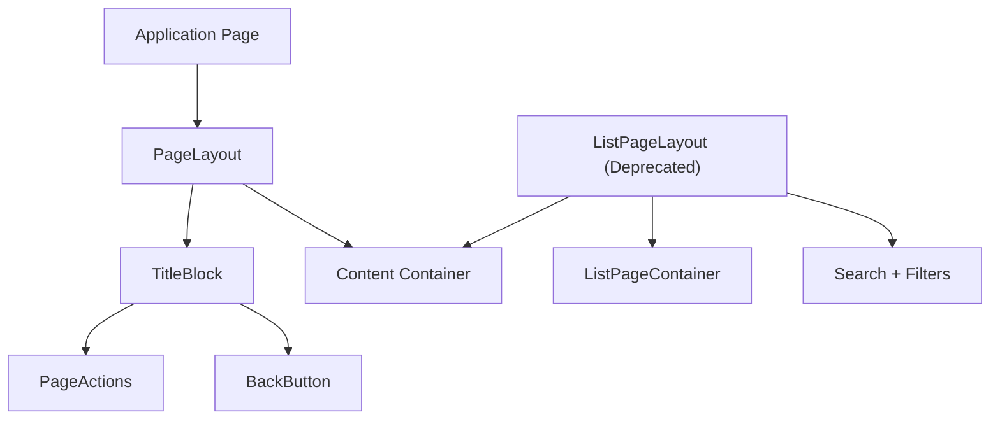
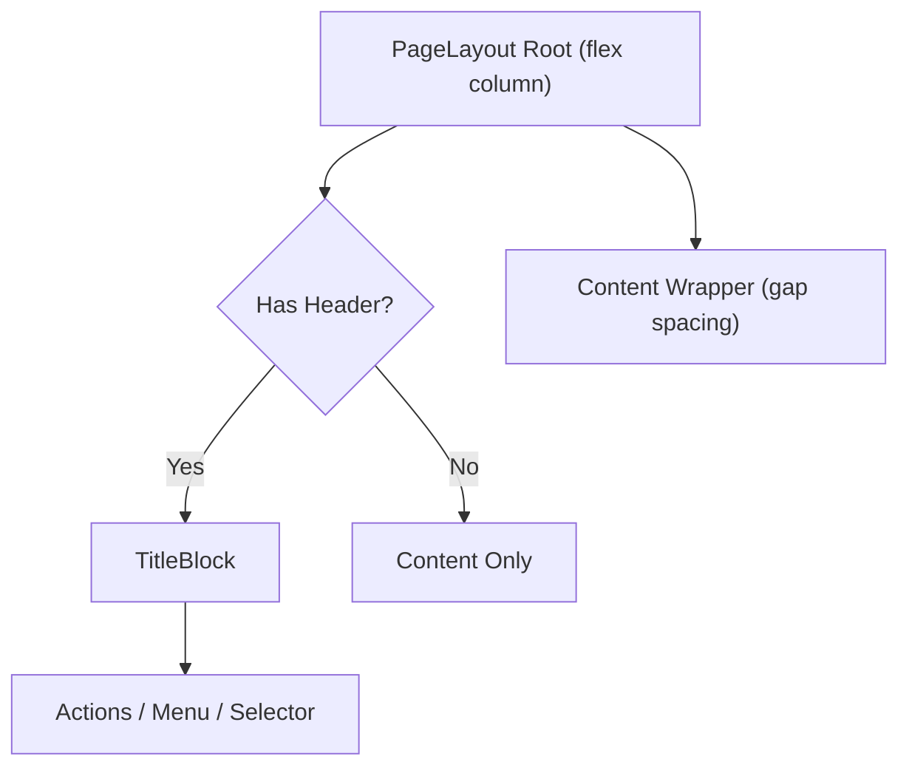
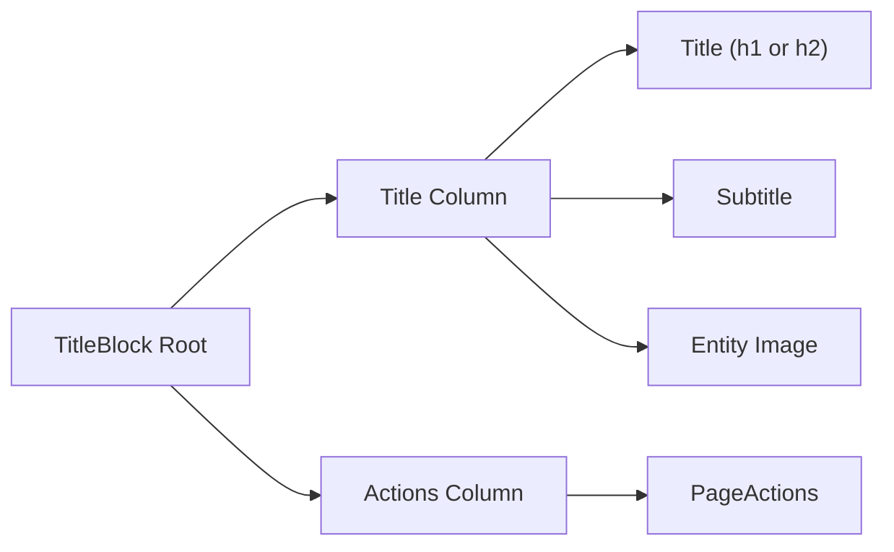
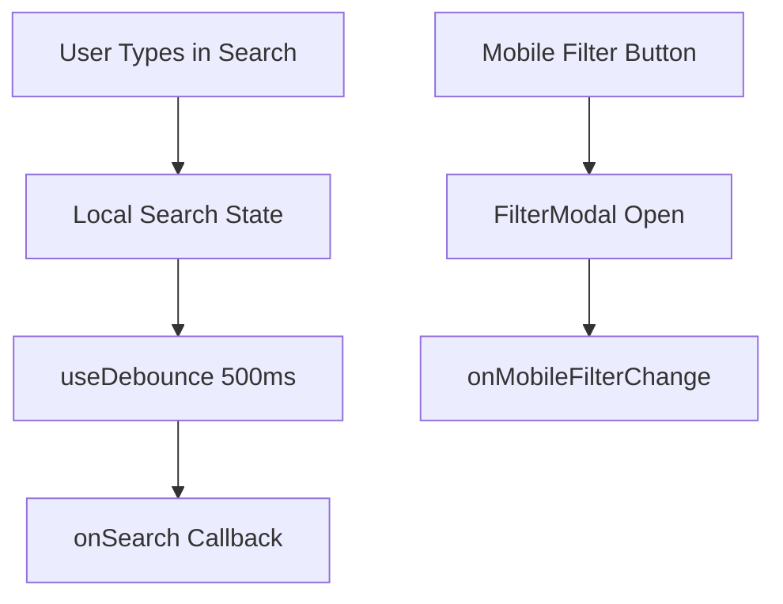
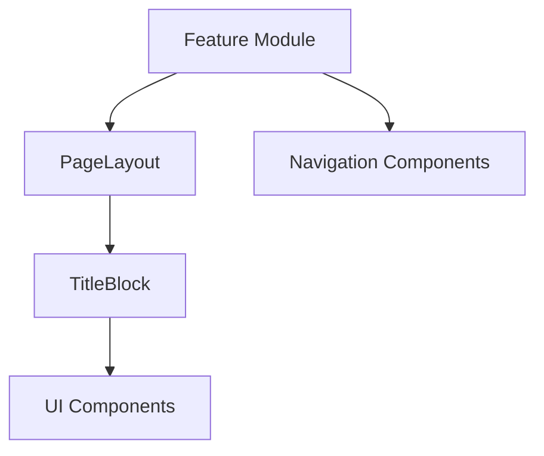

# Layout Components

The **Layout Components** module defines the canonical page chrome for OpenFrame frontend surfaces. It provides the structural building blocks that ensure consistent page headers, spacing, and content containers across the application.

This module is part of the Frontend Core layer and is responsible for:

- Standardizing page structure (header + content)
- Enforcing consistent spacing and typography
- Managing page-level actions and navigation affordances
- Providing list-oriented layouts with integrated search and filtering

The module contains three primary components:

- `PageLayout`
- `TitleBlock`
- `ListPageLayout` (deprecated in favor of `PageLayout`)

---

## Architectural Overview

At runtime:

1. A feature page (e.g., Devices, Tickets, Logs) renders `PageLayout`.
2. `PageLayout` conditionally renders a `TitleBlock`.
3. `TitleBlock` manages title, subtitle, image, back button, and actions.
4. The content area renders feature-specific UI (tables, forms, dashboards).

`ListPageLayout` wraps a legacy list pattern (title + search + filters + table) and delegates container responsibilities to `ListPageContainer`.

---

# PageLayout

**Source:** `page-layout.tsx`  
**Props Interface:** `PageLayoutProps`

`PageLayout` is the canonical, frozen page container used across OpenFrame surfaces. It provides:

- A consistent vertical structure
- A standardized header (via `TitleBlock`)
- Configurable action variants
- Optional selector slot (e.g., tab controls)
- Controlled spacing between header and content

## Responsibilities

- Render `TitleBlock` when header content is present
- Normalize spacing using design system tokens
- Support multiple action presentation styles:
  - `icon-buttons`
  - `primary-buttons`
  - `menu-primary`
- Maintain layout stability during loading states

## Structural Model

## Key Design Principles

- **Frozen Contract**: The markup and typography are intentionally locked to prevent unintended cross-application visual regressions.
- **Default-Preserving Extensions**: New props (e.g., `titleSize`, `titleWrap`, `loading`) are additive and must not alter existing behavior.
- **Responsive Integrity**: Header and actions wrap intelligently at `md+` breakpoints without breakpoint stacking regressions.

---

# TitleBlock

**Source:** `title-block.tsx`  
**Props Interface:** `TitleBlockProps`

`TitleBlock` is the visual header unit rendered by `PageLayout`. It encapsulates:

- Title (H1 or H2 variant)
- Subtitle
- Optional entity image
- Back button
- Action buttons or menu
- Optional selector (desktop-only)

## Layout Behavior

### Important Characteristics

- Uses `text-h2` as the frozen default baseline.
- `titleSize="h1"` opt-in allows larger typography without affecting existing callers.
- `titleWrap` allows multiline wrapping for CMS-driven titles.
- `loading` mode renders skeleton text while preserving exact header height.
- Minimum height is enforced via `TITLE_BLOCK_MIN_HEIGHT` to align with action button height.

This guarantees visual consistency across:

- Standard application pages
- Documentation pages
- Developer sections
- Hub surfaces

---

# ListPageLayout (Deprecated)

**Source:** `list-page-layout.tsx`  
**Props Interface:** `ListPageLayoutProps`

> ⚠️ Deprecated: Use `PageLayout` instead.

`ListPageLayout` provides a structured layout specifically for list-driven pages such as:

- Devices
- Logs
- Scripts
- Chats
- Policies

## Built-in Features

- Title + header actions
- Full-width search bar with debounce (500ms)
- Optional mobile filter modal
- Integrated error handling (`PageError`)
- Configurable padding and background
- Sticky header option

## Search + Filter Flow

### Behavior Details

- Maintains a local search value synchronized with controlled external state.
- Triggers `onSearch` only after debounce stabilization.
- Displays `FilterModal` only when filter groups or sort configuration exist.
- Renders `PageError` early if an error string is provided.

---

# Interaction with Other Modules

Layout Components form the structural foundation used by many other Frontend Core modules:

- Navigation elements from **Navigation Components** integrate via `TitleBlock` actions and selectors.
- Controls from **UI Components** populate header actions and page content.
- Feature-specific modules (Tickets, Devices, Monitoring, etc.) render their domain UI inside `PageLayout`.

Conceptually:

The Layout Components module does not contain business logic. It strictly governs structural composition and visual consistency.

---

# Design Guarantees

The module enforces the following invariants:

- Consistent vertical rhythm using design tokens
- Stable header height across loading and loaded states
- Predictable action placement and wrapping
- No silent visual regressions through uncontrolled refactors
- Backward-compatible extension through additive props only

Because these components are widely consumed, changes must be treated as high-impact and require explicit approval.

---

# Summary

The **Layout Components** module defines the canonical page chrome for OpenFrame:

- `PageLayout` — The primary page container.
- `TitleBlock` — The frozen, consistent header unit.
- `ListPageLayout` — A legacy list-oriented layout wrapper.

Together, they ensure that every page in OpenFrame shares a consistent, accessible, and design-system-aligned structure while allowing feature teams to focus purely on domain-specific UI.