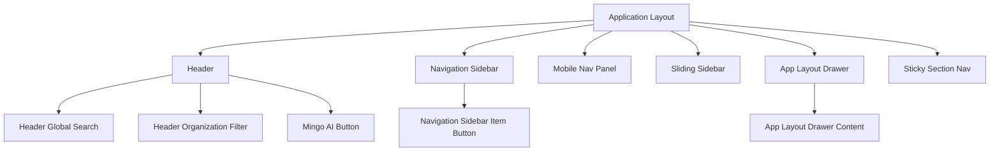
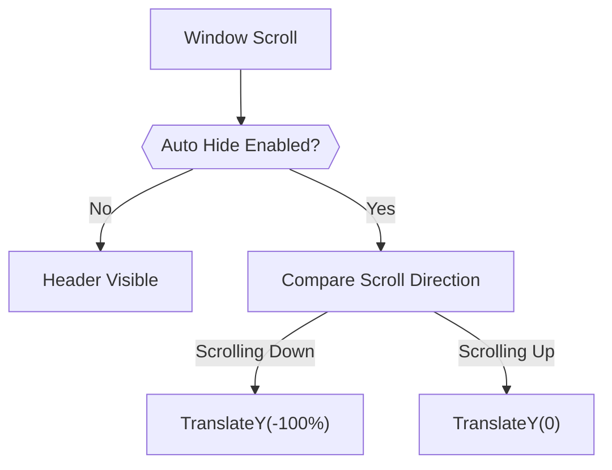
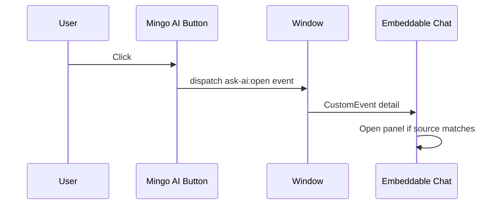
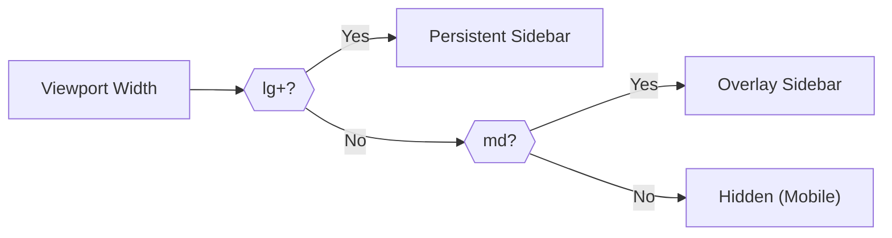
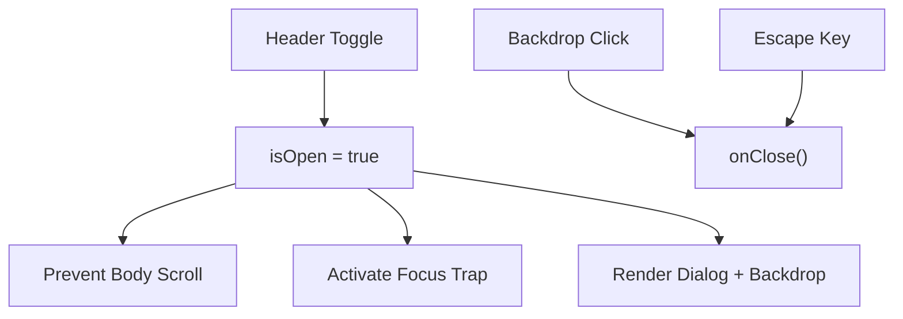
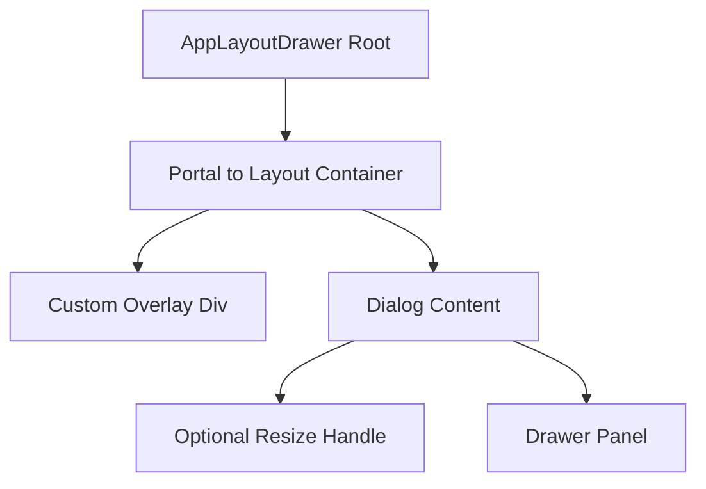
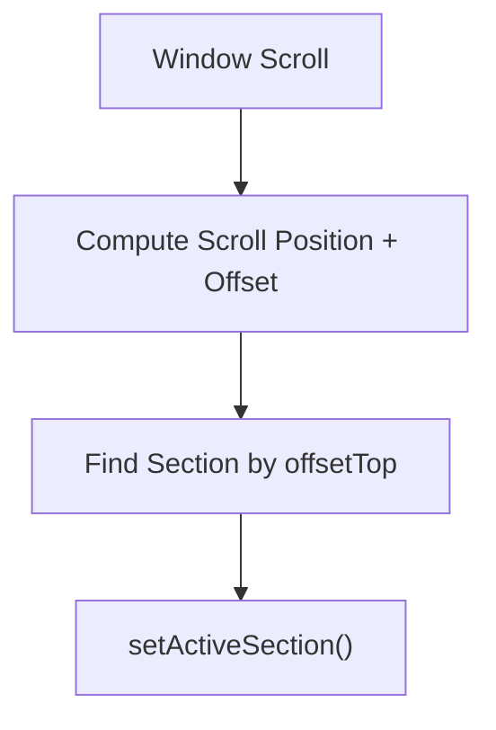

# Navigation Components

The **Navigation Components** module provides the structural and interactive navigation building blocks used across the OpenFrame frontend. It defines the header, sidebars, mobile navigation, sticky section navigation, and in-layout drawers that compose the overall application shell.

This module is part of `frontend-core` and is consumed by higher-level applications such as `openframe-oss-frontend`. It focuses on:

- Global header rendering and behavior
- Desktop and mobile navigation patterns
- Sidebar layouts (persistent and sliding)
- In-layout drawer infrastructure
- Section-based sticky navigation
- AI launcher integration (Mingo AI)

The components are designed to be:

- ✅ Responsive (mobile, tablet, desktop aware)
- ✅ Accessible (ARIA, focus management, inert usage)
- ✅ Layout-aware (header height measurement, container portals)
- ✅ Composable via configuration objects (`HeaderConfig`, `NavigationSidebarConfig`, etc.)

---

## Architecture Overview

At runtime, the Navigation Components form the application shell around feature modules.

### Key Design Principles

1. **Config-Driven Rendering**  
   The header and sidebars render from configuration objects rather than hardcoded routes.

2. **Viewport-Aware Behavior**  
   Media query hooks (`useMdUp`, `useLgUp`) and breakpoints dynamically adjust layout behavior.

3. **Layered Z-Index System**  
   Overlays and panels use carefully defined z-index tiers to coexist with modals, headers, and footers.

4. **Accessibility-First**  
   - `role="dialog"` where appropriate
   - `aria-controls`, `aria-expanded`, `aria-current`
   - `inert` to prevent focus leakage
   - Focus traps for overlays

---

# Core Components

## 1. Header

**Component:** `Header`  
**Props Interface:** `HeaderProps`

The Header is the top-level navigation bar. It supports:

- Logo and left actions
- Configurable navigation (left, center, or right aligned)
- Right-side action cluster
- Mobile hamburger toggle
- Optional Mingo AI launcher
- Auto-hide on scroll

### Behavior Model

### Notable Capabilities

- **Custom Dropdowns** with internal open state
- Uses `inert` instead of `aria-hidden` to prevent accessibility violations
- Breakpoint alignment (`lg`) ensures desktop nav and mobile toggle never co-show
- Configurable background (opaque by default to avoid unnecessary backdrop blur)

---

## 2. Header Global Search

**Component:** `HeaderGlobalSearch`  
**Props Interface:** `HeaderGlobalSearchProps`

A controlled/uncontrolled hybrid search input rendered inside the header.

### Features

- Controlled (`value` + `onChange`) or internal state fallback
- `onSubmit` callback on form submit or Enter key
- Fully flexible styling via `className`
- Uses design-system typography and tokens

This component is presentation-focused and delegates search logic to the host application.

---

## 3. Header Organization Filter

**Component:** `HeaderOrganizationFilter`  
**Props Interface:** `HeaderOrganizationFilterProps`

A dropdown-based organization selector typically used in multi-tenant or multi-organization contexts.

### Responsibilities

- Displays selected organization
- Shows device counts
- Emits `onOrgChange(id)` events
- Provides an "All Organizations" fallback

Built on top of the shared `DropdownMenu` UI primitives.

---

## 4. Mingo AI Button

**Component:** `MingoAiButton`  
**Props Interface:** `MingoAiButtonProps`

The marketing-header AI launcher button.

### Integration Model

### Key Characteristics

- Stateless event dispatcher
- Emits `ask-ai:open` `CustomEvent`
- Supports server-configured icon and label
- Full-height flush header layout
- Accent glow + shimmer animation styling

---

## 5. Navigation Sidebar (Desktop + Tablet)

**Component:** `NavigationSidebar`  
**Props Interface:** `NavigationSidebarProps`

Primary vertical navigation used in application dashboards.

### Layout Modes

- **Desktop (lg+)** → Push layout (fixed width)
- **Tablet (md only)** → Overlay mode (floats above content)
- **Mobile (< md)** → Hidden (replaced by MobileNavPanel)

### State Model

- Desktop minimized state persisted in `localStorage`
- Tablet minimized state in-memory only
- Escape closes overlay mode
- Backdrop scrim in tablet mode

### Child Component

- `NavigationSidebarItemButton`
  - Handles active state
  - Supports unread counters
  - Icon cloning for state-based color changes
  - `aria-current="page"` for accessibility

---

## 6. Mobile Nav Panel

**Component:** `MobileNavPanel`  
**Props Interface:** `MobileNavPanelProps`

Full-screen floating mobile navigation dialog.

### Features

- Backdrop overlay
- Scroll lock via `usePreventScroll`
- Focus trap via `useFocusTrap`
- Dynamic header height offset
- Sectioned navigation layout
- Safe-area-aware footer padding

---

## 7. Sliding Sidebar

**Component:** `SlidingSidebar`  
**Props Interface:** `SlidingSidebarProps`

Animated overlay sidebar powered by `framer-motion`.

### Distinct Characteristics

- Uses spring animation
- Supports nested expandable navigation items
- Non-modal dialog (header remains interactive)
- Uses `inert` when closed
- Reduced-motion support via `useReducedMotion`

This component is typically used in admin or contextual navigation flows.

---

## 8. App Layout Drawer

**Component:** `AppLayoutDrawer` + `AppLayoutDrawerContent`  
**Props Interface:** `AppLayoutDrawerContentProps`

An in-layout drawer that renders inside the main content container rather than at the viewport root.

### Architectural Differences vs Standard Drawer

1. Portals into the AppLayout container (not `document.body`)
2. Uses `absolute` positioning (not `fixed`)
3. Non-modal by default (`modal={false}`)
4. Custom overlay implementation

### Advanced Features

- Resizable panels (horizontal or vertical)
- Container-aware clamping
- Persisted size via `localStorage`
- Optional `keepMounted` mode
- `dismissOnInteractOutside` control
- Debug layout shift instrumentation
- Mobile breakpoint auto-disables resizing

This component enables contextual side panels (e.g., details, settings, inspectors) while keeping the header and sidebar interactive.

---

## 9. Sticky Section Nav

**Component:** `StickySectionNav`  
**Hook:** `useSectionNavigation`

Reusable vertical section navigation with scroll spy behavior.

### Hook Behavior

### Capabilities

- Active section highlighting
- Ribbon accent indicator
- Smooth scroll via shared `scrollElementIntoView`
- Throttled scroll listener
- Offset-aware (header height)

Used in:

- Documentation pages
- Vendor detail views
- Knowledge base
- Long-form content pages

---

# Interaction with Other Modules

The Navigation Components module integrates with:

- **UI Components** (Buttons, Dropdowns, Drawer primitives)
- **Hooks** (`useMediaQuery`, `usePreventScroll`, `useFocusTrap`, `useHeaderHeight`)
- **Types Module** (`HeaderConfig`, `NavigationItem`, `NavigationSidebarConfig`)
- **Embeddable Chat / Mingo systems** via custom events

It does **not** contain routing logic. Navigation decisions are delegated to:

- `config.onNavigate`
- `href` props
- Application-level router integration

---

# Summary

The **Navigation Components** module defines the structural backbone of the OpenFrame frontend.

It provides:

- A fully configurable header
- Responsive sidebars (persistent, overlay, sliding)
- Mobile-first navigation panel
- In-layout drawers for contextual UI
- Sticky section navigation for long pages
- Integrated AI launcher surface

Together, these components create a consistent, accessible, and extensible navigation framework that higher-level applications can configure without re-implementing layout primitives.
