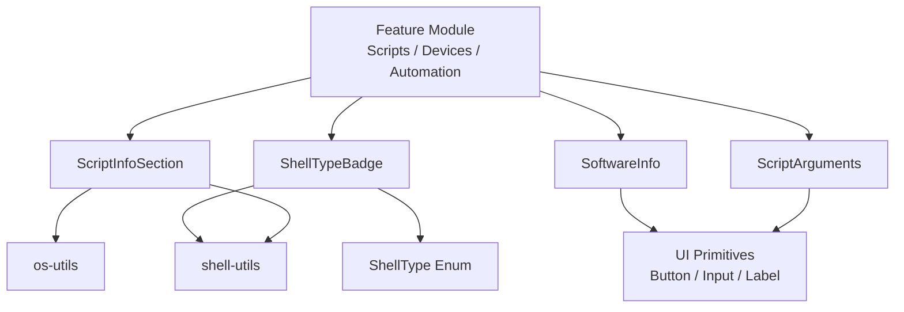
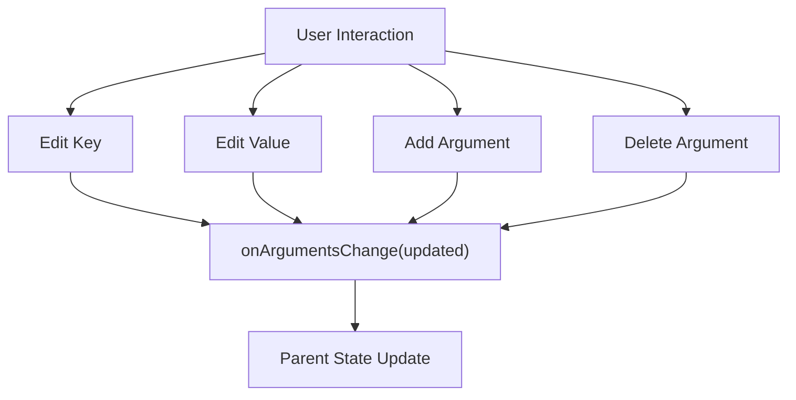
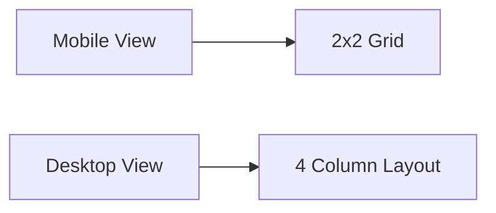
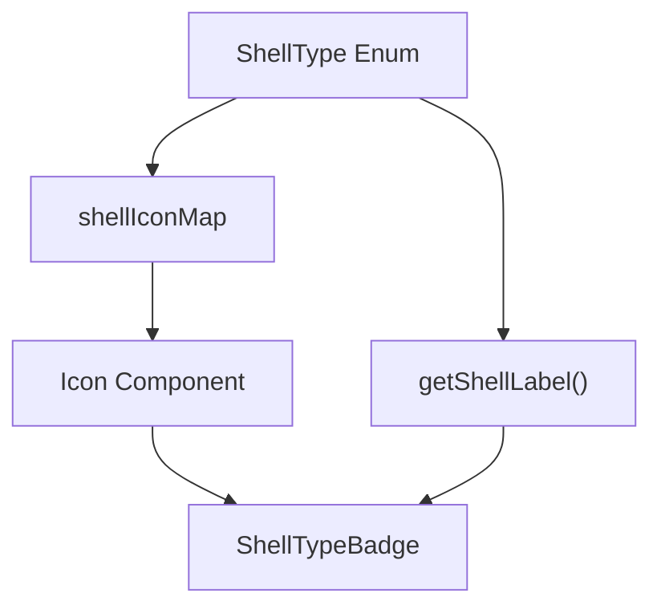
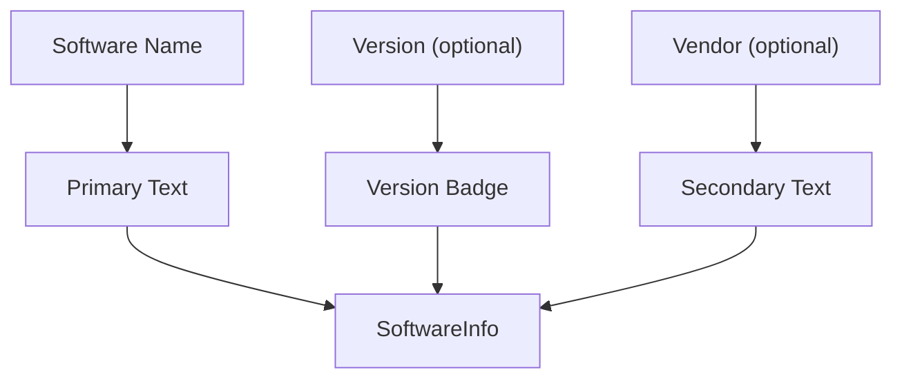
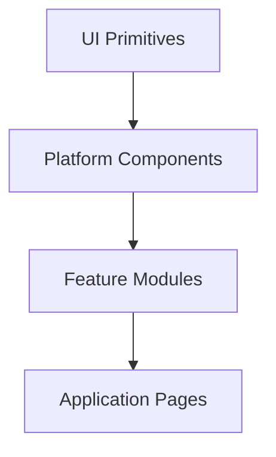

# Platform Components

The **Platform Components** module provides reusable, design-system-aligned UI building blocks for representing platform-level entities in the OpenFrame frontend. These components focus on:

- Script metadata and execution configuration
- Shell/runtime representation
- Software and vendor information display
- Consistent layout patterns for platform artifacts

This module lives within the frontend core and is primarily consumed by features such as Scripts, RMM management, device tooling views, and automation workflows.

---

## Architectural Role

Platform Components sit between domain-driven feature modules (e.g., Scripts, Devices, Automation) and low-level UI primitives (buttons, inputs, badges, layout containers).

They:

- Encapsulate platform-specific presentation logic (shell labels, OS labels, argument modeling)
- Normalize how scripts and software are displayed
- Provide controlled input patterns for execution configuration
- Rely on shared UI primitives and utility helpers

### High-Level Interaction Flow



---

# Core Components Overview

The Platform Components module consists of four primary components:

1. **ScriptArguments** – Interactive key-value argument editor
2. **ScriptInfoSection** – Script metadata display card
3. **ShellTypeBadge** – Typed shell badge with icon + label
4. **SoftwareInfo** – Software name, vendor, and version display

Each component follows OpenFrame Design System (ODS) styling conventions and uses shared utility helpers for consistency.

---

# ScriptArguments

## Purpose

`ScriptArguments` provides a controlled UI for managing script execution parameters as key-value pairs.

It is commonly used in:

- Script execution forms
- Scheduled task configuration
- Automation workflows
- RMM command builders

## Responsibilities

- Render a dynamic list of arguments
- Allow editing of argument keys and values
- Support flag-style arguments (empty value)
- Allow addition and deletion of arguments
- Remain fully controlled via `onArgumentsChange`

## Data Model

```text
ScriptArgument
  id: string
  key: string
  value: string
```

Each argument is uniquely identified by `id`, enabling stable rendering and updates.

## Behavioral Design

The component is fully controlled:

- Receives `arguments` as input
- Emits changes via `onArgumentsChange`
- Does not manage persistent internal state



## Design Considerations

- First row renders the `titleLabel` to reduce vertical repetition
- Uses `crypto.randomUUID()` for client-side ID generation
- Supports `disabled` mode for read-only or locked states
- Styled via ODS tokens and shared UI primitives

---

# ScriptInfoSection

## Purpose

`ScriptInfoSection` presents script metadata in a structured card layout.

It standardizes how scripts are displayed across:

- Script detail pages
- Marketplace views
- Execution previews
- Automation summaries

## Displayed Information

- Headline (script name)
- Subheadline (description)
- Shell type
- Supported platforms
- Category
- Author (with avatar support)

## Responsive Layout Strategy

The component adapts based on screen size:

- Mobile/Tablet: Two rows (2x2 grid)
- Desktop: Single row with four columns



## Utility Integration

- `getShellLabel()` – Converts enum value to human-readable label
- `getOSLabel()` – Converts platform key to display name

Supported platforms are formatted into a comma-separated string. If empty, the component displays:

```text
All Platforms
```

## Author Rendering

If `photoUrl` is provided, an image is shown.
Otherwise:

- Initials are derived from name
- Fallback to first two characters

---

# ShellTypeBadge

## Purpose

`ShellTypeBadge` displays a shell/runtime indicator with:

- Icon
- Human-readable label

It ensures visual consistency for all supported RMM shell types.

## Strongly Typed Mapping

The badge uses a `Record<ShellType, ShellIconConfig>` mapping to guarantee:

- Exhaustive shell coverage
- Compile-time safety when new shell types are introduced



## Supported Shell Types

Examples include:

- POWERSHELL
- CMD
- BASH
- PYTHON
- NUSHELL
- DENO
- SHELL

A default fallback icon is used if an unknown type is passed.

## Normalization

The component normalizes input using:

```text
shellType?.toUpperCase()
```

This ensures resilience against inconsistent casing from upstream data.

---

# SoftwareInfo

## Purpose

`SoftwareInfo` renders structured software metadata including:

- Software name (required)
- Vendor (optional)
- Version badge (optional)

Used in:

- Device software inventories
- Tool listings
- RMM dashboards
- Deployment summaries

## Rendering Behavior



## Visual Hierarchy

- Name → Primary emphasis
- Version → Surface badge styling
- Vendor → Muted secondary text

This ensures clarity while preserving compactness.

---

# Design Principles

Across all Platform Components, several patterns are consistently applied:

### 1. Controlled Components

Input-based components (e.g., `ScriptArguments`) are fully controlled to:

- Keep business logic in feature modules
- Enable predictable state updates
- Improve testability

### 2. Utility-Driven Labeling

Shell types and OS labels are resolved via shared utilities instead of hardcoded strings.

This ensures:

- Centralized formatting logic
- Easier localization or renaming
- Reduced duplication

### 3. ODS Styling Compliance

All components:

- Use ODS color tokens
- Respect typography scales (`text-h4`, `text-h6`)
- Follow consistent spacing patterns
- Integrate with shared UI primitives

### 4. Strict Typing

Strong TypeScript typing ensures:

- Exhaustive enum coverage
- Explicit prop contracts
- Safer refactoring

---

# How Platform Components Fit Into the System

Within the broader OpenFrame frontend architecture:

- **UI Components** provide atomic building blocks.
- **Platform Components** compose those primitives into domain-aware UI patterns.
- **Feature Modules** orchestrate state, data fetching, and workflows.



This layering ensures:

- Separation of concerns
- Reusability across features
- Consistent platform representation
- Reduced duplication in script and software UIs

---

# Summary

The **Platform Components** module standardizes how scripts, shells, and software entities are represented in the OpenFrame frontend.

By combining:

- Strong typing
- Utility-based normalization
- ODS-aligned styling
- Controlled interaction patterns

it provides a robust foundation for platform-facing features such as script management, RMM automation, and device tooling views.

These components ensure that platform artifacts are displayed consistently, configured safely, and extended predictably as the system evolves.