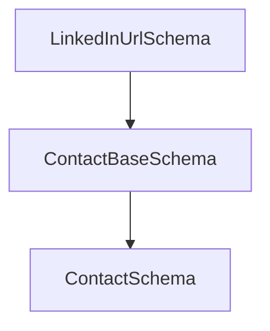
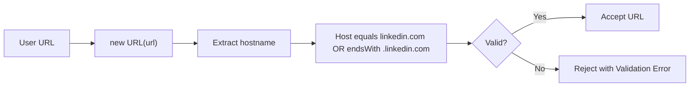
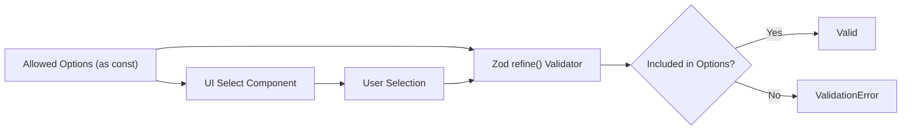
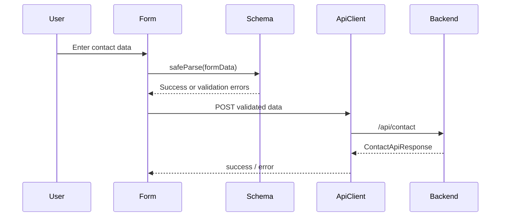
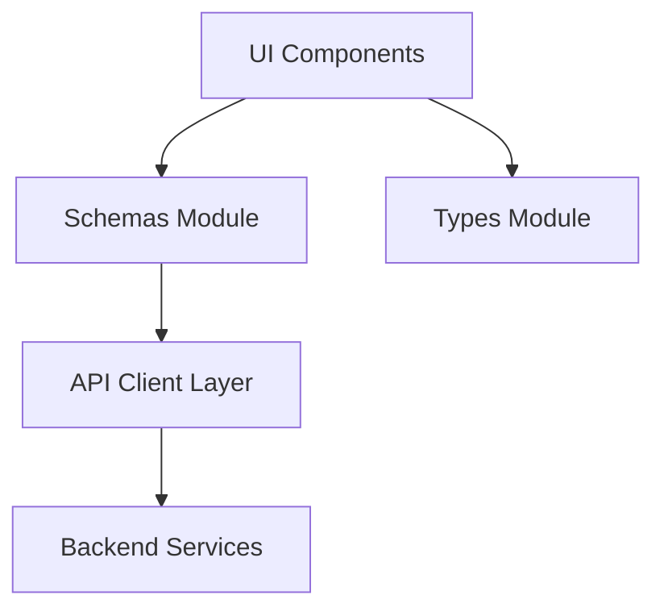

# Schemas

The **Schemas** module defines runtime validation contracts for frontend form data using Zod. It acts as the single source of truth for input validation, normalization, and API response typing for contact-style forms in the OpenFrame frontend.

While the broader type system is defined in the [Types](../types/types.md) module, Schemas focuses specifically on **runtime-safe validation**, ensuring that untrusted input (browser forms, embedded widgets, external integrations) is validated before being processed or sent to backend services.

---

## Purpose and Responsibilities

The Schemas module provides:

- ✅ Strong runtime validation using Zod
- ✅ Centralized validation rules to prevent drift
- ✅ Safe parsing with predictable field stripping
- ✅ Reusable schema building blocks
- ✅ Typed inference for form data
- ✅ Security-conscious URL validation

It is especially critical for:

- Public-facing contact forms
- Embedded contact widgets
- Partner or marketing lead capture flows
- Admin-side contact updates

---

## Core Component

### ContactApiResponse

Defined in:

```
typescript
openframe-frontend-core/src/schemas/contact-schema.ts
```

```typescript
export interface ContactApiResponse {
  success: boolean;
  error?: string;
}
```

This interface defines the API response contract returned from the `/api/contact` endpoint. It ensures predictable handling of success and error states in the frontend.

---

## High-Level Architecture

The Schemas module sits between UI form components and API clients.

```mermaid
flowchart LR
    UserInput["User Input"] --> ContactForm["Contact Form Component"]
    ContactForm --> ZodSchema["ContactSchema (Zod)"]
    ZodSchema -->|"safeParse()"| ValidatedData["Validated & Sanitized Data"]
    ValidatedData --> ApiClient["API Client"]
    ApiClient --> Backend["Backend /api/contact"]
    Backend --> ApiResponse["ContactApiResponse"]
    ApiResponse --> UIState["UI Success/Error State"]
```



### Key Properties

- Validation occurs **before API invocation**
- Invalid fields produce structured error messages
- Unknown fields are stripped automatically
- Type inference guarantees alignment between runtime and TypeScript

---

## Schema Composition Model

The module follows a layered schema-extension pattern:



### 1. LinkedInUrlSchema

Reusable URL validator enforcing:

- Valid URL format
- Hostname must equal `linkedin.com` or end with `.linkedin.com`
- Rejects adversarial substring attacks (e.g., `evil.com/linkedin.com/x`)
- Optional field

Security rationale:



This prevents incomplete substring sanitization vulnerabilities.

---

### 2. ContactBaseSchema

Shared fields across all contact-style forms:

- `name`
- `email`
- `linkedin_url`
- `helpCategory`
- `message`
- `rdt_cid` (optional tracking field)

Important design decision:

> Any field not present in this schema is silently stripped by `safeParse`.

This ensures:

- No accidental leakage of unknown fields
- Predictable backend payloads
- Explicit schema evolution

---

### 3. ContactSchema (Public API Schema)

Extends the base schema with dropdown-controlled fields:

- `companySize`
- `referralSource`

Both fields:

- Are optional
- Must match predefined allowed-value constants
- Use `.refine()` to enforce membership

---

## Allowed-Value Constants

The module exports immutable dropdown option arrays:

- `companySizeOptions`
- `referralSourceOptions`
- `defaultHelpCategoryOptions`

These are defined as `as const` arrays to:

- Enable literal union typing
- Prevent accidental mutation
- Maintain synchronization between UI and validation

Data integrity flow:



---

## Type Inference Strategy

The module leverages Zod inference:

```typescript
export type ContactFormData = z.infer<typeof ContactSchema>;
```

Benefits:

- Runtime schema is the source of truth
- TypeScript types cannot drift from validation logic
- Reduces duplication between interface and validator

Relationship with Types module:

- Schemas → runtime validation
- Types → structural and domain modeling

See: [Types](../types/types.md)

---

## Data Flow: End-to-End Contact Submission



Key guarantees:

- Backend only receives validated data
- Error messages are deterministic
- Validation rules are centralized

---

## Security Considerations

### 1. Hostname-Based URL Validation

Avoids substring-based validation vulnerabilities.

### 2. Field Stripping

Unknown fields are removed during parsing.

### 3. Explicit Allowed-Value Sets

Prevents:

- Arbitrary enum injection
- Dropdown spoofing
- Data pollution attacks

### 4. Maximum Length Enforcement

Mitigates:

- Oversized payload abuse
- Log amplification
- Potential DoS vectors

---

## Extending the Schemas Module

When adding a new contact-style form:

1. Extend `ContactBaseSchema`
2. Reuse `LinkedInUrlSchema`
3. Define new dropdown constants as `as const`
4. Use `.refine()` for membership enforcement
5. Export inferred types via `z.infer`

Example pattern:

```typescript
export const CustomContactSchema = ContactBaseSchema.extend({
  customField: z.string().min(1),
});

export type CustomContactData = z.infer<typeof CustomContactSchema>;
```

---

## How Schemas Fits Into the Frontend System



### Separation of Concerns

| Layer | Responsibility |
|--------|----------------|
| UI | Collect user input |
| Schemas | Validate and sanitize |
| Types | Provide structural typing |
| API Client | Transport data |
| Backend | Persist and process |

---

## Summary

The **Schemas** module is the runtime validation backbone of the frontend contact system. It ensures:

- Consistent validation rules
- Security-safe URL handling
- Dropdown integrity
- Strict data contracts
- Alignment between runtime validation and TypeScript types

By centralizing validation logic and enforcing composable schema patterns, the module prevents drift, improves maintainability, and protects the application from malformed or adversarial input.