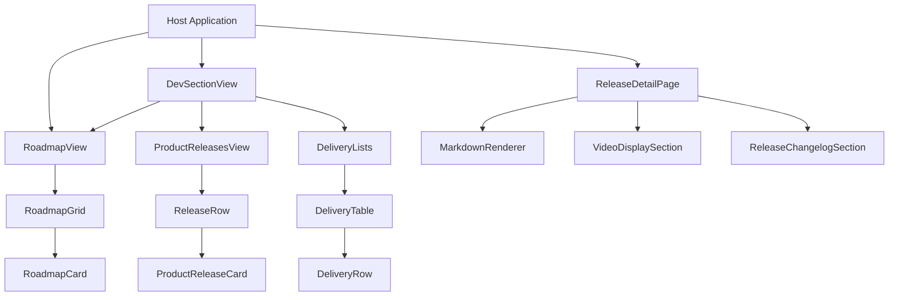
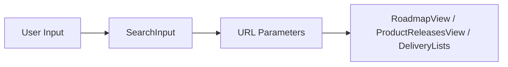
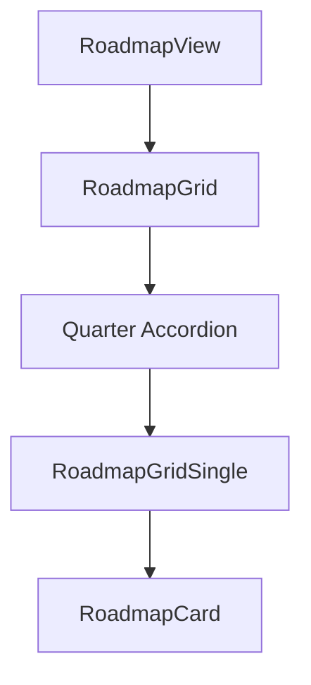
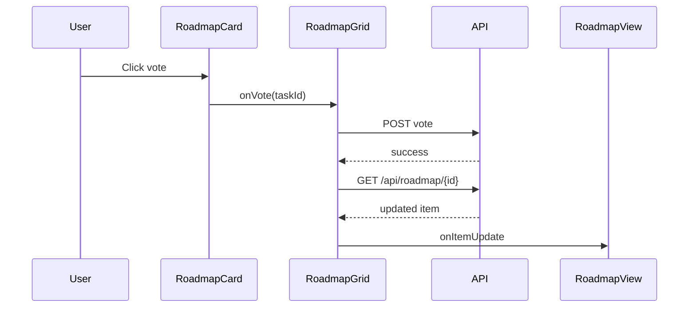
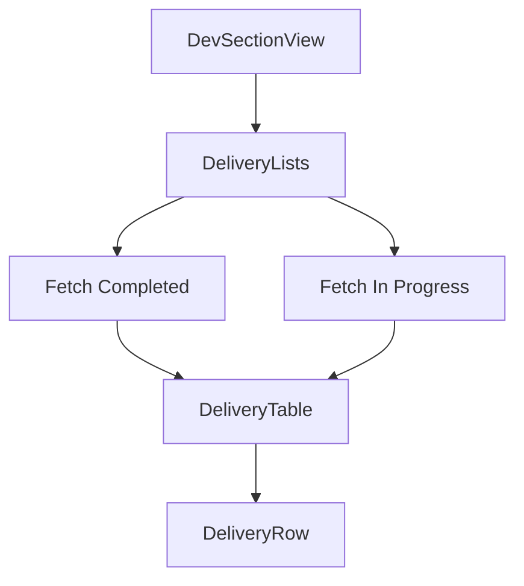
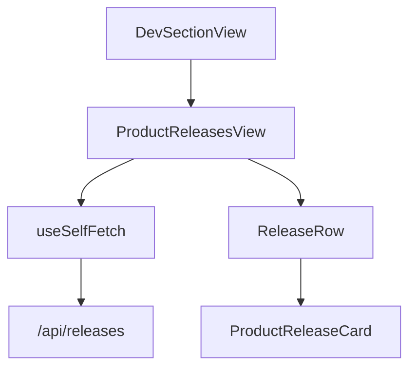
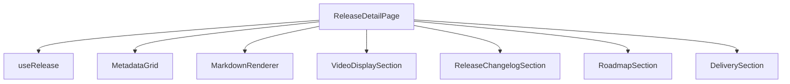
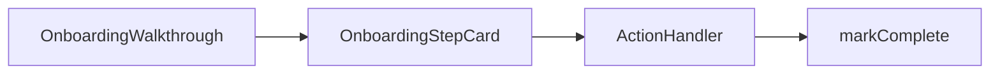
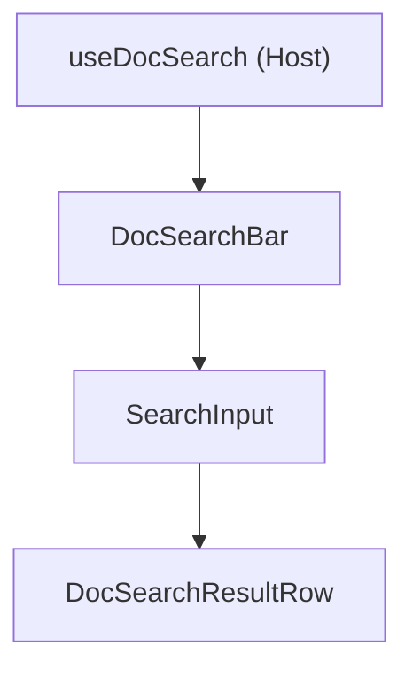
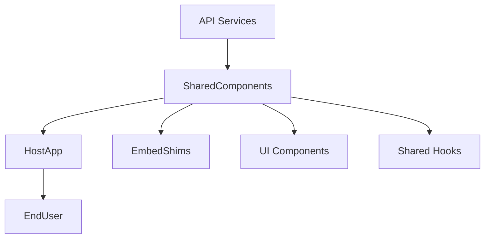

# Shared Components

The **Shared Components** module provides reusable, platform-agnostic React components that power content detail pages, roadmap and delivery surfaces, onboarding flows, search experiences, and product release views across OpenFrame.

It acts as the visual and behavioral foundation for:

- Product Releases (list + detail pages)
- Roadmap (quarter-grouped voting grid)
- Delivery / Bug Fix tracking
- Onboarding walkthroughs
- Document search (RAG-style dropdown)
- Shared metadata and layout primitives

These components are intentionally decoupled from application-specific state (e.g., React Query, routing implementations, or hub-only context). Instead, they rely on:

- Injected hooks (e.g., `useRelease`)
- Runtime adapters (e.g., embed-shims)
- Explicit API endpoints
- Controlled props for host customization

---

## Architectural Overview

The Shared Components module sits between platform-specific application code and low-level UI primitives.

### Key Architectural Principles

1. **Self-contained list views**  
   Components like `RoadmapView`, `ProductReleasesView`, and `DeliveryLists` fetch their own data using shared utilities (`useSelfFetch`, `contentFetch`).

2. **Injectable behavior**  
   Complex pages such as `ReleaseDetailPage` accept injectable hooks and sub-components (e.g., `useRelease`, `VideoDisplaySection`) to remain framework-agnostic.

3. **URL-driven state**  
   Filtering and pagination are controlled via URL parameters written by `DevSectionView` and read by list components.

4. **Embed-safe rendering**  
   All routing and image components use embed shims instead of directly importing framework-specific primitives.

---

# Core Component Groups

## 1. Dev Section Framework

### DevSectionView

`DevSectionView` is the canonical chrome wrapper for all development-facing sections (Roadmap, Delivery, Releases).

It owns:

- Section title / hero rendering
- Search input wiring
- Filter controls
- URL parameter synchronization
- Layout spacing consistency

This guarantees a single source of truth for:

- `?search=` parameters
- Status filters (e.g., `?status=working`)
- Page numbers

All consuming list components reactively refetch when these parameters change.

---

## 2. Roadmap System

### RoadmapView

A self-contained roadmap list surface that:

- Fetches roadmap items
- Reacts to URL filters
- Delegates rendering to `RoadmapGrid`

### RoadmapGrid

Supports two modes:

- **Grouped mode** (default for full-page roadmap):
  - Buckets items by quarter (e.g., "Q3 2026")
  - Sorts chronologically
  - Renders collapsible accordions

- **Flat grid mode** (for related-content rails)

Voting state is shared across all quarters to avoid race conditions.

### Voting Flow

This ensures optimistic UI consistency without global state libraries.

---

## 3. Delivery (Bug Fix & Enhancement Tracking)

### DeliveryLists

Self-contained component responsible for:

- Reading search + task-type filters from URL
- Fetching completed and in-progress tasks
- Rendering two tables
- Handling empty and error states

### DeliveryRow

Single source of truth for rendering a delivery task row:

- Title
- Status badge
- Task-type badge
- Relative time metadata
- Deep-link anchor support

It is reused by:

- Delivery list page
- Linked delivery cards on ticket surfaces

---

## 4. Product Releases

### ProductReleasesView

A fully self-contained releases list that:

- Fetches paginated releases
- Maintains fixed-height slot layout
- Delegates card rendering to `ProductReleaseCard`
- Handles pagination and empty states

### ReleaseDetailPage

A highly configurable detail page surface.

Responsibilities:

- Fetch release data via injected `useRelease`
- Render metadata grid
- Render markdown content
- Render video section (injectable)
- Render changelog sections
- Fetch linked roadmap + delivery tasks

The design allows:

- SSR hydration via `initialData`
- Embed usage without framework lock-in
- Host-specific overrides of rendering behavior

---

## 5. Onboarding System

### OnboardingWalkthrough

High-level onboarding container that:

- Manages step state (complete / skipped)
- Syncs completion from external hooks
- Prevents race conditions
- Handles dismissal logic

### OnboardingStepCard

Individual step card with:

- Completed / Skipped states
- Loading placeholders
- Action + Skip buttons

State is persisted via `useOnboardingState`, ensuring resilience across reloads.

---

## 6. Document Search

### DocSearchBar

Canonical RAG-style search dropdown component.

- Receives results from host-provided hook
- Uses shared `SearchInput`
- Renders rows via `DocSearchResultRow`

### DocSearchResultRow

Single visual contract for search result rows:

- Source icon resolution
- Title
- Breadcrumb path

Ensures consistent dropdown appearance across all search surfaces.

---

## 7. Shared Detail & Metadata Primitives

### ArticleAuthorByline

Reusable author metadata card used across:

- Blog posts
- Product releases
- Onboarding guides
- Investor updates

Key capabilities:

- Runtime-aware image proxying
- Embed-safe `<Link>` and `<Image>` shims
- Fallback bio handling
- SSR-safe date formatting (UTC normalization)

### DetailPageSkeleton

Reusable loading skeleton for detail pages.

Supports:

- Metadata grid column control
- Gallery toggle
- "Bare" mode for host-wrapped layouts

---

# Cross-Cutting Concerns

## 1. Embed Shims

All navigation and media components route through shim layers:

- `next-link` shim
- `next-image` shim
- `next-navigation` shim

This allows:

- Next.js hosts
- Non-Next embedders
- Hybrid runtime injection

Without code duplication.

---

## 2. URL-Driven Architecture

Every major list surface reads from URL parameters:

- `search`
- `status`
- `release_status`
- `task_type`
- `page`

This provides:

- Shareable deep links
- Back/forward navigation integrity
- Cross-surface linking (e.g., chat → roadmap → delivery)

---

## 3. Deep Linking via Anchors

Roadmap and Delivery rows expose deterministic DOM IDs:

- `roadmap-<id>`
- `delivery-<id>`

`useScrollToHash` polls for mount readiness and scrolls with sticky-header offsets.

---

# How Shared Components Fit into the System

The Shared Components module:

- Abstracts complex UI logic
- Standardizes UX patterns
- Reduces duplication across surfaces
- Enables embeddable, framework-flexible rendering

It is a critical layer that bridges API-driven data with consistent, reusable presentation across the OpenFrame ecosystem.
