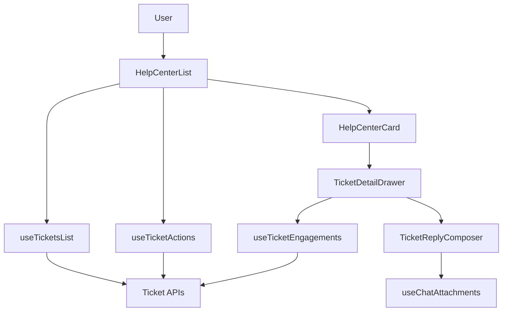
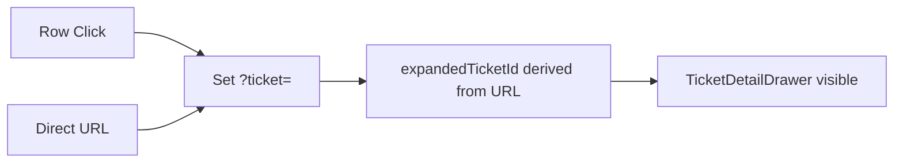
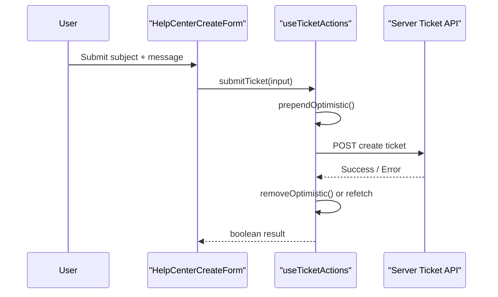
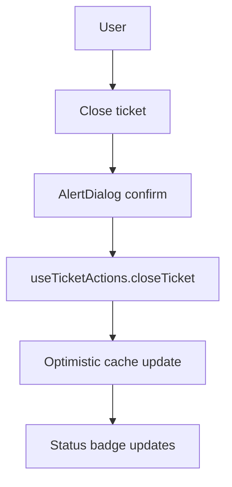

# Tickets Components

The **Tickets Components** module provides the complete customer-facing ticket management experience in OpenFrame. It includes:

- The Help Center surface (`/tickets`) with search, filtering, pagination, and deep-linking
- Ticket creation forms (new ticket)
- Ticket list rows with expandable detail drawers
- Conversation timelines (engagements)
- Reply composer with attachments and close/reopen flows
- Optimistic UI + TanStack Query cache integration

This module is part of `openframe-frontend-core` and is designed to be embedded both in the first-party OpenFrame app and in third-party host applications.

---

## 1. Architectural Overview

At a high level, Tickets Components sit between:

- **UI primitives** (Buttons, Cards, Inputs, StatusBadge, etc.)
- **Chat infrastructure** (identity, attachments, runtime endpoints)
- **TanStack Query** (data fetching + cache management)
- **Server ticket APIs** (`/api/chat/agent/*`)

### High-Level Component Graph

---

## 2. Core Surfaces

The module exposes two primary surfaces:

### 2.1 Help Center (`HelpCenterList`)

**Component:** `HelpCenterList`

This is the full `/tickets` page surface used in the OpenFrame hub and embeddable environments.

Responsibilities:

- Identity gating via `useChatIdentity`
- Reading URL params (`?search=`, `?status=`, `?page=`, `?ticket=`)
- Fetching paginated tickets via `useTicketsList`
- Managing optimistic placeholders locally (not in query cache)
- Driving the single-source-of-truth open drawer via `?ticket=<external_id>`
- Rendering:
  - `HelpCenterCreateForm` (in `preControls` slot)
  - Ticket rows (`HelpCenterCard`)
  - Pagination (`UnifiedPagination`)

### URL as State Model

Open/close state is derived from the URL:

This ensures:

- Shareable links
- Consistent behavior between click and deep link
- No duplicated local expanded state

---

### 2.2 Ticket Center (`TicketCenter`)

**Component:** `TicketCenter`

A lighter-weight embedded surface intended for host apps.

Differences from Help Center:

- No `DevSectionPage` chrome
- No search / filter / pagination
- Simpler layout with `TicketOpenForm` + list
- Local `expandedTicketId` state (no URL sync)

Both surfaces share:

- `useTicketsList`
- `useTicketActions`
- `TicketRow` / `HelpCenterCard` style expansion
- Shared `types.ts` contract

---

## 3. Ticket Creation Flow

There are two entry points:

- `HelpCenterCreateForm` (wraps `ContactForm`)
- `TicketOpenForm` (standalone simplified form)

### Help Center Create Form

**Component:** `HelpCenterCreateForm`

Key characteristics:

- Wraps canonical `ContactForm`
- Hides contact-only fields
- Injects custom `Subject` field via `extraTopField`
- Uses `actions.submitTicket(...)`
- Preserves form state on submission failure

### Submission Flow

Optimistic tickets:

- Have `_optimistic: true`
- Are not expandable
- Are stored in local state (not TanStack cache)

---

## 4. Ticket List & Drawer

### 4.1 HelpCenterCard

**Component:** `HelpCenterCard`

Represents a single row in the ticket list.

Responsibilities:

- Renders summary row via `DevCardRowContent`
- Displays status + priority badges
- Toggles expansion via URL-driven state
- Smooth-scrolls into view when expanded
- Blocks expansion for optimistic tickets

Expandable region renders:

- `TicketDetailDrawer`

---

### 4.2 TicketDetailDrawer (Conceptual)

While defined elsewhere, Tickets Components rely on it for:

- Conversation timeline
- Assigned agent display
- ClickUp linked delivery card
- Close / reopen affordances
- Reply composer

---

## 5. Conversation Timeline

### useTicketEngagements

**Hook:** `useTicketEngagements`

Fetches conversation engagements for a single ticket.

Key behaviors:

- Only enabled when drawer is open
- Uses TanStack Query
- No caching (`staleTime: 0`, `gcTime: 0`)
- Optional polling via `TICKET_LIVE_POLL_MS`
- Auth-scoped via `embedAuthedFetch`

### Engagement Model

Each engagement contains:

- `authorRole` (`customer` | `support`)
- `authorName`, `authorEmail`, `authorAvatarUrl`
- `body`
- `attachments`
- `createdAt`

This allows the drawer to render a full threaded conversation with correct role styling.

---

## 6. Reply & Close Flow

### TicketReplyComposer

**Component:** `TicketReplyComposer`

Reuses the global chat composer primitives:

- `ChatInput`
- `ChatAttachmentAddButton`
- `ChatAttachmentChipStrip`
- `useChatAttachments`

Key rules:

- Attachments-only replies allowed
- Draft preserved on failure
- Attachments cleared only on success
- Close action is reversible (not destructive style)

### Close / Reopen Lifecycle

Errors are mapped through `mapTicketActionError` and surfaced via:

- Toast
- Optional banner (reply-specific failures)
- Support-system-down global state

---

## 7. Data & Cache Model

### TicketData

Defined in `types.ts`, mirrors server projection (`find-ticket`).

Includes:

- HubSpot ticket metadata
- Assigned owner (resolved profile)
- ClickUp linked task summary
- Canonical status + pipeline stage label

### TicketsCacheSlot

Shape of TanStack Query cache entries:

- `tickets`
- `count`, `totalCount`
- `page`, `pageSize`, `totalPages`
- `scope`

All cache mutations MUST project and reassemble this structure to avoid runtime errors (previous regression: treating cache as `TicketData[]`).

---

## 8. Live Polling Strategy

Single constant:

- `TICKET_LIVE_POLL_MS = 8000`

Used for:

- List polling (status changes)
- Engagement polling (new replies)

Polling:

- Enabled only while drawer is open
- Disabled in background tabs (default Query behavior)

---

## 9. Identity & Security

Identity is provided by `useChatIdentity`.

Rules:

- Anonymous users see only an `EmptyState`
- No fetches are triggered for anon
- Ticket APIs are server-scoped to session email
- Engagement fetch verifies ticket ownership server-side

This ensures:

- No cross-customer ticket access
- No enumeration by guessing IDs

---

## 10. How Tickets Components Fit the System

Tickets Components connect:

- **Chat infrastructure** → identity, attachments, runtime endpoints
- **HubSpot backend** → ticket + engagement data
- **ClickUp integration** → linked delivery items
- **Dev Section system** → consistent UI chrome across roadmap / releases / tickets

They provide a consistent, embeddable, and URL-driven support experience that:

- Preserves shareability
- Supports optimistic UX
- Stays live-updated
- Shares primitives with chat and delivery surfaces

In short, Tickets Components are the structured support layer of OpenFrame — bridging conversational support, structured ticket workflows, and delivery tracking in a single cohesive UI module.
