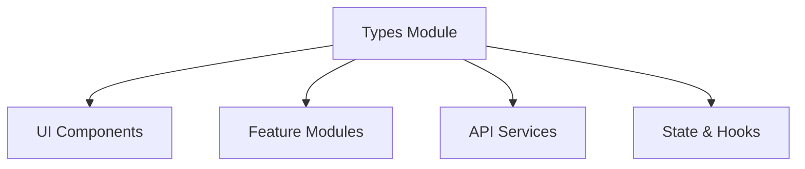
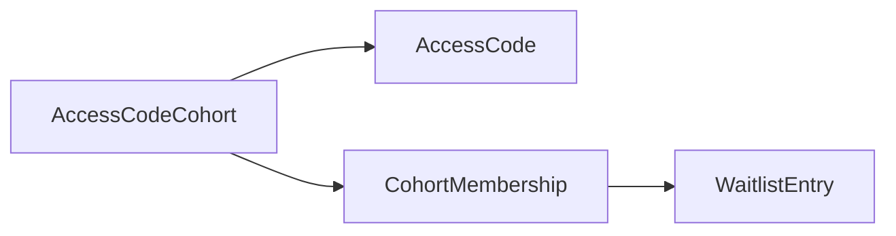
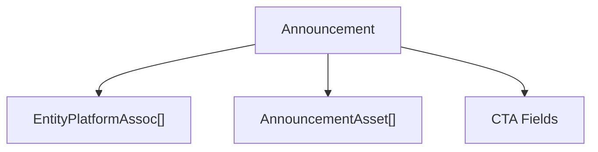
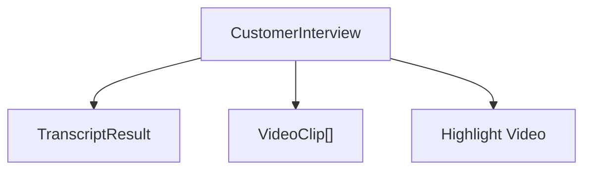
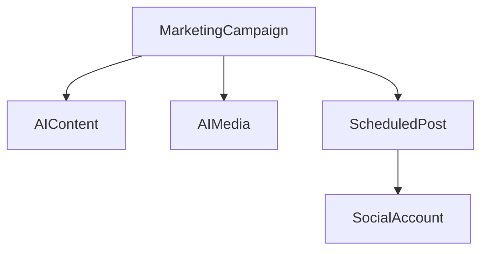
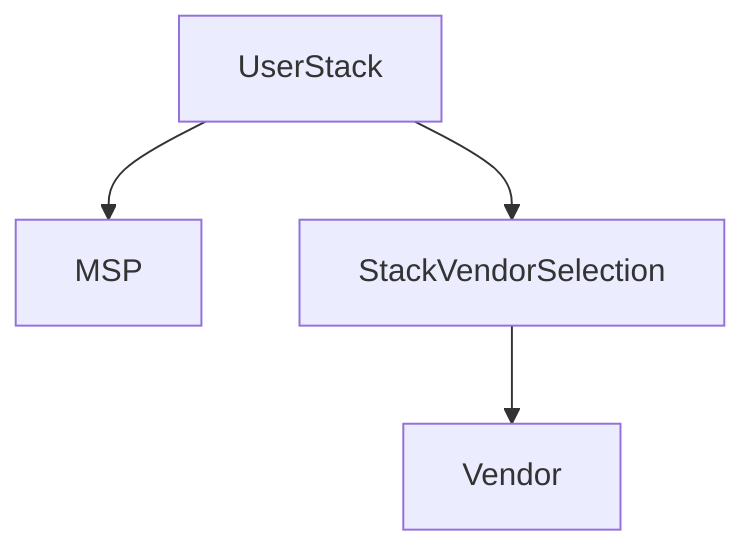

# Types

The **Types** module in `openframe-frontend-core` is the canonical source of truth for TypeScript interfaces, type aliases, enums, and shared constants used across the OpenFrame frontend ecosystem.

It defines:

- Domain models (e.g., BlogPost, CaseStudy, ProductRelease, Vendor, Stack)
- API request/response contracts
- Component prop interfaces
- Cross-cutting primitives (Platform, Media, Navigation, Permissions)
- AI/video-processing types
- Marketing and campaign data models
- Community, Slack, Team, and Profile schemas

By centralizing these contracts, the Types module ensures strong typing, consistency between UI and API layers, and safer refactoring across the platform.

---

## Architectural Role

The Types module sits at the foundation of the frontend architecture.

It is consumed by:

- UI components (cards, lists, dashboards)
- Feature modules (blog, stack builder, marketing AI, announcements)
- API services and data access layers
- Hooks and state stores
- Admin and public-facing views

### High-Level Position in Frontend Architecture

The module is **dependency-free in business logic** terms: it provides shapes and contracts but does not implement runtime behavior.

---

# Core Domain Areas

The Types module spans multiple product domains. Below is a structured breakdown of the most important areas.

---

## 1. Access Codes & Cohorts

**File:** `access-code-cohorts.ts`

Defines the onboarding and gated-access model used for waitlists and controlled launches.

### Key Types

- `AccessCodeCohort`
- `CreateAccessCodeCohort`
- `UpdateAccessCodeCohort`
- `AccessCode`
- `CohortMembership`
- `AccessCodeValidation`
- `CohortWithStats`

### Conceptual Model

This structure enables:

- Controlled cohort-based invitations
- Access code validation and consumption
- Stats aggregation (codes generated vs used)

---

## 2. Announcements System

**File:** `announcement.ts`

Defines the complete announcement lifecycle for marketing banners and admin-controlled alerts.

### Layers Covered

- Database model: `Announcement`
- API models: `CreateAnnouncementData`, `UpdateAnnouncementData`
- View contracts: `AnnouncementBarProps`, `AnnouncementFormProps`
- Filters & sorting: `AnnouncementFilters`, `AnnouncementSortOptions`

### Announcement Architecture

Notable characteristics:

- Multi-platform support via `entity_platforms`
- CTA configuration with icon + color overrides
- SSR + client-fetch modes supported in `AnnouncementBarProps`

---

## 3. Content & Publishing Domains

Several content types share common patterns: platforms, tags, SEO, publishing states, analytics.

### 3.1 Blog

**File:** `blog.ts`

Defines:

- `BlogPost`
- `BlogAuthor`
- `BlogCategory`
- `BlogTag`
- `SEOAnalysisResult`
- `BlogPagination`

Common capabilities:

- Multi-platform association
- Category & tag mapping
- SEO metadata
- Analytics counters (view_count)

---

### 3.2 Case Studies

**File:** `case-study.ts`

Extends blog-like structure with:

- Structured story sections (`challenge`, `solution`, `results`)
- AI-enhanced video processing
- Highlight video metadata
- Bidirectional link to `CustomerInterview`

---

### 3.3 Customer Interviews & AI

**Files:**
- `customer-interview.ts`
- `customer-interview-ai.types.ts`
- `video-processing.ts`

Defines full AI-driven video processing contracts.

### Video Processing Flow (Type-Level)

Shared primitives:

- `VideoTeaser`
- `TranscriptWord`
- `SpeakerMapping`
- `AIProcessingState`
- `VideoProcessingFields`

These types enable:

- Transcription (AssemblyAI)
- Clip extraction (TwelveLabs)
- Highlight video generation
- AI confidence scoring

---

### 3.4 Product Releases

**File:** `product-release.ts`

Defines structured changelog categories:

- `features_added`
- `bugs_fixed`
- `improvements`
- `breaking_changes`

Also includes:

- GitHub integration (`GitHubRelease`)
- Knowledge base links
- Video & highlight support
- HubSpot email metadata

---

## 4. Marketing & Campaign AI

**File:** `marketing.ts`

Defines the full Marketing AI system.

### Core Concepts

- `MarketingCampaign`
- `AIContent`
- `AIMedia`
- `ScheduledPost`
- `SocialAccount`
- `ContentApproval`
- `AIUsage`

### Campaign Domain Model

This supports:

- AI-generated blog posts and social content
- Image/video generation via multiple providers
- Approval workflows
- Cost tracking (tokens + cents)

---

## 5. Stack Builder & Vendor Ecosystem

**Files:**
- `stack.ts`
- `vendor.ts`
- `vendor-links.ts`
- `categories.ts`

These types power the MSP stack comparison and margin analysis engine.

### Core Entities

- `UserStack`
- `StackVendorSelection`
- `Vendor`
- `MSP`
- `MarginAnalysis`
- `StackCostCalculation`

### Stack Architecture

Enables:

- Commercial vs open-source comparisons
- Cost modeling
- Margin increase simulation
- Public stack sharing

---

## 6. Platform & Multi-Tenancy

**File:** `platform.ts`

Defines:

- `PlatformRecord`
- `PlatformConfig`
- `PlatformStats`
- `PlatformFilter`

Platform configuration drives:

- Content scoping
- Activity tracking
- Chat enablement
- Universal viewer behavior

This type layer underpins multi-platform rendering across OpenMSP, Flamingo, OpenFrame, and hub variants.

---

## 7. Community & Engagement

Includes:

- `slack.ts` (Slack community modeling)
- `tmcg.ts` (TMCG members & roles)
- `profile.ts` (User profiles, favorites, activities)
- `team.ts` (Team directory)
- `logs.types.ts` (Log viewer)
- `luma.ts` (Events integration)

These types standardize community, identity, and engagement data across features.

---

# Cross-Cutting Patterns

Across the entire Types module, several architectural patterns repeat.

---

## 1. Create / Update / Response Pattern

Most domains define:

- `CreateXData`
- `UpdateXData`
- `X`
- `XListResponse`

This creates strict separation between:

- Write payloads
- Partial updates
- Read models
- Pagination envelopes

---

## 2. Platform + Tag Normalization

Many entities include:

- `*_platforms?: EntityPlatformAssoc[]`
- `*_tags?: TagAssoc[]`

This enforces consistent many-to-many modeling across blog, case study, product release, etc.

---

## 3. AI Confidence & Metadata

AI-driven domains consistently include:

- Confidence scores
- External provider IDs
- Processing states
- Raw + formatted outputs

This ensures transparency and auditability in AI-assisted workflows.

---

# How the Types Module Fits the System

The Types module is:

- ✅ Shared across admin + public UI
- ✅ Shared across multiple platform variants
- ✅ Independent from rendering logic
- ✅ A contract between frontend and backend

In the broader module tree, it serves as a foundational layer for:

- Frontend components
- API clients
- Feature modules
- Stores and hooks

Without this module, each feature would redefine its own contracts, leading to drift and inconsistency.

---

# Summary

The **Types** module is the structural backbone of the OpenFrame frontend.

It provides:

- Domain modeling for all major product surfaces
- Strict API contracts
- Multi-platform consistency
- AI workflow schemas
- Shared component prop interfaces

By consolidating all type definitions in one module, OpenFrame achieves:

- Safer refactoring
- Better IDE support
- Reduced duplication
- Clear separation between data contracts and implementation logic

In short, the Types module defines the language the entire frontend speaks.