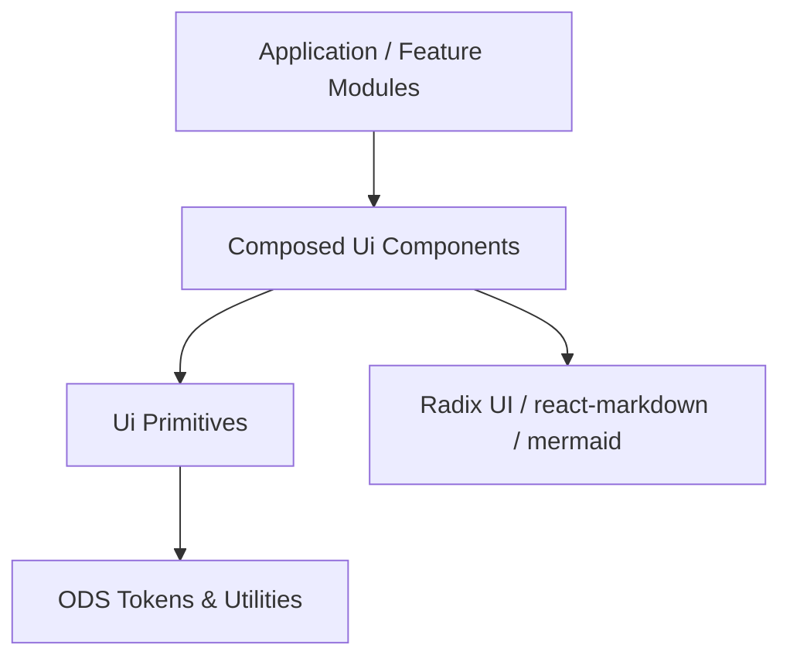
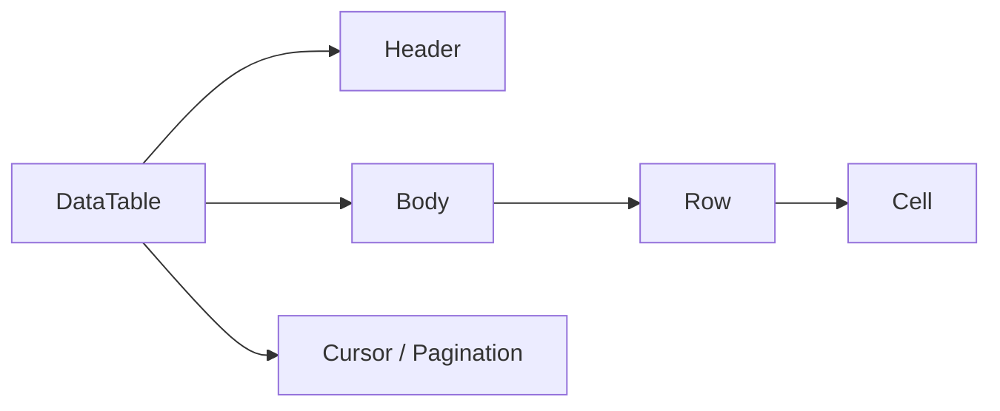
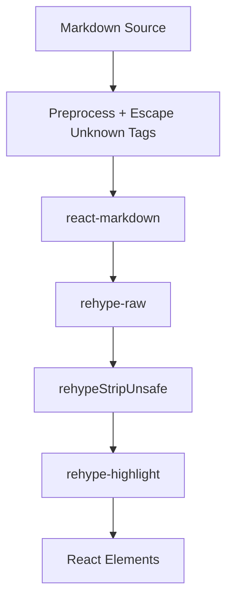
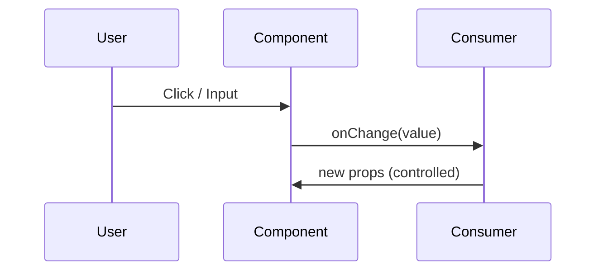
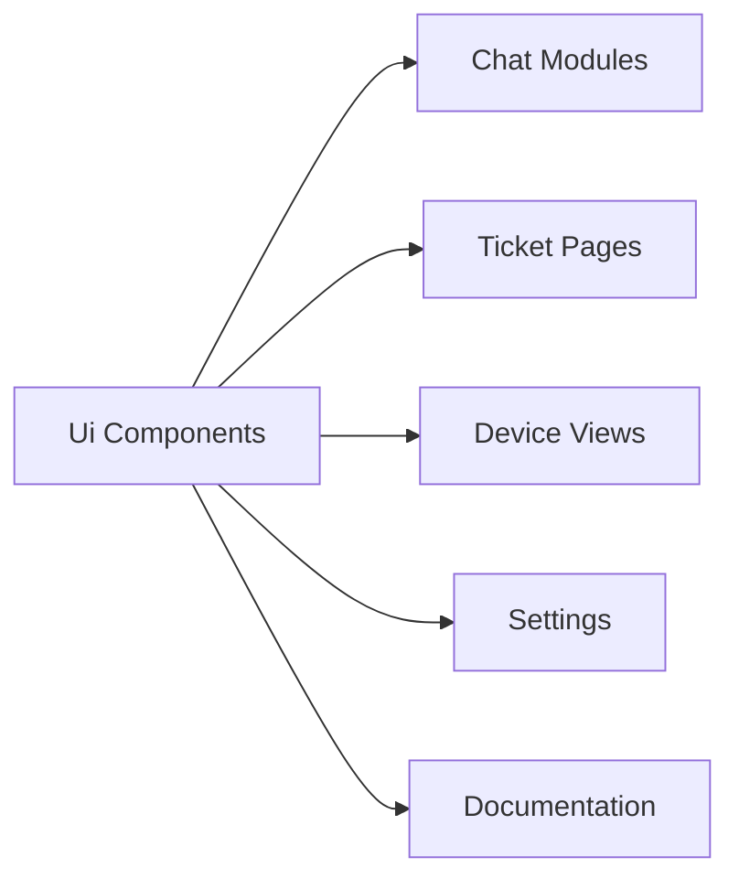

# Ui Components

The **Ui Components** module provides the foundational, reusable user interface building blocks used across the OpenFrame frontend. These components implement consistent Open Design System (ODS) styling, accessibility patterns, and interaction behaviors.

This module is part of the `frontend-core` library and is consumed by feature modules (chat, tickets, devices, settings, etc.) as well as the main `openframe-oss-frontend` application.

---

## Purpose and Scope

Ui Components encapsulates:

- ✅ Primitive form controls (Input, Textarea, Select-like triggers)
- ✅ Structured data presentation (Data Table, Info Cards, Panels)
- ✅ Interactive overlays (Dropdowns, Popovers, Filters)
- ✅ Content rendering (Markdown renderer with Mermaid support)
- ✅ File and media utilities (FileUpload, ImageUploader)
- ✅ Status and tagging systems (Tag, TicketStatusTag)
- ✅ Layout helpers (StackedRowsPanel, InfoSection)

The goal is to:

- Enforce visual and behavioral consistency
- Reduce duplication across feature modules
- Centralize accessibility and interaction logic
- Provide composable, theme-aware components

---

## Architectural Overview

Ui Components follows a layered architecture:

### Layers

1. **Ui Primitives**  
   Low-level building blocks such as:
   - `Input`
   - `Textarea`
   - `Button`
   - `Tag`
   - `InputTrigger`

2. **Composed Components**  
   Higher-level constructs built from primitives:
   - `DataTable`
   - `FilterModal`
   - `TagSelectDropdown`
   - `TicketInfoSection`
   - `ServiceCard`

3. **External Integrations**  
   Carefully wrapped third-party libraries:
   - Radix UI (Popover, Dropdown, ScrollArea)
   - react-markdown + rehype/remark plugins
   - Mermaid (diagram rendering)

4. **Design System Integration**  
   All components rely on:
   - ODS color tokens (`--color-*`, `--ods-*`)
   - ODS spacing tokens (`--spacing-system-*`)
   - Consistent typography utilities (`text-h4`, etc.)

---

## Core Component Categories

### 1. Form & Input Controls

These components provide standardized data entry patterns.

- `Input` – Text input with adornments, validation, loading states.
- `Textarea` – Multi-line input with icon support and auto-resize behavior.
- `Autocomplete` – Single and multi-select with keyboard navigation.
- `AssigneeDropdown` – Compact and default user selection dropdown.
- `PhoneInput` – Country-aware phone input with validation.
- `Slider` – Range input wrapper.
- `DatePicker` / `DateFilterMenu` – Calendar-based date and range selection.

**Design Principles:**

- Keyboard accessible by default
- Focus-visible ring consistency
- Error and warning states tied to ODS tokens
- Controlled/uncontrolled usage supported

---

### 2. Data Presentation Components

These components standardize how structured data is rendered.

#### Data Table System

Key elements:

- `DataTableHeader`
- `DataTableBody`
- `DataTableRow`
- `DataTableEmpty`
- `DataTableSkeleton`

Features:

- Sortable columns (opt-in via metadata)
- Filter integration
- Cursor pagination
- Skeleton loading states
- Responsive column visibility

#### Cards & Panels

- `InfoCard`, `InfoCardRow`
- `DashboardInfoCard`
- `OrganizationCard`
- `ServiceCard`
- `StackedRowsPanel`
- `HighlightCard`

These components enforce:

- Consistent card borders and radius
- Proper truncation behavior
- Optional interactive hover states
- Structured header/body/footer patterns

---

### 3. Overlay & Menu Components

Built primarily on Radix primitives.

- `ActionsMenu` / `ActionsMenuDropdown`
- `MoreActionsMenu` (legacy)
- `HoverDropdown`
- `FilterModal`
- `TagSelectDropdown`
- `TagsManager`

These components handle:

- Keyboard navigation
- Focus trapping (when required)
- Portal-based rendering
- Controlled vs uncontrolled open state
- Accessibility roles (`menu`, `option`, `listbox`)

---

### 4. Content Rendering & Markdown

`SimpleMarkdownRenderer` is a core infrastructure component.

Capabilities:

- GitHub-flavored markdown
- Syntax highlighting
- Mermaid diagrams
- Safe raw HTML rendering with custom sanitizer
- Internal documentation link resolution
- Authed image support via `useAuthedImageSrc`

This component is used in:

- Documentation views
- Chat messages
- Ticket descriptions
- Knowledge base articles

---

### 5. File & Media Utilities

- `FileUpload` – Drag-and-drop + managed async upload state.
- `ImageUploader` – Image preview, replace/remove, validation.
- `TicketAttachmentsList` – Compact attachment rows with download/delete.
- `FileManager` types – Shared contracts for file browsing UIs.

Common patterns:

- Dropzone behavior
- Validation (size, type)
- Managed vs uncontrolled modes
- Independent scrollable containers

---

### 6. Tag & Status System

Tag-related components are widely reused:

- `Tag`
- `TicketStatusTag`
- `TagKeyValueFilter`
- `FilterCheckboxItem`
- `TagSearchInput`

These components standardize:

- Status color mapping
- Badge styling
- Inline filtering behavior
- Consistent truncation and hover affordances

---

## State & Interaction Patterns

Across the module, components consistently:

- Support controlled and uncontrolled modes
- Avoid internal business logic
- Accept callbacks instead of performing navigation
- Use composition rather than deep inheritance

Example pattern:

This ensures Ui Components remain pure UI primitives.

---

## Accessibility Considerations

Ui Components consistently implement:

- ARIA roles (`menuitem`, `option`, `listbox`)
- `aria-selected`, `aria-disabled`
- Keyboard support (Enter, Space, Arrow keys, Escape)
- Focus-visible rings via ODS tokens
- Proper button semantics instead of clickable divs

The Markdown renderer additionally:

- Sanitizes unsafe attributes
- Blocks `javascript:` URLs
- Strips unsafe elements (`script`, `style`, etc.)

---

## Integration Within the Frontend

Ui Components is consumed by:

- Chat interfaces
- Ticket detail views
- Device and organization management pages
- Settings and configuration panels
- Documentation and knowledge base views

It acts as the visual and interaction backbone of the frontend.

---

## Design Principles

1. **Token-Driven Styling**  
   All spacing, colors, and typography derive from ODS tokens.

2. **Composable APIs**  
   Components expose render props or override hooks instead of hardcoding layouts.

3. **Minimal Business Logic**  
   State mutations are delegated upward.

4. **Responsive by Default**  
   Mobile-first with explicit breakpoints (`md`, `lg`, etc.).

5. **Safe Rendering of Untrusted Content**  
   Especially in markdown and diagram rendering.

---

## Summary

The **Ui Components** module is the foundational UI layer of OpenFrame’s frontend ecosystem. It provides:

- A unified design language
- Robust interaction primitives
- Safe, extensible content rendering
- Consistent data display patterns

By centralizing these responsibilities, it ensures that all feature modules share the same visual, accessibility, and interaction standards while remaining decoupled from business logic.
