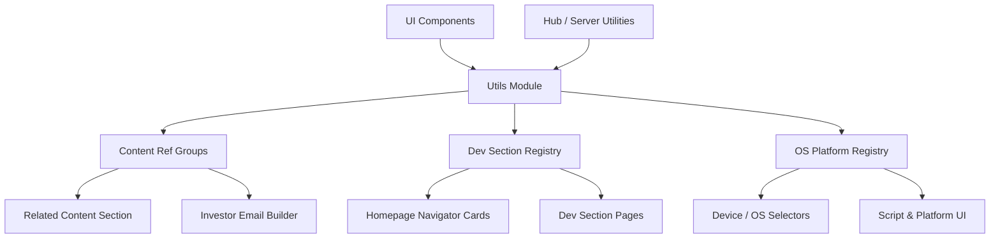
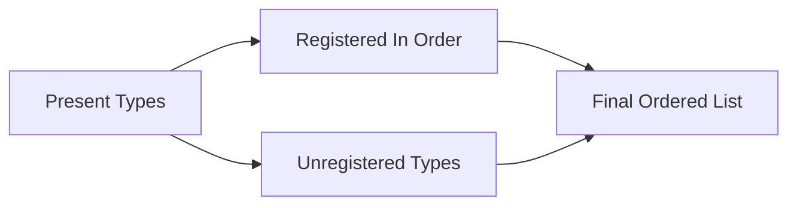
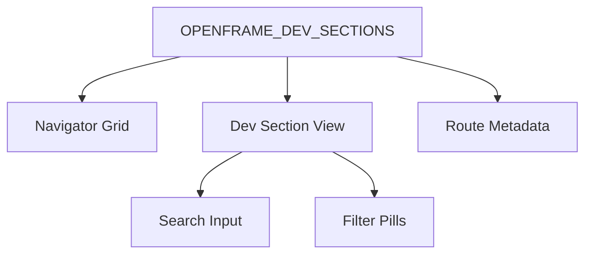
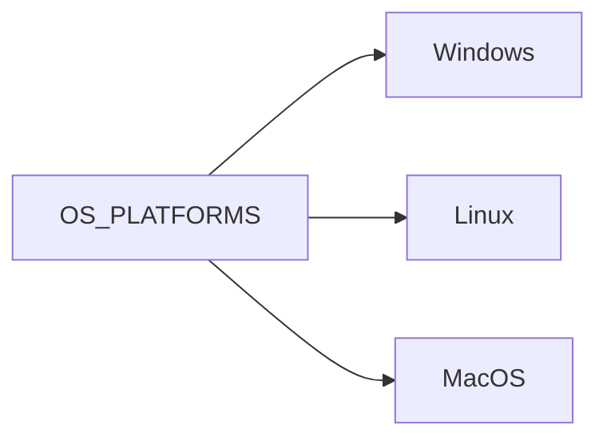
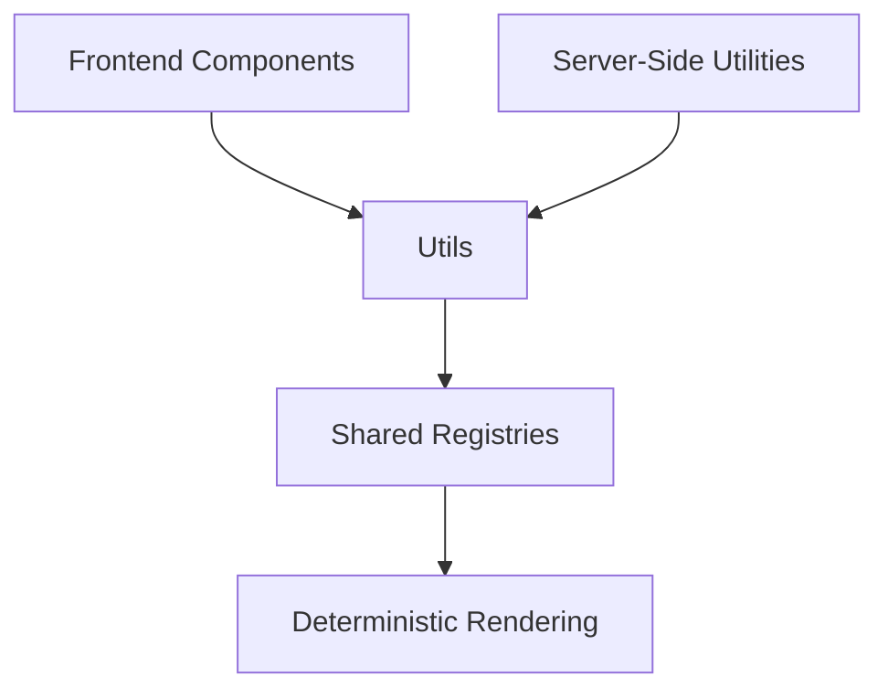

# Utils

The **Utils** module provides shared, server-safe configuration and metadata utilities used across OpenFrame frontend surfaces. It centralizes cross-cutting constants and registry-style configuration so UI components, hub pages, and server-side utilities can consume a single source of truth.

This module focuses on three core concerns:

- Content reference grouping and ordering
- Developer center section registry metadata
- Operating system platform definitions

By consolidating these concerns, the Utils module eliminates duplication, prevents drift between surfaces, and enables configuration-driven rendering patterns across the frontend.

---

## Architectural Overview

The Utils module acts as a **configuration registry layer** between feature components and rendering surfaces.



### Design Principles

1. **Single Source of Truth** – All per-type or per-section configuration lives in one registry.
2. **Configuration-Driven UI** – Rendering logic consumes metadata instead of hardcoding behavior.
3. **Server-Safe Utilities** – Files are safe to import in server bundles (no runtime side effects).
4. **Extensibility by Registration** – Adding new types requires adding entries, not rewriting logic.

---

# 1. Content Reference Groups

**Core component:** `ContentRefGroupConfig`

Defined in:

- `content-ref-groups.ts`

This registry groups `content_ref` entities (e.g., blog posts, webinars, releases) into display sections used by multiple surfaces.

## Purpose

It standardizes:

- Section labels
- Canonical ordering
- Layout style (grid or list)
- Card size variants

This ensures consistent grouping and ordering across:

- Related content rails
- Investor email builders
- Any future content aggregation surfaces

## Registry Structure

Each content type maps to:

- `label` – Section heading
- `order` – Canonical ordering priority
- `layout` – `grid` or `list`
- `gridSize` – Card size variant (`lg`, `default`, `sm`)

### Example Conceptual Structure

```text
CONTENT_REF_GROUPS
 ├─ investor_update
 ├─ product_release
 ├─ webinar
 ├─ case_study
 └─ onboarding_guide
```

## Cross-Surface Ordering Logic

The module exposes utility helpers:

- `getContentRefLabel()`
- `getContentRefLabelOrTitleCase()`
- `orderContentRefTypes()`

These ensure:

- Identical fallback label behavior
- Stable ordering of registered types
- Graceful handling of unregistered types

### Ordering Flow



Registered types are sorted by their configured `order`, followed by unregistered types in insertion order.

## Extensibility Model

Adding a new content type requires:

1. Adding one entry to `CONTENT_REF_GROUPS`
2. Ensuring it resolves in the entity dispatch layer

No changes are required in rendering components.

---

# 2. OpenFrame Dev Section Registry

**Core component:** `OpenframeDevSection`

Defined in:

- `dev-sections/openframe-dev-sections.ts`

This registry centralizes metadata for all OpenFrame developer-center surfaces, including:

- Roadmap
- Bug-fixes & Enhancements
- Releases
- Onboarding Guides
- Help Center

## Purpose

It unifies configuration for:

- Homepage navigator cards
- Section hero content
- Search configuration
- Filter pill configuration
- Route href

Instead of duplicating this metadata across pages, everything is defined once in `OPENFRAME_DEV_SECTIONS`.

## Section Metadata Structure

Each section defines:

- `href` – Route path
- `icon` – Lucide icon component reference
- `navigator` – Title + short description
- `hero` – Title + long description
- `search` – Placeholder + URL param key (nullable)
- `filter` – Label + param key + options (nullable)

### Section Consumption Flow



## Key Characteristics

- Uses `as const` to preserve strict literal typing
- Provides immutable option arrays for filters
- Supports `null` search/filter for special cases (e.g., onboarding)
- Allows embedders to filter sections by route

## Extensibility Model

To add a new dev section:

1. Add a new entry to `OPENFRAME_DEV_SECTIONS`
2. Ensure the route exists
3. Consume the section key where needed

No updates are required in homepage card grids or shared section views.

---

# 3. Operating System Platform Registry

**Core component:** `OSPlatformOption`

Defined in:

- `os-platforms.ts`

This module defines canonical OS-level platforms used across device and script interfaces.

## Supported Platforms

- Windows
- Linux
- MacOS (darwin)

## Structure

Each platform includes:

- `id` – Stable identifier (`windows`, `linux`, `darwin`)
- `name` – Human-readable label
- `icon` – Icon component reference

### Conceptual Model



The module also defines:

- `DEFAULT_OS_PLATFORM` – Defaults to `windows`

## Usage Context

This registry ensures consistent:

- Dropdown selections
- Script targeting UI
- Device filtering by OS
- Iconography usage

If a new OS needs to be supported, it is added once here and becomes available everywhere.

---

# How Utils Fits into the System

The Utils module is a **configuration backbone** for frontend rendering.

It does not implement business logic or UI directly. Instead, it:

- Supplies structured metadata
- Enforces consistency across pages
- Eliminates duplication
- Reduces risk of cross-surface drift

### System Placement



Because these utilities are:

- Pure TypeScript
- Side-effect free
- Registry-driven

They are safe for both client and server consumption and support static analysis and tree-shaking.

---

# Summary

The **Utils** module provides:

- A canonical content grouping system
- A centralized developer-center section registry
- A consistent OS platform definition layer

By making UI rendering configuration-driven and registry-based, it enables OpenFrame to scale feature surfaces without introducing duplication or inconsistent behavior across frontend and hub contexts.